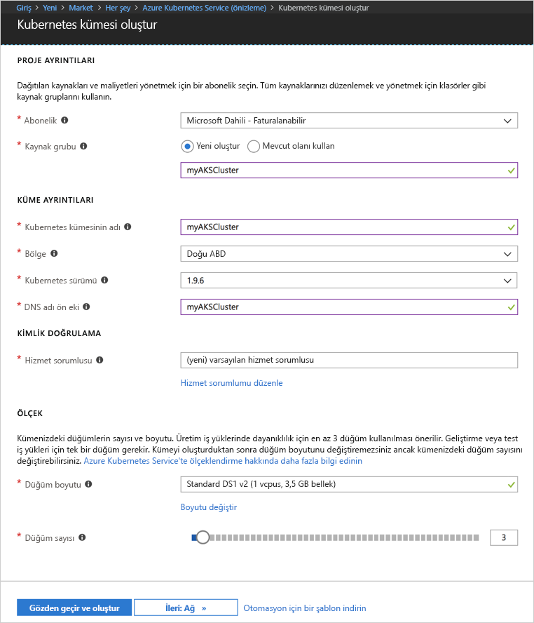
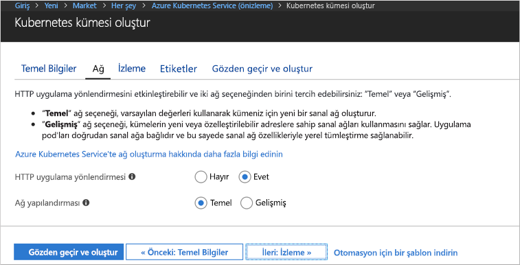
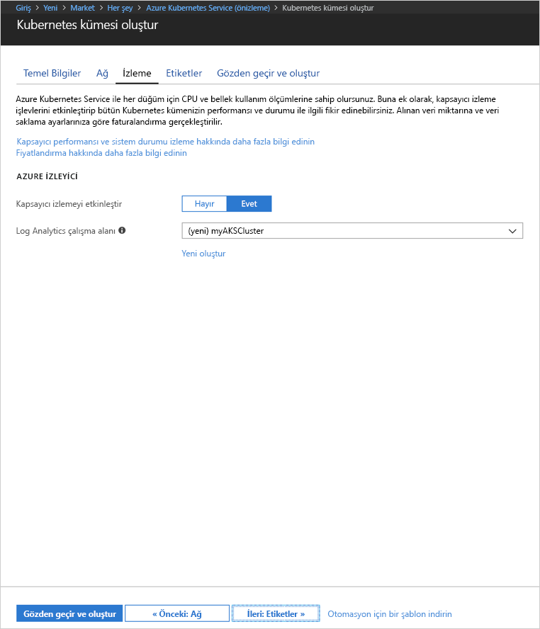
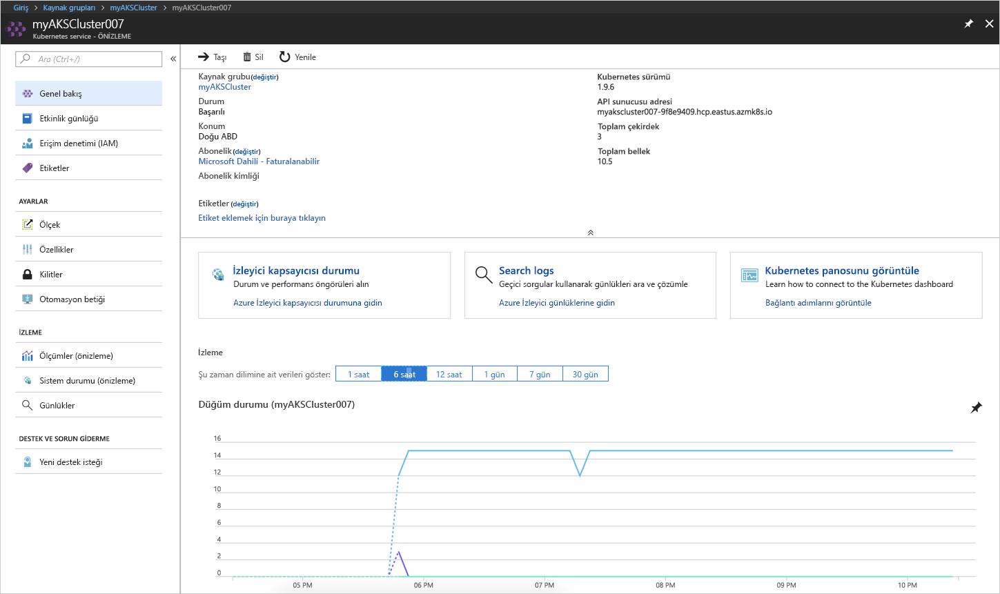
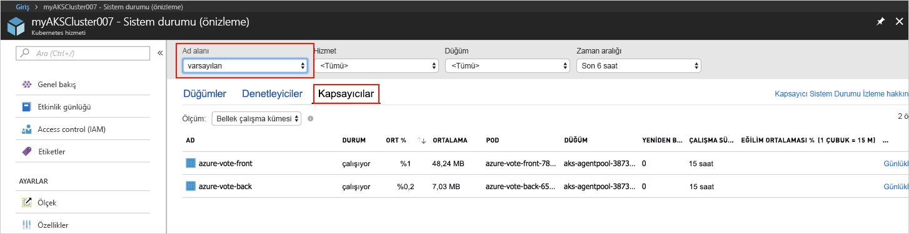
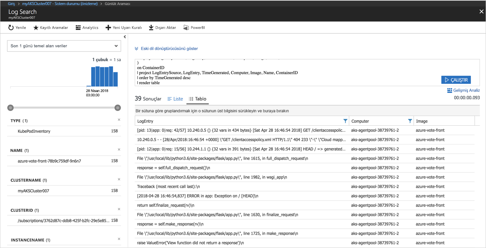

# <a name="quickstart-deploy-an-azure-kubernetes-service-aks-cluster"></a>Hızlı Başlangıç: Azure Kubernetes Hizmeti (AKS) kümesini dağıtma

Bu hızlı başlangıçta, Azure portalını kullanarak bir AKS kümesi dağıtırsınız. Ardından web ön ucu ve bir Redis örneğinden oluşan çok kapsayıcılı bir uygulama küme üzerinde çalıştırılır. Tamamlandığında, uygulamaya İnternet üzerinden erişilebilir.


Bu hızlı başlangıç, Kubernetes kavramlarının temel olarak bilindiğini varsayar. Kubernetes hakkında ayrıntılı bilgi için bkz. [Kubernetes belgeleri][kubernetes-documentation].

## <a name="sign-in-to-azure"></a>Azure'da oturum açma

http://portal.azure.com adresinden Azure portalında oturum açın.


## <a name="create-aks-cluster"></a>AKS kümesi oluşturma

**Kaynak oluştur**’u seçin > **Kubernetes** ifadesini arayın > **Kubernetes Hizmeti** > **Oluştur** seçeneğini belirleyin.

AKS kümesi oluşturma formunun her bir başlığının altında aşağıdaki adımları tamamlayın.

- **PROJE AYRINTILARI**: Bir Azure aboneliği ve yeni veya mevcut bir Azure kaynak grubu seçin.
- **KÜME AYRINTILARI**: AKS kümesi için bir ad, bölge, sürüm ve DNS adı öneki girin.
- **KİMLİK DOĞRULAMASI**: Yeni bir hizmet sorumlusu oluşturun veya mevcut bir hizmet sorumlusunu kullanın. Mevcut bir SPN kullanırken, SPN istemci kimliğini ve gizli dizisini sağlamanız gerekir.
- **ÖLÇEK**: AKS düğümleri için bir sanal makine boyutu seçin. AKS kümesi dağıtıldıktan sonra, sanal makine boyutu **değiştirilemez**. Ayrıca, kümeye dağıtılacak düğüm sayısını seçin. Küme dağıtıldıktan sonra düğüm sayısı **ayarlanabilir**.

Tamamlandığında, **Sonraki: Ağ** seçeneğini belirleyin.



Aşağıdaki ağ seçeneklerini yapılandırın:

- **Http uygulama yönlendirme** - Otomatik genel DNS adı oluşturma işlemiyle tümleşik bir giriş denetleyicisini yapılandırır. Http yönlendirme hakkında daha fazla bilgi için bkz. [AKS HTTP yönlendirme ve DNS][http-routing].
- **Ağ yapılandırması** - [kubenet][kubenet] Kubernetes eklentisini kullanan temel ağ yapılandırması ile [Azure CNI][azure-cni] kullanan gelişmiş ağ yapılandırması arasında seçim yapın. Ağ seçenekleri hakkında daha fazla bilgi için bkz. [AKS ağına genel bakış][aks-network].

Tamamlandığında, **Sonraki: Ağ** seçeneğini belirleyin.



AKS kümesi dağıtılırken Azure Container Insights, AKS kümesinin ve kümede çalıştırılan pod’ların durumunu izlemek için yapılandırılabilir. Küme durumu izleme hakkında daha fazla bilgi için bkz. [Azure Kubernetes Hizmeti durumunu izleme][aks-monitor].

**Evet**’i seçerek kapsayıcı izlemeyi etkinleştirin ve mevcut bir Log Analytics çalışma alanı seçin veya yenisini oluşturun.

**Gözden geçir + oluştur**’u seçin ve sonra tamamlandığında **Oluştur**’a tıklayın.



Kısa bir beklemeden sonra AKS kümesi dağıtılmıştır ve kullanıma hazırdır. AKS kümesi kaynak grubuna göz atın, AKS kaynağını seçin. AKS kümesi panosunu görmeniz gerekir.



## <a name="connect-to-the-cluster"></a>Kümeye bağlanma

Kubernetes kümesini yönetmek için Kubernetes komut satırı istemcisi [kubectl][kubectl]’i kullanın. Kubectl istemcisi Azure Cloud Shell’de önceden yüklüdür.

Azure portalının sağ üst köşesindeki düğmeyi kullanarak Cloud Shell’i açın.


[az aks get-credentials][az-aks-get-credentials] komutunu kullanarak, kubectl istemcisini Kubernetes kümenize bağlanacak şekilde yapılandırın.

Aşağıdaki komutu kopyalayıp Cloud Shell’e yapıştırın. Gerekirse, kaynak grubu ve küme adını değiştirin.

```azurecli-interactive
az aks get-credentials --resource-group myAKSCluster --name myAKSCluster
```

Kümenize bağlantıyı doğrulamak için [kubectl get][kubectl-get] komutunu kullanarak küme düğümleri listesini alın.

```azurecli-interactive
kubectl get nodes
```

Çıktı:

```
NAME                       STATUS    ROLES     AGE       VERSION
aks-agentpool-11482510-0   Ready     agent     9m        v1.9.6
aks-agentpool-11482510-1   Ready     agent     8m        v1.9.6
aks-agentpool-11482510-2   Ready     agent     9m        v1.9.6
```

## <a name="run-the-application"></a>Uygulamayı çalıştırma

Kubernetes bildirim dosyaları, hangi kapsayıcı görüntülerinin çalıştırılması gerektiği de dahil olmak üzere, küme için istenen durumu tanımlar. Bu örnekte, Azure Vote uygulamasını çalıştırmak için gerekli tüm nesneleri oluşturmak için bir bildirim kullanılır. Bu nesneler, biri Azure Vote ön ucu için, diğeri de Redis örneği için olmak üzere iki [Kubernetes dağıtımı][kubernetes-deployment] içerir. Ayrıca, Redis örneği için bir iç hizmet ve İnternet’ten Azure Vote uygulamasına erişmek için bir dış hizmet olmak üzere iki [Kubernetes Hizmeti][kubernetes-service] oluşturulur.

`azure-vote.yaml` adlı bir dosya oluşturun ve dosyayı aşağıdaki YAML koduna kopyalayın. Azure Cloud Shell'de çalışıyorsanız, bu dosyayı bir sanal veya fiziksel sistemde olduğu gibi vi veya Nano kullanarak oluşturabilirsiniz.

```yaml
apiVersion: apps/v1beta1
kind: Deployment
metadata:
  name: azure-vote-back
spec:
  replicas: 1
  template:
    metadata:
      labels:
        app: azure-vote-back
    spec:
      containers:
      - name: azure-vote-back
        image: redis
        ports:
        - containerPort: 6379
          name: redis
---
apiVersion: v1
kind: Service
metadata:
  name: azure-vote-back
spec:
  ports:
  - port: 6379
  selector:
    app: azure-vote-back
---
apiVersion: apps/v1beta1
kind: Deployment
metadata:
  name: azure-vote-front
spec:
  replicas: 1
  template:
    metadata:
      labels:
        app: azure-vote-front
    spec:
      containers:
      - name: azure-vote-front
        image: microsoft/azure-vote-front:v1
        ports:
        - containerPort: 80
        env:
        - name: REDIS
          value: "azure-vote-back"
---
apiVersion: v1
kind: Service
metadata:
  name: azure-vote-front
spec:
  type: LoadBalancer
  ports:
  - port: 80
  selector:
    app: azure-vote-front
```

Uygulamayı çalıştırmak için [kubectl apply][kubectl-apply] komutunu kullanın.

```azurecli-interactive
kubectl apply -f azure-vote.yaml
```

Çıktı:

```
deployment "azure-vote-back" created
service "azure-vote-back" created
deployment "azure-vote-front" created
service "azure-vote-front" created
```

## <a name="test-the-application"></a>Uygulamayı test etme

Uygulama çalıştırıldığında, uygulamayı İnternet üzerinden kullanıma sunmak için bir [Kubernetes hizmeti][kubernetes-service] oluşturulur. Bu işlemin tamamlanması birkaç dakika sürebilir.

İlerleme durumunu izlemek için [kubectl get service][kubectl-get] komutunu `--watch` bağımsız değişkeniyle birlikte kullanın.

```azurecli-interactive
kubectl get service azure-vote-front --watch
```

Başlangıçta *azure-vote-front* için *EXTERNAL-IP* durumu *pending* olarak görünür.

```
NAME               TYPE           CLUSTER-IP   EXTERNAL-IP   PORT(S)        AGE
azure-vote-front   LoadBalancer   10.0.37.27   <pending>     80:30572/TCP   6s
```

*EXTERNAL-IP* adresi *pending* durumundan *IP address* değerine değiştiğinde kubectl izleme işlemini durdurmak için `CTRL-C` komutunu kullanın.

```
azure-vote-front   LoadBalancer   10.0.37.27   52.179.23.131   80:30572/TCP   2m
```

Artık Azure Vote Uygulamasını görmek için dış IP adresine göz atabilirsiniz.


## <a name="monitor-health-and-logs"></a>Sistem durumunu ve günlükleri izleme

Kapsayıcı öngörüleri izleme etkinleştirildiyse, hem AKS kümesi hem de kümede çalıştırılan pod’lar için sistem durumu ölçümlerine AKS kümesi panosundan erişilebilir. Küme durumu izleme hakkında daha fazla bilgi için bkz. [Azure Kubernetes Hizmeti durumunu izleme][aks-monitor].

Azure Vote pod’larının geçerli durumunu, çalışma süresini ve kaynak kullanımını görmek için AKS kaynağına göz atın, **Kapsayıcı Durumunu İzle**’yi seçin > **varsayılan** ad alanını seçin ve **Kapsayıcılar** seçeneğini belirleyin. Azure portalında bu verilerin doldurulması birkaç dakika sürebilir.



`azure-vote-front` pod’unun günlüklerini görmek için **Günlükleri Görüntüle** bağlantısını seçin. Bu günlükler, kapsayıcıdaki stdout ve stderr akışlarını içerir.



## <a name="delete-cluster"></a>Kümeyi silme

Küme artık gerekli olmadığında, tüm ilişkili kaynaklarla birlikte küme kaynağını silin. AKS kümesi panosunda sil düğmesi seçilerek Azure portalında bu işlem tamamlanabilir. Alternatif olarak, Cloud Shell’de [az aks delete][az-aks-delete] komutu kullanılabilir.

```azurecli-interactive
az aks delete --resource-group myAKSCluster --name myAKSCluster --no-wait
```

## <a name="get-the-code"></a>Kodu alma

Bu hızlı başlangıçta, Kubernetes dağıtımı oluşturmak için önceden oluşturulmuş kapsayıcı görüntüleri kullanılır. İlgili uygulama kodu, Dockerfile ve Kubernetes bildirim dosyası GitHub'da bulunur.

[https://github.com/Azure-Samples/azure-voting-app-redis][azure-vote-app]

## <a name="next-steps"></a>Sonraki adımlar

Bu hızlı başlangıçta, bir Kubernetes kümesi dağıtıp ve bu kümeye çok kapsayıcılı bir uygulama dağıttınız.

AKS hakkında daha fazla bilgi ve dağıtım örneği için tam kod açıklaması için Kubernetes küme öğreticisine geçin.

> [!div class="nextstepaction"]
> [AKS öğreticisi][aks-tutorial]

<!-- LINKS - external -->
[azure-vote-app]: https://github.com/Azure-Samples/azure-voting-app-redis.git
[azure-cni]: https://github.com/Azure/azure-container-networking/blob/master/docs/cni.md
[kubectl]: https://kubernetes.io/docs/user-guide/kubectl/
[kubectl-apply]: https://kubernetes.io/docs/reference/generated/kubectl/kubectl-commands#apply
[kubectl-get]: https://kubernetes.io/docs/reference/generated/kubectl/kubectl-commands#get
[kubenet]: https://kubernetes.io/docs/concepts/cluster-administration/network-plugins/#kubenet
[kubernetes-deployment]: https://kubernetes.io/docs/concepts/workloads/controllers/deployment/
[kubernetes-documentation]: https://kubernetes.io/docs/home/
[kubernetes-service]: https://kubernetes.io/docs/concepts/services-networking/service/

<!-- LINKS - internal -->
[az-aks-get-credentials]: /cli/azure/aks?view=azure-cli-latest#az_aks_get_credentials
[az-aks-delete]: /cli/azure/aks#az-aks-delete
[aks-monitor]: ../monitoring/monitoring-container-health.md
[aks-network]: ./networking-overview.md
[aks-tutorial]: ./tutorial-kubernetes-prepare-app.md
[http-routing]: ./http-application-routing.md
