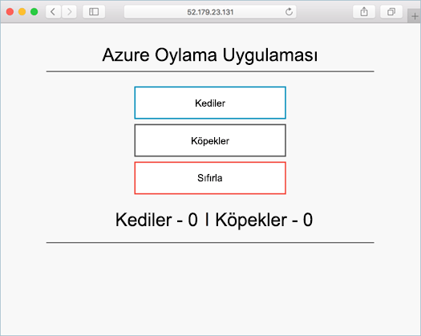

# <a name="tutorial-run-applications-in-azure-kubernetes-service-aks"></a>Öğretici: Azure Kubernetes Service (AKS) uygulamaları çalıştırma

Kubernetes, kapsayıcılı uygulamalar için dağıtılmış bir platform sunar. Kendi uygulamalarınızı ve hizmetlerinizi oluşturup bir Kubernetes kümesine dağıtırsınız, kullanılabilirlik ve bağlantı özellikleri de küme tarafından yönetilir. Yedi bölümün dördüncüsü olan bu öğreticide Kubernetes kümesine örnek bir uygulama dağıtılır. Aşağıdakileri nasıl yapacağınızı öğrenirsiniz:

> [!div class="checklist"]
> * Kubernetes bildirim dosyasını güncelleştirme
> * Kubernetes'te uygulama çalıştırma
> * Uygulamayı test etme

Ek öğreticilerde, bu uygulama ölçeklendirilir ve güncelleştirildi.

Bu hızlı başlangıç, Kubernetes kavramlarının temel olarak bilindiğini varsayar. Daha fazla bilgi için [Kubernetes kavramlarını Azure Kubernetes Service (AKS) için çekirdek][kubernetes-concepts].

## <a name="before-you-begin"></a>Başlamadan önce

Önceki öğreticilerde, bir uygulama bir kapsayıcı görüntüsüne paketlendi, görüntü Azure Container Registry’ye yüklendi ve bir Kubernetes kümesi oluşturuldu.

Bu öğreticiyi tamamlamak için önceden oluşturulmuş `azure-vote-all-in-one-redis.yaml` Kubernetes bildirim dosyasına ihtiyaç duyarsınız. Bu dosya, önceki öğreticide uygulama kaynak koduyla indirildi. Depo kopyalandı ve dizinleri kopyalanmış depoya göre değiştirdiğinizi doğrulayın. Bu adımları bu işlemi yapmadıysanız ve örneği takip etmek istiyorsanız, başlayın [öğretici 1 – kapsayıcı görüntüleri oluşturma][aks-tutorial-prepare-app].

Bu öğretici, Azure CLI Sürüm 2.0.53 çalıştırdığınız gerektirir veya üzeri. Sürümü bulmak için `az --version` komutunu çalıştırın. Yükleme veya yükseltme yapmanız gerekiyorsa bkz. [Azure CLI'yı yükleme][azure-cli-install].

## <a name="update-the-manifest-file"></a>Bildirim dosyasını güncelleştirme

Bu öğreticilerde Azure Container Registry (ACR) örneği, örnek uygulamanın kapsayıcı görüntüsünü depolar. Uygulamayı dağıtmak için Kubernetes bildirim dosyası içindeki görüntü adını ACR oturum açma sunucusu adını içerecek şekilde güncelleştirmeniz gerekir.

ACR oturum açma sunucusu adını kullanarak elde [az acr listesi][az-acr-list] komutuyla şu şekilde:

```azurecli
az acr list --resource-group myResourceGroup --query "[].{acrLoginServer:loginServer}" --output table
```

İlk öğreticide kopyalanan git deposundaki örnek bildirim dosyasında oturum açma sunucusu adı olarak *microsoft* kullanılmıştır. Kopyalanan olduğunuzdan emin olun *azure voting uygulamasını redis* dizin ve açık bildirim dosyasını bir metin düzenleyiciyle gibi `vi`:

```console
vi azure-vote-all-in-one-redis.yaml
```

*microsoft* yerine ACR oturum açma sunucunuzun adını yazın. Görüntü adı, bildirim dosyasının 51 satırında bulunur. Aşağıdaki örnekte varsayılan görüntü adı gösterilir:

```yaml
containers:
- name: azure-vote-front
  image: microsoft/azure-vote-front:v1
```

Kendi ACR oturum açma sunucunuzun adını girerek bildirim dosyanızın aşağıdaki örnekte olduğu gibi görünmesini sağlayın:

```yaml
containers:
- name: azure-vote-front
  image: <acrName>.azurecr.io/azure-vote-front:v1
```

Dosyayı kaydedin ve kapatın. İçinde `vi`, kullanın `:wq`.

## <a name="deploy-the-application"></a>Uygulamayı dağıtma

Uygulamanızı dağıtmak için [kubectl uygulamak][kubectl-apply] komutu. Bu komut, bildirim dosyasını ayrıştırır ve tanımlanmış Kubernetes nesnelerini oluşturur. Aşağıdaki örnekte gösterildiği gibi örnek bildirim dosyasının adını belirtin:

```console
kubectl apply -f azure-vote-all-in-one-redis.yaml
```

Aşağıdaki örnek çıktıda, AKS kümesinde başarıyla oluşturulan kaynakları gösterir:

```
$ kubectl apply -f azure-vote-all-in-one-redis.yaml

deployment "azure-vote-back" created
service "azure-vote-back" created
deployment "azure-vote-front" created
service "azure-vote-front" created
```

## <a name="test-the-application"></a>Uygulamayı test etme

Uygulama çalıştırıldığında, uygulama ön ucu İnternet'e bir Kubernetes hizmeti sunar. Bu işlemin tamamlanması birkaç dakika sürebilir.

İlerleme durumunu izlemek için [kubectl get service][kubectl-get] komutunu `--watch` bağımsız değişkeniyle birlikte kullanın.

```console
kubectl get service azure-vote-front --watch
```

Başlangıçta *EXTERNAL-IP* için *azure-vote-front* hizmet olarak gösterildiği *bekleyen*:

```
azure-vote-front   10.0.34.242   <pending>     80:30676/TCP   7s
```

Zaman *EXTERNAL-IP* adresi değişirse *bekleyen* gerçek genel IP adresi için `CTRL-C` durdurmak için `kubectl` işlemi izleyin. Hizmete atanan geçerli genel IP adresi aşağıdaki örnek çıktı gösterilmektedir:

```
azure-vote-front   10.0.34.242   52.179.23.131   80:30676/TCP   2m
```

Uygulamayı iş başında görmek için hizmetin dış IP adresini bir web tarayıcısı açın:



Uygulama yüklenmedi, görüntü kayıt defterinizdeki bir yetkilendirme sorunu nedeniyle olabilir. Kapsayıcılarınızın durumunu görüntülemek için `kubectl get pods` komutunu kullanın. Kapsayıcı görüntülerini çekilmiş olup [izin vermeyecek bir Kubernetes ile kapsayıcı kayıt defterine gizli](https://docs.microsoft.com/azure/container-registry/container-registry-auth-aks#access-with-kubernetes-secret).

## <a name="next-steps"></a>Sonraki adımlar

Bu öğreticide, örnek Azure vote uygulaması, aks'deki bir Kubernetes kümesine dağıtılmıştır. Şunları öğrendiniz:

> [!div class="checklist"]
> * Kubernetes bildirim dosyalarını güncelleştirme
> * Kubernetes'te uygulama çalıştırma
> * Uygulamayı test etme

Kubernetes uygulamasını ve temel alınan Kubernetes altyapısını ölçeklendirme hakkında daha fazla bilgi için sonraki öğreticiye ilerleyin.

> [!div class="nextstepaction"]
> [Kubernetes uygulamasını ve altyapısını ölçeklendirme][aks-tutorial-scale]

<!-- LINKS - external -->
[kubectl-apply]: https://kubernetes.io/docs/reference/generated/kubectl/kubectl-commands#apply
[kubectl-create]: https://kubernetes.io/docs/reference/generated/kubectl/kubectl-commands#create
[kubectl-get]: https://kubernetes.io/docs/reference/generated/kubectl/kubectl-commands#get

<!-- LINKS - internal -->
[aks-tutorial-prepare-app]: ./tutorial-kubernetes-prepare-app.md
[aks-tutorial-scale]: ./tutorial-kubernetes-scale.md
[az-acr-list]: /cli/azure/acr
[azure-cli-install]: /cli/azure/install-azure-cli
[kubernetes-concepts]: concepts-clusters-workloads.md
[kubernetes-service]: concepts-network.md#services
