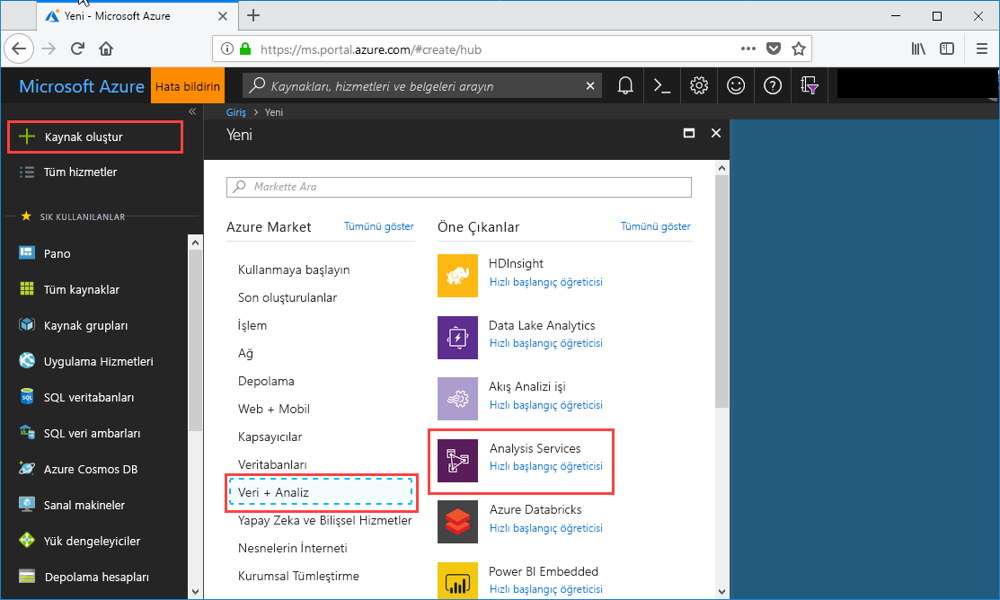
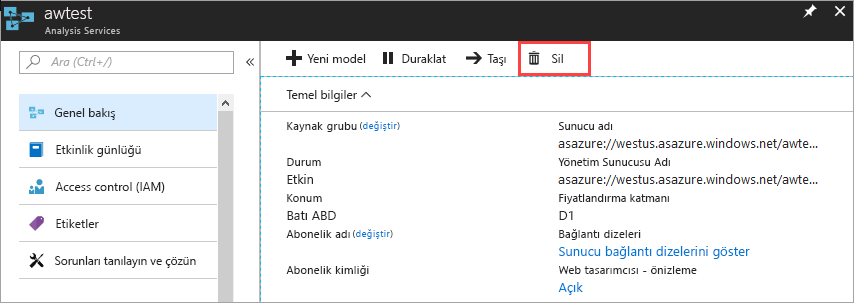

# Hızlı Başlangıç: Sunucu oluşturma - Portal

Bu hızlı başlangıçta, portalı kullanarak Azure aboneliğinizde bir Analysis Services sunucusu kaynağı oluşturma adımları açıklanmaktadır.

## Önkoşullar 

* **Azure aboneliği**: Ziyaret [Azure ücretsiz deneme sürümü](https://azure.microsoft.com/offers/ms-azr-0044p/) hesap oluşturmak için.
* **Azure Active Directory**: Aboneliğinizin Azure Active Directory kiracısı ile ilişkilendirilmesi gerekir. Ayrıca bu Azure Active Directory içindeki bir hesapla Azure'da oturum açmış olmanız gerekir. Daha fazla bilgi edinmek için bkz. [Kimlik doğrulaması ve kullanıcı izinleri](analysis-services-manage-users.md).

## Azure portalında oturum açın 

[Portalda oturum açın](https://portal.azure.com)

## Sunucu oluşturma

1. Tıklayın **+ kaynak Oluştur** > **Analytics** > **Analysis Services**.

    

2. **Analysis Services** sayfasında gerekli alanları doldurduktan sonra **Oluştur**'a basın.
   
   * **Sunucu adı**: Sunucu başvurmak için kullanılan benzersiz bir ad yazın.
   * **Abonelik**: Bu sunucu ile ilişkili aboneliği seçin.
   * **Kaynak grubu**: Yeni bir kaynak grubu oluşturun veya zaten seçin. Kaynak grupları, bir Azure kaynağı koleksiyonunu yönetmenize yardımcı olmak üzere tasarlanmıştır. Daha fazla bilgi edinmek için bkz. [kaynak grupları](../azure-resource-manager/resource-group-overview.md).
   * **Konum**: Bu Azure veri merkezi konumu sunucu barındırır. En büyük kullanıcı tabanınıza en yakın konumu seçin.
   * **Fiyatlandırma katmanı**: Fiyatlandırma katmanını seçin. Test yapıyorsanız ve örnek model veritabanını yükleyecekseniz ücretsiz **D1** katmanını seçin. Daha fazla bilgi için bkz. [Azure Analysis Services fiyatlandırması](https://azure.microsoft.com/pricing/details/analysis-services/). 
   * **Yönetici**: Varsayılan olarak, bu, oturum açmış olduğunuz hesap olacaktır. Azure Active Directory'den farklı bir hesap seçebilirsiniz.
   * **Yedekleme depolama ayarı**: İsteğe bağlı. [Depolama hesabınız](../storage/common/storage-introduction.md) varsa model yedekleme veritabanı olarak varsayılan yapabilirsiniz. [Yedekleme ve geri yükleme](analysis-services-backup.md) ayarlarını daha sonra da yapabilirsiniz.
   * **Depo anahtarı süre sonu**: İsteğe bağlı. Depo anahtarı için süre sonu belirtin.

Sunucunun oluşturulması genellikle bir dakikadan kısa sürer. **Portala Ekle**'yi seçtiyseniz yeni sunucunuzu görmek için portalınıza gidin. Ya da **Tüm hizmetler** > **Analysis Services** yolunu izleyerek sunucunuzun hazır olup olmadığına bakabilirsiniz. Sunucuları, 1200 ve üzeri uyumluluk düzeylerinde tablosal modelleri destekler. Model uyumluluk düzeyi SSDT veya SSMS içinde belirtilir.

## Kaynakları temizleme

İhtiyacınız kalmadıysa sunucunuzu silebilirsiniz. Sunucunuzun **Genel Bakış** sayfasında **Sil**'e tıklayın. 

 

## Sonraki adımlar
Bu hızlı başlangıçta Azure aboneliğinizde sunucu oluşturmayı öğrendiniz. Sunucuyu oluşturduğunuza göre bir sunucu güvenlik duvarı yapılandırarak (isteğe bağlı) güvenliğinin sağlanmasına yardımcı olacaksınız. Sunucunuza doğrudan portaldan örnek bir veri modeli de ekleyebilirsiniz. Örnek modelin olması, model veritabanı rollerini yapılandırma ve istemci bağlantılarını test etme işlemlerini öğrenme konusunda yardımcı olur. Daha fazla bilgi edinmek için, örnek model ekleme öğreticisiyle devam edin.

> [!div class="nextstepaction"]
> [Hızlı Başlangıç: Sunucu güvenlik duvarını - Portal yapılandırma](analysis-services-qs-firewall.md)   
> [!div class="nextstepaction"]
> [Öğretici: Sunucunuza bir örnek model ekleme](analysis-services-create-sample-model.md)
