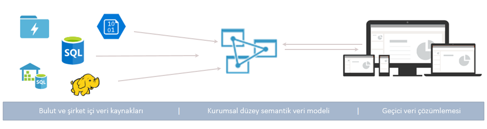
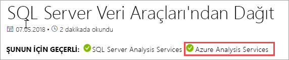
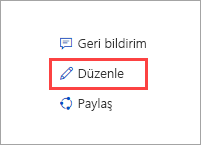

# Azure Analysis Services nedir?

Azure Analysis Services, bulutta kurumsal düzeyde veri modelleri sağlayan, tam yönetilen bir hizmet olarak platformdur (PaaS). Birden fazla veri kaynağından verileri birleştirmek, ölçümleri tanımlamak ve tek, güvenilen bir tablo biçiminde anlam veri modelinde verilerinizin güvenliğini sağlamak için gelişmiş karma ve modelleme özelliklerini kullanın. Veri modeli, kullanıcıların geçici veri analizi için çok büyük miktarlarda verilere göz atmasının daha kolay ve daha hızlı bir yolunu sağlar.

**Video:** Azure Analysis Services’in Microsoft’un genel BI özelliklerine ne kadar uygun olduğu hakkında bilgi almak için [Azure Analysis Services’e Genel Bakış](https://sec.ch9.ms/ch9/d6dd/a1cda46b-ef03-4cea-8f11-68da23c5d6dd/AzureASoverview_high.mp4) bölümüne göz atın.

## Hızla çalışmaya başlayın

Azure portalında, birkaç dakikada [sunucu oluşturabilirsiniz](analysis-services-create-server.md). Ayrıca, Azure Resource Manager [şablonları](../azure-resource-manager/resource-manager-create-first-template.md) ve PowerShell'le, bildirim temelli bir şablon kullanarak sunucu oluşturabilirsiniz. Basit bir şablonla, sunucu kaynaklarını ve bunların yanında depolama hesapları ve Azure İşlevleri gibi diğer Azure bileşenlerini dağıtabilirsiniz. 

**Video:** Azure Otomasyonu’nu kullanarak sunucu oluşturmayı nasıl hızlandırabileceğiniz hakkında daha fazla bilgi almak için [Dağıtımı otomatik hale getirme](https://channel9.msdn.com/series/Azure-Analysis-Services/AzureAnalysisServicesAutomation) bölümüne göz atın.

Azure Analysis Services, birçok Azure hizmetiyle tümleştirildiğinden gelişmiş analiz çözümleri oluşturmanıza olanak tanır. [Azure Active Directory](../active-directory/fundamentals/active-directory-whatis.md) ile tümleştirme, önemli verilerinize güvenli, rol tabanlı erişim sağlar. Verileri modele yükleyen bir etkinlik ekleyerek [Azure Data Factory](../data-factory/introduction.md) işlem hatlarıyla tümleştirin. Özel kodla modellerde basit düzenlemeler yapmak için [Azure Otomasyonu](../automation/automation-intro.md) ve [Azure İşlevleri](../azure-functions/functions-overview.md) kullanılabilir. 

## İhtiyacınız olduğunda doğru katman

Azure Analysis Services; **Geliştirici**, **Temel** ve **Standart** katmanlarında sunulur. Her katmanda, plan maliyetleri işlem gücüne, QPU'lara ve bellek boyutuna göre değişir. Sunucu oluşturduğunuzda, katman içinde bir plan seçersiniz. Aynı katman içinde planları yukarı veya aşağı doğru değişiklik yapabilir veya daha üst bir katmana yükseltebilirsiniz, ama üst katmandan daha alt bir katmana inemezsiniz.

### Geliştirici katmanı

Bu katman değerlendirme, geliştirme ve test senaryoları için önerilir. Tek bir plan, standart katman ile sunulan aynı işlevleri içerir ancak işlemci gücü, QPU ve bellek boyutu bakımından sınırlıdır. Bu katmanda sorgu çoğaltma ölçeği artırılamaz. Bu katman bir SLA sunmaz.

|Planlama  |QPU’lar  |Bellek (GB)  |
|---------|---------|---------|
|D1    |    20     |    3     |

### Temel katman

Bu katman küçük tablolu modeller, sınırlı düzeyde kullanıcı eşzamanlılığı ve basit veri yenileme gereksinimlerine sahip olan üretim çözümleri için önerilir. Bu katmanda sorgu çoğaltma ölçeği *artırılamaz*. Perspektifler, çoklu bölümler ve DirectQuery tablolu model özellikleri bu katmanda *desteklenmez*.  

|Planlama  |QPU’lar  |Bellek (GB)  |
|---------|---------|---------|
|B1    |    40     |    10     |
|B2    |    80     |    20     |

### Standart katman

Bu katman, kullanıcı eşzamanlılığının elastik olmasını gerektiren ve hızla büyüyen veri modellerine sahip olan görev açısından kritik üretim uygulamalarına yöneliktir. Neredeyse gerçek zamanlı veri modeli güncelleştirmeleri için gelişmiş veri yenilemeyi ve tüm tablo modelleme özelliklerini destekler.

|Planlama  |QPU’lar  |Bellek (GB)  |
|---------|---------|---------|
|S1    |    40     |    10     |
|S2    |    100     |    25     |
|S3    |    200     |    50     |
|S4    |    400     |    100     |
|S8*    |    320     |    200     |
|S9*    |    640    |    400     |

\* Tüm bölgelerde kullanılamaz.  

## Bölgelere göre kullanılabilirlik

Azure Analysis Services, dünyanın dört bir yanındaki bölgelerde desteklenir. Desteklenen planların ve sorgu çoğaltmalarının kullanılabilirliği, seçtiğiniz bölgeye bağlıdır. Plan ve sorgu çoğaltması kullanılabilirliği ihtiyaca ve bölgelerde bulunan kaynaklara göre değişebilir. 

### Kuzey ve Güney Amerika

|Bölge  | Desteklenen planlar | Sorgu çoğaltmaları (yalnızca Standart planlar) |
|---------|---------|:---------:|
|Güney Brezilya     |    B1, B2, S0, S1, S2, S4, D1     |     1    |
|Orta Kanada    |     B1, B2, S0, S1, S2, S4, D1    |     1    |
|Doğu ABD     |     B1, B2, S0, S1, S2, S4, D1    |    1     |
|Doğu ABD 2     |     B1, B2, S0, S1, S2, S4, S8\*, S9\*, D1     |    7     |
|Orta Kuzey ABD     |     B1, B2, S0, S1, S2, S4, D1     |    1     |
|Orta ABD     |    B1, B2, S0, S1, S2, S4, D1     |    1     |
|Orta Güney ABD     |    B1, B2, S0, S1, S2, S4, D1     |    1     |
|Batı Orta ABD   |     B1, B2, S0, S1, S2, S4, D1    |    3     |
|Batı ABD     |    B1, B2, S0, S1, S2, S4, S8\*, S9\*, D1     |    7     |
|Batı ABD 2    |    B1, B2, S0, S1, S2, S4, S8\*, S9\*, D1     |    3     |

### Avrupa

|Bölge  | Desteklenen planlar | Sorgu çoğaltmaları (yalnızca Standart planlar) |
|---------|---------|:---------:|
|Kuzey Avrupa     |    B1, B2, S0, S1, S2, S4, D1      |    7     |
|Birleşik Krallık Güney   |    B1, B2, S0, S1, S2, S4, D1      |     1    |
|Batı Avrupa     |    B1, B2, S0, S1, S2, S4, S8\*, S9\*, D1      |    7     |

### Asya Pasifik 

|Bölge  | Desteklenen planlar | Sorgu çoğaltmaları (yalnızca Standart planlar) |
|---------|---------|:---------:|
|Avustralya Güneydoğu     | B1, B2, S0, S1, S2, S4, D1       |    1     |
|Japonya Doğu  |   B1, B2, S0, S1, S2, S4, D1       |    1     |
|Güneydoğu Asya     |     B1, B2, S0, S1, S2, S4, S8\*, S9\*, D1     |   1      |
|Batı Hindistan     |    B1, B2, S0, S1, S2, S4, D1     |    1     |

Standart katmandaki \* S8, S9 planları bir sorgu çoğaltmasını destekler.

## Gereksinimlerinize göre ölçeklendirin

### Ölçek artırma\azaltma, duraklatma ve sürdürme

Sunucunuzu yükseltin, indirin veya duraklatın. Azure portalını kullanın ve PowerShell'i kullanarak kolayca tam denetim sahibi olun. Sadece kullandığınız kadar ödersiniz.  

### Hızlı sorgu yanıtları için genişletme kaynakları

Ölçek genişletme ile istemci sorguları bir sorgu havuzundaki birden çok *sorgu çoğaltması* arasında dağıtılır. Sorgu çoğaltmaları, tablo modellerinizin eşitlenmiş kopyalarını içerir. Sorgu iş yükü dağıtılarak, yüksek sorgu iş yükleri sırasında yanıt süreleri azaltılabilir. İstemci sorgularının işleme işlemlerinden olumsuz yönde etkilenmediğinden emin olmak için, model işleme işlemleri sorgu havuzundan ayrılabilir. 

En fazla yedi ek sorgu çoğaltması (sizin sunucunuzla birlikte toplam sekiz) ile bir sorgu havuzu oluşturabilirsiniz. Havuzunuzda sahip olabileceğiniz sorgu çoğaltmalarının sayısı, seçtiğiniz plana ve bölgeye bağlıdır. Sorgu çoğaltmaları, sunucunuzun bölgesi dışına yayılamaz. Sorgu çoğaltmaları, sunucunuzla aynı fiyattan faturalandırılır.

Katmanları değiştirirken yaptığınız gibi, sorgu çoğaltmalarını gereksinimlerinize göre genişletebilirsiniz. Genişletmeyi portalda veya REST API'leri kullanarak yapılandırın. Daha fazla bilgi için bkz. [Azure Analysis Services ölçeğini genişletme](analysis-services-scale-out.md).

## Fiyatlandırma

Toplam maliyet; seçtiğiniz bölge, katman, sorgu çoğaltmaları ve duraklatma/sürdürme gibi birkaç faktöre bağlıdır. Bölgenize yönelik tipik fiyatlandırmayı belirlemek için [Azure Analysis Services Fiyatlandırma](https://azure.microsoft.com/pricing/details/analysis-services/) hesaplayıcısını kullanın. Bu araç, tek bir bölge için tek sunuculu bir örneğin fiyatlandırmasını hesaplar. Sorgu çoğaltmalarının sunucunuzla aynı fiyattan faturalandırıldığını unutmayın. 

## SQL Server Analysis Services’ı temel alır

Azure Analysis Services, SQL Server Analysis Services Enterprise Edition’da bulunan harika özelliklerin çoğu ile uyumludur. Azure Analysis Services, 1200 veya üzeri [uyumluluk düzeylerinde](analysis-services-compat-level.md) tablolu modelleri destekler. Tablolu modeller, Tablolu Model Betik Dili (TMSL) ve Tablolu Nesne Modeli (TOM) kodundaki tablolu meta veri nesne tanımları halinde geliştirilmiş ilişkisel modelleme yapılarıdır (model, tablolar, sütunlar). Bölümler, perspektifler, satır düzeyinde güvenlik, çift yönlü ilişkiler ve çeviriler gibi özelliklerin tümü desteklenir\*. Çok boyutlu modeller ve Sharepoint için PowerPivot, Azure Analysis Services’te *desteklenmez*.

Hem bellek içi hem de DirectQuery modlarında tablolu modeller desteklenir. Bellek içi modda (varsayılan) tablolu modeller birden çok veri kaynağını destekler. Model verileri yüksek oranda sıkıştırılmış ve bellek içinde önbelleğe alınmış olduğundan, bu mod büyük miktarlarda veriler üzerinde en hızlı sorgu yanıtını sağlar. Ayrıca, karmaşık veri kümeleri ve sorgular için en fazla esnekliği sağlar. Bölümleme, artımlı yükleri etkinleştirir, paralelleştirmeyi artırır ve bellek tüketimini azaltır. Hesaplanmış tablolar gibi diğer gelişmiş veri modelleme özellikleri ve tüm DAX işlevleri desteklenir. Veri kaynaklarından önbelleğe alınmış verileri güncelleştirmek için bellek içi modeller yenilenmelidir (işlenmelidir). Azure hizmet sorumlusu desteği sayesinde PowerShell, TOM, TMSL ve REST kullanan katılımsız yenileme işlemleri, model verilerinizin her zaman güncel olduğundan emin olma esnekliği sunar. 

DirectQuery modu*, depolama ve sorgu yürütme için arka uç ilişkisel veritabanından yararlanır. Tek SQL Server, SQL Server Veri Ambarı, Azure SQL Veritabanı, Azure SQL Veri Ambarı, Oracle ve Teradata veri kaynaklarında son derece büyük veri kümeleri desteklenir. Arka uç veri kümeleri, kullanılabilir sunucu kaynak belleğini aşabilir. Karmaşık veri modeli yenileme senaryoları gerekli değildir. Ayrıca, sınırlı veri kaynağı türleri, DAX formül sınırlamaları ve bazı gelişmiş veri modelleme özelliklerinin desteklenmemesi gibi belirli kısıtlamalar vardır. Sizin için en iyi modu belirlemeden önce bkz. [Direct Query modu](https://docs.microsoft.com/sql/analysis-services/tabular-models/directquery-mode-ssas-tabular).

\* Özellik kullanılabilirliği katmana bağlıdır.

## Desteklenen veri kaynakları

Azure Analysis Services’te tablolu modeller, basit metin dosyalarından Azure Data Lake Store’daki Büyük Verilere varan çeşitlilikte veri kaynağını destekler. Daha fazla bilgi edinmek için bkz. [Azure Analysis Services'ta desteklenen veri kaynakları](analysis-services-datasource.md).

## Verileriniz güvende

Azure Analysis Services, birden fazla düzeyde hassas verileriniz için güvenlik sağlar. Sunucu düzeyinde: Güvenlik Duvarı, Azure kimlik doğrulaması, sunucu yöneticisi rolleri ve Sunucu Tarafı Şifreleme. Veri modeli düzeyinde, kullanıcı rollerinde, satır düzeyinde ve nesne düzeyi güvenlikte verilerinizin güvenli olduğundan ve yalnızca görmesi amaçlanan kullanıcılar tarafından görüldüğünden emin olun.

### Güvenlik duvarı

Azure Analysis Services Güvenlik Duvarı, kurallarda belirtilen IP adresleri dışındaki tüm istemci bağlantılarını engeller. İstemci IP’lerine veya aralığa göre izin verilen IP adreslerini belirten kuralları yapılandırın. Power BI (hizmet) bağlantılarına da izin verilebilir veya bağlantılar engellenebilir. Güvenlik duvarı ve kuralları portaldan ya da PowerShell kullanarak yapılandırın. Daha fazla bilgi için bkz. [Sunucu güvenlik duvarı yapılandırma](analysis-services-qs-firewall.md).

### Kimlik Doğrulaması

Kullanıcı kimlik doğrulaması, [Azure Active Directory (AAD)](../active-directory/fundamentals/active-directory-whatis.md) tarafından işlenir. Kullanıcılar oturum açarken veritabanına rol tabanlı erişim ile bir kuruluş hesabı kimliği kullanır. Kullanıcı kimlikleri, sunucunun içinde bulunduğu abonelik için varsayılan Azure Active Directory’nin üyesi olmalıdır. Daha fazla bilgi edinmek için bkz. [Kimlik doğrulaması ve kullanıcı izinleri](analysis-services-manage-users.md).

### Veri güvenliği

Azure Analysis Services, Analysis Services veritabanları için depolamayı ve meta verileri kalıcı hale getirmek için Azure Blob depolamayı kullanır. Blob’daki veri dosyaları, [Azure Blob Sunucu Tarafı Şifrelemesi (SSE)](../storage/common/storage-service-encryption.md) kullanılarak şifrelenir. Doğrudan Sorgu modu kullanılırken yalnızca meta veriler depolanır. Gerçek verilere veri kaynağından şifrelenmiş protokol aracılığıyla sorgu zamanında erişilir.

[Şirket içi veri ağ geçidi](analysis-services-gateway.md) yüklenip yapılandırılarak şirket içi veri kaynaklarınızda bulunan verilere güvenli erişim gerçekleştirilir. Ağ geçitleri hem DirectQuery hem de bellek içi modlar için veri erişimi sağlar.

### Roller

Analysis Services, sunucu ve model veritabanı işlemlerine, nesnelerine ve verilerine erişim izni veren [rol tabanlı yetkilendirme](https://docs.microsoft.com/sql/analysis-services/tabular-models/roles-ssas-tabular) kullanır. Bir sunucuya veya veritabanına erişimi olan tüm kullanıcılar, atanmış bir rol içinde Azure AD kullanıcı hesapları ile bunu yapar. Sunucu yöneticisi rolü, sunucu kaynağı düzeyindedir. Varsayılan olarak, bir sunucuyu oluştururken kullanılan hesap Sunucu Yöneticileri rolüne otomatik olarak eklenir. Portal, SSMS veya PowerShell kullanılarak başka kullanıcı ve grup hesapları eklenir.
  
Yönetici olmayan ve verileri sorgulayan son kullanıcılara, veritabanı rolleri aracılığıyla erişim izni verilir. Veritabanı rolü, veritabanında ayrı bir nesne olarak oluşturulur ve yalnızca bu rolün oluşturulduğu veritabanı için geçerli olur. Veritabanı rolleri, (veritabanı) Yönetici, Okuma ile Okuma ve İşleme izinleri tarafından tanımlanır. Kullanıcı ve grup hesapları, SSMS veya PowerShell kullanılarak eklenir.

### Satır düzeyi güvenlik

Tüm uyumluluk düzeylerindeki tablolu modeller, satır düzeyinde güvenliği destekler. Satır düzeyinde güvenlik, bir tablodaki satırları ve bir kullanıcının sorgulayabileceği ilişkili bir tablonun birçok yönündeki herhangi bir satırı tanımlayan DAX ifadeleri kullanılarak modelde yapılandırılır. DAX ifadeleri kullanan satır filtreleri, Okuma ile Okuma ve İşleme izinleri için tanımlanır. 

### Nesne düzeyinde güvenlik 

1400 uyumluluk düzeyindeki tablolu modeller, tablo düzeyinde güvenlik ile sütun düzeyinde güvenlik içeren nesne düzeyinde güvenliği destekler. Nesne düzeyinde güvenlik, TMSL veya TOM kullanılarak Model.bim dosyasındaki JSON tabanlı meta verilerde ayarlanır. Daha fazla bilgi almak için bkz. [Nesne düzeyinde güvenlik](https://docs.microsoft.com/sql/analysis-services/tabular-models/object-level-security).

### Hizmet sorumluları aracılığıyla otomasyon

Hizmet sorumluları, katılımsız kaynak ve hizmet düzeyinde işlemler gerçekleştirmek için kiracınızın içinde oluşturduğunuz bir Azure Active Directory uygulama kaynağıdır. Hizmet sorumluları, veri yenileme, ölçek artırma/azaltma ve duraklatma/sürdürme gibi genel görevleri otomatik hale getirmek amacıyla Azure Otomasyonu, PowerShell katılımsız modu, özel istemci uygulamaları ve web uygulamaları ile birlikte kullanılır. Rol üyeliği aracılığıyla hizmet sorumlularına izinler atanır. Daha fazla bilgi almak için bkz. [Hizmet sorumlularıyla otomasyon](analysis-services-service-principal.md).

### Azure idaresi

Azure Analysis Services, [Microsoft Online Services Koşullarına](http://www.microsoftvolumelicensing.com/DocumentSearch.aspx?Mode=3&DocumentTypeId=31) ve [Microsoft Gizlilik Bildirimine](https://privacy.microsoft.com/privacystatement) tabidir.
Azure Güvenliği hakkında daha fazla bilgi edinmek için bkz. [Microsoft Güven Merkezi](https://www.microsoft.com/trustcenter).

## Bildiğiniz araçları kullanın

### Visual Studio için SQL Server Veri Araçları (SSDT)

Ücretsiz [Visual Studio için SQL Server Veri Araçları (SSDT)](https://msdn.microsoft.com/library/mt204009.aspx) ile modeller geliştirin ve dağıtın. SSDT'de, hızla başlangıç yapıp ilerlemeniz için Analysis Services proje şablonları vardır. SSDT şimdi tablosal 1400 modelleri için karma işlevselliğini ve modern Veri Al veri kaynağı sorgusunu içerir. Power BI Masaüstü ve Excel 2016'daki Veri Al işlevini biliyorsanız, üst düzeyde özelleştirilmiş veri kaynağı sorguları oluşturmanın ne kadar kolay olduğunu zaten biliyor olmalısınız. Microsoft Analysis Services Projeleri ayrıca Visual Studio’da yüklenebilir VSIX paketi olarak kullanılabilir. [Market'ten indirin](https://marketplace.visualstudio.com/items?itemName=ProBITools.MicrosoftAnalysisServicesModelingProjects).

### Sql Server Management Studio

[SQL Server Management Studio](https://docs.microsoft.com/sql/ssms/download-sql-server-management-studio-ssms)’yu (SSMS) kullanarak sunucularınızı ve model veritabanlarınızı yönetin. Sunucularınıza bulutta bağlayın. TMSL betiklerini, doğrudan XMLA sorgu penceresinden çalıştırın ve TMSL betikleri ve PowerShell kullanarak görevleri otomatik hale getirin. Yeni özellikler ve işlevler hızla kullanıma sunulur çünkü SSMS her ay güncelleştirilir.

### PowerShell

Sunucu kaynakları oluşturma, sunucu işlemlerini askıya alma veya sürdürme ya da hizmet düzeyini (katman) değiştirme gibi sunucu kaynak yönetimi görevlerinde Azure Resource Manager (AzureRM) cmdlet'leri kullanılır. Rol üyeleri ekleme, işleme veya TMSL betiklerini çalıştırma gibi veritabanlarını yönetmeye yönelik diğer görevlerde, SqlServer modülündeki cmdlet'ler kullanılır. Daha fazla bilgi almak için bkz. [Azure Analysis Services’i PowerShell ile yönetme](analysis-services-powershell.md).

### Nesne modeli ve betik oluşturma

Tablosal modeller hızlı geliştirme sunar ve bunlar üst düzeyde özelleştirilebilir. Tablolu modeller model nesnelerini açıklamaya yönelik [Tablolu Nesne Modeli](https://docs.microsoft.com/sql/analysis-services/tabular-model-programming-compatibility-level-1200/introduction-to-the-tabular-object-model-tom-in-analysis-services-amo)'ni (TOM) de içerir. TOM, [Tablosal Model Betik Dili (TMSL)](https://docs.microsoft.com/sql/analysis-services/tabular-model-scripting-language-tmsl-reference) aracılığıyla JSON’da ve [Microsoft.AnalysisServices.Tabular](https://msdn.microsoft.com/library/microsoft.analysisservices.tabular.aspx) ad alanı aracılığıyla AMO veri tanımlama dilinde kullanıma sunulur. 

## En son istemci araçlarını destekler

Power BI, Excel, Reporting Services ve üçüncü taraf araçlar gibi modern veri keşif ve görselleştirme araçlarının tümü desteklenir ve kullanıcılara modern verileriniz üzerinde üst düzeyde etkileşimli ve görsel açıdan zengin öngörüler sağlar. 

## İzleme ve tanılama

Azure Analysis Services, Azure ölçümleriyle tümleşiktir ve sunucularınızın performans ve durumunu izlemenize yardımcı olan çok sayıda kaynağa özgü ölçüm sağlar. Daha fazla bilgi için bkz. [Sunucu ölçümlerini izleme](analysis-services-monitor.md). Ölçümleri [Azure kaynak tanılama günlükleri](../monitoring-and-diagnostics/monitoring-overview-of-diagnostic-logs.md) ile kaydedin. Günlükleri izleyin ve [Azure Depolama](https://azure.microsoft.com/services/storage/)’ya gönderin, [Azure Event Hubs](https://azure.microsoft.com/services/event-hubs/)’a akış yapın ve bir [Azure](https://www.microsoft.com/cloud-platform/operations-management-suite) hizmeti olan [Log Analytics](https://azure.microsoft.com/services/log-analytics/)’e aktarın. Daha fazla bilgi için bkz. [Tanılama günlüğüne kaydetmeyi ayarlama](analysis-services-logging.md).

Azure Analysis Services ayrıca [Dynamic Management Görünümleri (DMV)](https://docs.microsoft.com/sql/analysis-services/instances/use-dynamic-management-views-dmvs-to-monitor-analysis-services) kullanmayı destekler. SQL söz dizimine göre DMV’ler, sunucu örneği hakkında meta veri ve izleme bilgileri döndüren şema satır kümeleri ile arabirim oluşturur.

## Belgeler

Azure Analysis Services’e özgü belgeler buraya eklenir. Makaleleri bulmak için tarayıcı ekranınızın sol tarafındaki içindekiler bölümünü kullanın. 

Azure Analysis Services tablolu modelleri SQL Server Analysis Services’deki tablolu modellerle büyük ölçüde aynı olduğundan [SQL Server Analysis Services Belgeleri](https://docs.microsoft.com/sql/analysis-services/analysis-services) bölümünde paylaşılan kavram, yordam, geliştirici ve başvuru makalelerinden oluşan kapsamlı bir kitaplık mevcuttur. SQL Server Analysis Services belgelerindeki makaleler, bunların Azure Analysis Services için de geçerli olup olmadığını başlığın altındaki bir APPLIES TO başlığı ile gösterir.

### Katkıda bulunun!

Bu makale gibi Analysis Services belgeleri de açık kaynaktır. Bir GitHub hesabınız varsa, tarayıcınızın sağ üst köşesindeki Düzenle (kalem) simgesine tıklayarak bir makaleyi düzenleyebilirsiniz. Tarayıcı içi düzenleyiciyi kullanın ve sonra Dosya değişikliği öner’e tıklayın. 

Katkınız belge ekibi tarafından gözden geçirilecek ve onaylanması durumunda GitHub hesap adınız katkıda bulunan olarak gösterilecektir. Daha fazla bilgi için bkz. [Belgelere katkıda bulunan kılavuzu](https://docs.microsoft.com/contribute/).

Azure Analysis Services belgeleri ayrıca [GitHub Sorunları](https://docs.microsoft.com/teamblog/a-new-feedback-system-is-coming-to-docs)’nı kullanır. Ürün veya belgeler hakkında geri bildirim sağlayabilirsiniz. Bir makalenin altındaki **Geri bildirim** seçeneğini kullanın. GitHub Sorunları SQL Server Analysis Services belgeleri için henüz etkin değildir. 

## Bloglar

Her şey çok hızlı gelişiyor. [Analysis Services ekip blogunu](https://blogs.msdn.microsoft.com/analysisservices/) ve [Azure blogunu](https://azure.microsoft.com/blog/) ziyaret ederek en son bilgileri edinin.

## Topluluk

Analysis Services’ın canlı bir kullanıcı topluluğu vardır. [Azure Analysis Services forumundaki](https://aka.ms/azureanalysisservicesforum) konuşmalara katılın.

## Sonraki adımlar

> [!div class="nextstepaction"]
> [Ücretsiz Azure Denemesi için kaydolun](https://azure.microsoft.com/offers/ms-azr-0044p/)   

> [!div class="nextstepaction"]
> [Hızlı başlangıç: Sunucu oluşturma - Portal](analysis-services-create-server.md)   

> [!div class="nextstepaction"]
> [Hızlı başlangıç: Sunucu oluşturma - PowerShell](analysis-services-create-powershell.md)  
