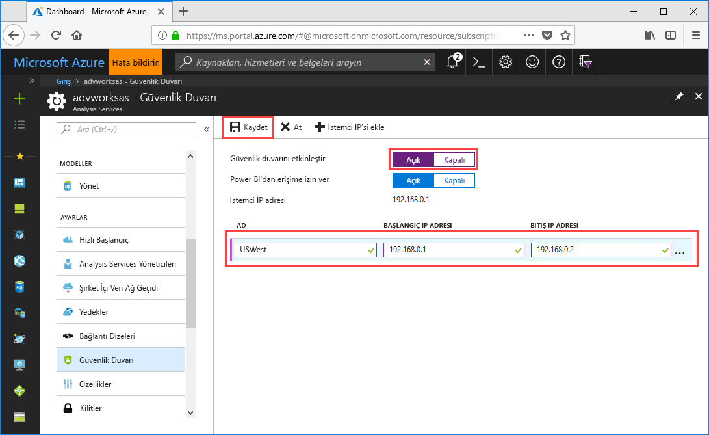

# Hızlı başlangıç: Sunucu güvenlik duvarını yapılandırma - Portal

Bu hızlı başlangıç Azure Analysis Services sunucunuz için güvenlik duvarını yapılandırmanıza yardımcı olur. Güvenlik duvarını etkinleştirmek ve yalnızca sunucunuza erişen bilgisayarlar için IP adresi aralıkları yapılandırmak, sunucunuzu ve verilerinizi güvenlik altına almanın önemli bir parçasıdır.

## Ön koşullar

- Aboneliğinizde bir Analysis Services sunucusu. Daha fazla bilgi edinmek için bkz. [Hızlı başlangıç: Sunucu oluşturma - Portal](analysis-services-create-server.md) veya [Hızlı başlangıç: Sunucu oluşturma - PowerShell](analysis-services-create-powershell.md)
- İstemci bilgisayarlar için bir veya birden çok IP adresi aralığı (gerekiyorsa).

## Azure portalında oturum açma 

[Portalda oturum açma](https://portal.azure.com)

## Güvenlik duvarını yapılandırma

1. Genel Bakış sayfasını açmak için sunucunuza tıklayın. 
2. **AYARLAR** > **Güvenlik Duvarı** > **Güvenlik duvarını etkinleştir** altında **Açık** seçeneğine tıklayın.
3. Power BI hizmetinden DirectQuery erişimine izin vermek için, **Power BI'dan erişime izin ver** alanında **Açık** seçeneğine tıklayın.  
4. (İsteğe bağlı) Bir veya birden çok IP adresi aralığı belirtin. Her aralık için bir ad, başlangıç ve bitiş IP adresi girin. 
5. **Kaydet**’e tıklayın.

     

## Kaynakları temizleme

Artık ihtiyacınız kalmadığında, IP adresi aralıklarını silin veya güvenlik duvarını devre dışı bırakın.

## Sonraki adımlar
Bu hızlı başlangıçta, sunucunuz için güvenlik duvarı yapılandırmayı öğrendiniz. Artık sunucunuz olduğuna ve bir güvenlik duvarıyla sunucunun güvenliğini sağladığınıza göre, ona portaldan temel bir örnek veri modeli ekleyebilirsiniz. Örnek modelin olması, model veritabanı rollerini yapılandırma ve istemci bağlantılarını test etme işlemlerini öğrenmeye yardımcı olur. Daha fazla bilgi edinmek için, örnek model ekleme öğreticisiyle devam edin.

> [!div class="nextstepaction"]
> [Öğretici: Sunucunuza örnek model ekleme](analysis-services-create-sample-model.md)
