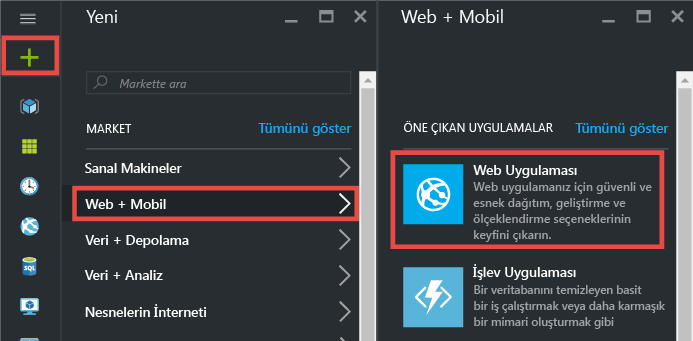
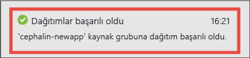
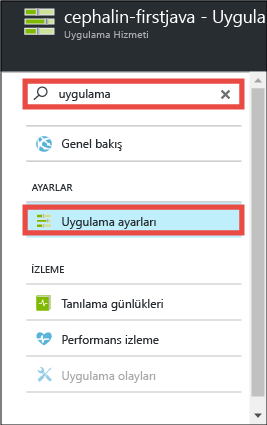
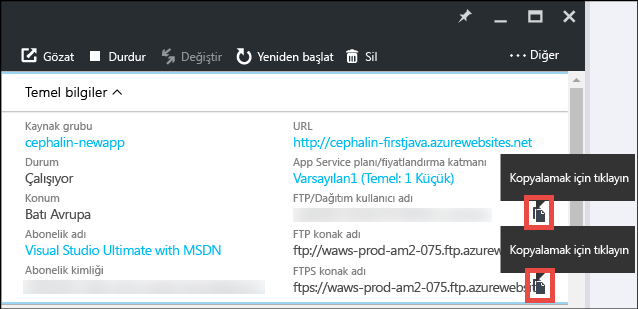
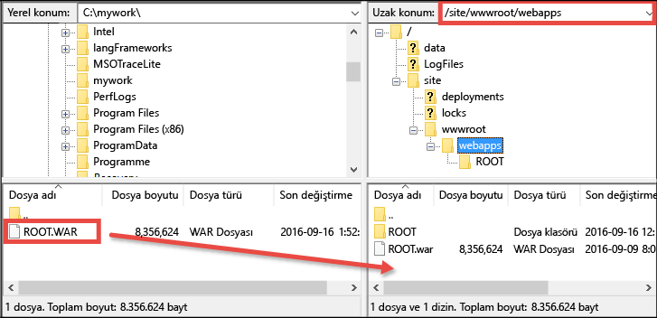

# Beş dakika içinde Azure’a ilk Java web uygulamanızı dağıtın (CLI 2.0 Önizleme)

> [!div class="op_single_selector"]
> * [İlk HTML sitesi](app-service-web-get-started-html-cli-nodejs.md)
> * [İlk .NET uygulaması](app-service-web-get-started-dotnet-cli-nodejs.md)
> * [İlk PHP uygulaması](app-service-web-get-started-php-cli-nodejs.md)
> * [İlk Node.js uygulaması](app-service-web-get-started-nodejs-cli-nodejs.md)
> * [İlk Python uygulaması](app-service-web-get-started-python-cli-nodejs.md)
> * [İlk Java uygulaması](app-service-web-get-started-java.md)
> 
> 

Bu öğretici, [Azure Uygulama Hizmeti](../app-service/app-service-value-prop-what-is.md)’nde basit bir Java web uygulaması dağıtmanıza yardımcı olur.
Web uygulamaları, [mobil uygulama arka uçları](/documentation/learning-paths/appservice-mobileapps/) ve [API Apps](../app-service-api/app-service-api-apps-why-best-platform.md) oluşturmak için App Service kullanabilirsiniz.

Yapacaklarınız: 

* Azure Uygulama Hizmeti'nde bir web uygulaması oluşturun.
* Örnek bir Java uygulaması dağıtın.
* Kodunuzun üretim ortamında dinamik bir şekilde çalıştığını görün.

## Önkoşullar
* [FileZilla](https://filezilla-project.org/) gibi bir FTP/FTPS istemcisi edinin.
* Bir Microsoft Azure hesabı edinin. Bir hesabınız yoksa, [ücretsiz deneme için kaydolabilir](https://azure.microsoft.com/pricing/free-trial/?WT.mc_id=A261C142F) veya [Visual Studio abone avantajlarınızı etkinleştirebilirsiniz.](https://azure.microsoft.com/pricing/member-offers/msdn-benefits-details/?WT.mc_id=A261C142F)

> [!NOTE]
> Azure hesabınız olmadan [App Service'i Deneyebilirsiniz](https://azure.microsoft.com/try/app-service/). Başlangıç uygulaması oluşturun ve bir saate kadar üzerinde çalışın; kredi kartı veya taahhüt gerekmez.
> 
> 

## Web uygulaması oluşturma
1. Azure hesabınızla [Azure portalında](https://portal.azure.com) oturum açın.
2. Sol menüden **Yeni** > **Web + Mobil** > **Web Uygulaması**'na tıklayın.
   
    
3. Uygulama oluşturma dikey penceresinde yeni uygulamanız için şu ayarları kullanın:
   
   * **Uygulama adı**: Benzersiz bir ad yazın.
   * **Kaynak grubu**: **Yeni Oluştur**'u seçin ve kaynak grubuna bir ad verin.
   * **App Service planı/Konumu**: Yapılandırmak için üzerine tıklayın, ardından App Service planının adını, konumunu ve fiyatlandırma katmanını ayarlamak için **Yeni Oluştur**'a tıklayın. **Ücretsiz** fiyatlandırma katmanını dilediğiniz gibi kullanın.
     
     İşlemleri tamamladığınızda uygulama oluşturma dikey pencereniz şu şekilde görünür:
     
     
4. Alttaki **Oluştur** düğmesine tıklayın. İlerlemeyi görmek için üstteki **Bildirim** simgesine tıklayabilirsiniz.
   
    
5. Dağıtım tamamlandığında bu bildirim iletisini görürsünüz. Dağıtımınızın dikey penceresini açmak için iletiye tıklayın.
   
    
6. Yeni web uygulamanızın dikey penceresini açmak için, **Dağıtım başarılı oldu** dikey penceresindeki **Kaynak** bağlantısına tıklayın.
   
    

## Bir Java uygulamasını web uygulamanızda dağıtma
Şimdi, FTPS kullanarak bir Java uygulamasını Azure’da dağıtalım.

1. Web uygulaması dikey penceresinde aşağı kaydırarak veya arayarak **Uygulama ayarlarını** bulun ve üzerine tıklayın. 
   
    
2. **Java sürümü**’nde **Java 8**’i seçin ve **Kaydet**’e tıklayın.
   
    
   
    **Web uygulaması ayarları başarıyla güncelleştirildi** bildirimini aldığınızda, http://*&lt;uygulamaadı>*.azurewebsites.net adresine giderek varsayılan JSP servlet’ini çalışırken görün.
3. Web uygulaması dikey penceresine dönüp, aşağı kaydırarak veya arayarak **Dağıtım kimlik bilgilerini** bulun ve üzerine tıklayın.
4. Dağıtım kimlik bilgilerinizi ayarlayın ve **Kaydet**'e tıklayın.
5. Web uygulaması dikey penceresinde, **Genel Bakış**’a tıklayın. **FTP/Dağıtım kullanıcı adı** ve **FTPS ana bilgisayar adı**’nın yanındaki **Kopyala** düğmesine tıklayarak bu değerleri kopyalayın.
   
    
   
    Artık Java uygulamanızı FTPS ile dağıtmaya hazırsınız.
6. FTP/FTPS istemcinizde, bir önceki adımda kopyaladığınız değerleri kullanarak Azure web uygulamanızın FTP sunucusunda oturum açın. Daha önce oluşturduğunuz dağıtım parolasını kullanın.
   
    Aşağıdaki ekran görüntüsünde, FileZilla ile oturum açma işlemi gösterilmiştir.
   
    
   
    Azure’da tanınmayan SSL sertifikaları için güvenlik uyarılarıyla karşılaşabilirsiniz. Devam edin.
7. [Bu bağlantıya](https://github.com/Azure-Samples/app-service-web-java-get-started/raw/master/webapps/ROOT.war) tıklayarak WAR dosyasını yerel makinenize indirin.
8. FTP/FTPS istemcinizde, uzak sitede **/site/wwwroot/webapps** konumuna gidin ve yerel makinenizdeki indirilmiş WAR dosyasını bu uzak dizine sürükleyin.
   
    
   
    **Tamam**’a tıklayarak dosyayı Azure’da geçersiz kılın.
   
   > [!NOTE]
   > Tomcat’in varsayılan davranışına uygun olarak, /site/wwwroot/webapps içindeki **ROOT.war** dosya adı, kök web uygulamasını (http://*&lt;uygulamaadı>*.azurewebsites.net); ***&lt;ad>*.war** dosya adı ise adlandırılmış bir web uygulamasını (http://*&lt;uygulamaadı>*.azurewebsites.net/*&lt;ad>*) belirtir.
   > 
   > 

İşte bu kadar! Java uygulamanız artık Azure'da çalışıyor. Kodunuzun nasıl çalıştığını görmek için tarayıcınızda http://*&lt;uygulamaadı >*.azurewebsites.net sayfasına gidin. 

## Uygulamanızda güncelleştirmeler yapma
Bir güncelleştirme yapmanız gerektiğinde, yeni WAR dosyasını FTP/FTPS istemcinizle aynı uzak dizine yüklemeniz yeterlidir.

## Sonraki adımlar
[Azure Market’te şablondan Java web uygulaması oluşturma](web-sites-java-get-started.md#marketplace). Tamamen özelleştirilebilen kendi Tomcat kapsayıcınıza sahip olabilir ve alışık olduğunuz Yönetici Kullanıcı Arabiriminden yararlanabilirsiniz. 

Doğrudan [IntelliJ](app-service-web-debug-java-web-app-in-intellij.md) veya [Eclipse](app-service-web-debug-java-web-app-in-eclipse.md) içinden Azure web uygulamanızda hata ayıklayın.

Veya ilk web uygulamanızla daha fazlasını yapın. Örnek:

* [Kodunuzu Azure'a dağıtmanın diğer yollarını](web-sites-deploy.md) deneyin. 
* Azure uygulamanızı bir sonraki seviyeye taşıyın. Kullanıcılarınızın kimliklerini doğrulayın. Talebe göre ölçeklendirin. Performans uyarıları ayarlayın. Tümünü birkaç tıklamayla gerçekleştirin. Bkz. [İlk web uygulamanıza işlevsellik ekleme](app-service-web-get-started-2.md).

<!--HONumber=Feb17_HO3-->

