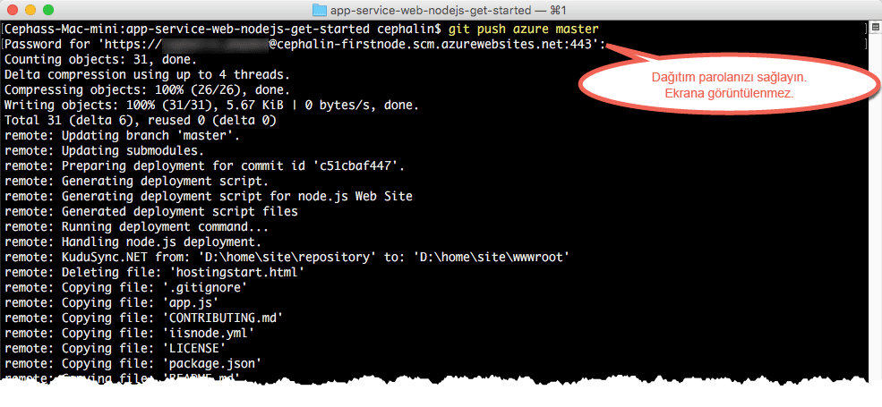

# İlk Node.js web uygulamanızı Azure’da beş dakikada dağıtın (CLI 2.0 Önizleme)

> [!div class="op_single_selector"]
> * [İlk HTML sitesi](app-service-web-get-started-html.md)
> * [İlk .NET uygulaması](app-service-web-get-started-dotnet.md)
> * [İlk PHP uygulaması](app-service-web-get-started-php.md)
> * [İlk Node.js uygulaması](app-service-web-get-started-nodejs.md)
> * [İlk Python uygulaması](app-service-web-get-started-python.md)
> * [İlk Java uygulaması](app-service-web-get-started-java.md)
> 
> 

Bu öğretici, ilk Node.js web uygulamanızı [Azure Uygulama Hizmeti](../app-service/app-service-value-prop-what-is.md)’nde dağıtmanıza yardımcı olur.
Web uygulamaları, [mobil uygulama arka uçları](/documentation/learning-paths/appservice-mobileapps/) ve [API Apps](../app-service-api/app-service-api-apps-why-best-platform.md) oluşturmak için App Service kullanabilirsiniz.

Yapacaklarınız: 

* Azure Uygulama Hizmeti'nde bir web uygulaması oluşturun.
* Örnek Node.js kodunu dağıtın.
* Kodunuzun üretim ortamında dinamik bir şekilde çalıştığını görün.
* Web uygulamanızı [Git yürütmelerini gönderdiğiniz](https://git-scm.com/docs/git-push) şekilde güncelleştirin.

[!INCLUDE [app-service-linux](../../includes/app-service-linux.md)]

## Görevi tamamlamak için kullanılacak CLI sürümleri

Görevi aşağıdaki CLI sürümlerinden birini kullanarak tamamlayabilirsiniz:

- [Azure CLI 1.0](app-service-web-get-started-nodejs-cli-nodejs.md): Klasik ve kaynak yönetimi dağıtım modellerine yönelik CLI’mız
- [Azure CLI 2.0 (Önizleme)](app-service-web-get-started-nodejs.md): Kaynak yönetimi dağıtım modeline yönelik yeni nesil CLI’mız

## Ön koşullar
* [Git](http://www.git-scm.com/downloads).
* [Azure CLI 2.0 Önizleme](/cli/azure/install-az-cli2).
* Bir Microsoft Azure hesabı. Bir hesabınız yoksa, [ücretsiz deneme için kaydolabilir](https://azure.microsoft.com/pricing/free-trial/?WT.mc_id=A261C142F) veya [Visual Studio abone avantajlarınızı etkinleştirebilirsiniz.](https://azure.microsoft.com/pricing/member-offers/msdn-benefits-details/?WT.mc_id=A261C142F)

> [!NOTE]
> Azure hesabınız olmadan [App Service'i Deneyebilirsiniz](https://azure.microsoft.com/try/app-service/). Başlangıç uygulaması oluşturun ve bir saate kadar üzerinde çalışın; kredi kartı veya taahhüt gerekmez.
> 
> 

## Node.js web uygulaması dağıtma
1. Yeni bir Windows komut istemi, PowerShell penceresi, Linux kabuğu veya OS X terminali açın. Makinenizde Git ve Azure CLI’nın yüklü olduğunu doğrulamak için `git --version` ve `azure --version` çalıştırın.
   
    
   
    Araçları yüklemediyseniz, indirme bağlantıları için bkz. [Ön koşullar](#Prerequisites).
2. Azure’da aşağıdaki gibi oturum açın:
   
        az login
   
    Oturum açma işlemine devam etmek için yardım iletisini izleyin.
   
    

3. App Service için dağıtım kullanıcısını ayarlayın. Kodu daha sonra bu kimlik bilgilerini kullanarak dağıtacaksınız.
   
        az appservice web deployment user set --user-name <username> --password <password>

3. Yeni bir [kaynak grubu](../azure-resource-manager/resource-group-overview.md) oluşturun. Bu ilk App Service öğreticisi için bunun ne olduğunu bilmeniz gerekmez.

        az group create --location "<location>" --name my-first-app-group

    `<location>` için hangi olası değerleri kullanabileceğinizi görmek için `az appservice list-locations` CLI komutunu kullanın.

3. Yeni bir "ÜCRETSİZ" [App Service planı](../app-service/azure-web-sites-web-hosting-plans-in-depth-overview.md) oluşturun. App Service’e yönelik bu ilk öğreticide, bu plandaki web uygulamaları için ücret ödemeniz gerekmeyecektir.

        az appservice plan create --name my-free-appservice-plan --resource-group my-first-app-group --sku FREE

4. `<app_name>` içinde benzersiz bir ada sahip yeni bir web uygulaması oluşturun.

        az appservice web create --name <app_name> --resource-group my-first-app-group --plan my-free-appservice-plan

4. Ardından, dağıtmak istediğiniz örnek Node.js kodunu alın. Çalışan bir dizine (`CD`) geçin ve örnek uygulamayı şu şekilde kopyalayın:
   
        cd <working_directory>
        git clone https://github.com/Azure-Samples/app-service-web-nodejs-get-started.git

5. Örnek uygulamanızın deposuna geçin.
   
        cd app-service-web-nodejs-get-started
5. Şu komutla App Service web uygulamanıza yönelik yerel Git dağıtımını yapılandırın:

        az appservice web source-control config-local-git --name <app_name> --resource-group my-first-app-group

    Buna benzer bir JSON çıktısı alırsınız ve bu çıktı uzak Git deposunun yapılandırıldığı anlamına gelir:

        {
        "url": "https://<deployment_user>@<app_name>.scm.azurewebsites.net/<app_name>.git"
        }

6. JSON'daki URL'yi yerel deponuz (basit olması açısından `azure` diyelim) için bir uzak Git deposu olarak ekleyin.

        git remote add azure https://<deployment_user>@<app_name>.scm.azurewebsites.net/<app_name>.git
   
7. Örnek kodunuzu, Git ile herhangi bir kodu gönderir gibi Azure uygulamanıza dağıtın. İstendiğinde önceden yapılandırdığınız parolayı kullanın.
   
        git push azure master
   
    
   
    `git push` Azure’a kod yerleştirmekle kalmaz, aynı zamanda dağıtım altyapısında dağıtım görevlerini tetikler. 
    Proje (depo) kökünüzde package.json varsa dağıtım betiği, gerekli paketleri sizin için geri yükler. 

Tebrikler, Azure App Service’ize uygulamanızı dağıttınız.

## Uygulamanızı çalışırken görme
Azure’da uygulamanızı çalışırken görmek için deponuzun herhangi bir dizininden bu komutu çalıştırın:

    azure site browse

## Uygulamanızda güncelleştirmeler yapma
Artık canlı sitede bir güncelleştirme yapmak için projenizin (depo) kökünden gönderme yapmak üzere Git’i kullanabilirsiniz. Kodunuzu ilk kez dağıtırken de bu yolu izlersiniz. Örneğin yerel olarak test ettiğiniz yeni bir değişikliği her göndermek istediğinizde tek yapmanız gereken projenizin (depo) kökünden aşağıdaki komutları çalıştırmaktır:

    git add .
    git commit -m "<your_message>"
    git push azure master

## Sonraki adımlar
[Node.js Express web uygulaması oluşturma, yapılandırma ve Azure’da dağıtma](app-service-web-nodejs-get-started.md). Bu öğreticiyi izleyerek, Azure’da Node.js web uygulaması çalıştırmak için ihtiyacınız olan aşağıdaki gibi temel becerileri öğrenebilirsiniz:

* Azure’da PowerShell/Bash uygulamaları oluşturma ve yapılandırma.
* Node.js sürümünü ayarlama.
* Kök uygulama dizininde olmayan bir başlangıç dosyası kullanma.
* NPM ile otomatikleştirme.
* Hata ve çıkış günlükleri alma.

Veya ilk web uygulamanızla daha fazlasını yapın. Örnek:

* [Kodunuzu Azure'a dağıtmanın diğer yollarını](web-sites-deploy.md) deneyin. Örneğin, GitHub depolarınızın birinden dağıtım yapmak için **Dağıtım seçenekleri**'nde **Yerel Git Deposu** yerine **GitHub**'ı seçmeniz yeterlidir.
* Azure uygulamanızı bir sonraki seviyeye taşıyın. Kullanıcılarınızın kimliklerini doğrulayın. Talebe göre ölçeklendirin. Performans uyarıları ayarlayın. Tümünü birkaç tıklamayla gerçekleştirin. Bkz. [İlk web uygulamanıza işlevsellik ekleme](app-service-web-get-started-2.md).

<!--HONumber=Feb17_HO2-->

