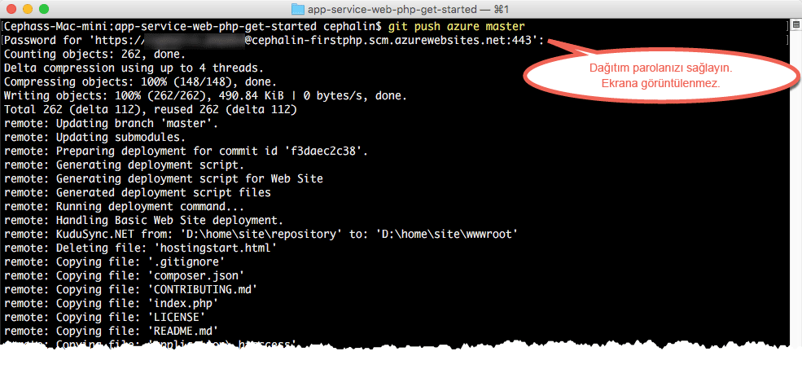

# İlk PHP web uygulamanızı Azure’da beş dakikada dağıtma
[!INCLUDE [app-service-web-selector-get-started-nodejs-cli](../../includes/app-service-web-selector-get-started-nodejs-cli.md)]  

Bu öğretici, ilk PHP web uygulamanızı [Azure Uygulama Hizmeti](../app-service/app-service-value-prop-what-is.md)’nde dağıtmanıza yardımcı olur.
Web uygulamaları, [mobil uygulama arka uçları](/documentation/learning-paths/appservice-mobileapps/) ve [API Apps](../app-service-api/app-service-api-apps-why-best-platform.md) oluşturmak için App Service kullanabilirsiniz.

Yapacaklarınız: 

* Azure Uygulama Hizmeti'nde bir web uygulaması oluşturun.
* Örnek PHP kodunu dağıtın.
* Kodunuzun üretim ortamında dinamik bir şekilde çalıştığını görün.
* Web uygulamanızı [Git yürütmelerini gönderdiğiniz](https://git-scm.com/docs/git-push) şekilde güncelleştirin.

[!INCLUDE [app-service-linux](../../includes/app-service-linux.md)]

## Görevi tamamlamak için kullanılacak CLI sürümleri

Görevi aşağıdaki CLI sürümlerinden birini kullanarak tamamlayabilirsiniz:

- [Azure CLI 1.0](app-service-web-get-started-php-cli-nodejs.md): Klasik ve kaynak yönetimi dağıtım modellerine yönelik CLI’mız
- [Azure CLI 2.0](app-service-web-get-started-php.md): Kaynak yönetimi dağıtım modeline yönelik yeni nesil CLI'mız

## Ön koşullar
* [Git](http://www.git-scm.com/downloads).
* [Azure CLI](../xplat-cli-install.md).
* Bir Microsoft Azure hesabı. Bir hesabınız yoksa, [ücretsiz deneme için kaydolabilir](https://azure.microsoft.com/pricing/free-trial/?WT.mc_id=A261C142F) veya [Visual Studio abone avantajlarınızı etkinleştirebilirsiniz.](https://azure.microsoft.com/pricing/member-offers/msdn-benefits-details/?WT.mc_id=A261C142F)

> [!NOTE]
> Azure hesabınız olmadan [App Service'i Deneyebilirsiniz](https://azure.microsoft.com/try/app-service/). Başlangıç uygulaması oluşturun ve bir saate kadar üzerinde çalışın; kredi kartı veya taahhüt gerekmez.
> 
> 

## PHP web uygulaması dağıtma
1. Yeni bir Windows komut istemi, PowerShell penceresi, Linux kabuğu veya OS X terminali açın. Makinenizde Git ve Azure CLI’nın yüklü olduğunu doğrulamak için `git --version` ve `azure --version` çalıştırın.
   
    
   
    Araçları yüklemediyseniz, indirme bağlantıları için bkz. [Ön koşullar](#Prerequisites).
2. Azure’da aşağıdaki gibi oturum açın:
   
        azure login
   
    Oturum açma işlemine devam etmek için yardım iletisini izleyin.
   
    
3. Azure CLI’yi ASM moduna alın ve Uygulama Hizmeti için dağıtım kullanıcısını ayarlayın. Kodu daha sonra bu kimlik bilgilerini kullanarak dağıtacaksınız.
   
        azure config mode asm
        azure site deployment user set --username <username> --pass <password>
4. Çalışan bir dizine (`CD`) geçin ve örnek PHP uygulamasını şu şekilde kopyalayın:
   
        git clone https://github.com/Azure-Samples/app-service-web-php-get-started.git
5. Örnek uygulamanızın deposuna geçin. Örnek:
   
        cd app-service-web-php-get-started
6. Azure’da Uygulama Hizmeti uygulama kaynağını benzersiz uygulama adıyla ve daha önce yapılandırdığınız dağıtım kullanıcısıyla oluşturun. Sorulduğunda tercih edilen bölgenin numarasını belirtin.
   
        azure site create <app_name> --git --gitusername <username>
   
    
   
    Uygulamanız artık Azure’da oluşturulmuştur. Ayrıca geçerli dizininiz Git ile başlatılmıştır ve yeni App Service uygulamasına Git remote olarak bağlanmıştır.
    Varsayılan HTML sayfasını görmek için uygulama URL’sine göz atabilirsiniz (http://&lt;uygulama_adı>.azurewebsites.net), ancak şimdi kodlarınızı buraya yerleştirmeye bakalım.
7. Örnek kodunuzu, Git ile herhangi bir kodu gönderir gibi Azure uygulamanıza dağıtın. İstendiğinde önceden yapılandırdığınız parolayı kullanın.
   
        git push azure master
   
    
   
    `git push` Azure’a kod yerleştirmekle kalmaz, aynı zamanda dağıtım altyapısında dağıtım görevlerini tetikler. Bununla birlikte PHP uygulamanızda composer.json dosyalarını otomatik olarak işlemek için  [Composer uzantısını etkinleştirebilirsiniz](web-sites-php-mysql-deploy-use-git.md#composer).

Tebrikler, Azure App Service’ize uygulamanızı dağıttınız.

## Uygulamanızı çalışırken görme
Azure’da uygulamanızı çalışırken görmek için deponuzun herhangi bir dizininden bu komutu çalıştırın:

    azure site browse

## Uygulamanızda güncelleştirmeler yapma
Artık canlı sitede bir güncelleştirme yapmak için projenizin (depo) kökünden gönderme yapmak üzere Git’i kullanabilirsiniz. Kodunuzu ilk kez dağıtırken de bu yolu izlersiniz. Örneğin yerel olarak test ettiğiniz yeni bir değişikliği her göndermek istediğinizde tek yapmanız gereken projenizin (depo) kökünden aşağıdaki komutları çalıştırmaktır:

    git add .
    git commit -m "<your_message>"
    git push azure master

## Sonraki adımlar
[Laravel web uygulaması oluşturma, onu yapılandırma ve Azure’da dağıtma](app-service-web-php-get-started-cli-nodejs.md). Bu öğreticiyi izleyerek, Azure’da herhangi bir PHP web uygulamasını çalıştırmak için ihtiyacınız olan aşağıdaki gibi temel becerileri öğrenebilirsiniz:

* Azure’da PowerShell/Bash uygulamaları oluşturma ve yapılandırma.
* PHP sürümünü ayarlama.
* Kök uygulama dizininde olmayan bir başlangıç dosyası kullanma.
* Composer otomasyonunu etkinleştirme.
* Ortama özel değişkenlere erişme.
* Sık karşılaşılan hataları giderme.

Veya ilk web uygulamanızla daha fazlasını yapın. Örnek:

* [Kodunuzu Azure'a dağıtmanın diğer yollarını](web-sites-deploy.md) deneyin. Örneğin, GitHub depolarınızın birinden dağıtım yapmak için **Dağıtım seçenekleri**'nde **Yerel Git Deposu** yerine **GitHub**'ı seçmeniz yeterlidir.
* Azure uygulamanızı bir sonraki seviyeye taşıyın. Kullanıcılarınızın kimliklerini doğrulayın. Talebe göre ölçeklendirin. Performans uyarıları ayarlayın. Tümünü birkaç tıklamayla gerçekleştirin. Bkz. [İlk web uygulamanıza işlevsellik ekleme](app-service-web-get-started-2.md).

