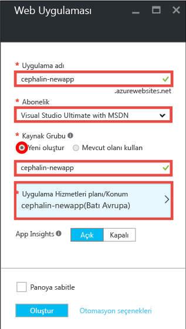
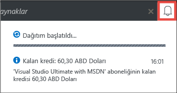
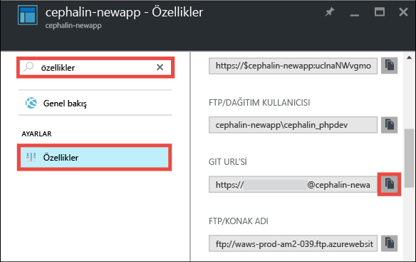
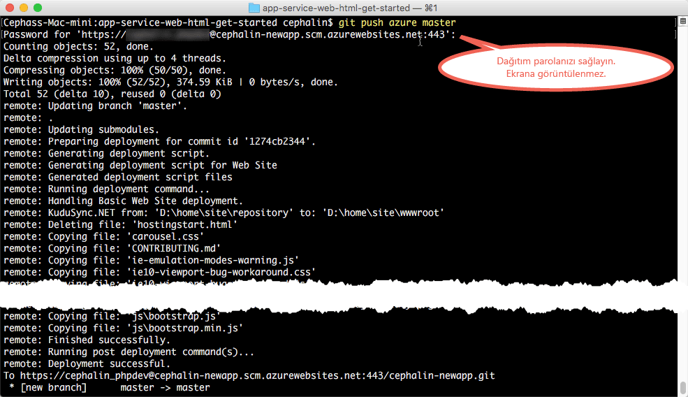

<properties 
    pageTitle="Beş dakika içinde Azure’a ilk web uygulamanızı dağıtın | Microsoft Azure" 
    description="Örnek bir uygulama dağıtarak App Service'te web uygulamaları çalıştırmanın ne kadar kolay olduğunu öğrenin. Hızlı bir şekilde gerçek geliştirmeler yapmaya başlayın ve sonuçlarını anında görün." 
    services="app-service\web"
    documentationCenter=""
    authors="cephalin"
    manager="wpickett"
    editor=""
/>

<tags
    ms.service="app-service-web"
    ms.workload="web"
    ms.tgt_pltfrm="na"
    ms.devlang="na"
    ms.topic="hero-article"
    ms.date="09/09/2016" 
    ms.author="cephalin"
/>
    
# Beş dakika içinde Azure’a ilk web uygulamanızı dağıtın

Bu öğretici ilk web uygulamanızı [App Service](../app-service/app-service-value-prop-what-is.md)’e dağıtmanıza yardımcı olur.
Web uygulamaları, [mobil uygulama arka uçları](/documentation/learning-paths/appservice-mobileapps/) ve [API Apps](../app-service-api/app-service-api-apps-why-best-platform.md) oluşturmak için App Service kullanabilirsiniz.

Yapacaklarınız: 

- Azure Uygulama Hizmeti'nde bir web uygulaması oluşturun.
- Örnek kod (ASP.NET, PHP, Node.js, Java, veya Python arasından seçiminizi yapın) dağıtın.
- Kodunuzun üretim ortamında dinamik bir şekilde çalıştığını görün.
- Web uygulamanızı [Git yürütmelerini gönderdiğiniz](https://git-scm.com/docs/git-push) şekilde güncelleştirin.

## Ön koşullar

- [Git’i yükleyin](http://www.git-scm.com/downloads). Yeni bir Windows komut isteminden, PowerShell penceresinden, Linux kabuğundan veya OS X terminalinden `git --version` öğesini çalıştırarak yüklemenizin başarılı olduğunu doğrulayın.
- Bir Microsoft Azure hesabı edinin. Bir hesabınız yoksa, [ücretsiz deneme için kaydolabilir](/pricing/free-trial/?WT.mc_id=A261C142F) veya [Visual Studio abone avantajlarınızı etkinleştirebilirsiniz.](/pricing/member-offers/msdn-benefits-details/?WT.mc_id=A261C142F)

>[AZURE.NOTE] Azure hesabınız olmadan [App Service'i Deneyebilirsiniz](http://go.microsoft.com/fwlink/?LinkId=523751). Başlangıç uygulaması oluşturun ve bir saate kadar üzerinde çalışın; kredi kartı veya taahhüt gerekmez.

## Web uygulaması oluşturma

1. Azure hesabınızla [Azure portalında](https://portal.azure.com) oturum açın.

2. Sol menüden **Yeni** > **Web + Mobil** > **Web Uygulaması**'na tıklayın.

    

3. Uygulama oluşturma dikey penceresinde yeni uygulamanız için şu ayarları kullanın:

    - **Uygulama adı**: Benzersiz bir ad yazın.
    - **Kaynak grubu**: **Yeni Oluştur**'u seçin ve kaynak grubuna bir ad verin.
    - **App Service planı/Konumu**: Yapılandırmak için üzerine tıklayın, ardından App Service planının adını, konumunu ve fiyatlandırma katmanını ayarlamak için **Yeni Oluştur**'a tıklayın. **Ücretsiz** fiyatlandırma katmanını dilediğiniz gibi kullanın.

    İşlemleri tamamladığınızda uygulama oluşturma dikey pencereniz şu şekilde görünür:

    

3. Alttaki **Oluştur** düğmesine tıklayın. İlerlemeyi görmek için üstteki **Bildirim** simgesine tıklayabilirsiniz.

    

4. Dağıtım tamamlandığında bu bildirim iletisini görürsünüz. Dağıtımınızın dikey penceresini açmak için iletiye tıklayın.

    

5. Yeni web uygulamanızın dikey penceresini açmak için, **Dağıtım başarılı oldu** dikey penceresindeki **Kaynak** bağlantısına tıklayın.

    

## Kodu, web uygulamanıza dağıtın

Şimdi, Git kullanarak Azure'a birkaç kod dağıtalım.

5. Web uygulaması dikey penceresinde, aşağı kaydırarak veya aratarak **Dağıtım seçenekleri**ni bulun ve üzerine tıklayın. 

    

6. **Kaynak Seç** > **Yerel Git Deposu** > **Tamam**'a tıklayın.

7. Web uygulaması dikey penceresine dönüp **Dağıtım kimlik bilgileri**'ne tıklayın.

8. Dağıtım kimlik bilgilerinizi ayarlayın ve **Kaydet**'e tıklayın.

7. Web uygulaması dikey penceresine dönüp aşağı kaydırarak veya aratarak **Özellikler**'i bulun ve üzerine tıklayın. **Git URL'sinin** yanındaki **Kopyala** düğmesine tıklayın.

    

    Artık kodunuzu Git ile dağıtmaya hazırsınız.

1. Komut satırı terminalinizde, çalışma dizinine (`CD`) geçip örnek uygulamayı şu şekilde kopyalayın:

        git clone <github_sample_url>

    

    *&lt;github_sample_url>* için, tercih ettiğiniz altyapıya bağlı olarak aşağıdaki URL’lerden birini kullanın:

    - HTML+CSS+JS: [https://github.com/Azure-Samples/app-service-web-html-get-started.git](https://github.com/Azure-Samples/app-service-web-html-get-started.git)
    - ASP.NET: [https://github.com/Azure-Samples/app-service-web-dotnet-get-started.git](https://github.com/Azure-Samples/app-service-web-dotnet-get-started.git)
    - PHP (CodeIgniter): [https://github.com/Azure-Samples/app-service-web-php-get-started.git](https://github.com/Azure-Samples/app-service-web-php-get-started.git)
    - Node.js (Express): [https://github.com/Azure-Samples/app-service-web-nodejs-get-started.git](https://github.com/Azure-Samples/app-service-web-nodejs-get-started.git)
    - Java: [https://github.com/Azure-Samples/app-service-web-java-get-started.git](https://github.com/Azure-Samples/app-service-web-java-get-started.git)
    - Python (Django): [https://github.com/Azure-Samples/app-service-web-python-get-started.git](https://github.com/Azure-Samples/app-service-web-python-get-started.git)

2. Örnek uygulamanızın deposuna geçin. Örneğin, 

        cd app-service-web-html-get-started

3. Birkaç adım önce Portaldan kopyaladığınız Git URL'sini kullanarak Git uzak komutunu Azure uygulamanız için yapılandırın.

        git remote add azure <giturlfromportal>

4. Örnek kodunuzu, Git ile herhangi bir kodu gönderir gibi Azure uygulamanıza dağıtın:

        git push azure master

        

    Dil altyapılarından birini kullandıysanız farklı bir çıktı göreceksiniz. Bunun nedeni `git push` Azure’a kod yerleştirmekle kalmaz, aynı zamanda dağıtım altyapısında dağıtım görevlerini tetikler. Proje (depo) kökünde package.json (Node.js) veya requirements.txt (Python) dosyaları bulunuyorsa ya da ASP.NET projenizde packages.config dosyası bulunuyorsa, dağıtım betiği sizin için gerekli paketleri geri yükler. Bununla birlikte PHP uygulamanızda composer.json dosyalarını otomatik olarak işlemek için [Composer uzantısını etkinleştirebilirsiniz](web-sites-php-mysql-deploy-use-git.md#composer).

İşte bu kadar! Kodunuz artık Azure'da dinamik bir şekilde çalışıyor. Kodunuzun nasıl çalıştığını görmek için tarayıcınızda http://*&lt;uygulamaadı >*.azurewebsites.net sayfasına gidin. 

## Uygulamanızda güncelleştirmeler yapma

Artık canlı sitede bir güncelleştirme yapmak için projenizin (depo) kökünden gönderme yapmak üzere Git’i kullanabilirsiniz. Kodunuzu ilk kez dağıtırken de bu yolu izlersiniz. Örneğin yerel olarak test ettiğiniz yeni bir değişikliği her göndermek istediğinizde tek yapmanız gereken projenizin (depo) kökünden aşağıdaki komutları çalıştırmaktır:

    git add .
    git commit -m "<your_message>"
    git push azure master

## Sonraki adımlar

Dil altyapınız için tercih edilen geliştirme ve dağıtım adımlarını bulun:

> [AZURE.SELECTOR]
- [.NET](web-sites-dotnet-get-started.md)
- [PHP](app-service-web-php-get-started.md)
- [Node.js](app-service-web-nodejs-get-started.md)
- [Python](web-sites-python-ptvs-django-mysql.md)
- [Java](web-sites-java-get-started.md)

Veya ilk web uygulamanızla daha fazlasını yapın. Örnek:

- [Kodunuzu Azure'a dağıtmanın diğer yollarını](../app-service-web/web-sites-deploy.md) deneyin. Örneğin, GitHub depolarınızın birinden dağıtım yapmak için **Dağıtım seçenekleri**'nde **Yerel Git Deposu** yerine **GitHub**'ı seçmeniz yeterlidir.
- Azure uygulamanızı bir sonraki seviyeye taşıyın. Kullanıcılarınızın kimliklerini doğrulayın. Talebe göre ölçeklendirin. Performans uyarıları ayarlayın. Tümünü birkaç tıklamayla gerçekleştirin. Bkz. [İlk web uygulamanıza işlevsellik ekleme](app-service-web-get-started-2.md).

<!--HONumber=sep14_HO2-->

