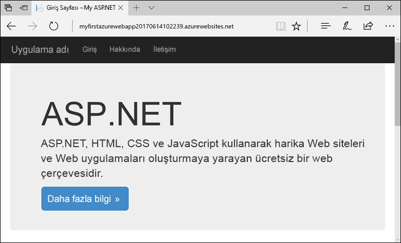
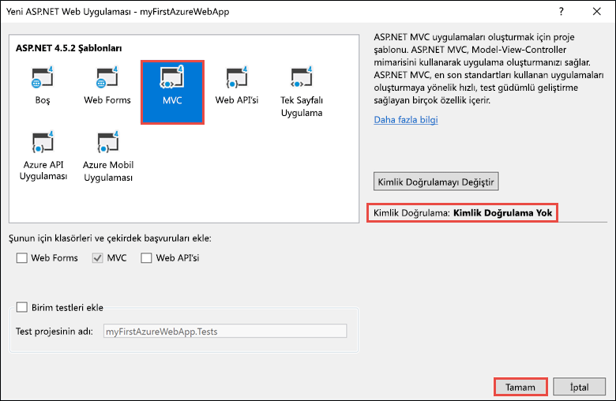
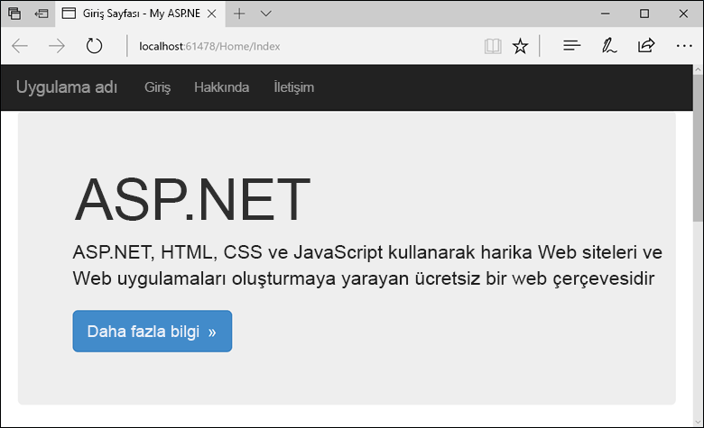
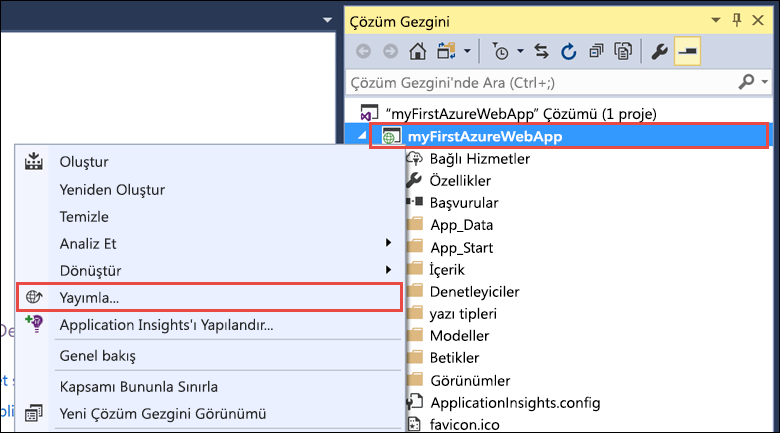
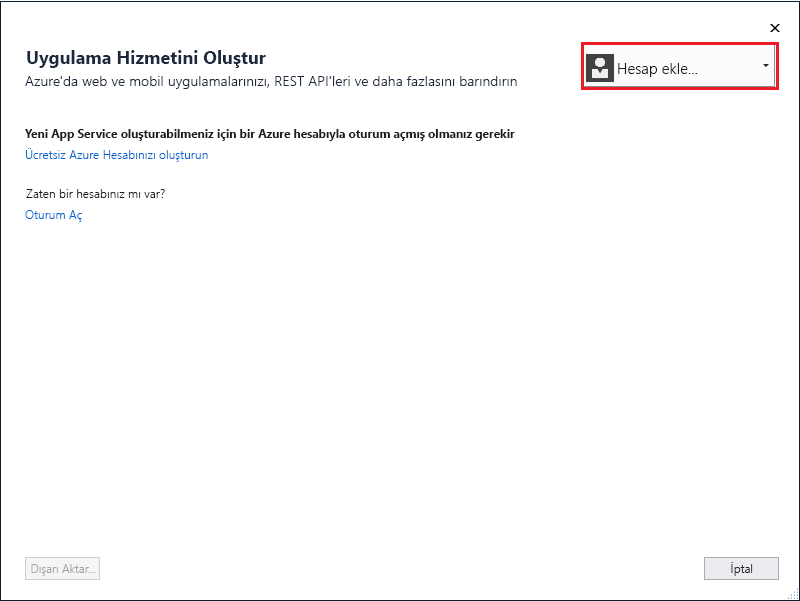
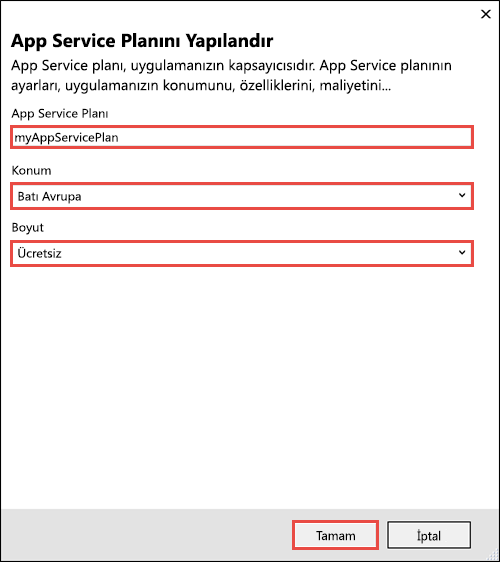
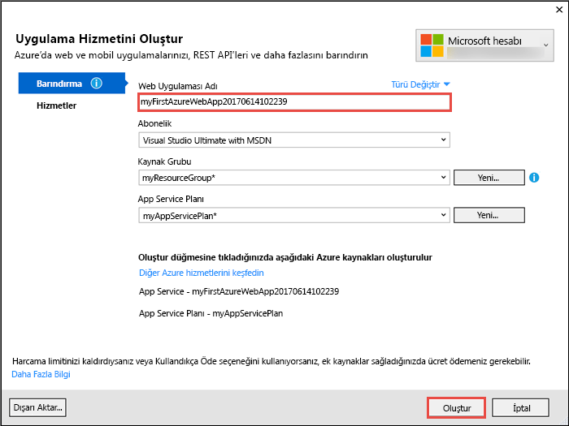
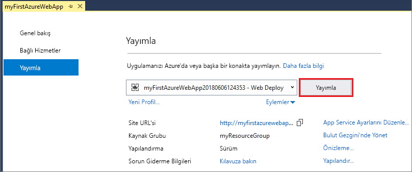
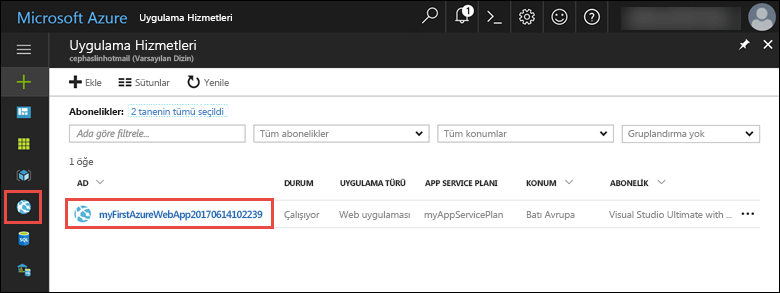
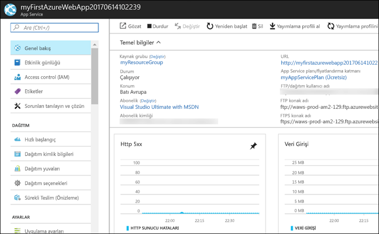

# <a name="create-an-aspnet-framework-web-app-in-azure"></a>Azure’da ASP.NET Framework web uygulaması oluşturma

[Azure App Service](overview.md), yüksek oranda ölçeklenebilen, kendi kendine düzeltme eki uygulayan bir web barındırma hizmeti sunar.  Bu hızlı başlangıçta, ilk ASP.NET web uygulamanızı Azure App Service'e dağıtma işlemi gösterilmektedir. İşlemi tamamladığınızda, App Service planı ve dağıtılmış web uygulaması ile bir App Service uygulaması içeren bir kaynak grubu gerekir.



[!INCLUDE [quickstarts-free-trial-note](../../includes/quickstarts-free-trial-note.md)]

## <a name="prerequisites"></a>Önkoşullar

Bu öğreticiyi tamamlamak için **ASP.NET ve web geliştirme** iş yüküyle <a href="https://www.visualstudio.com/downloads/" target="_blank">Visual Studio 2017</a>’yi yükleyin.

Visual Studio 2017'yi zaten yüklediyseniz:

- **Yardım** > **Güncelleştirmeleri Denetle**'ye tıklayarak Visual Studio'daki en son güncelleştirmeleri yükleyin.
- **Araçlar** > **Araçları ve Özellikleri Al**'a tıklayarak iş yükünü ekleyin.

## <a name="create-an-aspnet-web-app"></a>ASP.NET web uygulaması oluşturma

Visual Studio'da **Dosya > Yeni > Proje**’yi seçerek bir proje oluşturun. 

**Yeni Proje** iletişim kutusunda **Visual C# > Web > ASP.NET Web Uygulaması (.NET Framework)** öğesini seçin.

Uygulamayı _myFirstAzureWebApp_ olarak adlandırın ve ardından **Tamam**’ı seçin.
   


Azure’a herhangi bir türde ASP.NET web uygulaması dağıtabilirsiniz. Bu hızlı başlangıçta **MVC** şablonunu seçin ve kimlik doğrulamasının **Kimlik Doğrulaması Yok** olarak ayarlandığından emin olun.
      
**Tamam**’ı seçin.



Menüden **Hata Ayıkla > Hata Ayıklamadan Başla**’yı seçerek web uygulamasını yerel olarak çalıştırın.



## <a name="launch-the-publish-wizard"></a>Yayımlama sihirbazını başlatma

**Çözüm Gezgini**’nde **myFirstAzureWebApp** projesine sağ tıklayıp **Yayımla**’yı seçin.



Yayımlama sihirbazı otomatik olarak başlatılır. **App Service** > **Yayımla**'yı seçerek **App Service Oluştur** iletişim kutusunu açın.


## <a name="sign-in-to-azure"></a>Azure'da oturum açma

**App Service Oluştur** iletişim kutusunda **Hesap ekle**’yi seçin ve Azure aboneliğinizde oturum açın. Oturumunuz zaten açıksa, açılan menüden istediğiniz aboneliği içeren hesabı seçin.

> [!NOTE]
> Zaten oturum açtıysanız **Oluştur** öğesini henüz seçmeyin.
>
>
   


## <a name="create-a-resource-group"></a>Kaynak grubu oluşturma

[!INCLUDE [resource group intro text](../../includes/resource-group.md)]

**Kaynak Grubu**’nun yanındaki **Yeni** öğesini seçin.

Kaynak grubunuzu **myResourceGroup** olarak adlandırıp **Tamam**’ı seçin.

## <a name="create-an-app-service-plan"></a>App Service planı oluşturma

[!INCLUDE [app-service-plan](../../includes/app-service-plan.md)]

**Barındırma Planı**'nın yanındaki **Yeni**'yi seçin. 

**Barındırma Planını Yapılandır** iletişim kutusunda, ekran görüntüsünün altındaki tabloda verilen ayarları kullanın.



| Ayar | Önerilen Değer | Açıklama |
|-|-|-|
|App Service Planı| myAppServicePlan | App Service planının adı. |
| Location | Batı Avrupa | Web uygulamasının barındırıldığı veri merkezi. |
| Boyut | Ücretsiz | [Fiyatlandırma katmanı](https://azure.microsoft.com/pricing/details/app-service/?ref=microsoft.com&utm_source=microsoft.com&utm_medium=docs&utm_campaign=visualstudio), barındırma özelliklerini belirler. |

**Tamam**’ı seçin.

## <a name="create-and-publish-the-web-app"></a>Web uygulaması oluşturma ve yayımlama

**Uygulama Adı**’na benzersiz bir ad girin (geçerli karakterler `a-z`, `0-9` ve `-` karakterleridir) veya otomatik olarak oluşturulan benzersiz adı kabul edin. Web uygulamasının URL'si `http://<app_name>.azurewebsites.net` şeklindedir; burada `<app_name>`, uygulamanızın adıdır.

Azure kaynaklarını oluşturmaya başlamak için **Oluştur**’u seçin.



Sihirbaz tamamlandıktan sonra ASP.NET web uygulamasını Azure’da yayımlar ve ardından uygulamayı varsayılan tarayıcıda başlatır.


[Oluşturma ve yayımlama adımında](#create-and-publish-the-web-app) belirtilen uygulama adı `http://<app_name>.azurewebsites.net` biçiminde URL ön eki olarak kullanılır.

Tebrikler, ASP.NET web uygulamanız Azure App Service’te çalışıyor.

## <a name="update-the-app-and-redeploy"></a>Uygulamayı güncelleştirme ve yeniden dağıtma

**Çözüm Gezgini** menüsünden _Görünümler\Giriş\Index.cshtml_ dosyasını açın.

Üst kısımda `<div class="jumbotron">` HTML etiketini bulun ve tüm öğeyi aşağıdaki kodla değiştirin:

```HTML
<div class="jumbotron">
    <h1>ASP.NET in Azure!</h1>
    <p class="lead">This is a simple app that we’ve built that demonstrates how to deploy a .NET app to Azure App Service.</p>
</div>
```

Azure’a yeniden dağıtmak için **Çözüm Gezgini**’nde **myFirstAzureWebApp** projesine sağ tıklayıp **Yayımla**’yı seçin.

Yayımlama sayfasında **Yayımla**'yı seçin.


Yayımlama tamamlandığında Visual Studio, web uygulamasının URL’si ile bir tarayıcı başlatır.


## <a name="manage-the-azure-app"></a>Azure uygulaması yönetme

Web uygulamasını yönetmek için <a href="https://portal.azure.com" target="_blank">Azure portalına</a> gidin.

Sol menüden **uygulama hizmetleri**ve ardından Azure uygulamanızın adını seçin.



Web uygulamanızın Genel Bakış sayfasını görürsünüz. Buradan göz atma, durdurma, başlatma, yeniden başlatma ve silme gibi temel yönetim görevlerini gerçekleştirebilirsiniz. 



Soldaki menü, uygulamanızı yapılandırmak için farklı sayfalar sağlar. 

## <a name="video"></a>Video

Bu hızlı başlangıcı uygulamada görmek için videoyu izleyin ve sonra adımları kendiniz uygulayarak Azure’da ilk .NET uygulamanızı yayımlayın.

> [!VIDEO https://channel9.msdn.com/Shows/Azure-for-NET-Developers/Create-a-NET-app-in-Azure-Quickstart/player]

[!INCLUDE [Clean-up section](../../includes/clean-up-section-portal.md)]

## <a name="next-steps"></a>Sonraki adımlar

> [!div class="nextstepaction"]
> [SQL Veritabanı ile ASP.NET](app-service-web-tutorial-dotnet-sqldatabase.md)
