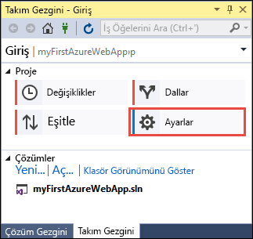
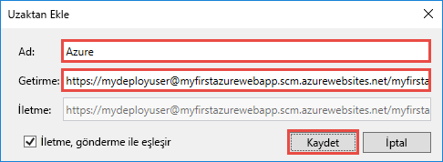

# <a name="create-an-aspnet-core-web-app-in-azure"></a>Azure’da ASP.NET Core web uygulaması oluşturma

> [!NOTE]
> Bu makalede bir uygulamanın Windows üzerinde App Service'e dağıtımı yapılır. _Linux_ üzerinde App Service'e dağıtım yapmak için bkz. [Linux üzerinde App Service'te .NET Core web uygulaması oluşturma](./containers/quickstart-dotnetcore.md).
>
> ASP.NET Framework uygulamasına yönelik adımları arıyorsanız bkz. [Azure’da ASP.NET Framework web uygulaması oluşturma](app-service-web-get-started-dotnet-framework.md). 
>

[Azure Web Apps](app-service-web-overview.md) yüksek oranda ölçeklenebilen, kendi kendine düzeltme eki uygulayan bir web barındırma hizmeti sunar.  Bu hızlı başlangıçta, Azure Web Apps’e ilk ASP.NET Core web uygulamanızı dağıtma işlemi gösterilmektedir. İşlemi tamamladığınızda bir App Service planı ve dağıtılmış web uygulaması ile Azure web uygulamasından oluşan kaynak grubunuz olacaktır.

[!INCLUDE [quickstarts-free-trial-note](../../includes/quickstarts-free-trial-note.md)]

## <a name="prerequisites"></a>Ön koşullar

Bu öğreticiyi tamamlamak için:

* <a href="https://www.visualstudio.com/downloads/" target="_blank">Visual Studio 2017</a>’yi aşağıdaki iş yükleri ile yükleyin:
    - **ASP.NET ve web geliştirme**
    - **Azure geliştirme**

    

## <a name="create-an-aspnet-core-web-app"></a>ASP.NET Core web uygulaması oluşturma

Visual Studio'da **Dosya > Yeni > Proje**’yi seçerek bir proje oluşturun. 

**Yeni Proje** iletişim kutusunda **Visual C# > Web > ASP.NET Core Web Uygulaması** öğesini seçin.

Uygulamaya _myFirstAzureWebApp_ adını verin, **Yeni Git deposu oluştur**’u seçin ve ardından **Tamam**’ı seçin.
   


Azure’a herhangi bir türde ASP.NET Core web uygulaması dağıtabilirsiniz. Bu hızlı başlangıçta **Web Uygulaması** şablonunu seçin ve kimlik doğrulamasının **Kimlik Doğrulaması Yok** olarak ayarlandığından emin olun.
      
**Tamam**’ı seçin.


ASP.NET Core projesi oluşturulduktan sonra, başlamanıza yardımcı olacak çeşitli kaynak bağlantıları sağlayan ASP.NET Core karşılama sayfası gösterilir. 


Menüden **Hata Ayıkla > Hata Ayıklamadan Başla**’yı seçerek web uygulamasını yerel olarak çalıştırın.


[!INCLUDE [cloud-shell-try-it.md](../../includes/cloud-shell-try-it.md)]

[!INCLUDE [Configure deployment user](../../includes/configure-deployment-user.md)] 

[!INCLUDE [Create resource group](../../includes/app-service-web-create-resource-group.md)] 

[!INCLUDE [Create app service plan](../../includes/app-service-web-create-app-service-plan.md)] 

[!INCLUDE [Create web app](../../includes/app-service-web-create-web-app.md)] 


## <a name="push-to-azure-from-visual-studio"></a>Visual Studio'dan Azure'a gönderme

Visual Studio'da **Görünüm** menüsünde **Takım Gezgini**’ne tıklayın. **Takım Gezgini** görüntülenir.

**Giriş** görünümünde, **Ayarlar** > **Depo Ayarları** seçeneğine tıklayın.



**Depo Ayarları**’nın **Uzak öğeler** bölümünde **Ekle**’yi seçin. **Uzak Öğe Ekle** iletişim kutusu görüntülenir.

**Ad** alanını _Azure_ olarak ayarlayın ve ardından **Getir** alanını, [Web uygulaması oluşturma](#create-a-web-app)’dan kaydettiğiniz URL’ye ayarlayın. **Kaydet**’e tıklayın.



Bu ayar `git remote add Azure <URL>` Git komutuna karşılık gelir.

Üstteki **Giriş** düğmesine tıklayın.

**Ayarlar** > **Genel Ayarlar** seçeneğini belirleyin. Adın ve e-posta adresinin ayarlandığını onaylayın. Gerekiyorsa **Güncelleştir**’i seçin.

Visual Studio projeyi oluşturduğunda, dosyaların tümünü zaten Git deposuna kaydetti. Şimdi tüm yapmanız gereken dosyaları Azure'a göndermek.

Üstteki **Giriş** düğmesine tıklayın. **Eşitle** > **Eylemler** > **Komut İstemi Aç** seçeneğini belirleyin. 

Komut penceresine aşağıdaki komutu girin ve istenildiğinde dağıtım parolasını girin:

```
git push Azure master
```

Bu komutun çalıştırılması birkaç dakika sürebilir. Çalıştırıldığında, aşağıdaki örneğe benzer bilgiler görüntüler:

```
Counting objects: 4, done.
Delta compression using up to 8 threads.
Compressing objects: 100% (4/4), done.
Writing objects: 100% (4/4), 349 bytes | 349.00 KiB/s, done.
Total 4 (delta 3), reused 0 (delta 0)
remote: Updating branch 'master'.
remote: Updating submodules.
remote: Preparing deployment for commit id '9e20345e9c'.
remote: Generating deployment script.
remote: Project file path: .\myFirstAzureWebApp\myFirstAzureWebApp.csproj
remote: Solution file path: .\myFirstAzureWebApp.sln
remote: Generated deployment script files
remote: Running deployment command...
remote: Handling ASP.NET Core Web Application deployment.
remote:   Restoring packages for D:\home\site\repository\myFirstAzureWebApp\myFirstAzureWebApp.csproj...
remote:   Restoring packages for D:\home\site\repository\myFirstAzureWebApp\myFirstAzureWebApp.csproj...
...
remote: Finished successfully.
remote: Running post deployment command(s)...
remote: Deployment successful.
To https://<app_name>.scm.azurewebsites.net/<app_name>.git
 * [new branch]      master -> master
```

## <a name="browse-to-the-app"></a>Uygulamaya göz atma

Bir tarayıcıda Azure web uygulaması URL'sine gidin: `http://<app_name>.azurewebsites.net`.

Sayfa bir Azure App Service web uygulaması çalıştırıyor.


Tebrikler, ASP.NET Core web uygulamanız Azure App Service’te çalışıyor.

## <a name="update-the-app-and-redeploy"></a>Uygulamayı güncelleştirme ve yeniden dağıtma

**Çözüm Gezgini** menüsünden _Pages/Index.cshtml_ dosyasını açın.

Üst kısımda `<div id="myCarousel" class="carousel slide" data-ride="carousel" data-interval="6000">` HTML etiketini bulun ve tüm öğeyi aşağıdaki kodla değiştirin:

```HTML
<div class="jumbotron">
    <h1>ASP.NET in Azure!</h1>
    <p class="lead">This is a simple app that we’ve built that demonstrates how to deploy a .NET app to Azure App Service.</p>
</div>
```

**Çözüm Gezgini**’nden, _Sayfalar/Dizin.cshtml_’ye sağ tıklayın ve **İşle**’ye tıklayın. Yaptığınız değişiklik için bir işleme iletisi girin ve **Tümünü İşle**’ye tıklayın.

Komut istemi penceresinde, kod değişikliklerini Azure'a gönderin.

```bash
git push Azure master
```

Dağıtım tamamlandığında, yeniden `http://<app_name>.azurewebsites.net` adresine gidin.


## <a name="manage-the-azure-web-app"></a>Azure web uygulamasını yönetme

Web uygulamasını yönetmek için <a href="https://portal.azure.com" target="_blank">Azure portalına</a> gidin.

Sol menüden **Uygulama Hizmetleri**'ni ve ardından Azure web uygulamanızın adını seçin.


Web uygulamanızın Genel Bakış sayfasını görürsünüz. Buradan göz atma, durdurma, başlatma, yeniden başlatma ve silme gibi temel yönetim görevlerini gerçekleştirebilirsiniz. 


Soldaki menü, uygulamanızı yapılandırmak için farklı sayfalar sağlar. 

[!INCLUDE [Clean-up section](../../includes/clean-up-section-portal.md)]

## <a name="next-steps"></a>Sonraki adımlar

> [!div class="nextstepaction"]
> [SQL Veritabanı ile ASP.NET Core](app-service-web-tutorial-dotnetcore-sqldb.md)
