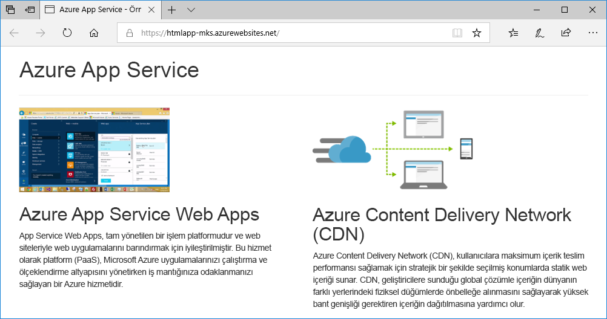
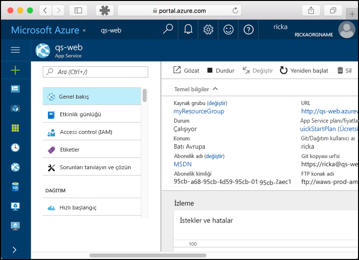

# <a name="create-a-static-html-web-app-in-azure"></a>Azure'da statik bir HTML web uygulaması oluşturma

[Azure App Service](overview.md), yüksek oranda ölçeklenebilen, kendi kendine düzeltme eki uygulayan bir web barındırma hizmeti sunar. Bu hızlı başlangıçta, temel bir HTML + CSS sitesini Azure App Service'e dağıtma işlemi gösterilmektedir. Bu hızlı başlangıcı [Cloud Shell](https://docs.microsoft.com/azure/cloud-shell/overview)'de tamamlayacaksınız ama bu komutları [Azure CLI](/cli/azure/install-azure-cli) ile yerel olarak da çalıştırabilirsiniz.


[!INCLUDE [quickstarts-free-trial-note](../../includes/quickstarts-free-trial-note.md)]

[!INCLUDE [cloud-shell-try-it.md](../../includes/cloud-shell-try-it.md)]

## <a name="download-the-sample"></a>Örneği indirme

Cloud Shell'de bir quickstart dizini oluşturun ve o dizine geçin.

```bash
mkdir quickstart

cd $HOME/quickstart
```

Ardından, örnek uygulama deposunu quickstart dizininize kopyalamak için aşağıdaki komutu çalıştırın.

```bash
git clone https://github.com/Azure-Samples/html-docs-hello-world.git
```

## <a name="create-a-web-app"></a>Web uygulaması oluşturun

Örnek kodu içeren dizine geçin ve `az webapp up` komutunu çalıştırın.

Aşağıdaki komutta <app_name> kısmını benzersiz uygulama adıyla değiştirin.

```bash
cd html-docs-hello-world

az webapp up --location westeurope --name <app_name>
```

`az webapp up` komutu şu eylemleri gerçekleştirir:

- Varsayılan kaynak grubunu oluşturur.

- Bir varsayılan uygulama hizmeti planı oluşturur.

- Belirtilen adla bir uygulama oluşturur.

- Dosyaları geçerli çalışma dizininden web uygulamasına [sıkıştırıp dağıtır](https://docs.microsoft.com/azure/app-service/deploy-zip).

Bu komutun çalıştırılması birkaç dakika sürebilir. Çalıştırıldığında, aşağıdaki örneğe benzer bilgiler görüntüler:

```json
{
  "app_url": "https://<app_name>.azurewebsites.net",
  "location": "westeurope",
  "name": "<app_name>",
  "os": "Windows",
  "resourcegroup": "appsvc_rg_Windows_westeurope",
  "serverfarm": "appsvc_asp_Windows_westeurope",
  "sku": "FREE",
  "src_path": "/home/<username>/quickstart/html-docs-hello-world ",
  < JSON data removed for brevity. >
}
```

`resourceGroup` değerini not edin. [Kaynakları temizleme](#clean-up-resources) bölümünde ihtiyacınız olacak.

## <a name="browse-to-the-app"></a>Uygulamaya göz atma

Bir tarayıcıda, uygulama URL'sine gidin: `http://<app_name>.azurewebsites.net`.

Sayfa bir Azure App Service web uygulaması çalıştırıyor.


**Tebrikler!** App Service'e ilk HTML uygulamanızı dağıttınız.

## <a name="update-and-redeploy-the-app"></a>Uygulamayı güncelleştirme ve yeniden dağıtma

Cloud Shell'de, nano metin düzenleyicisini açmak için `nano index.html` yazın. Aşağıda gösterildiği gibi, `<h1>` başlığında "Azure App Service - Sample Static HTML Site" değerini "Azure App Service" ile değiştirin.


Değişikliklerinizi kaydedin ve nanodan çıkın. Kaydetmek için `^O` ve çıkmak için `^X` komutunu kullanın.

Şimdi aynı `az webapp up` komutuyla uygulamayı yeniden dağıtacaksınız.

```bash
az webapp up --location westeurope --name <app_name>
```

Dağıtım tamamlandıktan sonra **Uygulamaya göz atma** adımında açılan tarayıcı penceresine dönüp sayfayı yenileyin.



## <a name="manage-your-new-azure-app"></a>Yeni Azure uygulamanızı yönetme

Oluşturduğunuz web uygulamasını yönetmek için <a href="https://portal.azure.com" target="_blank">Azure portalına</a> gidin.

Sol menüden **uygulama hizmetleri**ve ardından Azure uygulamanızın adına tıklayın.


Web uygulamanızın Genel Bakış sayfasını görürsünüz. Buradan göz atma, durdurma, başlatma, yeniden başlatma ve silme gibi temel yönetim görevlerini gerçekleştirebilirsiniz.



Soldaki menü, uygulamanızı yapılandırmak için farklı sayfalar sağlar.

## <a name="clean-up-resources"></a>Kaynakları temizleme

Önceki adımlarda, bir kaynak grubunda Azure kaynakları oluşturdunuz. Bu kaynakların gelecekte gerekli olacağını düşünmüyorsanız, Cloud Shell’de aşağıdaki komutu çalıştırarak kaynak grubunu silin. Kaynak grubu adının [web uygulaması oluşturma](#create-a-web-app) adında otomatik olarak oluşturulduğunu unutmayın.

```bash
az group delete --name appsvc_rg_Windows_westeurope
```

Bu komutun çalıştırılması bir dakika sürebilir.

## <a name="next-steps"></a>Sonraki adımlar

> [!div class="nextstepaction"]
> [Özel etki alanı eşleme](app-service-web-tutorial-custom-domain.md)
