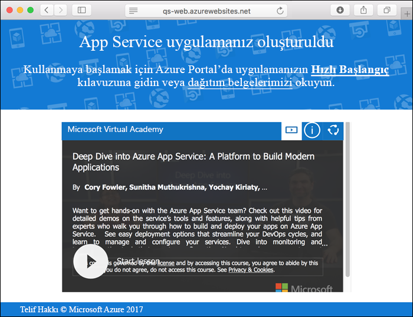

# <a name="create-a-static-html-web-app-in-azure"></a>Azure'da statik bir HTML web uygulaması oluşturma

[Azure Web Apps](app-service-web-overview.md) yüksek oranda ölçeklenebilen, kendi kendine düzeltme eki uygulayan bir web barındırma hizmeti sunar.  Bu hızlı başlangıç öğreticisinde, temel bir HTML+CSS sitesinin Azure'a nasıl dağıtılacağı gösterilmektedir. [Azure CLI](https://docs.microsoft.com/cli/azure/get-started-with-azure-cli)'yi kullanarak web uygulamasını oluşturabilir ve örnek HTML içeriğini web uygulamasına dağıtmak için Git'i kullanabilirsiniz.


Mac, Windows veya Linux makinesi kullanarak aşağıdaki adımları izleyebilirsiniz. Önkoşullar yüklendikten sonra adımların tamamlanması yaklaşık olarak beş dakika sürer.

## <a name="prerequisites"></a>Önkoşullar

Bu hızlı başlangıcı tamamlamak için:

- <a href="https://git-scm.com/" target="_blank">Git'i yükleyin</a>

[!INCLUDE [quickstarts-free-trial-note](../../includes/quickstarts-free-trial-note.md)]

## <a name="download-the-sample"></a>Örneği indirme

Bir terminal penceresinde, örnek uygulama deposunu yerel makinenize kopyalamak için aşağıdaki komutu çalıştırın.

```bash
git clone https://github.com/Azure-Samples/html-docs-hello-world.git
```

Örnek kodu içeren dizine geçin.

```bash
cd html-docs-hello-world
```

## <a name="view-the-html"></a>HTML’yi görüntüleme

Örnek HTML’yi içeren dizine gidin. *index.html* dosyasını tarayıcınızda açın.


[!INCLUDE [cloud-shell-try-it.md](../../includes/cloud-shell-try-it.md)]

[!INCLUDE [Configure deployment user](../../includes/configure-deployment-user.md)] 

[!INCLUDE [Create resource group](../../includes/app-service-web-create-resource-group.md)] 

[!INCLUDE [Create app service plan](../../includes/app-service-web-create-app-service-plan.md)] 

[!INCLUDE [Create web app](../../includes/app-service-web-create-web-app.md)] 



[!INCLUDE [Push to Azure](../../includes/app-service-web-git-push-to-azure.md)] 

```bash
Counting objects: 13, done.
Delta compression using up to 4 threads.
Compressing objects: 100% (11/11), done.
Writing objects: 100% (13/13), 2.07 KiB | 0 bytes/s, done.
Total 13 (delta 2), reused 0 (delta 0)
remote: Updating branch 'master'.
remote: Updating submodules.
remote: Preparing deployment for commit id 'cc39b1e4cb'.
remote: Generating deployment script.
remote: Generating deployment script for Web Site
remote: Generated deployment script files
remote: Running deployment command...
remote: Handling Basic Web Site deployment.
remote: KuduSync.NET from: 'D:\home\site\repository' to: 'D:\home\site\wwwroot'
remote: Deleting file: 'hostingstart.html'
remote: Copying file: '.gitignore'
remote: Copying file: 'LICENSE'
remote: Copying file: 'README.md'
remote: Finished successfully.
remote: Running post deployment command(s)...
remote: Deployment successful.
To https://<app_name>.scm.azurewebsites.net/<app_name>.git
 * [new branch]      master -> master
```

## <a name="browse-to-the-app"></a>Uygulamaya göz atma

Azure web uygulaması URL'si için bir tarayıcıda gidin: `http://<app_name>.azurewebsites.net`.

Sayfa bir Azure App Service web uygulaması çalıştırıyor.


**Tebrikler!** App Service'e ilk HTML uygulamanızı dağıttınız.

## <a name="update-and-redeploy-the-app"></a>Uygulamayı güncelleştirme ve yeniden dağıtma

*index.html* dosyasını bir metin düzenleyicide açın ve işaretlemede değişiklik yapın. Örneğin, "Azure App Service - Örnek Statik HTML Sitesi" H1 başlığını yalnızca "Azure App Service" olarak değiştirin.

Yerel terminal penceresi Git yaptığınız değişiklikleri kaydetmek ve kod değişiklikleri Azure'a gönderin.

```bash
git commit -am "updated HTML"
git push azure master
```

Dağıtım tamamlandıktan sonra değişiklikleri görmek için tarayıcınızı yenileyin.


## <a name="manage-your-new-azure-web-app"></a>Yeni Azure web uygulamanızı yönetme

Oluşturduğunuz web uygulamasını yönetmek için <a href="https://portal.azure.com" target="_blank">Azure portalına</a> gidin.

Sol menüden **Uygulama Hizmetleri**'ne ve ardından Azure web uygulamanızın adına tıklayın.


Web uygulamanızın Genel Bakış sayfasını görürsünüz. Buradan göz atma, durdurma, başlatma, yeniden başlatma ve silme gibi temel yönetim görevlerini gerçekleştirebilirsiniz. 


Soldaki menü, uygulamanızı yapılandırmak için farklı sayfalar sağlar. 

[!INCLUDE [cli-samples-clean-up](../../includes/cli-samples-clean-up.md)]

## <a name="next-steps"></a>Sonraki adımlar

> [!div class="nextstepaction"]
> [Özel etki alanı eşleme](app-service-web-tutorial-custom-domain.md)
