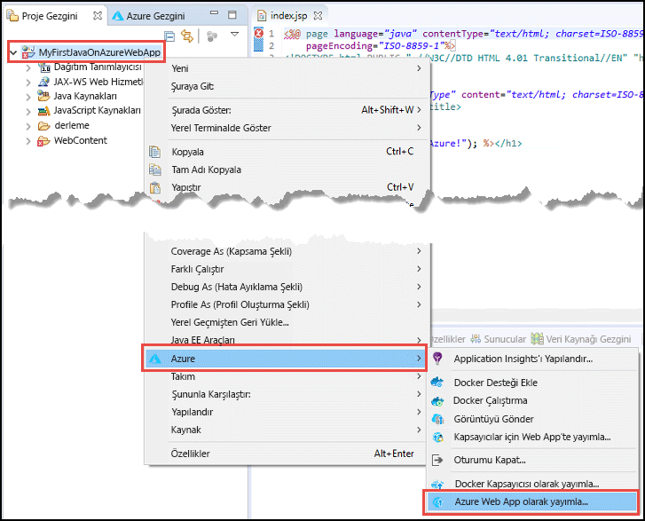
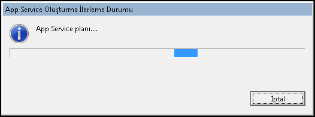
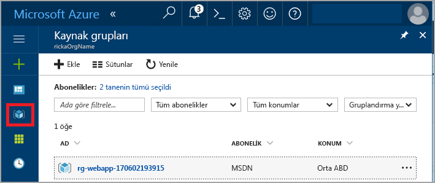
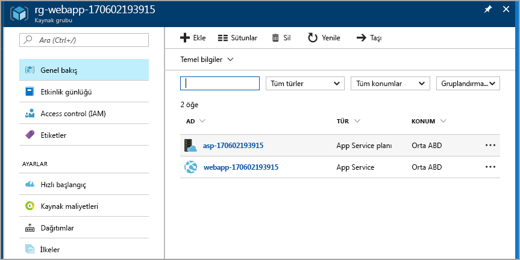
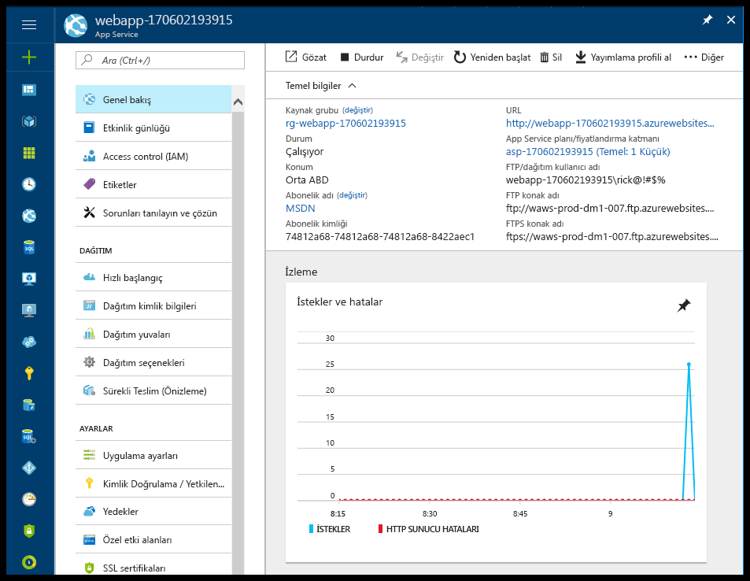

# <a name="create-your-first-java-web-app-in-azure"></a>Azure’da ilk Java web uygulamanızı oluşturma

[Azure App Service](overview.md), yüksek oranda ölçeklenebilen, kendi kendine düzeltme eki uygulayan bir web barındırma hizmeti sunar. Bu hızlı başlangıçta, [Java EE Geliştiricileri için Eclipse IDE](https://www.eclipse.org/) kullanarak App Service’e nasıl Java web uygulaması dağıtılacağı gösterilmektedir.

> [!IMPORTANT]
> Linux üzerinde Azure App Service ayrıca bir Java web uygulamalarını barındırmak için yerel olarak, yönetilen Tomcat, Java SE ve WildFly tekliflerini kullanarak Linux'ta seçenektir. Linux'ta App Service ile çalışmaya başlama ilgileniyorsanız bkz [hızlı başlangıç: Linux üzerinde App Service'te bir Java uygulaması oluşturma](containers/quickstart-java.md).

Bu hızlı başlangıcı tamamladığınızda, uygulamanız bir web tarayıcısında görüntülendiğinde aşağıdaki çizime benzer:


[!INCLUDE [quickstarts-free-trial-note](../../includes/quickstarts-free-trial-note.md)]

> [!NOTE]
>
> Bu hızlı başlangıçtaki adımlar, Eclipse IDE kullanarak Uygulama Hizmetine nasıl Java web uygulaması yayımlanacağını göstermektedir; ancak IntelliJ IDEA Ultimate Edition veya Community Edition’ı da kullanabilirsiniz. Daha fazla bilgi için bkz. [IntelliJ kullanarak Azure için Merhaba Dünya web uygulaması oluşturma](/java/azure/intellij/azure-toolkit-for-intellij-create-hello-world-web-app).
>

## <a name="prerequisites"></a>Önkoşullar

Bu hızlı başlangıcı tamamlamak için şunları yükleyin:

* Ücretsiz <a href="https://www.eclipse.org/downloads/" target="_blank">Java EE Geliştiricileri için Eclipse IDE</a>. Bu hızlı başlangıçta Eclipse Neon kullanılır.
* <a href="/java/azure/eclipse/azure-toolkit-for-eclipse-installation" target="_blank">Eclipse için Azure Araç Takımı</a>.

> [!NOTE]
>
> Bu hızlı başlangıçtaki adımları tamamlamak için Eclipse için Azure Araç Seti kullanarak Azure hesabınızda oturum açmanız gerekir. Bunu yapmak için bkz. [Eclipse için Azure Araç Seti’nde Azure Oturum Açma Yönergeleri](/java/azure/eclipse/azure-toolkit-for-eclipse-sign-in-instructions)
>

## <a name="create-a-dynamic-web-project-in-eclipse"></a>Eclipse’te dinamik web projesi oluşturma

Eclipse’te **Dosya** > **Yeni** > **Dinamik Web Projesi**’ni seçin.

**Yeni Dinamik Web Projesi** iletişim kutusunda, projeyi **MyFirstJavaOnAzureWebApp** olarak adlandırın ve **Son**’u seçin.
   


### <a name="add-a-jsp-page"></a>JSP sayfası ekleme

Proje Gezgini görüntülenmiyorsa, gezgini geri yükleyin.


Proje Gezgini'nde **MyFirstJavaOnAzureWebApp** projesini genişletin.
**WebContent**’e sağ tıklayın ve **Yeni** > **JSP Dosyası**’nı seçin.


**Yeni JSP Dosyası** iletişim kutusunda:

* Dosyayı **index.jsp** olarak adlandırın.
* **Son**’u seçin.

  

index.jsp dosyasında, `<body></body>` öğesini aşağıdaki işaretlemeyle değiştirin:

```jsp
<body>
<h1><% out.println("Hello Azure!"); %></h1>
</body>
```

Değişiklikleri kaydedin.

> [!NOTE]
>
> 1. satırda, eksik bir Java Servlet sınıfına başvuran hata görürseniz bu hatayı yoksayabilirsiniz.
> 
> 
>

## <a name="publish-the-web-app-to-azure"></a>Web uygulamasını Azure’da yayımlama

Proje Gezgini’nde projenize sağ tıklayın ve sonra **Azure** > **Azure Web App olarak yayımla**’yı seçin.



**Azure Oturum Açma** iletişim kutusu karşınıza çıkarsa, kimlik bilgilerinizi girmek için [Eclipse için Azure Araç Seti’nde Azure Oturum Açma Yönergeleri](/java/azure/eclipse/azure-toolkit-for-eclipse-sign-in-instructions) makalesindeki adımları izlemeniz gerekir.

### <a name="deploy-web-app-dialog-box"></a>Web Uygulaması Dağıtma iletişim kutusu

Azure hesabınızda oturum açtıktan sonra, **Web Uygulaması Dağıtma** iletişim kutusu açılır.

**Oluştur**’u seçin.


### <a name="create-app-service-dialog-box"></a>App Service Oluşturma iletişim kutusu

**App Service Oluşturma** iletişim kutusu varsayılan değerlerle açılır. Aşağıdaki görüntüde gösterilen **170602185241** sayısı, sizin iletişim kutunuzda farklıdır.


**App Service Oluşturma** iletişim kutusunda:

* Web uygulamanız için benzersiz bir ad girin veya oluşturulan adı değiştirmeyin. Bu ad Azure genelinde benzersiz olmalıdır. Ad, web uygulamasının URL adresinin bir parçasıdır. Örneğin, web uygulamasının adı **MyJavaWebApp** ise URL şu şekildedir: *myjavawebapp.azurewebsites.net*.
* Bu hızlı başlangıç için, varsayılan web kapsayıcısını değiştirmeyin.
* Bir Azure aboneliği seçin.
* **App Service planı** sekmesinde:

  * **Yeni Oluştur**: App Service planının adı olan varsayılan değeri değiştirmeyin.
  * **Konum**: Seçin **Batı Avrupa** veya size yakın bir konum.
  * **Fiyatlandırma katmanı**: Ücretsiz seçeneğini belirleyin. Özellikler için bkz. [App Service fiyatlandırması](https://azure.microsoft.com/pricing/details/app-service/?ref=microsoft.com&utm_source=microsoft.com&utm_medium=docs&utm_campaign=visualstudio).

    

[!INCLUDE [app-service-plan](../../includes/app-service-plan.md)]

### <a name="resource-group-tab"></a>Kaynak grubu sekmesi

**Kaynak grubu** sekmesini seçin. Kaynak grubu için oluşturulmuş varsayılan değeri değiştirmeyin.


[!INCLUDE [resource-group](../../includes/resource-group.md)]

**Oluştur**’u seçin.

<!--
### The JDK tab

Select the **JDK** tab. Keep the default, and then select **Create**.


-->

Azure Araç Takımı web uygulamasını oluşturur ve bir ilerleme durumu iletişim kutusu görüntüler.



### <a name="deploy-web-app-dialog-box"></a>Web Uygulaması Dağıtma iletişim kutusu

**Web Uygulaması Dağıtma** iletişim kutusunda **Köke dağıt**’ı seçin. *wingtiptoys.azurewebsites.net* adresinde bir uygulama hizmetiniz varsa ve köke dağıtmazsanız, **MyFirstJavaOnAzureWebApp** adlı web uygulaması *wingtiptoys.azurewebsites.net/MyFirstJavaOnAzureWebApp* adresine dağıtılır.


İletişim kutusunda Azure, JDK ve web kapsayıcısı seçimleri gösterilir.

Web uygulamasını Azure’da yayımlamak için **Dağıt**’ı seçin.

Yayımlama işlemi tamamlandığında, **Azure Etkinlik Günlüğü** iletişim kutusundaki **Yayımlandı** bağlantısını seçin.


Tebrikler! Web uygulamanızı başarılı bir şekilde Azure’da dağıttınız. 


## <a name="update-the-web-app"></a>Web uygulamasını güncelleştirme

Örnek JSP kodunu farklı bir ileti olarak değiştirin.

```jsp
<body>
<h1><% out.println("Hello again Azure!"); %></h1>
</body>
```

Değişiklikleri kaydedin.

Proje Gezgini’nde projeye sağ tıklayın ve **Azure** > **Azure Web App olarak yayımla**’yı seçin.

**Web Uygulaması Dağıtma** iletişim kutusu açılır ve daha önce oluşturduğunuz uygulama hizmetini gösterir. 

> [!NOTE] 
> Her yayımlama işleminde **Köke dağıt**’ı seçin. 
> 

Web uygulamasını seçip **Dağıt**’ı seçin. Bunu yaptığınızda değişiklikler yayımlanır.

**Yayımlanıyor** bağlantısı göründüğünde, web uygulamasına gitmek ve değişiklikleri görmek için bu bağlantıyı seçin.

## <a name="manage-the-web-app"></a>Web uygulamasını yönetme

Oluşturduğunuz web uygulamasını görmek için <a href="https://portal.azure.com" target="_blank">Azure portalına</a> gidin.

Soldaki menüden **Kaynak Grupları**'nı seçin.



Kaynak grubunu seçin. Sayfada bu hızlı başlangıçta oluşturduğunuz kaynaklar gösterilir.



Web uygulamasını (önceki resimde **webapp-170602193915**) seçin.

**Genel Bakış** sayfası açılır. Bu sayfada uygulamanın nasıl çalıştığına ilişkin bir görünüm sağlanır. Buradan göz atma, durdurma, başlatma, yeniden başlatma ve silme gibi temel yönetim görevlerini gerçekleştirebilirsiniz. Sayfanın sol tarafındaki sekmeler, açabileceğiniz farklı yapılandırmaları gösterir. 



[!INCLUDE [clean-up-section-portal-web-app](../../includes/clean-up-section-portal-web-app.md)]

## <a name="next-steps"></a>Sonraki adımlar

> [!div class="nextstepaction"]
> [Özel etki alanı eşleme](app-service-web-tutorial-custom-domain.md)
