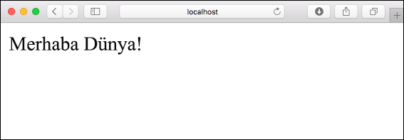
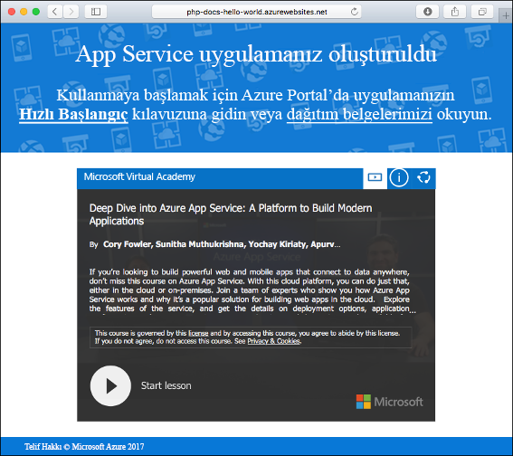
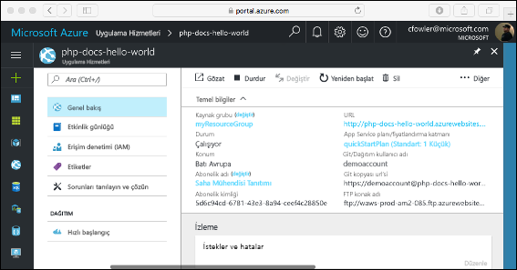

# <a name="create-a-php-web-app-in-azure"></a>Azure’da PHP web uygulaması oluşturma

> [!NOTE]
> Bu makalede bir uygulamanın Windows üzerinde App Service'e dağıtımı yapılır. _Linux_ üzerinde App Service'e dağıtım yapmak için bkz. [Linux üzerinde App Service'te PHP web uygulaması oluşturma](./containers/quickstart-php.md).
>

[Azure App Service](overview.md), yüksek oranda ölçeklenebilen, kendi kendine düzeltme eki uygulayan bir web barındırma hizmeti sunar.  Bu hızlı başlangıç öğreticisinde, PHP uygulamasını Azure App Service'e dağıtma işlemi gösterilmektedir. Cloud Shell’de [Azure CLI](https://docs.microsoft.com/cli/azure/get-started-with-azure-cli) kullanarak web uygulamasını oluşturabilir ve örnek PHP kodunu web uygulamasına dağıtmak için Git kullanabilirsiniz.


Mac, Windows veya Linux makinesi kullanarak buradaki adımları izleyebilirsiniz. Önkoşullar yüklendikten sonra adımların tamamlanması yaklaşık olarak beş dakika sürer.

[!INCLUDE [quickstarts-free-trial-note](../../includes/quickstarts-free-trial-note.md)]

## <a name="prerequisites"></a>Önkoşullar

Bu hızlı başlangıcı tamamlamak için:

* <a href="https://git-scm.com/" target="_blank">Git'i yükleyin</a>
* <a href="https://php.net/manual/install.php" target="_blank">PHP'yi yükleyin</a>

## <a name="download-the-sample-locally"></a>Örnekleri yerel makineye indirme

Bir terminal penceresinde aşağıdaki komutları çalıştırın. Bu işlem, örnek uygulamanın yerel makinenize kopyalanmasını ve örnek kodu içeren dizine gitmenizi sağlar. 

```bash
git clone https://github.com/Azure-Samples/php-docs-hello-world
cd php-docs-hello-world
```

## <a name="run-the-app-locally"></a>Uygulamayı yerel olarak çalıştırma

Azure'a dağıttığınızda nasıl görüneceğini görmek için uygulamayı yerel olarak çalıştırın. Yerleşik PHP web sunucusunu başlatmak için bir terminal penceresi açın ve `php` komutunu kullanın.

```bash
php -S localhost:8080
```

Bir web tarayıcısı açın ve `http://localhost:8080` konumundaki örnek uygulamaya gidin.

Sayfada gösterilen örnek uygulamada **Merhaba Dünya!** iletisini görürsünüz.



Terminal pencerenizde **Ctrl+C** tuşlarına basarak web sunucusundan çıkın.

[!INCLUDE [cloud-shell-try-it.md](../../includes/cloud-shell-try-it.md)]

[!INCLUDE [Configure deployment user](../../includes/configure-deployment-user.md)]

[!INCLUDE [Create resource group](../../includes/app-service-web-create-resource-group.md)]

[!INCLUDE [Create app service plan](../../includes/app-service-web-create-app-service-plan.md)]

## <a name="create-a-web-app"></a>Web uygulaması oluşturma

Cloud Shell’de, [`az webapp create`](/cli/azure/webapp?view=azure-cli-latest#az-webapp-create) komutuyla `myAppServicePlan` App Service planında bir web uygulaması oluşturun. 

Aşağıdaki örnekte `<app_name>` kısmını genel olarak benzersiz bir uygulama adıyla değiştirin (geçerli karakterler `a-z`, `0-9` ve `-` şeklindedir). Çalışma zamanı `PHP|7.0` olarak ayarlanmıştır. Desteklenen tüm çalışma zamanları görmek için [`az webapp list-runtimes`](/cli/azure/webapp?view=azure-cli-latest#az-webapp-list-runtimes) komutunu çalıştırın. 

```azurecli-interactive
# Bash
az webapp create --resource-group myResourceGroup --plan myAppServicePlan --name <app_name> --runtime "PHP|7.0" --deployment-local-git
# PowerShell
az --% webapp create --resource-group myResourceGroup --plan myAppServicePlan --name <app_name> --runtime "PHP|7.0" --deployment-local-git
```

Web uygulaması oluşturulduğunda Azure CLI aşağıda yer alan çıktıdaki gibi bilgiler gösterir:

```json
Local git is configured with url of 'https://<username>@<app_name>.scm.azurewebsites.net/<app_name>.git'
{
  "availabilityState": "Normal",
  "clientAffinityEnabled": true,
  "clientCertEnabled": false,
  "cloningInfo": null,
  "containerSize": 0,
  "dailyMemoryTimeQuota": 0,
  "defaultHostName": "<app_name>.azurewebsites.net",
  "enabled": true,
  < JSON data removed for brevity. >
}
```
Git dağıtımı etkin boş bir yeni web uygulaması oluşturdunuz.

> [!NOTE]
> Git uzak URL’si `deploymentLocalGitUrl` özelliği içinde `https://<username>@<app_name>.scm.azurewebsites.net/<app_name>.git` biçiminde gösterilir. Bu URL’ye daha sonra ihtiyacınız olacağı için URL’yi kaydedin.
>

Yeni oluşturduğunuz web uygulamasına göz atın. _&lt;uygulama adı>_ ’nı, önceki adımda oluşturulan benzersiz uygulama adınızla değiştirin.

```bash
http://<app name>.azurewebsites.net
```

Yeni web uygulamanız aşağıdaki gibi görünmelidir:



[!INCLUDE [Push to Azure](../../includes/app-service-web-git-push-to-azure.md)] 

```bash
Counting objects: 2, done.
Delta compression using up to 4 threads.
Compressing objects: 100% (2/2), done.
Writing objects: 100% (2/2), 352 bytes | 0 bytes/s, done.
Total 2 (delta 1), reused 0 (delta 0)
remote: Updating branch 'master'.
remote: Updating submodules.
remote: Preparing deployment for commit id '25f18051e9'.
remote: Generating deployment script.
remote: Running deployment command...
remote: Handling Basic Web Site deployment.
remote: Kudu sync from: '/home/site/repository' to: '/home/site/wwwroot'
remote: Copying file: '.gitignore'
remote: Copying file: 'LICENSE'
remote: Copying file: 'README.md'
remote: Copying file: 'index.php'
remote: Ignoring: .git
remote: Finished successfully.
remote: Running post deployment command(s)...
remote: Deployment successful.
To https://<app_name>.scm.azurewebsites.net/<app_name>.git
   cc39b1e..25f1805  master -> master
```

## <a name="browse-to-the-app"></a>Uygulamaya göz atma

Web tarayıcınızı kullanarak, dağıtılan uygulamanın konumuna gidin.

```
http://<app_name>.azurewebsites.net
```

PHP örnek kodu bir Azure App Service web uygulamasında çalışıyor.


**Tebrikler!** App Service’e ilk PHP uygulamanızı dağıttınız.

## <a name="update-locally-and-redeploy-the-code"></a>Kodu yerel makinede güncelleştirme ve yeniden dağıtma

Bir yerel metin düzenleyicisi kullanarak `index.php` dosyasını PHP uygulaması içinde açın ve `echo` öğesinin yanındaki dizenin içinde bulunan metinde küçük bir değişiklik yapın:

```php
echo "Hello Azure!";
```

Yerel terminal penceresinde, değişikliklerinizi Git’e işleyin ve ardından kod değişikliklerini Azure’a gönderin.

```bash
git commit -am "updated output"
git push azure master
```

Dağıtım tamamlandıktan sonra **Uygulamaya göz atma** adımında açılan tarayıcı penceresine dönüp sayfayı yenileyin.


## <a name="manage-your-new-azure-app"></a>Yeni Azure uygulamanızı yönetme

Oluşturduğunuz web uygulamasını yönetmek için <a href="https://portal.azure.com" target="_blank">Azure portalına</a> gidin.

Sol menüden **uygulama hizmetleri**ve ardından Azure uygulamanızın adına tıklayın.


Web uygulamanızın Genel Bakış sayfasını görürsünüz. Buradan göz atma, durdurma, başlatma, yeniden başlatma ve silme gibi temel yönetim görevlerini gerçekleştirebilirsiniz.



Soldaki menü, uygulamanızı yapılandırmak için farklı seçenekler sağlar. 

[!INCLUDE [cli-samples-clean-up](../../includes/cli-samples-clean-up.md)]

## <a name="next-steps"></a>Sonraki adımlar

> [!div class="nextstepaction"]
> [MySQL ile PHP](app-service-web-tutorial-php-mysql.md)
