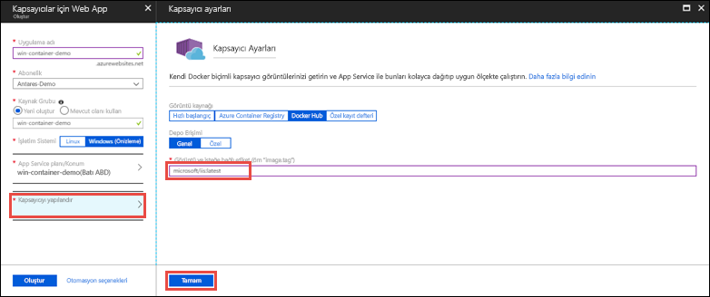

# <a name="run-a-custom-windows-container-in-azure-preview"></a>Azure'da özel Windows kapsayıcısı çalıştırma (Önizleme)

[Azure App Service](app-service-web-overview.md), Windows'da IIS üzerinde çalışan ASP.NET veya Node.js gibi önceden tanımlı uygulama yığınları sunar. Önceden yapılandırılmış Windows ortamı, işletim sistemini yönetimsel erişime, yazılım yüklemesine ve genel derleme önbelleğine ve benzeri uygulamalara karşı kilitler (bkz. [Azure App Service'teki işletim sistemi işlevleri](web-sites-available-operating-system-functionality.md)). Uygulamanız önceden yapılandırılmış ortamın sunduğundan daha fazla erişime ihtiyaç duyuyorsa özel bir Windows kapsayıcısı dağıtabilirsiniz. Bu hızlı başlangıçta Azure App Service'ten [Docker Hub](https://hub.docker.com/)'a özel IIS görüntüsü dağıtma adımları gösterilmektedir.


## <a name="sign-in-to-azure"></a>Azure'da oturum açma

https://portal.azure.com adresinden Azure portalında oturum açın.

## <a name="create-a-windows-container-app"></a>Windows kapsayıcı uygulaması oluşturma

1. Azure portalının sol üst köşesinde bulunan **Kaynak oluştur** öğesini seçin.

2. Azure Market kaynakları listesinin üzerindeki arama kutusunda **Kapsayıcılar için Web App**'i arayın ve seçin.

3. *mywebapp* gibi bir uygulama adı girin, varsayılan değerleri kabul ederek yeni kaynak grubu oluşturun ve **İşletim sistemi** kutusunda **Windows (Önizleme)** seçeneğine tıklayın.

    

4. **App Service planı/Konumu** > **Yeni oluştur**'a tıklayarak bir App Service planı oluşturun. Plana yeni bir ad verin, varsayılan değerleri kabul edin ve **Tamam**'a tıklayın.

    

5. **Kapsayıcıyı yapılandır**'a tıklayın, **Resim ve isteğe bağlı etiket** içine _microsoft/iis:latest_ yazın ve **Tamam**'a tıklayın.

    

    Bu makalede genel [microsoft/iis:latest](https://hub.docker.com/r/microsoft/iis/) Docker Hub görüntüsünü kullanacaksınız. Web uygulamanız için [Azure Container Registry](/azure/container-registry/) gibi başka bir konumda veya başka özel bir depoda bulunan özel görüntünüz varsa bu adımda yapılandırabilirsiniz.

6. **Oluştur**'a tıklayın ve Azure'un gereken kaynakları oluşturmasını bekleyin.

## <a name="browse-to-the-container-app"></a>Kapsayıcı uygulamasına göz atma

Azure işlemi tamamlandığında bir bildirim kutusu görüntülenir.


1. **Kaynağa git**'e tıklayın.

2. Uygulama sayfasında **URL**'nin altındaki bağlantıya tıklayın.

Aşağıdaki sayfayla yeni bir tarayıcı sayfası açılır:


Birkaç dakika bekleyin ve IIS hoş geldiniz sayfasını görene kadar tekrar deneyin:


**Tebrikler!** Azure App Service'te ilk özel Windows kapsayıcınızı çalıştırıyorsunuz.

## <a name="see-container-start-up-logs"></a>Kapsayıcı başlangıç günlüklerini inceleme

Windows kapsayıcısının yüklenmesi biraz zaman alabilir. İlerleme durumunu görmek için aşağıdaki URL'ye gidin. *\<app_name>* yerine uygulamanızın adını yazın.
```
https://<app_name>.scm.azurewebsites.net/api/logstream
```

Akışı yapılan günlükler şuna benzer:

```
2018-07-27T12:03:11  Welcome, you are now connected to log-streaming service.
27/07/2018 12:04:10.978 INFO - Site: win-container-demo - Start container succeeded. Container: facbf6cb214de86e58557a6d073396f640bbe2fdec88f8368695c8d1331fc94b
27/07/2018 12:04:16.767 INFO - Site: win-container-demo - Container start complete
27/07/2018 12:05:05.017 INFO - Site: win-container-demo - Container start complete
27/07/2018 12:05:05.020 INFO - Site: win-container-demo - Container started successfully
```

## <a name="use-a-different-docker-image"></a>Farklı bir Docker görüntüsü kullanma

Uygulamanızı çalıştırmak için farklı bir özel Docker görüntüsü kullanabilirsiniz. Ancak istediğiniz çerçeve için doğru [üst görüntüyü](https://docs.docker.com/develop/develop-images/baseimages/) seçmeniz gerekir: 

- .NET Framework uygulamalarını dağıtmak için Windows Server Core 2016 [Uzun Süreli Hizmet Kanalı (LTSC)](https://docs.microsoft.com/windows-server/get-started/semi-annual-channel-overview#long-term-servicing-channel-ltsc) sürümünü kullanan bir üst görüntüyü seçin. 
- .NET Core uygulamalarını dağıtmak için Windows Server Nano 2016 [Uzun Süreli Hizmet Kanalı (LTSC)](https://docs.microsoft.com/windows-server/get-started/semi-annual-channel-overview#long-term-servicing-channel-ltsc) sürümünü kullanan bir üst görüntüyü seçin. 

Uygulama başlatılırken üst görüntünün indirilmesi zaman alabilir. Ancak Azure App Service önbelleğinde bulunan aşağıdaki üst görüntülerden birini kullanarak başlangıç süresini kısaltabilirsiniz:

- [microsoft/iis](https://hub.docker.com/r/microsoft/iis/):windowsservercore-ltsc2016, latest
- [microsoft/iis](https://hub.docker.com/r/microsoft/iis/):nanoserver-sac2016
- [microsoft/aspnet](https://hub.docker.com/r/microsoft/aspnet/):4.7.2-windowsservercore-ltsc2016, 4.7.2, latest
- [microsoft/dotnet](https://hub.docker.com/r/microsoft/dotnet/):2.1-aspnetcore-runtime
- [microsoft/dotnet](https://hub.docker.com/r/microsoft/dotnet/):2.1-sdk
