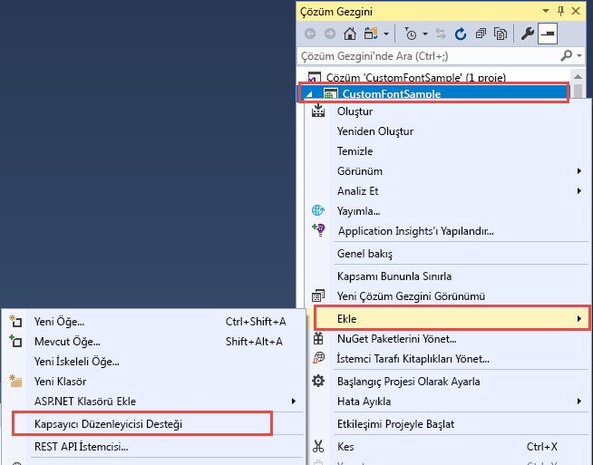
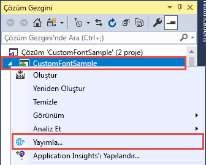
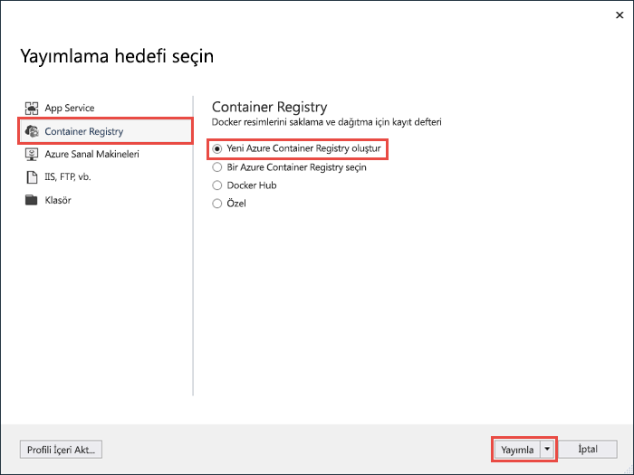
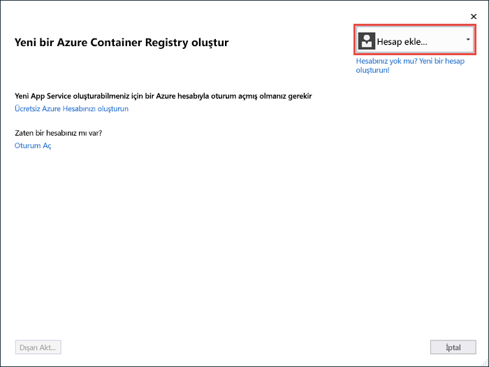
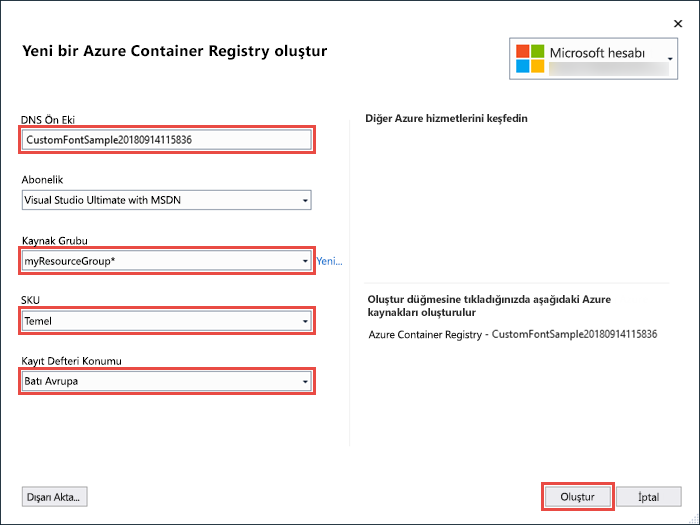
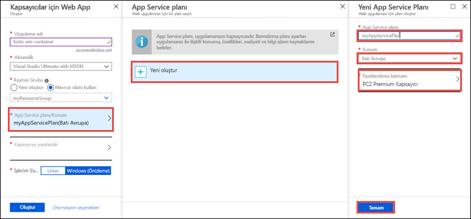
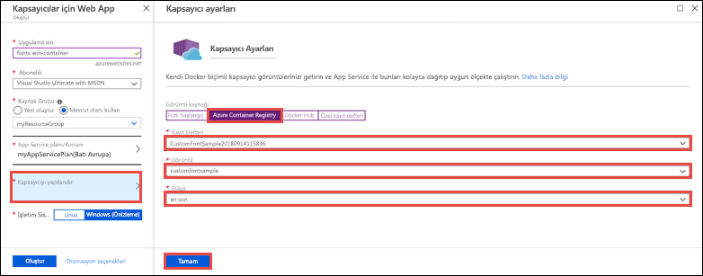
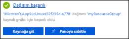

# <a name="migrate-an-aspnet-app-to-azure-app-service-using-a-windows-container-preview"></a>Windows kapsayıcısı kullanarak bir ASP.NET uygulamasını Azure App Service'e geçirme (Önizleme)

[Azure App Service](overview.md), Windows'da IIS üzerinde çalışan ASP.NET veya Node.js gibi önceden tanımlı uygulama yığınları sunar. Önceden yapılandırılmış Windows ortamı, işletim sistemini yönetimsel erişime, yazılım yüklemesine ve genel derleme önbelleğine ve benzeri uygulamalara karşı kilitler (bkz. [Azure App Service'teki işletim sistemi işlevleri](operating-system-functionality.md)). Ancak App Service içinde özel bir Windows kapsayıcısı kullanmak, uygulamanızın ihtiyaç duyduğu işletim sistemi değişikliklerini kolayca gerçekleştirmenizi sağlar. Bu sayede özel işletim sistemi ve yazılım yapılandırmasına ihtiyaç duyan bir şirket içi uygulamayı geçirmek oldukça kolaydır. Bu öğreticide Windows yazı tipi kitaplığında yüklü olan özel yazı tiplerini kullanan bir ASP.NET uygulamasını App Service'e geçirme adımları gösterilmektedir. Visual Studio'dan [Azure Container Registry](https://docs.microsoft.com/azure/container-registry/)'ye özel olarak yapılandırılmış bir Windows görüntüsü dağıtıp ardından bunu App Service'te çalıştıracaksınız.


## <a name="prerequisites"></a>Önkoşullar

Bu öğreticiyi tamamlamak için:

- <a href="https://hub.docker.com/" target="_blank">Docker Hub hesabı için kaydolma</a>
- <a href="https://docs.docker.com/docker-for-windows/install/" target="_blank">Docker for Windows'u yükleyin</a>.
- <a href="https://docs.microsoft.com/virtualization/windowscontainers/quick-start/quick-start-windows-10" target="_blank">Windows kapsayıcılarını çalıştırmak için Docker’a geçiş yapın</a>.
- **ASP.NET ve web geliştirme** ve **Azure geliştirme** iş yükleriyle <a href="https://www.visualstudio.com/downloads/" target="_blank">Visual Studio 2017</a>’yi yükleyin. Visual Studio 2017'yi zaten yüklediyseniz:
    - **Yardım** > **Güncelleştirmeleri Denetle**'ye tıklayarak Visual Studio'daki en son güncelleştirmeleri yükleyin.
    - **Araçlar** > **Araçları ve Özellikleri Al**'a tıklayarak iş yüklerini Visual Studio’ya ekleyin.

## <a name="set-up-the-app-locally"></a>Uygulamayı yerel ortamda oluşturma

### <a name="download-the-sample"></a>Örneği indirme

Bu adımda yerel .NET projesini oluşturacaksınız.

- [Örnek projeyi indirin](https://github.com/Azure-Samples/custom-font-win-container/archive/master.zip).
- *custom-font-win-container.zip* dosyasını açın.

Örnek projede Windows yazı tipi kitaplığına yüklenmiş olan özel bir yazı tipini kullanan basit bir ASP.NET uygulaması bulunmaktadır. Yazı tiplerini yüklemenize gerek yoktur işletim sistemine tümleşik bir uygulama örneği olarak verilmiştir. Bu tür bir uygulamayı App Service'e geçirmek için kodunuzu yeniden düzenleyip tümleştirmeyi kaldırabilir veya özel Windows kapsayıcısında olduğu için olduğu şekilde geçirebilirsiniz.

### <a name="install-the-font"></a>Yazı tipini yükleme

Windows Gezgini'nde _custom-font-win-container-master/CustomFontSample_ dizinine gidin, _FrederickatheGreat-Regular.ttf_ dosyasına sağ tıklayın ve **Yükle**'yi seçin.

Bu yazı tipi [Google Fonts](https://fonts.google.com/specimen/Fredericka+the+Great) sayfasında genel kullanıma açık bir şekilde sunulmaktadır.

### <a name="run-the-app"></a>Uygulamayı çalıştırma

*custom-font-win-container/CustomFontSample.sln* dosyasını Visual Studio'da açın. 

Uygulamayı hata ayıklaması yapılmadan çalıştırmak için `Ctrl+F5` yazın. Uygulama varsayılan tarayıcınızda görüntülenir. 


Yüklenmiş olan bir yazı tipini kullandığından uygulama App Service korumalı alanında çalışmayacaktır. Ancak yazı tipini Windows kapsayıcısına yükleyebileceğiniz için uygulamayı Windows kapsayıcısı kullanarak dağıtabilirsiniz.

### <a name="configure-windows-container"></a>Windows kapsayıcısını yapılandırma

Çözüm Gezgini'nde **CustomFontSample** projesine sağ tıklayıp **Ekle** > **Kapsayıcı Düzenleme Desteği**'ne tıklayın.



**Docker Compose** > **Tamam**'ı seçin.

Projeniz Windows kapsayıcısında çalışacak şekilde ayarlanır. **CustomFontSample** projesine bir _Dockerfile_ ve çözüme bir **docker-compose** projesi eklenir. 

Çözüm Gezgini'nden **Dockerfile** dosyasını açın.

[Desteklenen bir üst görüntü](app-service-web-get-started-windows-container.md#use-a-different-parent-image) kullanmanız gerekir. `FROM` satırını aşağıdaki kod ile değiştirerek üst görüntüyü değiştirin:

```Dockerfile
FROM mcr.microsoft.com/dotnet/framework/aspnet:4.7.2-windowsservercore-ltsc2019
```

Dosyanın en sonuna şu satırı ekleyin ve dosyayı kaydedin:

```Dockerfile
RUN ${source:-obj/Docker/publish/InstallFont.ps1}
```

_InstallFont.ps1_ dosyasını **CustomFontSample** projesinde bulabilirsiniz. Yazı tipini yükleyen basit bir betiktir. Betiğin daha karmaşık sürümünü [Betik Merkezi](https://gallery.technet.microsoft.com/scriptcenter/fb742f92-e594-4d0c-8b79-27564c575133) sayfasında bulabilirsiniz.

## <a name="publish-to-azure-container-registry"></a>Azure Container Registry'de yayımlama

[Azure Container Registry](https://docs.microsoft.com/azure/container-registry/), kapsayıcı dağıtımlarınızın görüntülerini depolayabilir. App Service'i Azure Container Registry'de barındırılan görüntüleri kullanacak şekilde yapılandırabilirsiniz.

### <a name="open-publish-wizard"></a>Yayımlama sihirbazını açma

Çözüm Gezgini'nde **CustomFontSample** projesine sağ tıklayın ve **Yayımla**'yı seçin.



### <a name="create-registry-and-publish"></a>Kayıt defterini oluşturma ve yayımlama

Yayımlama sihirbazında **Kapsayıcı Kayıt Defteri** > **Yeni Azure Azure Container Registry** > **Yayımla**'yı seçin.



### <a name="sign-in-with-azure-account"></a>Azure hesabınızla oturum açın

**Yeni Azure Container Registry oluştur** iletişim kutusunda **Hesap ekle**’yi seçin ve Azure aboneliğinizde oturum açın. Oturumunuz zaten açıksa, açılan menüden istediğiniz aboneliği içeren hesabı seçin.



### <a name="configure-the-registry"></a>Kayıt defterini yapılandırma

Yeni kapsayıcı kayıt defterini aşağıdaki tabloda bulunan değerleri kullanarak yapılandırın. Tamamladığınızda **Oluştur**’a tıklayın.

| Ayar  | Önerilen değer | Daha fazla bilgi edinmek için |
| ----------------- | ------------ | ----|
|**DNS Ön Eki**| Oluşturulan kayıt defteri adını kullanın veya benzersiz bir adla değiştirin. |  |
|**Kaynak Grubu**| **Yeni**'ye tıklayın, **myResourceGroup** yazın ve **Tamam**'a tıklayın. |  |
|**SKU**| Temel | [Fiyatlandırma katmanları](https://azure.microsoft.com/pricing/details/container-registry/)|
|**Kayıt Defteri Konumu**| Batı Avrupa | |



Bir terminal penceresi açılır ve görüntü dağıtımı ilerleme durumunu görüntüler. Dağıtımın tamamlanmasını bekleyin.

## <a name="sign-in-to-azure"></a>Azure'da oturum açma

https://portal.azure.com adresinden Azure portalında oturum açın.

## <a name="create-a-web-app"></a>Web uygulaması oluşturma

Soldaki menüden **Kaynak oluştur** > **Web** > **Kapsayıcılar için Web Uygulaması**'nı seçin.

### <a name="configure-the-new-web-app"></a>Yeni web uygulamasını yapılandırma

Oluşturma arabirimindeki ayarları aşağıdaki tabloya göre yapılandırın:

| Ayar  | Önerilen değer | Daha fazla bilgi edinmek için |
| ----------------- | ------------ | ----|
|**Uygulama Adı**| Benzersiz bir ad yazın. | Web uygulamasının URL'si `http://<app_name>.azurewebsites.net` şeklindedir; burada `<app_name>`, uygulamanızın adıdır. |
|**Kaynak Grubu**| **Mevcut olanı kullan**’ı seçin ve **myResourceGroup** yazın. |  |
|**OS**| Windows (Önizleme) | |

### <a name="configure-app-service-plan"></a>App Service planını yapılandırma

**App Service planı/Konum** > **Yeni oluştur**'a tıklayın. Plana yeni bir ad verin, konum olarak **Batı Avrupa**'yı seçin ve **Tamam**'a tıklayın.



### <a name="configure-container"></a>Kapsayıcıyı yapılandırma

**Kapsayıcıyı yapılandır** > **Azure Container Registry**'ye tıklayın. [Azure Container Registry'de yayımlama](#publish-to-azure-container-registry) bölümünde oluşturduğunuz kayıt defterini, görüntüyü ve etiketi seçip **Tamam**'a tıklayın.



### <a name="complete-app-creation"></a>Uygulama oluşturmayı tamamlama

**Oluştur**'a tıklayın ve Azure'un gereken kaynakları oluşturmasını bekleyin.

## <a name="browse-to-the-web-app"></a>Web uygulamasına göz atma

Azure işlemi tamamlandığında bir bildirim kutusu görüntülenir.



1. **Kaynağa git**'e tıklayın.

2. Uygulama sayfasında **URL**'nin altındaki bağlantıya tıklayın.

Aşağıdaki sayfayla yeni bir tarayıcı sayfası açılır:


Birkaç dakika bekleyin ve beklediğiniz güzel yazı tipine sahip giriş sayfası açılana kadar yeniden deneyin:


**Tebrikler!** Bir ASP.NET uygulamasını Windows kapsayıcısında Azure App Service'e geçirdiniz.

## <a name="see-container-start-up-logs"></a>Kapsayıcı başlangıç günlüklerini inceleme

Windows kapsayıcısının yüklenmesi biraz zaman alabilir. İlerleme durumunu görmek için aşağıdaki URL'ye gidin. *\<app_name>* yerine uygulamanızın adını yazın.
```
https://<app_name>.scm.azurewebsites.net/api/logstream
```

Akışı yapılan günlükler şuna benzer:

```
14/09/2018 23:16:19.889 INFO - Site: fonts-win-container - Creating container for image: customfontsample20180914115836.azurecr.io/customfontsample:latest.
14/09/2018 23:16:19.928 INFO - Site: fonts-win-container - Create container for image: customfontsample20180914115836.azurecr.io/customfontsample:latest succeeded. Container Id 329ecfedbe370f1d99857da7352a7633366b878607994ff1334461e44e6f5418
14/09/2018 23:17:23.405 INFO - Site: fonts-win-container - Start container succeeded. Container: 329ecfedbe370f1d99857da7352a7633366b878607994ff1334461e44e6f5418
14/09/2018 23:17:28.637 INFO - Site: fonts-win-container - Container ready
14/09/2018 23:17:28.637 INFO - Site: fonts-win-container - Configuring container
14/09/2018 23:18:03.823 INFO - Site: fonts-win-container - Container ready
14/09/2018 23:18:03.823 INFO - Site: fonts-win-container - Container start-up and configuration completed successfully
```

