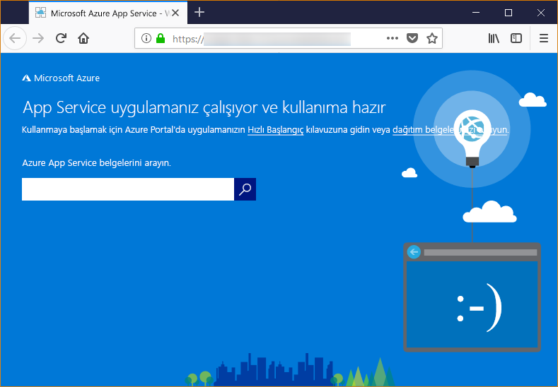

# <a name="configure-a-linux-python-app-for-azure-app-service"></a>Bir Linux Python uygulamasını Azure App Service için yapılandırma

Bu makalede nasıl [Azure App Service](app-service-linux-intro.md) Python uygulamaları ve gerektiğinde App Service'in davranışını nasıl özelleştirebileceğiniz çalışır. Python uygulamaları dağıtılması gerekir tüm gerekli [pip](https://pypi.org/project/pip/) modüller.

App Service dağıtım altyapısı, otomatik olarak sanal ortam etkinleştirir ve çalışan `pip install -r requirements.txt` dağıttığınızda sizin için bir [Git deposu](../deploy-local-git.md?toc=%2fazure%2fapp-service%2fcontainers%2ftoc.json), veya bir [Zip paketini](../deploy-zip.md?toc=%2fazure%2fapp-service%2fcontainers%2ftoc.json) ile açık yapı işlemleri.

Bu kılavuzu temel kavramları ve App Service'te yerleşik bir Linux kapsayıcı kullanan bir Python geliştiricileri için yönergeler sağlar. Azure App Service daha önce kullanmadıysanız izlemelidir [Python hızlı](quickstart-python.md) ve [öğretici PostgreSQL ile Python](tutorial-python-postgresql-app.md) ilk.

> [!NOTE]
> Linux şu anda App Service'te Python uygulamaları çalıştırmak için önerilen seçenektir. Windows seçeneği hakkında daha fazla bilgi için bkz. [App Service'in Windows flavor Python'u](https://docs.microsoft.com/visualstudio/python/managing-python-on-azure-app-service).
>

## <a name="show-python-version"></a>Python sürümü göster

Geçerli Python sürümü göstermek için aşağıdaki komutu çalıştırın [Cloud Shell](https://shell.azure.com):

```azurecli-interactive
az webapp config show --resource-group <resource-group-name> --name <app-name> --query linuxFxVersion
```

Tüm desteklenen Python sürümleri göstermek için aşağıdaki komutu çalıştırın [Cloud Shell](https://shell.azure.com):

```azurecli-interactive
az webapp list-runtimes --linux | grep PYTHON
```

Python'ın desteklenmeyen bir sürümünü, bunun yerine kendi kapsayıcı görüntünüzü oluşturarak çalıştırabilirsiniz. Daha fazla bilgi için [özel bir Docker görüntüsü kullanma](tutorial-custom-docker-image.md).

## <a name="set-python-version"></a>Python sürümünü ayarlama

Aşağıdaki komutu çalıştırın [Cloud Shell](https://shell.azure.com) -3.7 Python sürümünü ayarlamak için:

```azurecli-interactive
az webapp config set --resource-group <resource-group-name> --name <app-name> --linux-fx-version "PYTHON|3.7"
```

## <a name="container-characteristics"></a>Kapsayıcı özellikleri

Dağıtılan GitHub deposunda tanımlanan bir Docker kapsayıcısı içinde çalıştırmak için Linux üzerinde App Service'e Python uygulamaları [Python 3.6](https://github.com/Azure-App-Service/python/tree/master/3.6.6) veya [Python 3.7](https://github.com/Azure-App-Service/python/tree/master/3.7.0).

Bu kapsayıcı aşağıdaki özelliklere sahiptir:

- Uygulamalar ek `--bind=0.0.0.0 --timeout 600` bağımsız değişkenleri kullanılarak [Gunicorn WSGI HTTP Server](https://gunicorn.org/) ile çalıştırılır.

- Temel görüntü varsayılan olarak Flask web çerçevesini içerir ancak kapsayıcı Django gibi WSGI ve Python 3.7 ile uyumlu diğer çerçeveleri de destekler.

- Django gibi ek paketleri yüklemek için `pip freeze > requirements.txt` kullanarak projenizin kök dizininde bir [*requirements.txt*](https://pip.pypa.io/en/stable/user_guide/#requirements-files) dosyası oluşturun. Ardından projenizi Git dağıtımı kullanarak App Service'te yayımlayın. Bunu yaptığınızda uygulamanızın bağımlılıklarının yüklenmesi için kapsayıcıda otomatik olarak `pip install -r requirements.txt` çalıştırılır.

## <a name="container-startup-process"></a>Kapsayıcı başlatma işlemi

Başlatma sırasında Linux'ta App Service kapsayıcısı şu adımları çalıştırır:

1. Kullanım bir [özel bir başlangıç komutu](#customize-startup-command), sağlanan.
2. Varlığını denetleyin bir [Django uygulaması](#django-app)ve algılanırsa Gunicorn için başlatın.
3. Varlığını denetleyin bir [Flask uygulaması](#flask-app)ve algılanırsa Gunicorn için başlatın.
4. Başka bir uygulama bulunamazsa yoksa kapsayıcıda bulunan varsayılan uygulamayı başlatır.

Aşağıdaki bölümlerde bu seçeneklerle ilgili ek ayrıntılar verilmiştir.

### <a name="django-app"></a>Django uygulaması

Django uygulamaları için App Service uygulama kodunuzda `wsgi.py` adlı bir dosya olup olmadığını denetler ve ardından şu komutu kullanarak Gunicorn'u çalıştırır:

```bash
# <module> is the path to the folder that contains wsgi.py
gunicorn --bind=0.0.0.0 --timeout 600 <module>.wsgi
```

Başlangıç komutu üzerinde daha fazla denetime sahip olmak istiyorsanız [özel başlangıç komutu](#customize-startup-command) kullanın ve `<module>` yerine *wsgi.py* dosyasını içeren modülün adını yazın.

### <a name="flask-app"></a>Flask uygulaması

Flask için App Service için adlı bir dosya arar *application.py* veya *app.py* ve Gunicorn şu şekilde başlar:

```bash
# If application.py
gunicorn --bind=0.0.0.0 --timeout 600 application:app
# If app.py
gunicorn --bind=0.0.0.0 --timeout 600 app:app
```

Ana uygulama modülünüz farklı bir dosyada bulunuyorsa uygulama nesnesi için farklı bir ad kullanın veya Gunicorn'a ek bağımsız değişkenler sağlamak istiyorsanız [özel başlangıç komutu](#customize-startup-command) kullanın.

### <a name="default-behavior"></a>Varsayılan davranış

App Service özel komut dosyası, Django uygulaması veya Flask uygulaması bulamazsa _opt/defaultsite_ klasöründe bulunan varsayılan salt okunur uygulamayı çalıştırır. Varsayılan uygulama aşağıdaki gibi görünür:



## <a name="customize-startup-command"></a>Başlangıç komutu özelleştirme

Özel bir Gunicorn başlangıç komutu sağlayarak kapsayıcının başlangıç davranışını denetleyebilirsiniz. Bunu yapmak için aşağıdaki komutu çalıştırarak [Cloud Shell](https://shell.azure.com):

```azurecli-interactive
az webapp config set --resource-group <resource-group-name> --name <app-name> --startup-file "<custom-command>"
```

Örneğin, bir Flask uygulaması olan ana modülü varsa *hello.py* ve bu dosyayı Flask uygulaması nesnesinde adlı `myapp`, ardından  *\<özel komut >* aşağıdaki gibidir:

```bash
gunicorn --bind=0.0.0.0 --timeout 600 hello:myapp
```

Ana modülünüz `website` gibi bir alt klasör ise bu klasörü `--chdir` bağımsız değişkeniyle belirtin:

```bash
gunicorn --bind=0.0.0.0 --timeout 600 --chdir website hello:myapp
```

İçin Gunicorn için herhangi bir ek bağımsız değişkenler de ekleyebilirsiniz  *\<özel komut >* , gibi `--workers=4`. Daha fazla bilgi için bkz. [Gunicorn'u Çalıştırma](https://docs.gunicorn.org/en/stable/run.html) (docs.gunicorn.org).

Bir Gunicorn olmayan sunucu gibi kullanılacak [aiohttp](https://aiohttp.readthedocs.io/en/stable/web_quickstart.html), değiştirebilirsiniz  *\<özel komut >* ile aşağıdakine benzer:

```bash
python3.7 -m aiohttp.web -H localhost -P 8080 package.module:init_func
```

> [!Note]
> App Service, özel komut dosyasının işlenmesi sırasında oluşan hataları yoksayar ve başlatma işlemine Django ve Flask uygulamalarını arayarak devam eder. Beklediğiniz davranışı görmüyorsanız başlangıç dosyanızın App Service'e dağıtıldığından ve dosyada hata bulunmadığından emin olun.

## <a name="access-environment-variables"></a>Ortam değişkenlerine erişme

Uygulama hizmetinde [uygulama ayarlarını belirlemek](../configure-common.md?toc=%2fazure%2fapp-service%2fcontainers%2ftoc.json#configure-app-settings) , uygulama kodunuz dışında. Standardını kullanarak bunlar erişebilir [os.environ](https://docs.python.org/3/library/os.html#os.environ) deseni. Örneğin, bir uygulama ayarı erişmeye adlı `WEBSITE_SITE_NAME`, aşağıdaki kodu kullanın:

```python
os.environ['WEBSITE_SITE_NAME']
```

## <a name="detect-https-session"></a>HTTPS oturumu algılayın

App Service'te [SSL sonlandırma](https://wikipedia.org/wiki/TLS_termination_proxy) tüm HTTPS isteklerini, şifrelenmemiş HTTP istekleri olarak uygulamanızı ulaşmak için Ağ Yük Dengeleyiciler, olur. Uygulama mantığı ihtiyaçlarınızı veya değil, kullanıcı isteklerini şifreli olup olmadığı denetlenecek incelemek, `X-Forwarded-Proto` başlığı.

```python
if 'X-Forwarded-Proto' in request.headers and request.headers['X-Forwarded-Proto'] == 'https':
# Do something when HTTPS is used
```

Popüler web çerçeveleri erişmenizi `X-Forwarded-*` bilgileri, standart uygulama deseni. İçinde [CodeIgniter](https://codeigniter.com/), [is_https()](https://github.com/bcit-ci/CodeIgniter/blob/master/system/core/Common.php#L338-L365) değerini denetler `X_FORWARDED_PROTO` varsayılan olarak.

## <a name="access-diagnostic-logs"></a>Tanılama günlüklerine erişim

[!INCLUDE [Access diagnostic logs](../../../includes/app-service-web-logs-access-no-h.md)]

## <a name="open-ssh-session-in-browser"></a>Tarayıcıda SSH oturum aç

[!INCLUDE [Open SSH session in browser](../../../includes/app-service-web-ssh-connect-builtin-no-h.md)]

## <a name="troubleshooting"></a>Sorun giderme

- **Kendi uygulama kodunuzu dağıttıktan sonra varsayılan uygulamayı görüyorsunuz.** Varsayılan uygulama ya da App Service, uygulama kodunuz dağıtılan henüz veya App Service, uygulama kodunuz bulunamadı ve bunun yerine varsayılan uygulamayı çalıştırdığınız için görünür.
- App Service'i yeniden başlatın, 15-20 saniye bekleyin ve uygulamayı yeniden denetleyin.
- Windows tabanlı örnek yerine Linux için App Service’i kullandığınızdan emin olun. Azure CLI’de `<resource_group_name>` ve `<app_service_name>` hizmetini uygun bir şekilde değiştiren `az webapp show --resource-group <resource_group_name> --name <app_service_name> --query kind` komutunu çalıştırın. Çıktı olarak `app,linux` görünmelidir, aksi takdirde App Service’i yeniden oluşturun ve Linux’u seçin.
- SSH veya Kudu kullanarak doğrudan App Service'e bağlanın ve dosyalarınızın *site/wwwroot* dizininde bulunduğunu doğrulayın. Dosyalarınız orada değilse dağıtım işlemlerinizi gözden geçirin ve uygulamayı yeniden dağıtın.
- Dosyalarınız oradaysa App Service başlangıç dosyanızı tanımlayamamış olabilir. Uygulamanızın App Service'in [Django](#django-app) veya [Flask](#flask-app) için beklediği şekilde yapılandırılmış olduğundan emin olun veya [özel başlangıç komutu](#customize-startup-command) kullanın.
- **Tarayıcıda "Hizmet Kullanılamıyor" iletisini görüyorsunuz.** Bu durum, tarayıcının App Service'ten yanıt beklerken zaman aşımına uğradığını gösterir. Bunun nedeni App Service'in Gunicorn sunucusunu başlatmış olması ancak uygulama kodunu belirten bağımsız değişkenlerin hatalı olmasıdır.
- Özellikle App Service Planınızda en düşük fiyatlandırma katmanlarını kullanıyorsanız tarayıcıyı yenileyin. Ücretsiz katmanları kullandığınızda uygulamanın başlaması daha uzun sürebilir ve tarayıcıyı yenilediğinizde yanıt verebilir.
- Uygulamanızın App Service'in [Django](#django-app) veya [Flask](#flask-app) için beklediği şekilde yapılandırılmış olduğundan emin olun veya [özel başlangıç komutu](#customize-startup-command) kullanın.
- [Günlük akışı erişim](#access-diagnostic-logs).

## <a name="next-steps"></a>Sonraki adımlar

> [!div class="nextstepaction"]
> [Öğretici: PostgreSQL ile Python uygulaması](tutorial-python-postgresql-app.md)

> [!div class="nextstepaction"]
> [Öğretici: Özel kapsayıcı deposundan dağıtın](tutorial-custom-docker-image.md)

> [!div class="nextstepaction"]
> [App Service Linux SSS](app-service-linux-faq.md)
