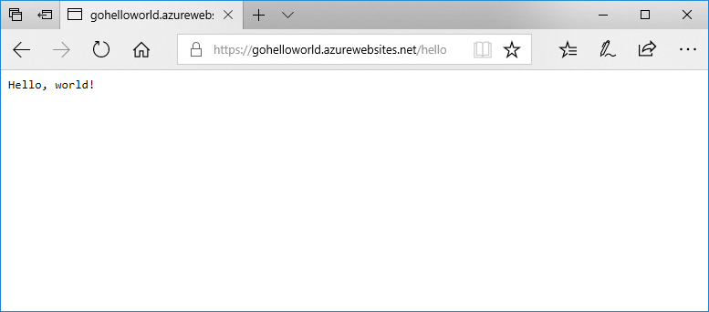

# <a name="deploy-a-dockergo-web-app-in-web-app-for-containers"></a>Kapsayıcılar için Web App’te bir Docker/Go web uygulaması dağıtma

[App Service Linux](app-service-linux-intro.md), Linux’ta .NET, PHP, Node.js ve diğer dilleri destekleyen önceden tanımlı uygulama yığınları sağlar. Ayrıca web uygulamanızı Azure’da zaten tanımlı olmayan bir uygulama yığınında çalıştırmak için özel bir Docker görüntüsü de kullanabilirsiniz. Bu hızlı başlangıçta bir web uygulaması oluşturma ve Docker Hub’dan Go görüntüsü dağıtma gösterilmektedir. Web uygulamasını [Azure CLI](https://docs.microsoft.com/cli/azure/get-started-with-azure-cli) kullanarak oluşturursunuz.



[!INCLUDE [quickstarts-free-trial-note](../../../includes/quickstarts-free-trial-note.md)]

[!INCLUDE [cloud-shell-try-it.md](../../../includes/cloud-shell-try-it.md)]

[!INCLUDE [Create resource group](../../../includes/app-service-web-create-resource-group-linux.md)]

[!INCLUDE [Create app service plan](../../../includes/app-service-web-create-app-service-plan-linux.md)]

## <a name="create-a-web-app"></a>Web uygulaması oluşturma

[az webapp create](/cli/azure/webapp?view=azure-cli-latest#az-webapp-create) komutuyla `myAppServicePlan` App Service planında bir [web uygulaması](../overview.md) oluşturun. `<app name>` değerini genel olarak benzersiz bir uygulama adıyla değiştirmeyi unutmayın.

```azurecli-interactive
az webapp create --resource-group myResourceGroup --plan myAppServicePlan --name <app name> --deployment-container-image-name microsoft/azure-appservices-go-quickstart
```

Önceki komutta, `--deployment-container-image-name` genel Docker Hub görüntüsüne işaret eder [microsoft/azure-appservices-go-quickstart](https://hub.docker.com/r/microsoft/azure-appservices-go-quickstart/).

Web uygulaması oluşturulduğunda Azure CLI aşağıda yer alan çıktıdaki gibi bilgiler gösterir:

```json
{
  "availabilityState": "Normal",
  "clientAffinityEnabled": true,
  "clientCertEnabled": false,
  "cloningInfo": null,
  "containerSize": 0,
  "dailyMemoryTimeQuota": 0,
  "defaultHostName": "<app name>.azurewebsites.net",
  "deploymentLocalGitUrl": "https://<username>@<app name>.scm.azurewebsites.net/<app name>.git",
  "enabled": true,
  < JSON data removed for brevity. >
}
```

## <a name="browse-to-the-app"></a>Uygulamaya göz atma

```bash
http://<app_name>.azurewebsites.net/hello
```


**Tebrikler!** Kapsayıcılar için Web App’e yönelik Go uygulaması çalıştıran özel bir Docker görüntüsü dağıttınız.

[!INCLUDE [Clean-up section](../../../includes/cli-script-clean-up.md)]

## <a name="next-steps"></a>Sonraki adımlar

> [!div class="nextstepaction"]
> [Özel Docker görüntüsü kullanma](tutorial-custom-docker-image.md)