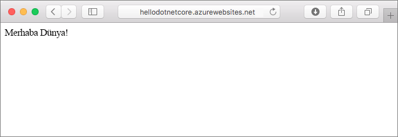
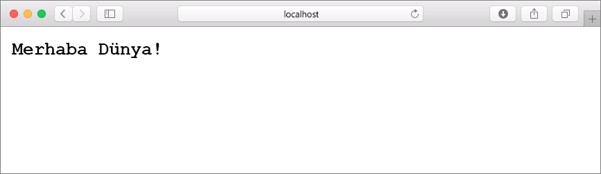
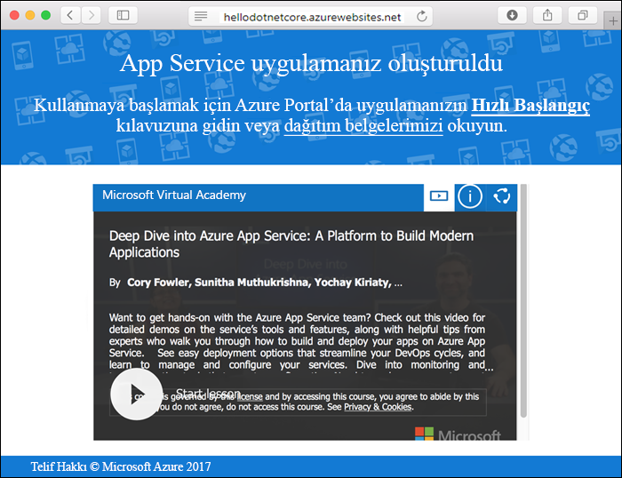
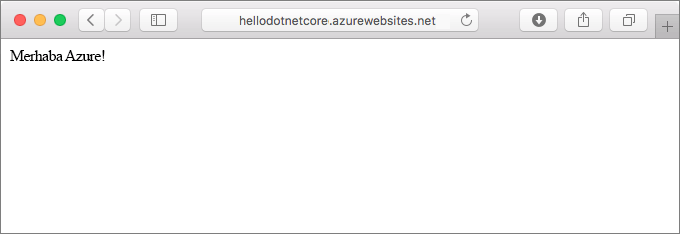
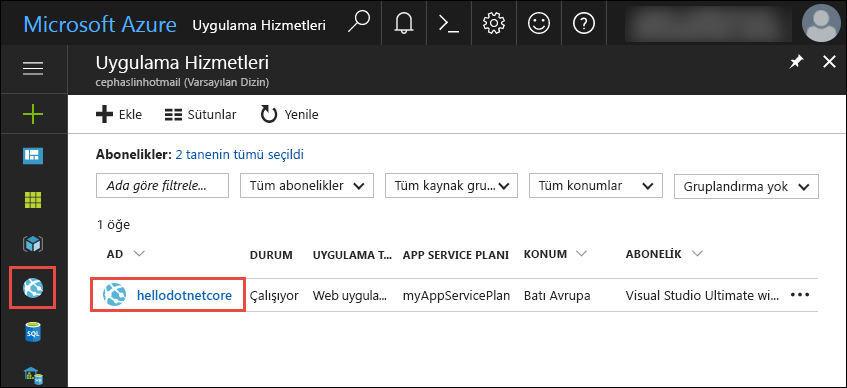
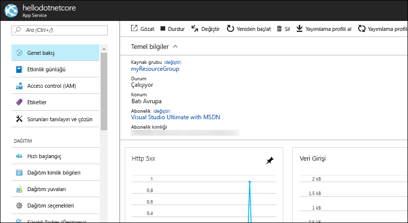

# <a name="create-a-net-core-web-app-in-app-service-on-linux"></a>Linux üzerinde App Service'te bir .NET Core web uygulaması oluşturma

[Uygulama hizmeti Linux'ta](app-service-linux-intro.md) düzeyde ölçeklenebilir, otomatik olarak düzeltme eki uygulama web hizmetini kullanarak Linux işletim sistemi barındırma sağlar. Bu hızlı başlangıç nasıl oluşturulacağını gösterir bir [.NET Core](https://docs.microsoft.com/aspnet/core/) Linux uygulama hizmeti uygulaması. Web uygulamasını kullanarak oluşturduğunuz [Azure CLI](https://docs.microsoft.com/cli/azure/get-started-with-azure-cli), ve Git .NET Core kodunuzu web uygulamasına dağıtmak için kullanın.



Mac, Windows veya Linux makinesi kullanarak aşağıdaki adımları izleyebilirsiniz.

## <a name="prerequisites"></a>Ön koşullar

Bu hızlı başlangıcı tamamlamak için:

* [Git'i yükleyin](https://git-scm.com/)
* [.NET Core SDK yükleme](https://www.microsoft.com/net/download/core)

[!INCLUDE [quickstarts-free-trial-note](../../../includes/quickstarts-free-trial-note.md)]

## <a name="create-the-app-locally"></a>Uygulama yerel olarak oluşturma

Makinenizde bir terminal penceresi içinde adlı bir dizin oluşturun `hellodotnetcore` ve geçerli dizini değiştirin.

```bash
md hellodotnetcore
cd hellodotnetcore
```

Yeni bir .NET Core web uygulaması oluşturun.

```bash
dotnet new web
```

## <a name="run-the-app-locally"></a>Uygulamayı yerel olarak çalıştırma

NuGet paketlerini geri yüklemek ve uygulamayı çalıştırın.

```bash
dotnet restore
dotnet run
```

Bir web tarayıcısı açın ve uygulamaya gidin `http://localhost:5000`.

Sayfada gösterilen örnek uygulamada **Hello World** iletisini görebilirsiniz.



Terminal pencerenizde **Ctrl+C** tuşlarına basarak web sunucusundan çıkın. .NET Core proje için bir Git deposu başlatır.

```bash
git init
git add .
git commit -m "first commit"
```

[!INCLUDE [cloud-shell-try-it.md](../../../includes/cloud-shell-try-it.md)]

[!INCLUDE [Configure deployment user](../../../includes/configure-deployment-user.md)]

[!INCLUDE [Create resource group](../../../includes/app-service-web-create-resource-group.md)]

[!INCLUDE [Create app service plan](../../../includes/app-service-web-create-app-service-plan-linux.md)]

## <a name="create-a-web-app"></a>Web uygulaması oluşturma

[!INCLUDE [Create web app](../../../includes/app-service-web-create-web-app-dotnetcore-no-h.md)]

Yeni oluşturulan web uygulamanıza göz atın. Değiştir  _&lt;uygulama adı >_ ile web uygulaması adı.

```bash
http://<app name>.azurewebsites.net
```



[!INCLUDE [Push to Azure](../../../includes/app-service-web-git-push-to-azure.md)] 

```bash
Counting objects: 22, done.
Delta compression using up to 8 threads.
Compressing objects: 100% (18/18), done.
Writing objects: 100% (22/22), 51.21 KiB | 3.94 MiB/s, done.
Total 22 (delta 1), reused 0 (delta 0)
remote: Updating branch 'master'.
remote: Updating submodules.
remote: Preparing deployment for commit id '741f16d1db'.
remote: Generating deployment script.
remote: Project file path: ./hellodotnetcore.csproj
remote: Generated deployment script files
remote: Running deployment command...
remote: Handling ASP.NET Core Web Application deployment.
remote: ...............................................................................................
remote:   Restoring packages for /home/site/repository/hellodotnetcore.csproj...
remote: ....................................
remote:   Installing System.Xml.XPath 4.0.1.
remote:   Installing System.Diagnostics.Tracing 4.1.0.
remote:   Installing System.Threading.Tasks.Extensions 4.0.0.
remote:   Installing System.Reflection.Emit.ILGeneration 4.0.1.
remote:   ...
remote: Finished successfully.
remote: Running post deployment command(s)...
remote: Deployment successful.
To https://cephalin-dotnetcore.scm.azurewebsites.net/cephalin-dotnetcore.git
 * [new branch]      master -> master
```

## <a name="browse-to-the-app"></a>Uygulamaya göz atma

Web tarayıcınızı kullanarak dağıtılan uygulamaya göz atın.

```bash
http://<app_name>.azurewebsites.net
```

Node.js örnek kod, bir web uygulamasında yerleşik görüntüsü ile çalışıyor.


**Tebrikler!** Linux üzerinde App Service'e ilk Node.js uygulamanızı dağıttıktan sonra.

## <a name="update-and-redeploy-the-code"></a>Kodu güncelleştirme ve yeniden dağıtma

Yerel dizininde açın _haline_ dosya. Yöntem çağrısının metni küçük değişiklikler yapmak `context.Response.WriteAsync`:

```csharp
await context.Response.WriteAsync("Hello Azure!");
```

Değişikliklerinizi Git’e işleyin ve ardından kod değişikliklerini Azure’a gönderin.

```bash
git commit -am "updated output"
git push azure master
```

Dağıtım tamamlandıktan sonra **Uygulamaya göz atma** adımında açılan tarayıcı penceresine dönüp yenile öğesine dokunun.



## <a name="manage-your-new-azure-web-app"></a>Yeni Azure web uygulamanızı yönetme

Oluşturduğunuz web uygulamasını yönetmek için <a href="https://portal.azure.com" target="_blank">Azure portalına</a> gidin.

Sol menüden **Uygulama Hizmetleri**'ne ve ardından Azure web uygulamanızın adına tıklayın.



Web uygulamanızın Genel Bakış sayfasını görürsünüz. Buradan göz atma, durdurma, başlatma, yeniden başlatma ve silme gibi temel yönetim görevlerini gerçekleştirebilirsiniz. 



Soldaki menü, uygulamanızı yapılandırmak için farklı sayfalar sağlar. 

[!INCLUDE [cli-samples-clean-up](../../../includes/cli-samples-clean-up.md)]

## <a name="next-steps"></a>Sonraki adımlar

> [!div class="nextstepaction"]
> [Linux üzerinde Azure App Service'te bir .NET Core ve SQL veritabanı web uygulaması oluşturma](tutorial-dotnetcore-sqldb-app.md)
