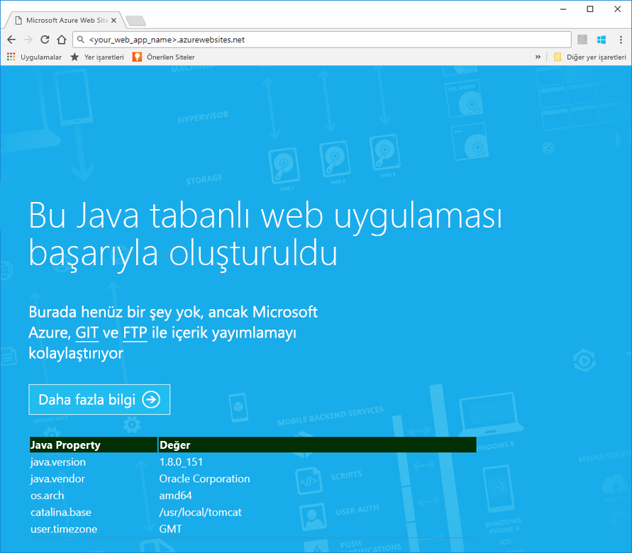
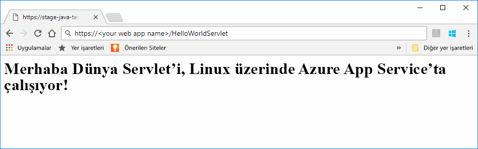
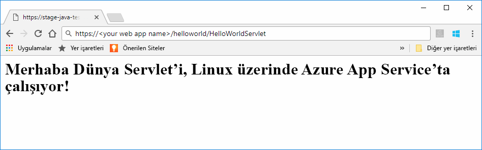

# <a name="preview-create-a-java-web-app-in-app-service-on-linux"></a>Önizleme: Linux üzerindeki App Service’te Java web uygulaması oluşturma

Linux üzerinde App Service şu anda Java web uygulamalarını desteklemek için bir önizleme özelliği sunmaktadır. Önizlemeler hakkında daha fazla bilgi için lütfen [Microsoft Azure Önizlemeleri için Ek Kullanım Koşulları](https://azure.microsoft.com/support/legal/preview-supplemental-terms/)’nı inceleyin. [IntelliJ için Azure Araç Setini kullanarak Java web uygulamalarını buluttaki bir Linux kapsayıcısına dağıtmak](https://docs.microsoft.com/java/azure/intellij/azure-toolkit-for-intellij-hello-world-web-app-linux), Java uygulamanızı kendi kapsayıcınıza dağıtmanın alternatif bir yoludur.

> [!NOTE]
> Bu makalede bir Java web uygulamasının Linux üzerinde App Service'e dağıtımı yapılır.
>

[Linux’ta App Service](app-service-linux-intro.md) Linux işletim sistemini kullanan yüksek oranda ölçeklenebilir, otomatik olarak düzeltme eki uygulayan bir web barındırma hizmeti sağlar. Bu hızlı başlangıçta Linux üzerinde yerleşik görüntü kullanarak bir Java uygulamasını App Service’e dağıtma işlemi gösterilmektedir. [Azure CLI](https://docs.microsoft.com/cli/azure/get-started-with-azure-cli) kullanarak yerleşik görüntü ile web uygulamasını oluşturabilir ve Java uygulamasını web uygulamasına dağıtabilirsiniz.


[!INCLUDE [quickstarts-free-trial-note](../../../includes/quickstarts-free-trial-note.md)]


## <a name="prerequisites"></a>Ön koşullar

Bu hızlı başlangıcı tamamlamak için: 

* Bir Azure aboneliğiniz olmalıdır. Azure aboneliğiniz yoksa başlamadan önce [ücretsiz bir hesap](https://azure.microsoft.com/free/?ref=microsoft.com&utm_source=microsoft.com&utm_medium=docs&utm_campaign=visualstudio) oluşturun.
* [Git’i yükleyin](https://git-scm.com/).
* [Eclipse](https://www.eclipse.org/downloads/)’i yükleyin.


[!INCLUDE [cloud-shell-try-it.md](../../../includes/cloud-shell-try-it.md)]

[!INCLUDE [Configure deployment user](../../../includes/configure-deployment-user.md)]

[!INCLUDE [Create resource group](../../../includes/app-service-web-create-resource-group-linux.md)]

[!INCLUDE [Create app service plan](../../../includes/app-service-web-create-app-service-plan-linux.md)]


## <a name="create-a-web-app"></a>Web uygulaması oluşturma

Cloud Shell’de, `myAppServicePlan` App Service planında bir [web uygulaması](../app-service-web-overview.md) oluşturun. Bunu, [`az webapp create`](/cli/azure/webapp?view=azure-cli-latest#az_webapp_create) komutunu kullanarak yapabilirsiniz. Aşağıdaki örnekte *\<uygulama_adı>* kısmını genel olarak benzersiz bir uygulama adıyla değiştirin (geçerli karakterler `a-z`, `0-9` ve `-` şeklindedir). 

```azurecli-interactive
# Bash
az webapp create --name <app_name> --resource-group myResourceGroup --plan myAppServicePlan --runtime "TOMCAT|8.5-jre8"
# PowerShell
az --% webapp create --name <app_name> --resource-group myResourceGroup --plan myAppServicePlan --runtime "TOMCAT|8.5-jre8"
```

**Çalışma zamanı** parametresi için aşağıdaki çalışma zamanlarından birini kullanın:
 * TOMCAT|8.5-jre8
 * TOMCAT|9.0-jre8


Web uygulaması oluşturulduğunda Azure CLI aşağıda yer alan örnekteki gibi bilgiler gösterir:

```json
{
  "additionalProperties": {},
  "availabilityState": "Normal",
  "clientAffinityEnabled": true,
  "clientCertEnabled": false,
  "cloningInfo": null,
  "containerSize": 0,
  "dailyMemoryTimeQuota": 0,
  "defaultHostName": "<your web app name>.azurewebsites.net",
  "enabled": true,
  "enabledHostNames": [
    "<your web app name>.azurewebsites.net",
    "<your web app name>.scm.azurewebsites.net"
  ],
  "ftpPublishingUrl": "ftp://<your ftp URL>",  
  < JSON data removed for brevity. >
}
```

**ftpPublishingUrl** değerini kopyalayın. Daha sonra FTP dağıtımını seçerseniz bu değeri kullanacaksınız.

Yeni oluşturulan web uygulamasına göz atın.

```
http://<app_name>.azurewebsites.net
```

Web uygulaması çalışır durumdaysa aşağıdaki görüntüye benzer bir varsayılan ekran görmeniz gerekir:




## <a name="download-the-sample-java-app"></a>Örnek Java uygulamasını indirin

Makinenizde bir terminal penceresinde, örnek uygulama deposunu yerel makinenize kopyalamak için aşağıdaki komutu çalıştırın. Bu örnek uygulamayı sonraki bir adımda dağıtacaksınız.

```bash
git clone https://github.com/Azure-Samples/java-docs-hello-world
```


## <a name="deploying-the-java-app-to-app-service-on-linux"></a>Java uygulamasını Linux üzerinde App Service'e dağıtma

Örnek projeyi [Eclipse](https://www.eclipse.org/downloads/)’te açın ve `helloworld.war` adlı [Web Arşivi (WAR) dosyasına java uygulamasını gönderin](http://help.eclipse.org/kepler/index.jsp?topic=%2Forg.eclipse.wst.webtools.doc.user%2Ftopics%2Ftwcrewar.html).

Java uygulaması WAR dosyanızı dağıtmak için WarDeploy (şu anda [Önizleme](https://azure.microsoft.com/support/legal/preview-supplemental-terms/) aşamasındadır) veya FTP kullanabilirsiniz.

Kullandığınız dağıtım yöntemine bağlı olarak Java web uygulamasına göz atma yolu biraz farklı olacaktır.

### <a name="deploy-with-wardeploy"></a>WarDeploy ile dağıtma 

WAR dosyanızı WarDeploy ile dağıtmak için aşağıdaki cURL örnek komut satırını kullanarak *https://<your app name>.scm.azurewebsites.net/api/wardeploy* sayfasına bir POST isteği gönderin. POST isteğinin ileti gövdesinde .war dosyası bulunmalıdır. Uygulamanızın dağıtım kimlik bilgileri, HTTP BASIC kimlik doğrulaması kullanılarak istekte belirtilir. WarDeploy hakkında daha fazla bilgi için bkz. [Uygulamanızı bir ZIP veya WAR dosyası ile Azure App Service'e dağıtma](../app-service-deploy-zip.md).

```bash
curl -X POST -u <username> --data-binary @"<war_file_path>" https://<app_name>.scm.azurewebsites.net/api/wardeploy
```

Aşağıdakileri güncelleştirin:

* `username` - Daha önce oluşturduğunuz dağıtım kimlik bilgisi kullanıcı adını kullanın.
* `war_file_path` - Yerel WAR dosyası yolunu kullanın.
* `app_name` - Daha önce oluşturduğunuz uygulama adını kullanın.

Komutu yürütün. cURL tarafından istendiğinde, dağıtım kimlik bilgilerinizin parolasını yazın.

Web tarayıcınızda aşağıdaki URL’yi kullanarak dağıtılan uygulamanın konumuna göz atın.

```bash
http://<app_name>.azurewebsites.net
```

Java örnek kodu bir web uygulaması yerleşik görüntüsünde çalışır.


Web tarayıcınızı kullanarak servlet’e göz atın.

```bash
http://<app_name>.azurewebsites.net/HelloWorldServlet
```

Servlet bir web uygulaması yerleşik görüntüsünde çalışır.




**Tebrikler!** Linux üzerinde App Service’e ilk Java uygulamanızı dağıttınız.


### <a name="ftp-deployment"></a>FTP dağıtımı

Alternatif olarak, WAR dosyasını dağıtmak için FTP de kullanabilirsiniz. 

Dosyayı web uygulamanızın */home/site/wwwroot/webapps* dizininde FTP ile bulun. Aşağıdaki örnek komut satırı cURL kullanır:

```bash
curl -T war_file_path -u "app_name\username" ftp://webappFTPURL/site/wwwroot/webapps/
```

Aşağıdakileri güncelleştirin:

* `war_file_path` - Yerel WAR dosyası yolunu kullanın.
* `app_name` - Daha önce oluşturduğunuz uygulama adını kullanın.
* `username` - Daha önce oluşturduğunuz dağıtım kimlik bilgisi kullanıcı adını kullanın.
* `webappFTPURL` - Web uygulamanızın daha önce kopyaladığınız **FTP konak adı** değerini kullanın. FTP konak adı aynı zamanda web uygulamanızın [Azure portalındaki](https://portal.azure.com/) **Genel bakış** dikey penceresinde listelenir.

Komutu yürütün. cURL tarafından istendiğinde, dağıtım kimlik bilgilerinizin parolasını yazın.


Web tarayıcınızda aşağıdaki URL’yi kullanarak dağıtılan uygulamanın konumuna göz atın.

```bash
http://<app_name>.azurewebsites.net/helloworld
```

Java örnek kodu bir web uygulaması yerleşik görüntüsünde çalışır.


Web tarayıcınızı kullanarak servlet’e göz atın.

```bash
http://<app_name>.azurewebsites.net/helloworld/HelloWorldServlet
```

Java örnek kodu bir web uygulaması yerleşik görüntüsünde çalışır.




**Tebrikler!** Linux üzerinde App Service’e ilk Java uygulamanızı dağıttınız.


[!INCLUDE [cli-samples-clean-up](../../../includes/cli-samples-clean-up.md)]


## <a name="next-steps"></a>Sonraki adımlar

Azure ile Java kullanma hakkında daha fazla bilgi için aşağıdaki bağlantılara bakın:

* [Java Geliştiricileri için Azure](https://docs.microsoft.com/java/azure/)
* [IntelliJ için Azure Araç Seti’ni kullanarak bulutta bir Linux kapsayıcısına Merhaba Dünya web uygulaması dağıtma](https://docs.microsoft.com/java/azure/intellij/azure-toolkit-for-intellij-hello-world-web-app-linux)
* [Visual Studio Team Services için Java Araçları](https://java.visualstudio.com/)
