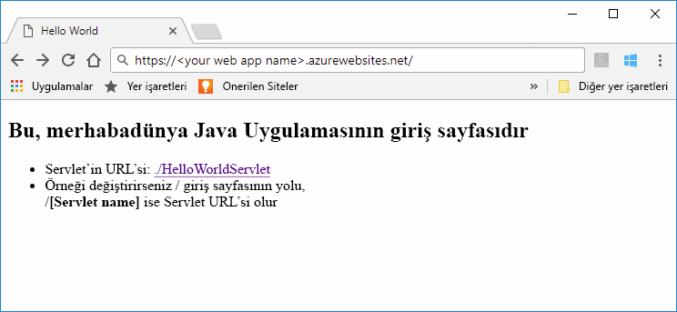

# <a name="quickstart-create-a-java-app-in-app-service-on-linux"></a>Hızlı Başlangıç: Linux üzerinde App Service'te bir Java uygulaması oluşturma

[Linux üzerindeki App Service](app-service-linux-intro.md) Linux işletim sistemini kullanan yüksek oranda ölçeklenebilir, otomatik olarak düzeltme eki uygulayan bir web barındırma hizmeti sağlar. Bu hızlı başlangıçta nasıl kullanılacağını gösterir [Azure CLI](https://docs.microsoft.com/cli/azure/get-started-with-azure-cli) ile [Azure App Service için Maven Plugin](https://github.com/Microsoft/azure-maven-plugins/tree/develop/azure-webapp-maven-plugin) bir Java web arşivi (WAR) dosyasına dağıtılacak.
> [!NOTE]
>
> Aynı şeyi de yapılabilir Intellij ve Eclipse gibi popüler Ide'leri kullanarak. Bizim benzer belgeleri kullanıma [Intellij Hızlı Başlangıç için Azure Araç Seti](/java/azure/intellij/azure-toolkit-for-intellij-create-hello-world-web-app) veya [Eclipse Hızlı Başlangıç için Azure Araç Seti](/java/azure/eclipse/azure-toolkit-for-eclipse-create-hello-world-web-app).
>


[!INCLUDE [quickstarts-free-trial-note](../../../includes/quickstarts-free-trial-note.md)]

[!INCLUDE [cloud-shell-try-it.md](../../../includes/cloud-shell-try-it.md)]

## <a name="create-a-java-app"></a>Java uygulaması oluşturma

Cloud Shell isteminde adlı yeni bir uygulama oluşturmak için aşağıdaki Maven komutunu yürütün `helloworld`:

```bash
mvn archetype:generate -DgroupId=example.demo -DartifactId=helloworld -DarchetypeArtifactId=maven-archetype-webapp
```

## <a name="configure-the-maven-plugin"></a>Maven eklentisini yapılandırma

Maven'dan dağıtım için, Cloud Shell'deki kod düzenleyiciyi kullanarak `helloworld` dizinindeki proje `pom.xml` dosyasını açın. 

```bash
code pom.xml
```

Sonra `pom.xml` dosyasının `<build>` öğesinin içine aşağıdaki eklenti tanımını ekleyin.

```xml
<plugins>
    <!--*************************************************-->
    <!-- Deploy to Tomcat in App Service Linux           -->
    <!--*************************************************-->
    <plugin>
        <groupId>com.microsoft.azure</groupId>
        <artifactId>azure-webapp-maven-plugin</artifactId>
        <version>1.7.0</version>
    </plugin>
</plugins>
```

Azure App Service'e dağıtma işlemi, Azure clı'dan hesap kimlik bilgilerini kullanır. [Azure CLI ile oturum](/cli/azure/authenticate-azure-cli?view=azure-cli-latest) devam etmeden önce.

```azurecli
az login
```

Dağıtım yapılandırabileceğiniz sonra maven komutunu çalıştırın `mvn azure-webapp:config` komut isteminde ve varsayılan yapılandırmaları basarak kullanmak **ENTER** alana kadar **onaylayın (E/H)** , daha sonra sor basın **'y'** ve yapılandırmayı gerçekleştirilir.

```cmd
~@Azure:~/helloworld$ mvn azure-webapp:config
[INFO] Scanning for projects...
[INFO]
[INFO] ----------------------< example.demo:helloworld >-----------------------
[INFO] Building helloworld Maven Webapp 1.0-SNAPSHOT
[INFO] --------------------------------[ war ]---------------------------------
[INFO]
[INFO] --- azure-webapp-maven-plugin:1.6.0:config (default-cli) @ helloworld ---
[WARNING] The plugin may not work if you change the os of an existing webapp.
Define value for OS(Default: Linux):
1. linux [*]
2. windows
3. docker
Enter index to use:
Define value for javaVersion(Default: jre8):
1. jre8 [*]
2. java11
Enter index to use:
Define value for runtimeStack(Default: TOMCAT 8.5):
1. TOMCAT 9.0
2. jre8
3. TOMCAT 8.5 [*]
4. WILDFLY 14
Enter index to use:
Please confirm webapp properties
AppName : helloworld-1558400876966
ResourceGroup : helloworld-1558400876966-rg
Region : westeurope
PricingTier : Premium_P1V2
OS : Linux
RuntimeStack : TOMCAT 8.5-jre8
Deploy to slot : false
Confirm (Y/N)? : Y
```

> [!NOTE]
> Bu makalede yalnızca WAR dosyalarıyla paketlenmiş Java uygulamalarıyla çalışacağız. Eklenti ayrıca JAR web uygulamalarını da destekler. Denemek için [Linux'ta App Service'e Java SE JAR dosyası dağıtma](https://docs.microsoft.com/java/azure/spring-framework/deploy-spring-boot-java-app-with-maven-plugin?toc=%2fazure%2fapp-service%2fcontainers%2ftoc.json).

Gidin `pom.xml` aşağıda listelenen gerekli, bazı yaygın olanları belirlerseniz yeniden eklentisi yapılandırma güncelleştirilir görmek için App Service için diğer yapılandırmalar doğrudan pom dosyanızın değiştirebilirsiniz:

 Özellik | Gerekli | Açıklama | Version
---|---|---|---
`<schemaVersion>` | false | Yapılandırma şeması sürümünü belirtin. Desteklenen değerler şunlardır: `v1`, `v2`. | 1.5.2
`<resourceGroup>` | true | Web uygulamanız için Azure kaynak grubu. | 0.1.0+
`<appName>` | true | Web uygulamanızın adı. | 0.1.0+
[`<region>`](/java/api/overview/azure/maven/azure-webapp-maven-plugin/readme#region) | true | Web uygulamanızı nerede barındırılacağını bölge belirtir. Varsayılan değer **westus**. Tüm geçerli bölgeler [desteklenen bölgeler](/java/api/overview/azure/maven/azure-webapp-maven-plugin/readme#region) bölümü. | 0.1.0+
[`<pricingTier>`](/java/api/overview/azure/maven/azure-webapp-maven-plugin/readme##pricingtier) | false | Web uygulamanız için bir fiyatlandırma katmanı. Varsayılan değer **P1V2**.| 0.1.0+
[`<runtime>`](/java/api/overview/azure/maven/azure-webapp-maven-plugin/readme#runtimesetting) | true | Çalışma zamanı ortamı yapılandırması ayrıntıları görebilir [burada](/java/api/overview/azure/maven/azure-webapp-maven-plugin/readme#runtimesetting). | 0.1.0+
[`<deployment>`](/java/api/overview/azure/maven/azure-webapp-maven-plugin/readme#deploymentsetting) | true | Dağıtım yapılandırma ayrıntıları görebilir [burada](/java/api/overview/azure/maven/azure-webapp-maven-plugin/readme#deploymentsetting). | 0.1.0+

## <a name="deploy-the-app"></a>Uygulamayı dağıtma

Aşağıdaki komutu kullanarak Java uygulamanızı Azure'a dağıtın:

```bash
mvn package azure-webapp:deploy
```

Dağıtım tamamlandıktan sonra, web tarayıcınızda aşağıdaki URL’yi kullanarak dağıtılan uygulamanın konumuna gidin; örneğin `http://<webapp>.azurewebsites.net`. 


**Tebrikler!** Linux üzerinde App Service’e ilk Java uygulamanızı dağıttınız.

## <a name="clean-up-resources"></a>Kaynakları temizleme

Önceki adımlarda, bir kaynak grubunda Azure kaynakları oluşturdunuz. Bu kaynakların gelecekte gerekli olacağını düşünmüyorsanız, Cloud Shell’de aşağıdaki komutu çalıştırarak kaynak grubunu silin:

```azurecli-interactive
az group delete --name <your resource group name; for example: helloworld-1558400876966-rg> --yes
```

Bu komutun çalıştırılması bir dakika sürebilir.

## <a name="next-steps"></a>Sonraki adımlar

> [!div class="nextstepaction"]
> [Öğretici: PostgreSQL ile Java Enterprise uygulaması](tutorial-java-enterprise-postgresql-app.md)

> [!div class="nextstepaction"]
> [Java uygulamasını yapılandırma](configure-custom-container.md)

> [!div class="nextstepaction"]
> [Jenkins ile CI/CD](/azure/jenkins/deploy-jenkins-app-service-plugin)

> [!div class="nextstepaction"]
> [Diğer Azure için Java geliştiricilerinin kaynakları](/java/azure/)
