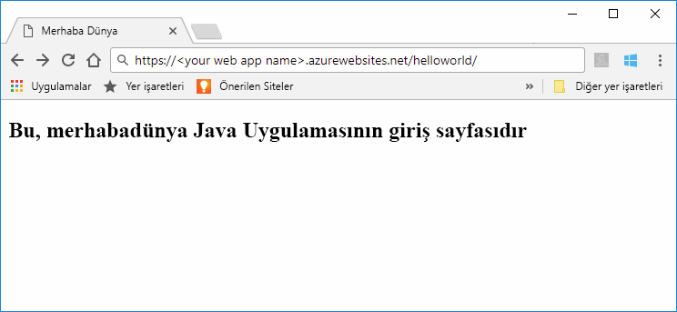

# <a name="quickstart-create-a-java-app-in-app-service-on-linux"></a>Hızlı Başlangıç: Linux üzerinde App Service'te bir Java uygulaması oluşturma

[Linux üzerindeki App Service](app-service-linux-intro.md) Linux işletim sistemini kullanan yüksek oranda ölçeklenebilir, otomatik olarak düzeltme eki uygulayan bir web barındırma hizmeti sağlar. Bu hızlı başlangıçta nasıl kullanılacağını gösterir [Azure CLI](https://docs.microsoft.com/cli/azure/get-started-with-azure-cli) ile [Azure Web Apps (Önizleme) için Maven Plugin](https://github.com/Microsoft/azure-maven-plugins/tree/develop/azure-webapp-maven-plugin) bir Java web arşivi (WAR) dosyasına dağıtılacak.


[!INCLUDE [quickstarts-free-trial-note](../../../includes/quickstarts-free-trial-note.md)]

[!INCLUDE [cloud-shell-try-it.md](../../../includes/cloud-shell-try-it.md)]

## <a name="create-a-java-app"></a>Java uygulaması oluşturma

Cloud Shell isteminde adlı yeni bir uygulama oluşturmak için aşağıdaki Maven komutunu yürütün `helloworld`:

```bash
mvn archetype:generate -DgroupId=example.demo -DartifactId=helloworld -DarchetypeArtifactId=maven-archetype-webapp
```

## <a name="configure-the-maven-plugin"></a>Maven eklentisini yapılandırma

Maven'dan dağıtım için, Cloud Shell'deki kod düzenleyiciyi kullanarak `helloworld` dizinindeki proje `pom.xml` dosyasını açın. 

```bash
code pom.xml
```

Sonra `pom.xml` dosyasının `<build>` öğesinin içine aşağıdaki eklenti tanımını ekleyin.

```xml
<plugins>
    <!--*************************************************-->
    <!-- Deploy to Tomcat in App Service Linux           -->
    <!--*************************************************-->
    <plugin>
        <groupId>com.microsoft.azure</groupId>
        <artifactId>azure-webapp-maven-plugin</artifactId>
        <version>1.5.3</version>
        <configuration>
            <!-- App information -->
            <resourceGroup>${RESOURCEGROUP_NAME}</resourceGroup>
            <appName>${WEBAPP_NAME}</appName>
            <region>${REGION}</region>
   
            <!-- Java Runtime Stack for App on Linux-->
            <linuxRuntime>tomcat 8.5-jre8</linuxRuntime> 
        </configuration>
    </plugin>
</plugins>
```    


> [!NOTE] 
> Bu makalede yalnızca WAR dosyalarıyla paketlenmiş Java uygulamalarıyla çalışacağız. Eklenti ayrıca JAR web uygulamalarını da destekler. Denemek için [Linux'ta App Service'e Java SE JAR dosyası dağıtma](https://docs.microsoft.com/java/azure/spring-framework/deploy-spring-boot-java-app-with-maven-plugin?toc=%2fazure%2fapp-service%2fcontainers%2ftoc.json).


Eklenti yapılandırmasında aşağıdaki yer tutucuları güncelleştirin:

| Yer tutucu | Açıklama |
| ----------- | ----------- |
| `RESOURCEGROUP_NAME` | Uygulamanızın oluşturulacağı yeni kaynak grubunun adı. Uygulamanın tüm kaynaklarını bir gruba koyarak birlikte yönetebilirsiniz. Örneğin, kaynak grubunu sildiğinizde uygulamayla ilişkili tüm kaynaklar da silinir. Bu değeri *TestResources* gibi benzersiz bir yeni kaynak grubu adı ile güncelleştirin. Bu kaynak grubunu daha sonraki bir bölümde tüm Azure kaynaklarını temizlemek için kullanacaksınız. |
| `WEBAPP_NAME` | Uygulama adı bölümü (WEBAPP_NAME.azurewebsites.net) Azure'a dağıtırken uygulama için ana bilgisayar adı olacaktır. Bu değer Java uygulamanızı örneğin barındıracak yeni App Service uygulaması için benzersiz bir adla güncelleştirin *contoso*. |
| `REGION` | Uygulamanın barındırıldığı, örneğin bir Azure bölgesi `westus2`. Cloud Shell'den veya CLI'dan `az account list-locations` komutunu kullanarak bölgelerin bir listesini alabilirsiniz. |

## <a name="deploy-the-app"></a>Uygulamayı dağıtma

Aşağıdaki komutu kullanarak Java uygulamanızı Azure'a dağıtın:

```bash
mvn package azure-webapp:deploy
```

Dağıtım tamamlandıktan sonra, web tarayıcınızda aşağıdaki URL’yi kullanarak dağıtılan uygulamanın konumuna gidin; örneğin `http://<webapp>.azurewebsites.net/helloworld`. 



**Tebrikler!** Linux üzerinde App Service’e ilk Java uygulamanızı dağıttınız.

[!INCLUDE [cli-samples-clean-up](../../../includes/cli-samples-clean-up.md)]

## <a name="next-steps"></a>Sonraki adımlar

> [!div class="nextstepaction"]
> [Öğretici: PostgreSQL ile Java Enterprise uygulaması](tutorial-java-enterprise-postgresql-app.md)

> [!div class="nextstepaction"]
> [Java uygulamasını yapılandırma](configure-custom-container.md)

> [!div class="nextstepaction"]
> [Jenkins ile CI/CD](/azure/jenkins/deploy-jenkins-app-service-plugin)
