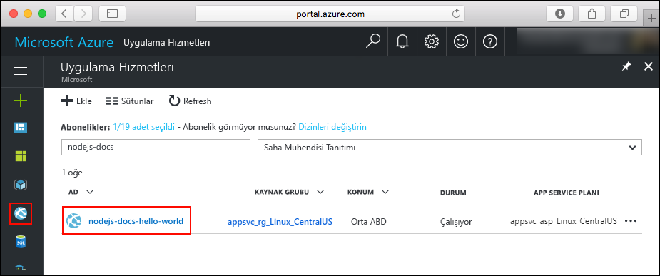

# <a name="create-a-nodejs-app-in-azure-app-service-on-linux"></a>Linux üzerinde Azure App Service'te bir Node.js uygulaması oluşturma

> [!NOTE]
> Bu makalede bir uygulamanın Linux üzerinde App Service'e dağıtımı yapılır. App Service dağıtmak için _Windows_, bkz: [Azure'da bir Node.js uygulaması oluşturma](../app-service-web-get-started-nodejs.md).
>

[Linux’ta App Service](app-service-linux-intro.md) Linux işletim sistemini kullanan yüksek oranda ölçeklenebilir, otomatik olarak düzeltme eki uygulayan bir web barındırma hizmeti sağlar. Bu hızlı başlangıçta Linux üzerinde [Cloud Shell](https://docs.microsoft.com/azure/cloud-shell/overview) kullanarak bir Node.js uygulamasını App Service’e dağıtma gösterilmektedir.

Bu hızlı başlangıcı Cloud Shell'de tamamlayacaksınız ama bu komutları [Azure CLI](/cli/azure/install-azure-cli) ile yerel olarak da çalıştırabilirsiniz.


[!INCLUDE [quickstarts-free-trial-note](../../../includes/quickstarts-free-trial-note.md)]

[!INCLUDE [cloud-shell-try-it.md](../../../includes/cloud-shell-try-it.md)]

## <a name="download-the-sample"></a>Örneği indirme

Cloud Shell'de bir quickstart dizini oluşturun ve o dizine geçin.

```bash
mkdir quickstart

cd quickstart
```

Ardından, örnek uygulama deposunu quickstart dizininize kopyalamak için aşağıdaki komutu çalıştırın.

```bash
git clone https://github.com/Azure-Samples/nodejs-docs-hello-world
```

Çalıştırıldığında, aşağıdaki örneğe benzer bilgiler görüntüler:

```bash
Cloning into 'nodejs-docs-hello-world'...
remote: Counting objects: 40, done.
remote: Total 40 (delta 0), reused 0 (delta 0), pack-reused 40
Unpacking objects: 100% (40/40), done.
Checking connectivity... done.
```

> [!NOTE]
> Örnek index.js process.env.PORT için dinleme bağlantı noktasını ayarlar. Bu ortam değişkeni, App Service tarafından atanır.
>

## <a name="create-a-web-app"></a>Web uygulaması oluşturma

Örnek kodu içeren dizine geçin ve `az webapp up` komutunu çalıştırın.

Aşağıdaki komutta <app_name> kısmını benzersiz uygulama adıyla değiştirin.

```bash
cd nodejs-docs-hello-world

az webapp up -n <app_name>
```

Bu komutun çalıştırılması birkaç dakika sürebilir. Çalıştırıldığında, aşağıdaki örneğe benzer bilgiler görüntüler:

```json
Creating Resource group 'appsvc_rg_Linux_CentralUS' ...
Resource group creation complete
Creating App service plan 'appsvc_asp_Linux_CentralUS' ...
App service plan creation complete
Creating app '<app_name>' ....
Webapp creation complete
Updating app settings to enable build after deployment
Creating zip with contents of dir /home/username/quickstart/nodejs-docs-hello-world ...
Preparing to deploy and build contents to app.
Fetching changes.

Generating deployment script.
Generating deployment script.
Generating deployment script.
Running deployment command...
Running deployment command...
Running deployment command...
Deployment successful.
All done.
{
  "app_url": "https://<app_name>.azurewebsites.net",
  "location": "Central US",
  "name": "<app_name>",
  "os": "Linux",
  "resourcegroup": "appsvc_rg_Linux_CentralUS ",
  "serverfarm": "appsvc_asp_Linux_CentralUS",
  "sku": "STANDARD",
  "src_path": "/home/username/quickstart/nodejs-docs-hello-world ",
  "version_detected": "6.9",
  "version_to_create": "node|6.9"
}
```

`az webapp up` komutu şu eylemleri gerçekleştirir:

- Varsayılan kaynak grubunu oluşturur.

- Bir varsayılan uygulama hizmeti planı oluşturur.

- Belirtilen adla bir uygulama oluşturur.

- [Zip dağıtma](https://docs.microsoft.com/azure/app-service/deploy-zip) dosyaları uygulamanın geçerli çalışma dizini.

## <a name="browse-to-the-app"></a>Uygulamaya göz atma

Web tarayıcınızı kullanarak, dağıtılan uygulamanın konumuna gidin. < App_name > Uygulama adınızla değiştirin.

```bash
http://<app_name>.azurewebsites.net
```

Node.js örnek kodu, bir yerleşik görüntü ile Linux üzerinde App Service'te çalışıyor.


**Tebrikler!** Linux’ta App Service’e ilk Node.js uygulamanızı dağıttınız.

## <a name="update-and-redeploy-the-code"></a>Kodu güncelleştirme ve yeniden dağıtma

Cloud Shell'de, nano metin düzenleyicisini açmak için `nano index.js` yazın.


 `response.end` çağrısında metinde küçük bir değişiklik yapın:

```nodejs
response.end("Hello Azure!");
```

Değişikliklerinizi kaydedin ve nanodan çıkın. Kaydetmek için `^O` ve çıkmak için `^X` komutunu kullanın.

Şimdi uygulamayı yeniden dağıtacaksınız. Yedek `<app_name>` uygulamanızla.

```bash
az webapp up -n <app_name>
```

Dağıtım tamamlandıktan sonra **Uygulamaya göz atma** adımında açılan tarayıcı penceresine dönüp sayfayı yenileyin.


## <a name="manage-your-new-azure-app"></a>Yeni Azure uygulamanızı yönetme

Git <a href="https://portal.azure.com" target="_blank">Azure portalında</a> oluşturduğunuz uygulamayı yönetmek için.

Sol menüden **uygulama hizmetleri**ve ardından Azure uygulamanızın adına tıklayın.



Uygulamanızın genel bakış sayfasını görürsünüz. Buradan göz atma, durdurma, başlatma, yeniden başlatma ve silme gibi temel yönetim görevlerini tamamlayabilirsiniz.


Soldaki menü, uygulamanızı yapılandırmak için farklı sayfalar sağlar.

## <a name="clean-up-resources"></a>Kaynakları temizleme

Önceki adımlarda, bir kaynak grubunda Azure kaynakları oluşturdunuz. İleride bu kaynaklara ihtiyaç duymayacağınızı düşünüyorsanız, kaynak grubunu Cloud Shell'den silin. Bölgeyi değiştirdiyseniz, `appsvc_rg_Linux_CentralUS` kaynak grubu adını uygulamanıza özel kaynak grubuyla değiştirin.

```azurecli-interactive
az group delete --name appsvc_rg_Linux_CentralUS
```

Bu komutun çalıştırılması bir dakika sürebilir.

## <a name="next-steps"></a>Sonraki adımlar

> [!div class="nextstepaction"]
> [Öğretici: MongoDB ile node.js uygulaması](tutorial-nodejs-mongodb-app.md)

> [!div class="nextstepaction"]
> [Node.js uygulamasını yapılandırma](configure-language-nodejs.md)
