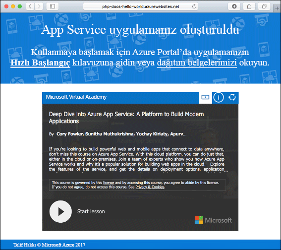
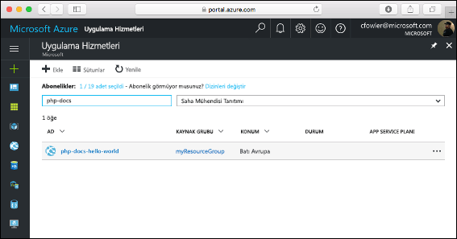
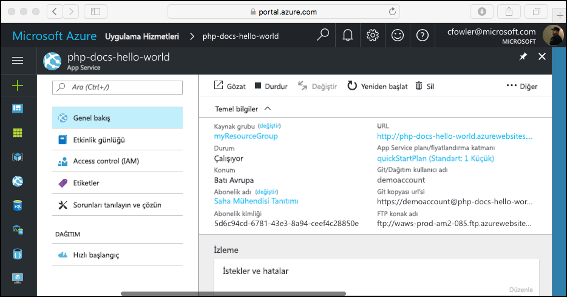

# <a name="create-a-php-app-in-app-service-on-linux"></a>Linux üzerinde App Service'te bir PHP uygulaması oluşturma

> [!NOTE]
> Bu makalede bir uygulamanın Linux üzerinde App Service'e dağıtımı yapılır. App Service dağıtmak için _Windows_, bkz: [Azure'da bir PHP uygulaması oluşturma](../app-service-web-get-started-php.md).
>

[Linux’ta App Service](app-service-linux-intro.md) Linux işletim sistemini kullanan yüksek oranda ölçeklenebilir, otomatik olarak düzeltme eki uygulayan bir web barındırma hizmeti sağlar. Bu hızlı başlangıç öğreticisinde, Linux’ta Azure App Service’e bir PHP uygulamasının nasıl dağıtılacağı gösterilmektedir. Kullanarak yerleşik görüntü ile uygulama oluşturma [Azure CLI](https://docs.microsoft.com/cli/azure/get-started-with-azure-cli) Cloud Shell'de ve PHP kodunu App Service uygulamasına dağıtmak için Git kullanabilirsiniz.


Mac, Windows veya Linux makinesi kullanarak bu makaledeki adımları izleyebilirsiniz.

[!INCLUDE [quickstarts-free-trial-note](../../../includes/quickstarts-free-trial-note.md)]

## <a name="prerequisites"></a>Önkoşullar

Bu hızlı başlangıcı tamamlamak için:

* <a href="https://git-scm.com/" target="_blank">Git'i yükleyin</a>
* <a href="https://php.net" target="_blank">PHP'yi yükleyin</a>

## <a name="download-the-sample"></a>Örneği indirme

Bir terminal penceresinde, örnek uygulamayı yerel makinenize kopyalamak ve örnek kodu içeren dizine gitmek için aşağıdaki komutları çalıştırın.

```bash
git clone https://github.com/Azure-Samples/php-docs-hello-world
cd php-docs-hello-world
```

## <a name="run-the-app-locally"></a>Uygulamayı yerel olarak çalıştırma

Azure'a dağıttığınızda nasıl görüneceğini görmek için uygulamayı yerel olarak çalıştırın. Yerleşik PHP web sunucusunu başlatmak için bir terminal penceresi açın ve `php` komutunu kullanın.

```bash
php -S localhost:8080
```

Bir web tarayıcısı açın ve `http://localhost:8080` konumundaki örnek uygulamaya gidin.

Sayfada gösterilen örnek uygulamada **Merhaba Dünya!** iletisini görürsünüz.


Terminal pencerenizde **Ctrl+C** tuşlarına basarak web sunucusundan çıkın.

[!INCLUDE [cloud-shell-try-it.md](../../../includes/cloud-shell-try-it.md)]

[!INCLUDE [Configure deployment user](../../../includes/configure-deployment-user.md)]

[!INCLUDE [Create resource group](../../../includes/app-service-web-create-resource-group-linux.md)]

[!INCLUDE [Create app service plan](../../../includes/app-service-web-create-app-service-plan-linux.md)]

## <a name="create-a-web-app"></a>Web uygulaması oluşturma

[!INCLUDE [Create web app](../../../includes/app-service-web-create-web-app-php-linux-no-h.md)] 

Yerleşik görüntü ile yeni oluşturulmuş uygulamanızı görmek için siteye göz atın. Değiştirin  _&lt;uygulama adı >_ uygulamanızın adıyla.

```bash
http://<app_name>.azurewebsites.net
```

İşte yeni uygulamanız aşağıdaki gibi görünmelidir:



[!INCLUDE [Push to Azure](../../../includes/app-service-web-git-push-to-azure.md)] 

```bash
Counting objects: 2, done.
Delta compression using up to 4 threads.
Compressing objects: 100% (2/2), done.
Writing objects: 100% (2/2), 352 bytes | 0 bytes/s, done.
Total 2 (delta 1), reused 0 (delta 0)
remote: Updating branch 'master'.
remote: Updating submodules.
remote: Preparing deployment for commit id '25f18051e9'.
remote: Generating deployment script.
remote: Running deployment command...
remote: Handling Basic Web Site deployment.
remote: Kudu sync from: '/home/site/repository' to: '/home/site/wwwroot'
remote: Copying file: '.gitignore'
remote: Copying file: 'LICENSE'
remote: Copying file: 'README.md'
remote: Copying file: 'index.php'
remote: Ignoring: .git
remote: Finished successfully.
remote: Running post deployment command(s)...
remote: Deployment successful.
To https://<app_name>.scm.azurewebsites.net/<app_name>.git
   cc39b1e..25f1805  master -> master
```

## <a name="browse-to-the-app"></a>Uygulamaya göz atma

Web tarayıcınızı kullanarak, dağıtılan uygulamanın konumuna gidin.

```bash
http://<app_name>.azurewebsites.net
```

PHP örnek kodu, yerleşik görüntü ile Linux üzerinde App Service'te çalışıyor.


**Tebrikler!** Linux’ta App Service’e ilk PHP uygulamanızı dağıttınız.

## <a name="update-locally-and-redeploy-the-code"></a>Kodu yerel makinede güncelleştirme ve yeniden dağıtma

Yerel dizinde, `index.php` dosyasını PHP uygulaması içinde açın ve `echo` öğesinin yanındaki dizenin içinde bulunan metinde küçük bir değişiklik yapın:

```php
echo "Hello Azure!";
```

Değişikliklerinizi Git’e işleyin ve ardından kod değişikliklerini Azure’a gönderin.

```bash
git commit -am "updated output"
git push azure master
```

Dağıtım tamamlandıktan sonra **Uygulamaya göz atma** adımında açılan tarayıcı penceresine dönüp sayfayı yenileyin.


## <a name="manage-your-new-azure-app"></a>Yeni Azure uygulamanızı yönetme

Git <a href="https://portal.azure.com" target="_blank">Azure portalında</a> oluşturduğunuz uygulamayı yönetmek için.

Sol menüden **uygulama hizmetleri**ve ardından Azure uygulamanızın adına tıklayın.



Uygulamanızın genel bakış sayfasını görürsünüz. Buradan göz atma, durdurma, başlatma, yeniden başlatma ve silme gibi temel yönetim görevlerini gerçekleştirebilirsiniz.



Soldaki menü, uygulamanızı yapılandırmak için farklı sayfalar sağlar. 

[!INCLUDE [cli-samples-clean-up](../../../includes/cli-samples-clean-up.md)]

## <a name="next-steps"></a>Sonraki adımlar

> [!div class="nextstepaction"]
> [Öğretici: MySQL ile PHP uygulaması](tutorial-php-mysql-app.md)

> [!div class="nextstepaction"]
> [PHP uygulamasını yapılandırma](configure-language-php.md)
