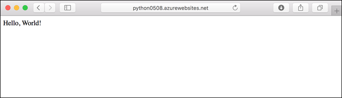
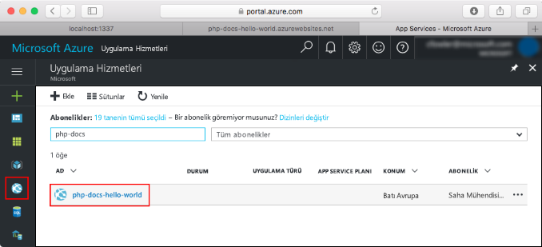
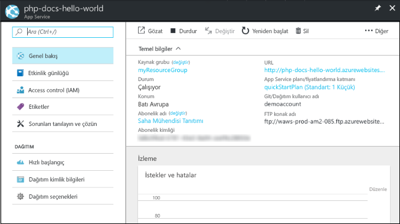

# <a name="create-a-python-app-in-azure-app-service-on-linux"></a>Linux üzerinde Azure App Service'te bir Python uygulaması oluşturma

Bu hızlı başlangıçta basit bir Python uygulaması dağıtma [Linux üzerinde App Service'te](app-service-linux-intro.md), yüksek oranda ölçeklenebilen, kendi kendine düzeltme eki uygulayan web barındırma hizmeti sağlar. Azure komut satırı arabirimini kullanın ( [Azure CLI](/cli/azure/install-azure-cli)), izleyebilmeniz etkileşimli, tarayıcı tabanlı Azure Cloud Shell üzerinden, Mac, Linux veya Windows bilgisayarı adımları kullanın.



## <a name="prerequisites"></a>Önkoşullar

Bu hızlı başlangıcı tamamlamak için:

* <a href="https://www.python.org/downloads/" target="_blank">Python 3.7 sürümünü yükleme</a>
* <a href="https://git-scm.com/" target="_blank">Git'i yükleyin</a>
* Azure aboneliği. Zaten yoksa, oluşturun bir [ücretsiz bir hesap](https://azure.microsoft.com/free/?ref=microsoft.com&utm_source=microsoft.com&utm_medium=docs&utm_campaign=visualstudio) başlamadan önce.

## <a name="download-the-sample-locally"></a>Örnekleri yerel makineye indirme

Bir terminal penceresinde, örnek uygulamayı yerel makinenize kopyalamak ve örnek kodun bulunduğu dizine gitmek için aşağıdaki komutları çalıştırın.

```bash
git clone https://github.com/Azure-Samples/python-docs-hello-world
cd python-docs-hello-world
```

Depo içeren bir *application.py*, deponun bir Flask uygulamasını içeren App Service söyleyen. Daha fazla bilgi için [kapsayıcı başlatma işlemi ve özelleştirmeleri](how-to-configure-python.md).

## <a name="run-the-app-locally"></a>Uygulamayı yerel olarak çalıştırma

Azure'a dağıttığınızda nasıl görüneceğini görmek için uygulamayı yerel olarak çalıştırın. Gerekli bağımlılık dosyalarını yüklemek ve yerleşik geliştirme sunucusunu başlatmak için bir terminal penceresi açın ve aşağıdaki komutları kullanın. 

```bash
# In Bash
python3 -m venv venv
source venv/bin/activate
pip install -r requirements.txt
FLASK_APP=application.py flask run

# In PowerShell
py -3 -m venv env
env\scripts\activate
pip install -r requirements.txt
Set-Item Env:FLASK_APP ".\application.py"
flask run
```

Bir web tarayıcısı açın ve `http://localhost:5000/` konumundaki örnek uygulamaya gidin.

Sayfada gösterilen örnek uygulamada **Merhaba Dünya!** iletisini görürsünüz.


Terminal pencerenizde **Ctrl+C** tuşlarına basarak web sunucusundan çıkın.

[!INCLUDE [cloud-shell-try-it.md](../../../includes/cloud-shell-try-it.md)]

## <a name="download-the-sample"></a>Örneği indirme

Cloud Shell'de bir quickstart dizini oluşturun ve o dizine geçin.

```bash
mkdir quickstart

cd quickstart
```

Ardından, örnek uygulama deposunu quickstart dizininize kopyalamak için aşağıdaki komutu çalıştırın.

```bash
git clone https://github.com/Azure-Samples/python-docs-hello-world
```

Çalıştırıldığında, aşağıdaki örneğe benzer bilgiler görüntüler:

```bash
Cloning into 'python-docs-hello-world'...
remote: Enumerating objects: 43, done.
remote: Total 43 (delta 0), reused 0 (delta 0), pack-reused 43
Unpacking objects: 100% (43/43), done.
Checking connectivity... done.
```

## <a name="create-a-web-app"></a>Web uygulaması oluşturma

Örnek kodu içeren dizine geçin ve `az webapp up` komutunu çalıştırın.

Aşağıdaki örnekte, değiştirin `<app-name>` benzersiz bir uygulama adına sahip.

```bash
cd python-docs-hello-world

az webapp up -n <app-name>
```

Bu komutun çalıştırılması birkaç dakika sürebilir. Çalıştırıldığında, aşağıdaki örneğe benzer bilgiler görüntüler:

```json
The behavior of this command has been altered by the following extension: webapp
Creating Resource group 'appsvc_rg_Linux_CentralUS' ...
Resource group creation complete
Creating App service plan 'appsvc_asp_Linux_CentralUS' ...
App service plan creation complete
Creating app '<app-name>' ....
Webapp creation complete
Creating zip with contents of dir /home/username/quickstart/python-docs-hello-world ...
Preparing to deploy contents to app.
All done.
{
  "app_url": "https:/<app-name>.azurewebsites.net",
  "location": "Central US",
  "name": "<app-name>",
  "os": "Linux",
  "resourcegroup": "appsvc_rg_Linux_CentralUS ",
  "serverfarm": "appsvc_asp_Linux_CentralUS",
  "sku": "BASIC",
  "src_path": "/home/username/quickstart/python-docs-hello-world ",
  "version_detected": "-",
  "version_to_create": "python|3.7"
}
```

[!INCLUDE [AZ Webapp Up Note](../../../includes/app-service-web-az-webapp-up-note.md)]

## <a name="browse-to-the-app"></a>Uygulamaya göz atma

Web tarayıcınızı kullanarak, dağıtılan uygulamanın konumuna gidin.

```bash
http://<app-name>.azurewebsites.net
```

Python örnek kodu, bir yerleşik görüntü ile Linux üzerinde App Service'te çalışıyor.


**Tebrikler!** Linux üzerinde App Service'e ilk Python uygulamanızı dağıttınız.

## <a name="update-locally-and-redeploy-the-code"></a>Kodu yerel makinede güncelleştirme ve yeniden dağıtma

Cloud Shell'de yazın `code application.py` Cloud Shell düzenleyiciyi açın.


 `return` çağrısında metinde küçük bir değişiklik yapın:

```python
return "Hello Azure!"
```

Yaptığınız değişiklikleri kaydedin ve düzenleyiciden çıkın. Kaydetmek için `^S` ve çıkmak için `^Q` komutunu kullanın.

Uygulamayı kullanarak yeniden [ `az webapp up` ](/cli/azure/ext/webapp/webapp?view=azure-cli-latest.md#ext-webapp-az-webapp-up) komutu. Uygulamanız için adı yerine `<app-name>`ve için bir konum belirtin `<location-name>` (öğesinden gösterilen değerleri kullanarak [ `az account list-locations` ](/cli/azure/appservice?view=azure-cli-latest.md#az-appservice-list-locations) komutu).

```bash
az webapp up -n <app-name> -l <location-name>
```

Dağıtım tamamlandıktan sonra **Uygulamaya göz atma** adımında açılan tarayıcı penceresine dönüp sayfayı yenileyin.


## <a name="manage-your-new-azure-app"></a>Yeni Azure uygulamanızı yönetme

Git <a href="https://portal.azure.com" target="_blank">Azure portalında</a> oluşturduğunuz uygulamayı yönetmek için.

Sol menüden **uygulama hizmetleri**ve ardından Azure uygulamanızın adına tıklayın.



Uygulamanızın genel bakış sayfasını görürsünüz. Buradan göz atma, durdurma, başlatma, yeniden başlatma ve silme gibi temel yönetim görevlerini gerçekleştirebilirsiniz.



Soldaki menü, uygulamanızı yapılandırmak için farklı sayfalar sağlar. 

[!INCLUDE [cli-samples-clean-up](../../../includes/cli-samples-clean-up.md)]

## <a name="next-steps"></a>Sonraki adımlar

> [!div class="nextstepaction"]
> [Öğretici: PostgreSQL ile Python uygulaması](tutorial-python-postgresql-app.md)

> [!div class="nextstepaction"]
> [Python uygulamasını yapılandırma](how-to-configure-python.md)

> [!div class="nextstepaction"]
> [Öğretici: Python uygulaması özel kapsayıcısında çalıştırma](tutorial-custom-docker-image.md)
