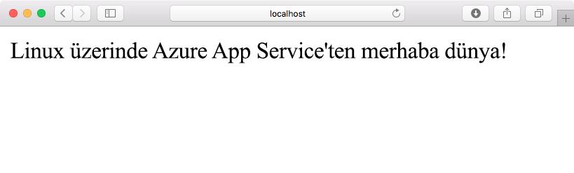
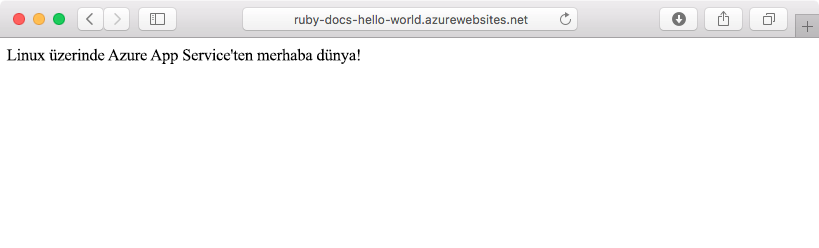
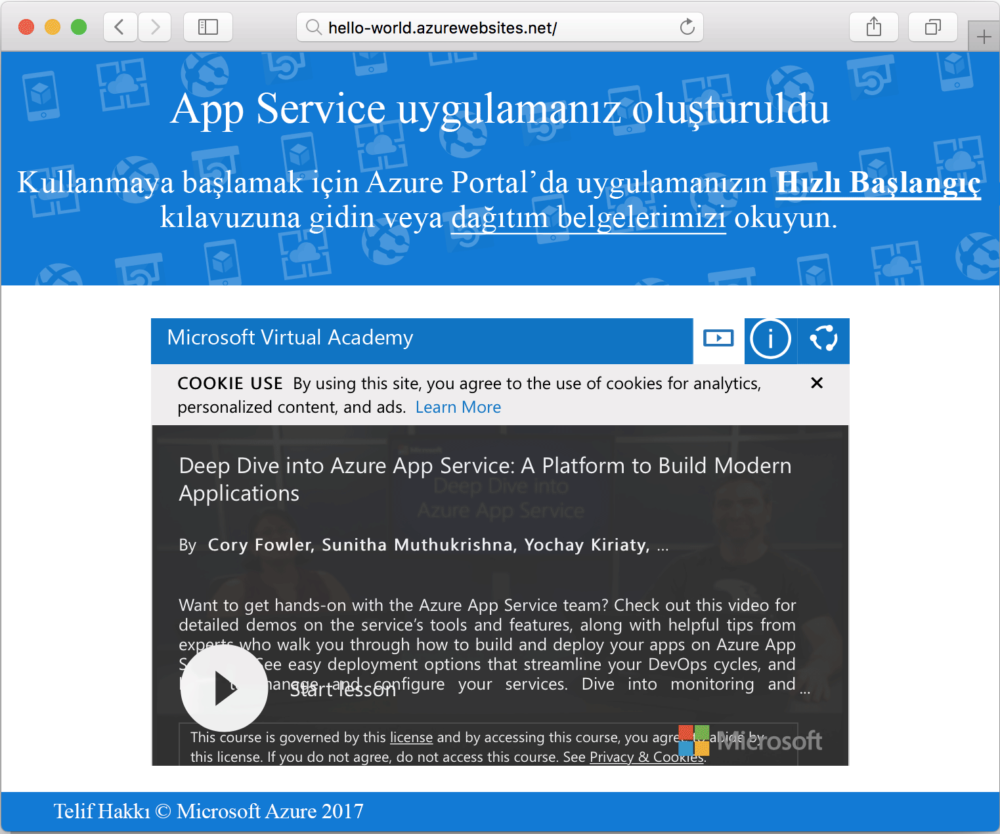

# <a name="create-a-ruby-on-rails-app-in-app-service-on-linux"></a>Linux üzerinde App Service'te Ruby on Rails uygulaması oluşturma

[Linux’ta Azure App Service](app-service-linux-intro.md) yüksek oranda ölçeklenebilen, kendi kendine düzeltme eki uygulayan bir web barındırma hizmeti sunar. Bu hızlı başlangıçta, basit bir [Ruby on Rails](https://rubyonrails.org/) uygulaması oluşturup Linux’ta bir Web App olarak Azure’a nasıl dağıtabileceğiniz açıklanır.

> [!NOTE]
> Ruby geliştirme yığını şu anda yalnızca Ruby on Rails'i desteklemektedir. Sinatra gibi farklı bir platform kullanmak istiyorsanız veya kullanmak istiyorsanız bir [desteklenmeyen Ruby sürümü](app-service-linux-intro.md), yapmanız [özel bir kapsayıcıda çalıştırmak](quickstart-docker-go.md).



[!INCLUDE [quickstarts-free-trial-note](../../../includes/quickstarts-free-trial-note.md)]

## <a name="prerequisites"></a>Önkoşullar

* <a href="https://www.ruby-lang.org/en/documentation/installation/#rubyinstaller" target="_blank">Ruby 2.3 veya üzerini yükleyin</a>
* <a href="https://git-scm.com/" target="_blank">Git'i yükleyin</a>

## <a name="download-the-sample"></a>Örneği indirme

Bir terminal penceresinde, örnek uygulama deposunu yerel makinenize kopyalamak için aşağıdaki komutu çalıştırın:

```bash
git clone https://github.com/Azure-Samples/ruby-docs-hello-world
```

## <a name="run-the-application-locally"></a>Uygulamayı yerel olarak çalıştırma

Azure'a dağıttığınızda nasıl görüneceğini görmek için uygulamayı yerel olarak çalıştırın. Bir terminal penceresi açın, `hello-world` dizinine geçiş yapın ve sunucuyu başlatmak için `rails server` komutunu kullanın.

İlk adım, gerekli gem'leri yüklemektir. Örneğe bir `Gemfile` dahil edildiğinden yüklenecek gem'leri belirtmeniz gerekmez. Bunun için bundler'ı kullanacağız:

```bash
bundle install
```

Gem'ler yüklendikten sonra uygulamayı başlatmak için bundler'ı kullanacağız:

```bash
bundle exec rails server
```

Web tarayıcınızı kullanarak uygulamayı yerel olarak test etmek için `http://localhost:3000` yoluna gidin.



[!INCLUDE [Try Cloud Shell](../../../includes/cloud-shell-try-it.md)]

[!INCLUDE [Configure deployment user](../../../includes/configure-deployment-user.md)]

[!INCLUDE [Create resource group](../../../includes/app-service-web-create-resource-group-linux.md)]

[!INCLUDE [Create app service plan](../../../includes/app-service-web-create-app-service-plan-linux.md)]

## <a name="create-a-web-app"></a>Web uygulaması oluşturma

[!INCLUDE [Create web app](../../../includes/app-service-web-create-web-app-ruby-linux-no-h.md)] 

Yerleşik görüntü ile yeni oluşturduğunuz web uygulamasını görmek için siteye göz atın. _&lt;app name>_ değerini kendi web uygulamanızın adıyla değiştirin.

```bash
http://<app_name>.azurewebsites.net
```

Yeni web uygulamanız aşağıdaki gibi görünmelidir:



## <a name="deploy-your-application"></a>Uygulamanızı dağıtma

Yerel uygulamayı Azure web sitenize dağıtmak için aşağıdaki komutları çalıştırın:

```bash
git remote add azure <Git deployment URL from above>
git add -A
git commit -m "Initial deployment commit"
git push azure master
```

Uzaktan dağıtım işlemlerinin başarılı olarak bildirildiğini doğrulayın. Komutlar aşağıdaki metne benzer bir çıktı oluşturur:

```bash
remote: Using sass-rails 5.0.6
remote: Updating files in vendor/cache
remote: Bundle gems are installed into ./vendor/bundle
remote: Updating files in vendor/cache
remote: ~site/repository
remote: Finished successfully.
remote: Running post deployment command(s)...
remote: Deployment successful.
To https://<your web app name>.scm.azurewebsites.net/<your web app name>.git
  579ccb....2ca5f31  master -> master
myuser@ubuntu1234:~workspace/<app name>$
```

Dağıtım tamamlandığında, dağıtımın etkili olması için burada gösterildiği gibi [`az webapp restart`](/cli/azure/webapp?view=azure-cli-latest#az-webapp-restart) komutunu kullanarak web uygulamanızı yeniden başlatın:

```azurecli-interactive
az webapp restart --name <app name> --resource-group myResourceGroup
```

Sitenize gidin ve sonuçları doğrulayın.

```bash
http://<app name>.azurewebsites.net
```


> [!NOTE]
> Uygulama yeniden başlatıldığı sırada siteye göz atmaya çalışılması, `Error 503 Server unavailable` şeklinde bir HTTP durum koduna yol açar. Tamamen yeniden başlatılması birkaç dakika sürebilir.
>

[!INCLUDE [Clean-up section](../../../includes/cli-script-clean-up.md)]

## <a name="next-steps"></a>Sonraki adımlar

> [!div class="nextstepaction"]
> [Öğretici: Postgres ile Ruby on Rails](tutorial-ruby-postgres-app.md)

> [!div class="nextstepaction"]
> [Ruby uygulamasını yapılandırma](configure-language-ruby.md)
