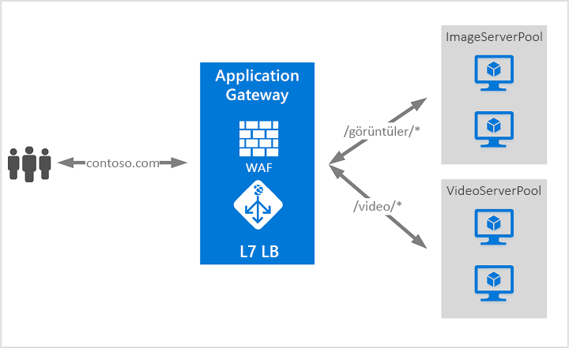

# Azure Application Gateway nedir?

Azure Application Gateway, web uygulamalarınıza trafiği yönetmenizi sağlayan bir web trafiği yük dengeleyicisidir. Geleneksel yük dengeleyiciler aktarım katmanında (OSI katman 4 - TCP ve UDP) çalışır ve trafiği kaynak IP adresi ve bağlantı noktasına göre hedef bir IP adresi ve bağlantı noktasına yönlendirir.

Application Gateway ile ek öznitelikleri URI yolu veya ana bilgisayar üst bilgileri gibi bir HTTP isteğini temel alan yönlendirme kararlarını yapabilirsiniz. Örneğin, gelen URL’yi temel alarak trafiği yönlendirebilirsiniz. Yani `/images` gelen URL’deyse, trafiği görüntüler için yapılandırılmış belirli bir sunucu kümesine (havuz olarak da bilinir) yönlendirebilirsiniz. Varsa `/video` olan URL'nin bu trafiğin videolar için en iyi duruma getirilmiş başka bir havuz yönlendirilir.

Bu yönlendirme türü, uygulama katmanı (OSI katman 7) yük dengelemesi olarak bilinir. Azure Application Gateway, URL tabanlı yönlendirmeyi ve daha fazlasını yapabilir.

Azure Application Gateway aşağıdaki özellikleri içerir:

## Güvenli Yuva Katmanı (SSL) sonlandırma

Application Gateway, ağ geçidinde SSL sonlandırmasını destekler. Bu sonlandırmanın ardından, trafik genelde arka uç sunucularına şifrelenmemiş olarak akar. Bu özellik, web sunucularının maliyetli şifreleme ve şifre çözme ek yükünden kurtulmasını sağlar. Ancak bazen şifrelenmemiş iletişimin sunucularına kabul edilebilir bir seçenek değildir. Bu güvenlik gereksinimleri, uyumluluk gereksinimleri nedeniyle olabilir veya uygulamanın yalnızca güvenli bağlantı kabul etmesi olabilir. Bu uygulamalar için application gateway uçtan uca SSL şifrelemesini destekler.

## Otomatik ölçeklendirme

Uygulama ağ geçidi veya WAF dağıtımları Standard_v2 veya WAF_v2 SKU altında otomatik ölçeklendirmeyi destekler ve ölçeğini artırabilir veya trafik yük düzenleri değişen aşağı dayalı. Otomatik ölçeklendirme ayrıca sağlama sırasında dağıtım boyutu veya örnek sayısı seçme gereksinimini de ortadan kaldırır. Application Gateway standard_v2 ve WAF_v2 özellikler hakkında daha fazla bilgi için bkz. [otomatik ölçeklendirme v2 SKU](application-gateway-autoscaling-zone-redundant.md).

## Bölge artıklığı

Birden çok daha iyi hataya dayanıklılık sunar ve her bölge içinde ayrı bir Application Gateway'ler sağlamaya gerek kaldırma kullanılabilirlik, bir uygulama ağ geçidi veya WAF dağıtımları Standard_v2 veya WAF_v2 SKU altında yayılabilir.

## Statik VIP

Application gateway VIP Standard_v2 veya WAF_v2 SKU üzerinde statik VIP türü özel olarak destekler. Bu, uygulama ağ geçidiyle ilişkili VIP bile uygulama ağ geçidi yaşam süresi boyunca değişmez sağlar.

## Web uygulaması güvenlik duvarı

Web uygulaması güvenlik duvarı (WAF), web uygulamalarınızda açıklardan yararlanmaya ve güvenlik açıklarına karşı merkezi koruma sağlayan bir Application Gateway özelliğidir. WAF bu işlemi [OWASP (Açık Web Uygulaması Güvenlik Projesi) çekirdek kural kümeleri](https://www.owasp.org/index.php/Category:OWASP_ModSecurity_Core_Rule_Set_Project) 3.0 veya 2.2.9’daki kurallara göre yapar. 

Web uygulamaları, bilinen yaygın güvenlik açıklarından yararlanan kötü amaçlı saldırıların giderek daha fazla hedefi olmaktadır. Bu açıklardan yararlanma örnekleri arasında SQL ekleme saldırıları, siteler arası komut dosyası saldırıları yaygındır. Uygulama kodunda bu tür saldırıların önlenmesi zor olabilir ve uygulama topolojisinin birçok katmanında ayrıntılı bakım, düzeltme eki uygulama ve izleme işlemleri gerektirebilir. Merkezi bir web uygulaması güvenlik duvarı, güvenlik yönetimini çok daha kolay hale getirir ve yetkisiz erişim ya da izinsiz giriş tehditlerine karşı uygulama yöneticilerine daha iyi güvence verir. Bir WAF çözümü, bilinen bir güvenlik açığına merkezi bir konumda düzeltme eki uygulayarak güvenlik tehdidine karşı, web uygulamalarının her birinin güvenliğini sağlamaya göre daha hızlı tepki verebilir. Var olan uygulama ağ geçitleri, web uygulaması güvenlik duvarı bulunan bir uygulama ağ geçidine kolaylıkla dönüştürülebilir.

Daha fazla bilgi için [Application Gateway içindeki Web uygulaması Güvenlik Duvarı (WAF)](https://docs.microsoft.com/azure/application-gateway/waf-overview)).

## URL tabanlı yönlendirme

URL Yolu Tabanlı Yönlendirme, trafiği isteğin URL Yollarına göre arka uç sunucu havuzlarına yönlendirmenizi sağlar. Senaryolardan biri, farklı içerik türleri için istekleri farklı havuzlara yönlendirmektir.

Örneğin, `http://contoso.com/video/*` için istekler VideoServerPool’a ve `http://contoso.com/images/*` için istekler ImageServerPool’a yönlendirilir. Yol desenlerinden hiçbiri eşleşmiyorsa DefaultServerPool seçilir.

Daha fazla bilgi için [Application Gateway ile URL tabanlı yönlendirme](https://docs.microsoft.com/azure/application-gateway/url-route-overview).

## Birden çok site barındırma

Birden çok site barındırma, aynı uygulama ağ geçidi örneğinde birden fazla web sitesi yapılandırmanızı sağlar. Bu özellik, bir uygulama ağ geçidine en fazla 100 web sitesi ekleyerek dağıtımlarınız için daha verimli bir topoloji yapılandırmanıza olanak tanır. Her web sitesi kendi havuzuna yönlendirilebilir. Örneğin, uygulama ağ geçidi ContosoServerPool ve FabrikamServerPool adlı iki sunucu havuzundan `contoso.com` ve `fabrikam.com` için trafik sunabilir.

`http://contoso.com` için istekler ContosoServerPool’a ve `http://fabrikam.com` için istekler FabrikamServerPool’a yönlendirilir.

Benzer şekilde, aynı üst etki alanının iki alt etki alanı, aynı uygulama ağ geçidi dağıtımında barındırılabilir. Alt etki alanı kullanım örnekleri, tek bir uygulama ağ geçidi dağıtımında barındırılan `http://blog.contoso.com` ve `http://app.contoso.com` öğelerini içerebilir.

Daha fazla bilgi için [uygulama ağ geçidi ile birden çok site barındırma](https://docs.microsoft.com/azure/application-gateway/multiple-site-overview).

## Yönlendirme

Birçok web uygulaması için yaygın bir senaryo, bir uygulama ile kullanıcıları arasındaki tüm iletişimin şifrelenmiş bir yol üzerinden yapıldığından emin olmak için otomatik HTTP’yi HTTPS’ye dönüştürme yeniden yönlendirmesini desteklemektir.

Geçmişte, HTTP, HTTPS için aldığı isteklerini yeniden yönlendirmek için tek amacı olan ayrılmış bir havuz oluşturma gibi teknikler kullanmış olabilirsiniz. Uygulama ağ geçidi, Application Gateway’de trafiği yeniden yönlendirme özelliğini destekler. Bu uygulama yapılandırmasını basitleştirir, kaynak kullanımını en iyi duruma getirir ve genel ve yol tabanlı yeniden yönlendirme dahil yeni yeniden yönlendirme senaryolarını destekler. Uygulama ağ geçidi yeniden yönlendirme desteği HTTP-HTTPS yeniden yönlendirmesi için tek başına sınırlı değildir. Bu, kuralları kullanarak tanımladığınız herhangi bir bağlantı noktasından ve bağlantı noktasına yeniden yönlendirebilmeniz için genel bir yeniden yönlendirme mekanizmasıdır. Ayrıca, bir dış siteye yönlendirmeyi de destekler.

Application Gateway yeniden yönlendirme desteği aşağıdaki özellikleri sunar:

- Ağ Geçidi üzerindeki bir bağlantı noktasından başka bir bağlantı noktasına genel yeniden yönlendirme. Bu özellik, bir sitede HTTP’den HTTPS’ye yeniden yönlendirmeyi sağlar.
- Yol tabanlı yönlendirme. Bu tür yeniden yönlendirmeler, HTTP’den HTTPS’ye yeniden yönlendirmeyi yalnızca belirli bir site alanında (örneğin `/cart/*` tarafından belirtilen bir alışveriş sepetinde) etkinleştirir.
- Dış siteye yeniden yönlendirme.

Daha fazla bilgi için [trafik yönlendirme](https://docs.microsoft.com/azure/application-gateway/redirect-overview) uygulama ağ geçidi ile.

## Oturum benzeşimi

Tanımlama bilgilerine dayalı oturum benzeşimi özelliği, bir kullanıcı oturumunu aynı sunucuda tutmak istediğinizde kullanışlıdır. Ağ geçidi ile yönetilen tanımlama bilgilerini kullanan Application Gateway, sonraki trafiği işleme amacıyla bir kullanıcı oturumundan aynı sunucuya yönlendirebilir. Bu, oturum durumunun bir kullanıcı oturumuna ait sunucuya yerel olarak kaydedildiği durumlarda önemlidir.

## Websocket ve HTTP/2 trafiği

Application Gateway, WebSocket ve HTTP/2 protokolleri için yerel destek sağlar. WebSocket desteğini isteğe bağlı olarak etkinleştirmek veya devre dışı bırakmak için kullanıcı tarafından yapılandırılabilen bir ayar yoktur.

WebSocket ve HTTP/2 protokolleri, uzun süre çalışan bir TCP bağlantısı üzerinden bir sunucu ile bir istemci arasında tam çift yönlü iletişimi etkinleştirir. Bu, web sunucusu ile istemci arasında HTTP tabanlı uygulamalarda gerektiği gibi yoklama olmadan çift yönlü olabilen daha etkileşimli bir iletişime olanak sağlar. Bu protokollerin düşük ek yükü, HTTP, sahip ve birden çok istek/yanıt daha verimli bir kaynak kullanımı kaynaklanan aynı TCP bağlantısını yeniden kullanabilirsiniz. Bu protokoller, geleneksel HTTP bağlantı noktaları 80 ve 443 üzerinden çalışmak üzere tasarlanmıştır.

Daha fazla bilgi için [WebSocket desteği](https://docs.microsoft.com/azure/application-gateway/application-gateway-websocket) ve [HTTP/2 desteği](https://docs.microsoft.com/azure/application-gateway/configuration-overview#http2-support).

## Azure Kubernetes Service (AKS) giriş denetleyicisi önizlemesi 

Application Gateway giriş denetleyicisi, AKS kümesi içinde bir pod olarak çalışır ve Application Gateway'in AKS kümesi için giriş görevi yapmasını sağlar. Bu, yalnızca uygulama ağ geçidi v2 ile desteklenir.

Daha fazla bilgi için bkz. [Azure Application Gateway Giriş Denetleyicisi](https://azure.github.io/application-gateway-kubernetes-ingress/).

## Bağlantı boşaltma

Bağlantı boşaltma, planlı hizmet güncelleştirmeleri sırasında arka uç havuzu üyelerinin normal bir şekilde kapatılmasına yardımcı olur. Bu ayar bir arka uç http ayarıyla etkinleştirilir ve kural oluşturma sırasında bir arka uç havuzunun tüm üyelerine uygulanabilir. Etkinleştirildikten sonra Application Gateway, arka uç havuzuna serbest kayıt tüm örneklerini yeni bir istek yapılandırılmış bir süre sınırı içinde tamamlamak mevcut isteklerini verirken almazsınız sağlar. Bu arka uç havuzundan bir API çağrısı tarafından açıkça kaldırılan arka uç örnekleriyle hem sistem durumu araştırmaları tarafından belirlenen şekilde sağlıklı olarak raporlanan arka uç örnekleriyle geçerlidir.

## Özel hata sayfaları

Application Gateway, varsayılan hata sayfalarını göstermek yerine özel hata sayfaları oluşturmanızı sağlar. Özel hata sayfası sayesinde kendi logonuzu ve sayfa düzeninizi kullanabilirsiniz.

Daha fazla bilgi için [yeniden HTTP üstbilgileri](rewrite-http-headers.md).

## HTTP üst bilgilerini yeniden üretme

HTTP üstbilgileri istemci ve sunucu istek veya yanıt ek bilgilerle geçmesine izin verin. Bu HTTP üstbilgileri yeniden yazma gibi birçok önemli senaryoyu gerçekleştirmenize yardımcı olur:

- Güvenlikle ilgili üstbilgi alanlarını HSTS gibi / X XSS koruma ekleniyor.
- Hassas bilgilerin ortaya koyabilir yanıt üstbilgi alanlarını kaldırılıyor.
- X-iletilen-için üst bağlantı noktası bilgilerini arındırılıyor.

Uygulama ağ geçidi eklemek, kaldırmak veya HTTP istek ve yanıt üstbilgileri, istek ve yanıt paketleri istemci ve arka uç havuzları arasında taşırken güncelleştirme yeteneğini destekler. Ayrıca, belirtilen üst bilgiler, yalnızca belirli koşullar karşılandığında yazılır emin olmak için koşulları ekleme olanağı sağlar.

Daha fazla bilgi için [yeniden HTTP üstbilgileri](rewrite-http-headers.md).

## Boyutlandırma

Uygulama ağ geçidi Standard_v2 ve WAF_v2 SKU otomatik ölçeklendirme için yapılandırılmış veya boyutu dağıtımları sabit. Bu SKU'lar farklı örnek boyutları sunmamaktadır.

Uygulama ağ geçidi standart ve WAF SKU anda üç büyüklükte sunulmaktadır: **Küçük**, **orta**, ve **büyük**. Küçük örnek boyutları, geliştirme ve test senaryolarına yöneliktir.

Application Gateway limitlerinin tam listesi için bkz. [Application Gateway hizmet limitleri](../azure-subscription-service-limits.md?toc=%2fazure%2fapplication-gateway%2ftoc.json#application-gateway-limits).

Aşağıdaki tabloda, SSL boşaltmasının etkin olduğu her bir Application Gateway örneği için ortalama performans aktarım hızı gösterilmiştir:

| Ortalama arka uç sayfa yanıtı boyutu | Küçük | Orta | Büyük |
| --- | --- | --- | --- |
| 6 KB |7,5 Mbps |13 Mbps |50 Mbps |
| 100 KB |35 Mbps |100 Mbps |200 Mbps |

> [!NOTE]
> Bu değerler bir uygulama ağ geçidi verimliliği için yaklaşık değerlerdir. Gerçek verimlilik; ortalama sayfa boyutu, arka uç örneklerinin konumu ve bir sayfaya hizmet etmek için işleme süresi gibi çeşitli ortam ayrıntılarına bağlıdır. Tam performans rakamlarına ulaşmak için kendi testlerinizi çalıştırmanız gerekir. Bu değerler yalnızca kapasite planlama konusunda yardımcı olmak için verilmiştir.

## Sonraki adımlar

Gereksinimleriniz ve ortamınıza bağlı olarak, Azure portalı, Azure PowerShell veya Azure CLI kullanarak bir test Application Gateway oluşturabilirsiniz:

- [Hızlı Başlangıç: Azure Application Gateway - Azure portalı ile doğrudan web trafiği](quick-create-portal.md)
- [Hızlı Başlangıç: Azure Application Gateway - Azure PowerShell ile doğrudan web trafiği](quick-create-powershell.md)
- [Hızlı Başlangıç: Azure Application Gateway - Azure CLI ile doğrudan web trafiği](quick-create-cli.md)