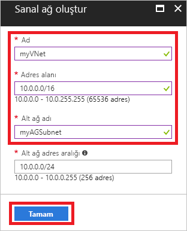
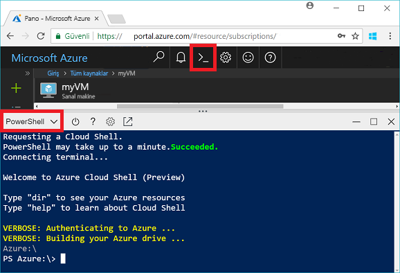
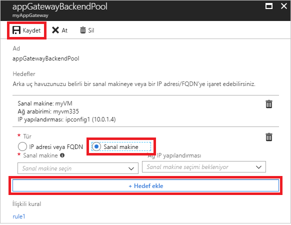
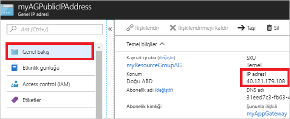

# <a name="quickstart-direct-web-traffic-with-azure-application-gateway---azure-portal"></a>Hızlı Başlangıç: Azure Application Gateway ile web trafiğini yönlendirme - Azure portalı

Azure Application Gateway ile bağlantı noktalarına dinleyiciler atayarak ve arka uç havuzuna kaynaklar ekleyerek uygulama web trafiğinizi belirli kaynaklara yönlendirebilirsiniz.

Bu hızlı başlangıç, arka uç havuzunda iki sanal makine bulunan bir uygulama ağ geçidini hızla oluşturmak üzere Azure portalını kullanmayı göstermektedir. Ardından doğru bir şekilde çalışıp çalışmadığından emin olmak için test edersiniz.

Azure aboneliğiniz yoksa başlamadan önce [ücretsiz bir hesap](https://azure.microsoft.com/free/?WT.mc_id=A261C142F) oluşturun.

## <a name="log-in-to-azure"></a>Azure'da oturum açma

[http://portal.azure.com](http://portal.azure.com) adresinden Azure portalında oturum açın

## <a name="create-an-application-gateway"></a>Uygulama ağ geçidi oluşturma

Diğer kaynaklarla iletişim kurmak için uygulama ağ geçidine yönelik bir sanal makine oluşturmanız gerekir. Uygulama ağ geçidini oluştururken aynı zamanda bir sanal makine oluşturabilirsiniz. Bu örnekte iki alt ağ oluşturulmuştur: biri uygulama ağ geçidi ve diğeri de sanal makineler içindir. 

1. Azure portalının sol üst köşesinde bulunan **Kaynak oluştur** öğesine tıklayın.
2. **Ağ** ve ardından Öne Çıkanlar listesinde **Application Gateway**’i seçin.
3. Uygulama ağ geçidi için şu değerleri girin:

    - *myAppGateway* - Uygulama ağ geçidinin adı.
    - *myResourceGroupAG* - Yeni kaynak grubu.

    

4. Diğer ayarların varsayılan değerlerini kabul edin ve sonra **Tamam**’a tıklayın.
5. **Sanal ağ seç** > **Yeni oluştur**’a tıklayın ve sonra sanal ağ için bu değerleri girin:

    - *myVNet* - Sanal ağın adı.
    - *10.0.0.0/16* - Sanal ağın adres alanı.
    - *myAGSubnet* - Alt ağın adı.
    - *10.0.0.0/24* - Alt ağın adres alanı.

    

6. Sanal ağı ve alt ağı oluşturmak için **Tamam**’a tıklayın.
6. **Genel IP adresi seçin** > **Yeni oluştur** öğesini seçin ve sonra genel IP adresinin adını girin. Bu örnekte genel IP adresinin adı *myAGPublicIPAddress* şeklindedir. Diğer ayarların varsayılan değerlerini kabul edin ve sonra **Tamam**’a tıklayın.
8. Dinleyici yapılandırması için varsayılan değerleri kabul edin, web uygulaması güvenlik duvarını devre dışı bırakın ve sonra **Tamam**’a tıklayın.
9. Özet sayfasında ayarları gözden geçirin ve sonra **Tamam**’a tıklayarak sanal ağı, genel IP adresini ve uygulama ağ geçidini oluşturun. Uygulama ağ geçidinin oluşturulması 30 dakikaya kadar sürebilir. Sonraki bölüme geçmeden önce dağıtımın başarıyla tamamlanmasını bekleyin.

### <a name="add-a-subnet"></a>Alt ağ ekleme

1. Sol taraftaki menüde **Tüm kaynaklar**’a ve sonra kaynaklar listesinden **myVNet** öğesine tıklayın.
2. **Alt Ağlar** > **Alt Ağ**’a tıklayın.

    

3. Alt ağ adı için *myBackendSubnet* girin ve sonra **Tamam**’a tıklayın.

## <a name="create-backend-servers"></a>Arka uç sunucular oluşturma

Bu örnekte, uygulama ağ geçidi için arka uç sunucular olarak kullanılacak iki sanal makine oluşturacaksınız. 

### <a name="create-a-virtual-machine"></a>Sanal makine oluşturma

1. **Yeni**’ye tıklayın.
2. **İşlem**’i ve sonra Öne Çıkanlar listesinde **Windows Server 2016 Datacenter**’ı seçin.
3. Sanal makine için şu değerleri girin:

    - *myVM* - Sanal makinenin adı.
    - Yönetici kullanıcı adı için *azureuser*.
    - *Azure123456!* Parola.
    - **Mevcut olanı kullan**’ı seçin ve *myResourceGroupAG* seçeneğini belirleyin.

4. **Tamam**’a tıklayın.
5. Sanal makinenin boyutu için **DS1_V2** seçeneğini belirleyin ve sonra **Seç**’e tıklayın.
6. Sanal ağ için **myVNet** öğesinin seçili olduğundan ve alt ağın **myBackendSubnet** olduğundan emin olun. 
7. Önyükleme tanılamalarını devre dışı bırakmak için **Devre Dışı** seçeneğine tıklayın.
8. **Tamam**’a tıklayın, özet sayfasındaki ayarları gözden geçirin ve sonra **Oluştur**’a tıklayın.

### <a name="install-iis"></a>IIS yükleme

Uygulama ağ geçidinin başarıyla oluşturulduğunu doğrulamak için sanal makinelere IIS yükleyin.

1. Etkileşimli kabuğu açın ve **PowerShell**’e ayarlandığından emin olun.

    

2. Sanal makineye IIS yüklemek için aşağıdaki komutu çalıştırın: 

    ```azurepowershell-interactive
    Set-AzureRmVMExtension `
      -ResourceGroupName myResourceGroupAG `
      -ExtensionName IIS `
      -VMName myVM `
      -Publisher Microsoft.Compute `
      -ExtensionType CustomScriptExtension `
      -TypeHandlerVersion 1.4 `
      -SettingString '{"commandToExecute":"powershell Add-WindowsFeature Web-Server; powershell Add-Content -Path \"C:\\inetpub\\wwwroot\\Default.htm\" -Value $($env:computername)"}' `
      -Location EastUS
    ```

3. İkinci bir sanal makine oluşturun ve yeni tamamladığınız adımları kullanarak IIS yükleyin. Ad olarak ve VMName için Set-AzureRmVMExtension komutuna *myVM2* girin.

### <a name="add-backend-servers"></a>Arka uç sunucuları ekleme

Sanal makineleri oluşturduktan sonra uygulama ağ geçidindeki arka uç havuzuna eklemeniz gerekir.

1. **Tüm kaynaklar** > **myAppGateway** öğesine tıklayın.
2. **Arka uç havuzları** öğesine tıklayın. Uygulama ağ geçidi ile varsayılan bir havuz otomatik olarak oluşturulur. **appGatewayBackendPool** öğesine tıklayın.
3. **Hedef ekle** > **Sanal makine**’ye tıklayın ve sonra *myVM*’yi seçin. **Hedef ekle** > **Sanal makine**’yi ve sonra *myVM2*’yi seçin.

    

4. **Kaydet**’e tıklayın.

## <a name="test-the-application-gateway"></a>Uygulama ağ geçidini test etme

Uygulama ağ geçidini oluşturmak için NGINX’in yüklenmesi gerekli değildir ancak IIS’i bu hızlı başlangıçta uygulama ağ geçidinin başarılı bir şekilde oluşturulup oluşturulmadığını doğrulamak için yüklediniz.

1. Genel Bakış ekranında uygulama ağ geçidi için genel IP adresini bulun. **Tüm kaynaklar** > **myAGPublicIPAddress** öğesine tıklayın.

    

2. Genel IP adresini kopyalayıp tarayıcınızın adres çubuğuna yapıştırın.

    

Tarayıcıyı yenilediğinizde diğer VM’nin adının göründüğünü görürsünüz.

## <a name="clean-up-resources"></a>Kaynakları temizleme

İlk olarak uygulama ağ geçidiyle oluşturulan kaynakları keşfedin ve ardından artık gerekmediğinde kaynak grubu, uygulama ağ geçidi ve tüm ilgili kaynakları silebilirsiniz. Bunu yapmak için, uygulama ağ geçidini içeren kaynak grubunu seçin ve **Sil**’e tıklayın.

## <a name="next-steps"></a>Sonraki adımlar

> [!div class="nextstepaction"]
> [Azure CLI kullanarak bir uygulama ağ geçidi ile web trafiğini yönetme](./tutorial-manage-web-traffic-cli.md)
