# DevOps için Application Insights genel bakış

İle [Application Insights](app-insights-overview.md), uygulamanızı nasıl gerçekleştiriyor hızlıca bulabilir ve canlı olduğunda kullanılıyor. Bir sorun varsa, bunu, etkisini değerlendirmenize yardımcı olur ve nedenini belirlemeye yardımcı hakkında bilmenizi sağlar.

Web uygulamaları geliştirir ekibinden bir hesap şöyledir:

* *"Birkaç gün önce bir 'ikincil' düzeltme dağıttığımız. Biz geniş test geçişi çalıştırılmadı, ancak bazı beklenmeyen değişiklik ön ve arka uç arasındaki uyumsuzluk neden yükü içine ne yazık ki birleştirilmiş. Hemen bizim uyarı surged sunucu özel durumlar harekete ve sizi durumdan haberdar. Birkaç tıklama Application Insights portalındaki hemen problemi daraltmak için özel durum callstacks gelen yeterli bilgi aldı. Biz geri hemen ve hasarı sınırlıdır. Application Insights yaptı döngüsü bu kısmı devops çok kolay ve işlem yapılabilir."*

Bu makalede bir ekipte çevrimiçi bankacılık sistem nasıl Application Insights hızla müşterilere yanıt ve güncelleştirme yapmak için kullandıkları görmek için (RÇY) geliştirir Fabrikam banka izleyin.  

Aşağıdaki çizimde gösterilen bir DevOps döngüde takım çalışır:

Gereksinimleri geliştirme biriktirme (görev listesi) akış. Bunlar genellikle çalışma - genellikle geliştirmeleri ve uzantıları var olan uygulamaya biçiminde yazılımlara sprint kısa çalışır. Dinamik uygulama sık sık yeni özelliklerle güncelleştirilmiştir. Canlı olsa da, takım performans ve kullanım Application Insights yardımıyla izler. Bu APM veri kendi geliştirme biriktirme akışları.

Takım, canlı web uygulaması için yakından izlemek için Application Insights kullanır:

* Performans. Nasıl yanıt süreleri olan istek sayısı değişir anlamak istedikleri; ne kadar CPU, ağ, disk ve diğer kaynakları kullanılıyor; hangi uygulama kodunun performansını yavaşlatabilecek; ve performans sorunlarını olduğu.
* Hataları. Özel durumlar varsa veya başarısız istekleri, veya bir performans sayacı kendi rahat aralığın dışında kalırsa, takım eylem yararlanabilirsiniz hızlı bir şekilde bilmesi gerekir.
* Kullanımı. Yeni bir özellik yayımlandığında, takım ne ölçüde kullanıldığı ve kullanıcıların bir güçlükle onunla olup olmadığına bilmek ister.

Şimdi döngüsü geri bildirim parçası odaklanır:

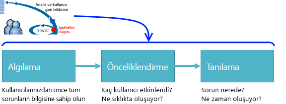

## Zayıf kullanılabilirlik Algıla
Marcela Markova RÇY ekipteki Kıdemli bir geliştiricinin ve çevrimiçi performansını izleme sağlama alır. Aynen birkaç ayarlar [kullanılabilirlik testleri](app-insights-monitor-web-app-availability.md):

* Uygulama için ana giriş sayfası için bir tek URL testi http://fabrikambank.com/onlinebanking/. Aynen 'Hoş Geldiniz!' HTTP kodu 200 ve metin ölçütüne göre ayarlar. Bu test başarısız olursa, ağ veya sunucular veya belki de bir dağıtım sorunu ciddi yanlış bir şey yoktur. (Veya birisi Hoş Geldiniz değiştirildi! ileti kendi bilinen izin vererek olmadan sayfasında.)
* Her oturum açtığında ve geçerli listeleme, birkaç önemli ayrıntıları her sayfada denetimi hesap alır daha derin çok adımlı bir test. Bu test hesapları veritabanı bağlantısını çalıştığını doğrular. Aynen kurgusal Müşteri Kimliği kullanır: test amaçları için birkaç tanesi tutulur.

Bu testler ayarlama, Marcela takım herhangi kesinti hakkında hızlı bir şekilde bilir emin olur.  

Web testi grafik kırmızı nokta olarak hataları görünecektir:

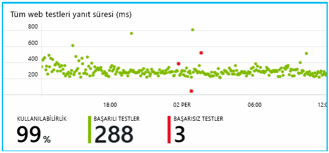

Ancak daha da önemlisi, herhangi bir hata hakkında uyarı Geliştirme ekibine e-posta ile. Bu şekilde, bunlar önce neredeyse tüm müşteriler bildirin.

## Performansı İzle
Application Insights genel bakış sayfasında çeşitli gösteren bir grafik olduğundan [anahtar ölçümleri](app-insights-web-monitor-performance.md).

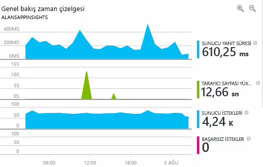

Tarayıcı sayfa yükleme süresi doğrudan web sayfalarından gönderilen telemetri türetilir. Sunucu yanıt süresi, sunucu istek sayısı ve başarısız istek sayısı tüm web sunucusunda ölçülen ve buradan Application Insights'a gönderilir.

Marcela ile sunucu yanıt grafiğini biraz ilgilenen ' dir. Bu grafik zaman sunucu kullanıcının tarayıcıdan bir HTTP isteğini alır ve yanıt döndüğünde arasında geçen ortalama süre gösterir. Sistemdeki yük değiştikçe bu grafikteki bir değişim görmek alışılmadık değil. Ancak bu durumda olduğu anlaşılıyor küçük miktarı artar isteklerinin ve büyük sayısı arasında bir bağıntı yanıt süresini miktarı artar olmalıdır. Yalnızca kendi sınırlarına işletim sistemi belirtebilir.

Aynen sunucuları grafikleri açar:

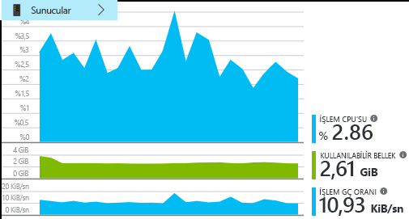

Veritabanıyla ilgili hiçbir belirtisi kaynak sınırlaması, böylece belki darbe sunucu yanıt grafiklerde yalnızca bir rastlantı olan olması.

## Hedeflerinizi karşılamak için Uyarıları Ayarla
Bununla birlikte, aynen yanıt sürelerini takip istiyor. Çok yüksek gidin, kendisi hakkında hemen bilmek ister.

Aynen ayarlar için bir [uyarı](app-insights-metrics-explorer.md), yanıt zamanları tipik bir eşik değerinden yüksek. Bu yanıt süreleri yavaşsa, kendisi hakkında anlarsınız kendi güven verir.

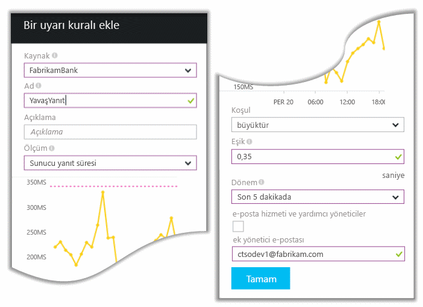

Uyarılar, çok çeşitli diğer ölçümleri üzerinde ayarlanabilir. Örneğin, özel durum sayısı yüksek olur ya da kullanılabilir bellek düşük gider veya istemci isteklerini bir en yüksek ise e-postaları alabilir.

## Akıllı algılama Uyarıları hakkında bilgi sahibi olmak
Ertesi gün, bir uyarı e-posta Application Insights ulaşır. Ancak kendisi açıldığında, aynen aynen ayarlamak yanıt süresi uyarı değil bulur. Bunun yerine, her başarısız isteklerin - diğer bir deyişle, 500 veya daha fazla hata kodları döndürmüş istekleri ani bir artışa olmamıştı söyler.

Kullanıcıları genellikle bir özel durum kodu aşağıdaki hata - burada gördünüz başarısız isteklerdir. "Üzgünüz ayrıntılarınızı şu an güncelleştiremedik." söyleyen bir ileti görürler olabilir Ya da kullanıcının ekranında, web sunucusu'nın bir yığın dökümü mutlak utanç en kötü görünür.

Bu uyarı bir beklenmedik biçimde çünkü aynen olduğundan, aranan en son ne zaman encouragingly düşük başarısız istek sayısı. Bir küçük hataları meşgul Server'da beklenen sayısıdır.

Ayrıca edildi beklenmedik biçimde her için biraz çünkü aynen bu uyarıyı yapılandırmak zorunda alamadık. Application Insights akıllı algılama içerir. Otomatik olarak, uygulamanızın normal hatası düzeni ve belirli bir sayfada ya da yüksek yük altında "için kullanılan" hataları için ayarlar veya diğer ölçümleri bağlı. Yalnızca bu beklediğiniz gelen yukarıda neden olduğunda uyarı başlatır.

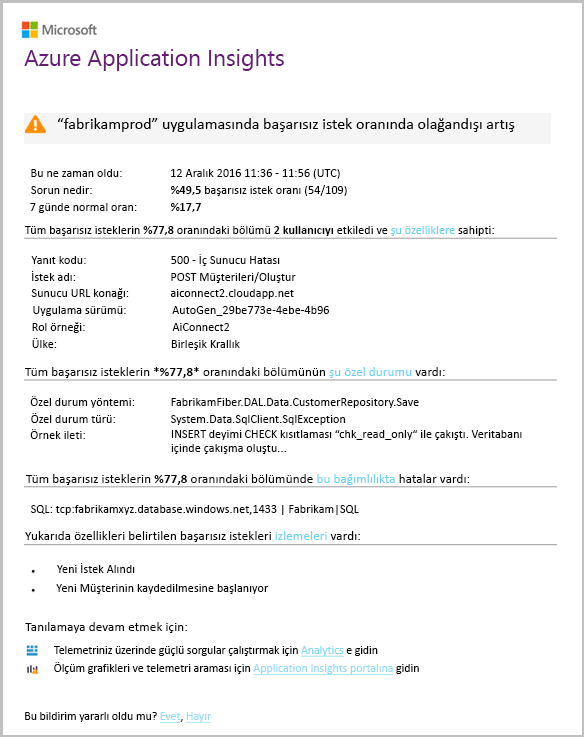

Bu çok kullanışlı bir e-postadır. Yalnızca bir alarm yükseltmek değil. Çok sayıda önceliklendirme ve tanılama iş çok yapar.

Etkilenen kaç müşteriler ve hangi web sayfaları veya işlemleri gösterir. Marcela olup bu yangın ayrıntıya çalışan tüm ekip almak ihtiyaç duyacağı veya olup haftaya kadar yoksayılabilir karar verebilirsiniz.

E-posta Ayrıca belirli bir özel durum oluştu ve daha ilginç - hatası belirli bir veritabanının başarısız çağrılar ile ilişkili olduğunu bile, - gösterir. Bu Marcela'nın takım yakın zamanda herhangi bir güncelleştirme dağıtılmamış olsa bile neden hata aniden görünen açıklanmaktadır.

Marcella bu e-postaya göre veritabanı takım lideri ping atar. Aynen son yarım saat içinde bir düzeltmenin yayımlanan öğrenir; ve hata, belki de bulunmamış olabilir ikincil şema değişikliği...

Bu nedenle, günlükleri araştırma önce bile ve bunu doğan 15 dakika içinde sabit yolu sorunu açıktır. Ancak, Marcela Application Insights açmak için bağlantıyı tıklatır. Düz başarısız bir istek açar ve kârlılığı bağımlılık çağrıları ilişkili listesinde çağrısı başarısız veritabanı görebilir.

## Özel durumlar Algıla
Kurulum, biraz ile [özel durumları](app-insights-asp-net-exceptions.md) Application Insights'a otomatik olarak raporlanır. Bunlar aynı zamanda açıkça çağrıları ekleyerek yakalanabilir [TrackException()](app-insights-api-custom-events-metrics.md#trackexception) koda:  

    var telemetry = new TelemetryClient();
    ...
    try
    { ...
    }
    catch (Exception ex)
    {
       // Set up some properties:
       var properties = new Dictionary <string, string>
         {{"Game", currentGame.Name}};

       var measurements = new Dictionary <string, double>
         {{"Users", currentGame.Users.Count}};

       // Send the exception telemetry:
       telemetry.TrackException(ex, properties, measurements);
    }

Belirgin bir kurtarma olmadıkça Fabrikam banka takım uygulama olarak her zaman bir özel durum telemetri göndermesini gelişmiştir.  

Aslında, bunların daha da geniş stratejidir: Burada müşteri, bir özel durum kodu veya karşılık gelir olup olmadığını ne yapmak istedikleri engellenen her durumda telemetri gönderdikleri. Dış arası banka aktarım sistemi işletimsel bir nedenden dolayı (hata müşterinin) "Bu işlem tamamlanamıyor" iletisi döndürürse, örneğin, sonra bunlar bu olay izleme.

    var successCode = AttemptTransfer(transferAmount, ...);
    if (successCode < 0)
    {
       var properties = new Dictionary <string, string>
            {{ "Code", returnCode, ... }};
       var measurements = new Dictionary <string, double>
         {{"Value", transferAmount}};
       telemetry.TrackEvent("transfer failed", properties, measurements);
    }

TrackException özel durum yığını kopyasını gönderdiğinden bildirmek için kullanılır. TrackEvent diğer olaylarını bildirmek için kullanılır. Tanılama aşamasında yararlı olabilecek herhangi bir özellik ekleyebilirsiniz.

Özel durumlar ve olayları gösterilmiyor [tanılama arama](app-insights-diagnostic-search.md) dikey. Bunlara ek özellikleri görmek ve izleme yığın için ayrıntıya inebilir.

## Proaktif izleme
Marcela, yalnızca uyarılar için beklerken kalmaya devam etmez. Yeniden her dağıtım hemen sonra aynen bir inceler [yanıt sürelerini](app-insights-web-monitor-performance.md) -genel şekil ve özel durum sayısı yanı sıra, en yavaş istekler tablosu.  

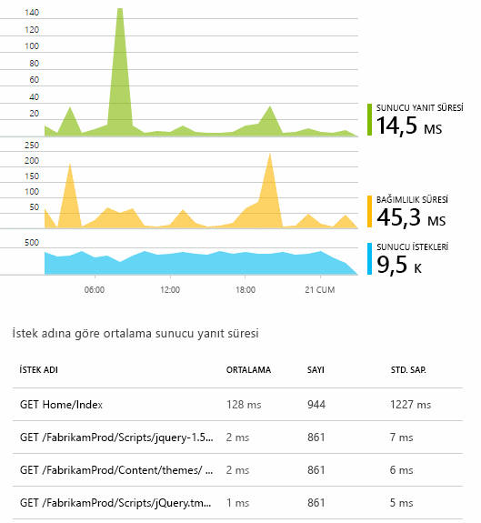

Genellikle her hafta son ile karşılaştırma aynen her dağıtım performans etkisini değerlendirebilirsiniz. Varsa ani worsening, kârlılığı, ilgili geliştiricilere başlatır.

## Önceliklendirme sorunları
-Bir sorun kapsamını ve önem derecesi değerlendiriliyor - önceliklendirme ilk adımı sonra algılamadır. Takım gece yarısı diyoruz? Veya sonraki uygun boşluğu biriktirme, kadar bırakılabilir? Değerlendirme içinde anahtar bazı sorular verilmiştir.

Ne sıklıkta gerçekleştiriliyor? Genel Bakış dikey penceresinde grafiklerde bazı perspektif bir soruna verin. Örneğin, Fabrikam uygulama bir gece dört web testi uyarılar oluşturulur. Hala çoğu testler yeşil oturuyormuş grafiği sabah baktığınızda, takım gerçekten bazı kırmızı nokta olduğunu görebilir. Kullanılabilirlik grafiğe ayrıntılara, tüm bu zaman zaman ortaya çıkan sorunları bir test konumdan olduğunu açıktı. Bu açıkça yalnızca bir rota etkileyen bir ağ sorunu oluştu ve büyük olasılıkla kendisini temizler.  

Bunun aksine, özel durum sayısı veya yanıt sürelerinin grafik çarpıcı ve kararlı bir artışa açıkça için hakkında Panik şeydir.

Yararlı önceliklendirme Taktik bunun deneyin, kendiniz ' dir. Aynı sorunla çalıştırırsanız, gerçek olduğunu bilirsiniz.

Kullanıcıların hangi kesir etkilendiğini? Bir kaba yanıt almak için hata oranı göre oturum sayısı bölün.

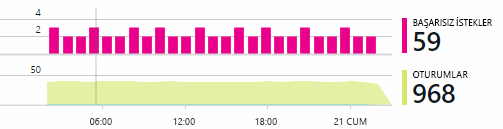

Yavaş yanıtlar olduğunda, her sayfanın kullanım sıklığı en yavaş yanıt istekleriyle tablosunun karşılaştırın.

Engellenen senaryo ne kadar önemli mi? Belirli bir kullanıcı hikayesinin engelleme işlevsel bir sorun varsa, çok önemli midir? Müşteriler, faturalar ödeme edilemez, bu ciddi olur; Ekran rengi tercihlerini değiştiremezsiniz, belki de bekleyebilir. Olay ya da özel durum ayrıntısı veya yavaş sayfa kimliğini müşteriler burada yaşıyorsanız söyler.

## Sorunları tanılama
Tanılama oldukça aynı hata ayıklama değil. Kod aracılığıyla İzleme başlamadan önce neden, kaba fikrini olmalıdır sorun nerede ve ne zaman oluştuğunu.

**Ne zaman böyle bir durum?** Olay ve ölçüm grafikleri tarafından sağlanan Geçmiş görünümünü efektleri ile olası nedenleri ilişkilendirmek kolaylaştırır. Yanıt süresi veya özel durum hızları aralıklı yükselme olup, istek sayısına ulaştığı arayın: aynı anda tarafı sonra kaynak sorunu gibi görünüyor. Daha fazla CPU veya bellek atamanız gerekiyor mu? Yoksa yük yönetemez bir bağımlılık mı?

**Bu bize?**  Olasılığı daha sonra - Örneğin, müşterinin hesap özetine istediği - isteğinin belirli bir türdeki performans ani açılan varsa, web uygulamanızın yerine bir dış alt olabilir. Ölçüm Gezgini bağımlılık süresi hızları ve bağımlılık hata oranı seçin ve son birkaç saat veya gün, algılanan soruna ile üzerinden kendi geçmişlerini karşılaştırın. Değişiklikler var. ilişkilendirerek, dış bir alt sistemi için blame olabilir.  

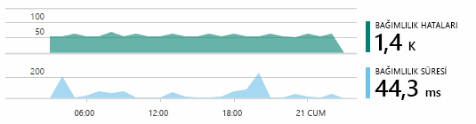

Coğrafi konuma sorunları bazı yavaş bağımlılık sorunlardır. Fabrikam banka Azure sanal makineleri kullanır ve bunlar yanlışlıkla hesap sunucusu ve web sunucusu farklı bir ülkede bulunan olduğunu buldu. Çarpıcı geliştirme geçirerek olana bunlardan biri.

**Biz ne?** Varsa sorun bağımlılık olarak görünmüyor ve her zaman vardır durumda değilse, büyük olasılıkla tarafından son zamanlarda bir değişiklik neden oldu. Ölçüm ve olay grafikleri tarafından sağlanan geçmiş perspektif ani değişiklikler dağıtımlar ile ilişkilendirmek kolaylaştırır. Bu sorun için arama aşağı daraltır. Uygulama kodundaki hangi satırların performansını yavaşlatabilecek belirlemek için uygulama Öngörüler profil oluşturucu etkinleştirin. Lütfen [profil oluşturma Canlı Azure web uygulamaları Application Insights ile](./app-insights-profiler.md). Profil Oluşturucu etkinleştirildikten sonra aşağıdakine benzer bir izleme görürsünüz. Bu örnekte, kolayca belirgin, yöntem *GetStorageTableData* sorunu neden oldu.  

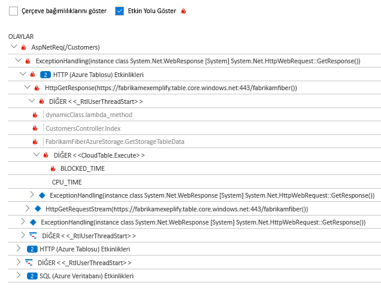

**Ne var ne yok?** Bazı sorunlar nadiren oluşur ve çevrimdışı test ederek izlemek zor olabilir. Tüm yapabiliriz etmektir Canlı oluştuğunda hata yakalamaya çalışın. Özel durum raporlarında yığın dökümleri inceleyebilirsiniz. Ayrıca, sık kullandığınız günlük ile veya TrackTrace() ya da TrackEvent() ile izleme çağrıları yazabilirsiniz.  

Fabrikam ile arası hesap aktarımları, ancak yalnızca hesap türleri için belirli zaman zaman ortaya çıkan bir sorun var. Neler daha iyi anlamak için hesap türünü bir özellik olarak her çağrı ekleme koddaki anahtar noktalarda TrackTrace() çağrıları eklenir. Yalnızca bu izlemeler tanılama arama filtrelemek kolay hale. Bunlar, ayrıca parametre değerlerini özellikleri ve ölçümleri izleme çağrıları iliştirilmiş.

## Bulunan sorunları yanıt
Sorunu tanı koydu sonra düzeltmek için bir plan yapabilirsiniz. Son zamanlarda bir değişiklik geri almanıza gerek olabilir, veya belki yalnızca devam edin ve düzeltin. Düzeltme yaptıktan sonra Application Insights başarılı olup olmadığını bildirir.  

Fabrikam Bank'ın geliştirme ekibi için bunlar kullanılan Application Insights kullanmadan önce daha fazla yapılandırılmış bir yaklaşım performans ölçümü için gerçekleştirin.

* Bunlar, Application Insights genel bakış sayfasında belirli ölçümleri açısından performans hedefleri ayarlayın.
* Bunlar performans ölçümleri 'funnels.' kullanıcı ilerlemeyi ölçmek ölçümleri gibi başlangıç uygulaması tasarlama  

## Kullanıcı etkinliğini izleme
Yanıt süresi sürekli olarak iyi ve birkaç özel durum olduğunda geliştirme ekibi için kullanılabilirlik taşıyabilirsiniz. Bunlar, kullanıcıların deneyimini iyileştirmek ve istenilen hedeflere ulaşmak için daha fazla kullanıcı teşvik eden hakkında düşünebilirsiniz.

Application Insights ile bir uygulama kullanıcıların ne öğrenmek için de kullanılabilir. Sorunsuz çalışmaya başladıktan sonra takım hangi özelliklerin en popüler olduğunu hangi kullanıcıların veya gibi zorluk ile ve ne sıklıkta geri dönmeden isterdiniz. Bunları yaklaşan işlerini önceliklendirmek yardımcı olur. Ve her bir özelliğin başarısını geliştirme döngüsü bir parçası olarak ölçmek planlayabilirsiniz.

Örneğin, tipik kullanıcı gezisine web sitesi aracılığıyla bir Temizle "Huni." sahip Birçok müşteri kredi farklı türlerde oranlarda arayın. Daha küçük bir sayı Git tırnak formu doldurun. Olanların bir teklif almak, birkaç bir tane kredisi alın.

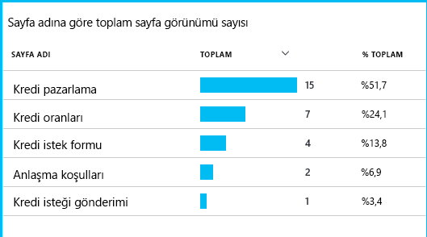

Müşteriler büyük sayıda burada bırakma dikkate alarak, iş daha fazla kullanıcı Huni altına alma kullanıma çalışabilir. Bazı durumlarda, bir kullanıcı deneyimi (UX) hatası olabilir - örneğin, 'İleri' düğmesine zor veya yönergeleri açık değil. Büyük olasılıkla, açılan aşımı ayarlarına daha önemli iş nedenleri vardır: Kredi oranları çok yüksek olabilir.

Bir nedeniyle ne olursa olsun, verileri kullanıcıların ne yaptıklarını iş takım yardımcı olur. Daha fazla izleme çağrıları ayrıntılı çalışmaya eklenebilir. TrackEvent() tüm kullanıcı eylemlerden, bireysel düğme tıklama ince ayrıntılarıyla devre dışı bir kredi ödeme gibi önemli başarılar için saymak için kullanılabilir.

Takım kullanıcı etkinliği hakkında bilgi zorunda kullanılan alma. Günümüzde, yeni bir özellik tasarım olduğunda, kullanım hakkında geri bildirim nasıl elde çalışırlar. Bunlar başlatma özelliğinden izleme çağrıları tasarlayın. Bu özellik her geliştirme döngüsü geliştirmek için geri bildirim kullanırlar.

[Kullanımı izleme hakkında daha fazla okuma](app-insights-usage-overview.md).

## DevOps döngüsü Uygula
Bu nedenle, bir takım Application Insights yalnızca tek tek sorunlarını gidermek için ancak kendi geliştirme yaşam döngüsü geliştirmek için kullanılır. I bunu nasıl Application Insights ile uygulama performans yönetimi, kendi uygulamalarında yardımcı olabileceği hakkında fikir edinmek verdiği umuyoruz.

## Video

> [!VIDEO https://channel9.msdn.com/events/Connect/2016/112/player]

## Sonraki adımlar
Uygulamanızın özelliklerine bağlı olarak çeşitli şekillerde başlayabiliriz. En iyi uyan seçin:

* [ASP.NET web uygulaması](app-insights-asp-net.md)
* [Java web uygulaması](app-insights-java-get-started.md)
* [Node.js web uygulaması](app-insights-nodejs.md)
* Üzerinde barındırılan uygulamalar, dağıtılmış [IIS](app-insights-monitor-web-app-availability.md), [J2EE](app-insights-java-live.md), veya [Azure](app-insights-azure.md).
* [Web sayfaları](app-insights-javascript.md) -tek sayfa uygulaması veya normal web sayfası - bu kendi başına veya kullanın ayrıca herhangi bir sunucu seçenekleri.
* [Kullanılabilirlik testleri](app-insights-monitor-web-app-availability.md) genel internet'ten uygulamanızı test etmek.
