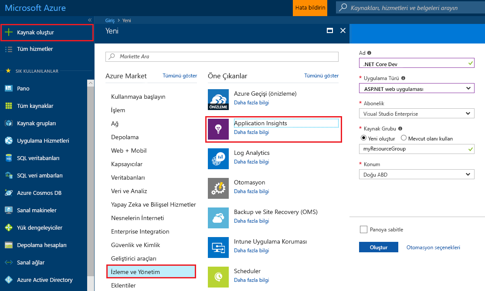
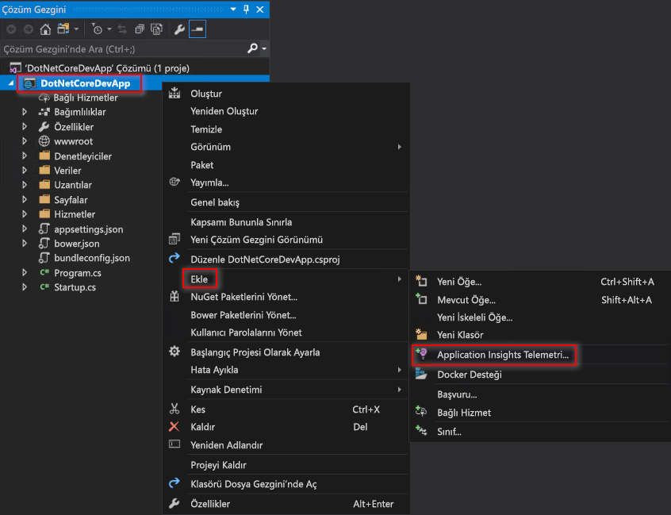
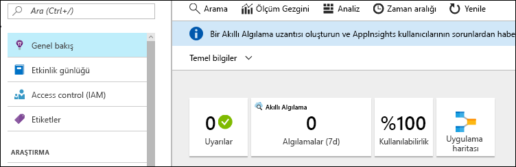
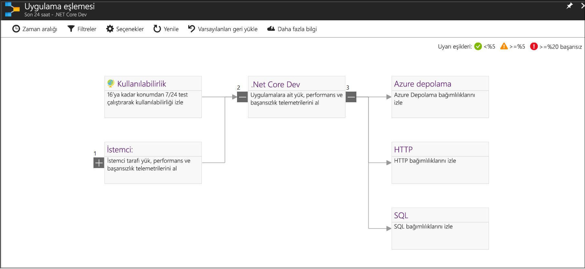
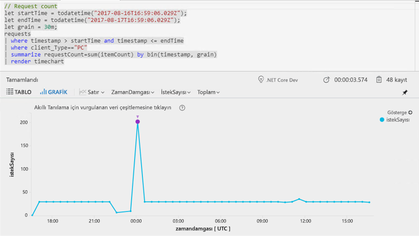
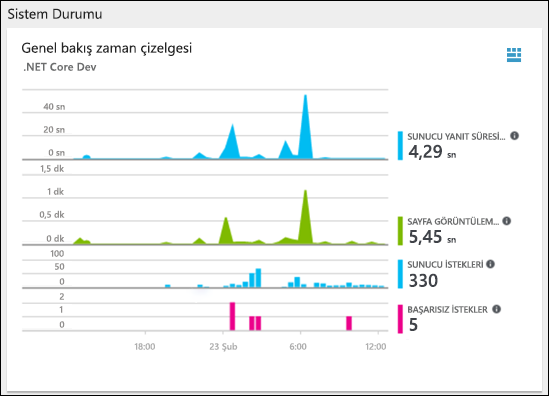
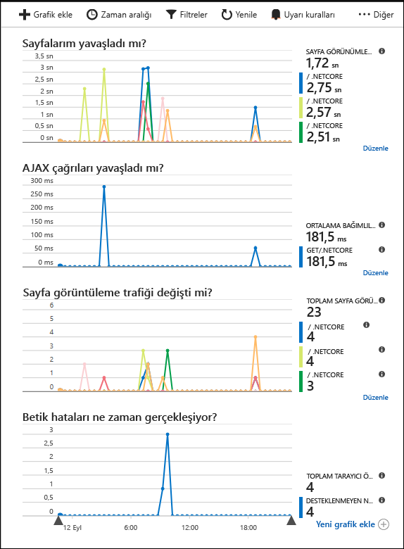

# <a name="start-monitoring-your-aspnet-core-web-application"></a>ASP.NET Core Web Uygulamanızı İzlemeye Başlama

Azure Application Insights ile web uygulamanızı kullanılabilirlik, performans ve kullanım bakımından kolayca izleyebilirsiniz. Ayrıca, bir kullanıcının bildirmesini beklemeden uygulamanızdaki hataları hızlıca tanımlayıp tespit edebilirsiniz. 

Bu hızlı başlangıç, Application Insights SDK'sını var olan bir ASP.NET Core web uygulamasına eklerken size kılavuzluk eder. 

## <a name="prerequisites"></a>Ön koşullar

Bu hızlı başlangıcı tamamlamak için:

- [Visual Studio 2017](https://www.visualstudio.com/downloads/)’yi aşağıdaki iş yükleri ile yükleyin:
  - ASP.NET ve web geliştirme
  - Azure geliştirme
- [.NET Core 2.0 SDK yükleme](https://www.microsoft.com/net/core)
- Bir Azure Aboneliği ve var olan bir .NET Core web uygulaması gerekir.

Bir ASP.NET Core web uygulamanız yoksa [ASP.NET Core Web Uygulaması Oluşturma Kılavuzu](https://docs.microsoft.com/aspnet/core/tutorials/publish-to-azure-webapp-using-vs)’nu izleyerek bir tane oluşturabilirsiniz.

Azure aboneliğiniz yoksa başlamadan önce [ücretsiz](https://azure.microsoft.com/free/) bir hesap oluşturun.

## <a name="log-in-to-the-azure-portal"></a>Azure portalında oturum açma

[Azure Portal](https://portal.azure.com/)’da oturum açın.

## <a name="enable-application-insights"></a>Application Insights'ı etkinleştirme

Application Insights, şirket içinde veya bulutta çalışmasından bağımsız olarak İnternet’e bağlı herhangi bir uygulamadan telemetri verilerini toplayabilir. Bu verileri görüntülemeyi başlatmak için aşağıdaki adımları kullanın.

1. **Kaynak oluştur** > **İzleme ve Yönetim** > **Application Insights**’ı seçin.

   

    Bir yapılandırma kutusu görünür. Giriş alanlarını doldurmak için aşağıdaki tabloyu kullanın.

    | Ayarlar        |  Değer           | Açıklama  |
   | ------------- |:-------------|:-----|
   | **Ad**      | Genel Olarak Benzersiz Değer | İzlemekte olduğunuz uygulamayı tanımlayan ad |
   | **Uygulama Türü** | ASP.NET web uygulaması | İzlemekte olduğunuz uygulamanın türü |
   | **Kaynak Grubu**     | myResourceGroup      | App Insights verilerini barındıran yeni kaynak grubunun adı |
   | **Konum** | Doğu ABD | Yakınınızda bulunan veya uygulamanızın barındırıldığı konumun yakınında olan bir konum seçin |

2. **Oluştur**’a tıklayın.

## <a name="configure-app-insights-sdk"></a>App Insights SDK’sını Yapılandırma

1. ASP.NET Core Web Uygulaması **projenizi** Visual Studio’da açın > **Çözüm Gezgini**’nde AppName öğesne sağ tıklayın > **Ekle** > **Application Insights Telemetrisi**’ni seçin.

    

2. **Ücretsiz Başlat** düğmesine tıklayın > Azure portalında oluşturduğunuz **Var olan kaynak**’ı seçin > **Kaydet**’e tıklayın.

3. Uygulamanızı başlatmak için **Hata Ayıkla** > **Hata Ayıklamadan Başlat** (Ctrl+F5) öğesini seçin

> [!NOTE]
> Verilerin portalda görünmesi 3-5 dakika sürer. Bu uygulama düşük trafikli bir test uygulaması ise, çoğu ölçümün yalnızca etkin istek veya işlem olduğunda yakalandığını aklınızda bulundurun.

## <a name="start-monitoring-in-the-azure-portal"></a>Azure portalında izlemeyi başlatma

1. Artık **Proje** > **Application Insights** > **Application Insights Portalını Aç** öğesini seçerek, o anda çalışan uygulamanızın ayrıntılarını görmek üzere Application Insights **Genel Bakış** sayfasını yeniden açabilirsiniz.

   

2. Uygulama bileşenleriniz arasındaki bağımlılık ilişkilerinin görsel düzeni için **Uygulama haritası**’na tıklayın. Her bileşen yük, performans, hatalar ve uyarılar gibi KPI'leri gösterir.

   

3. **Uygulama Analizi** simgesine  tıklayın.  Bu işlem, Application Insights tarafından toplanan tüm verileri analiz etmeye yönelik zengin bir sorgu dili sağlayan **Application Insights Analizi**’ni açar. Bu örnekte, istek sayısını grafik olarak işleyen bir sorgu oluşturulur. Diğer verileri çözümlemek için kendi sorgularınızı yazabilirsiniz.

   

4. **Genel Bakış** sayfasına geri dönüp **Sistem Durumuna Genel Bakış zaman çizelgesi**’ni inceleyin.  Bu pano, gelen istek sayısı, bu isteklerin süresi ve oluşan hatalar dahil olmak üzere uygulamanızın sistem durumu hakkında istatistikler sağlar. 

   

   **Sayfa Görünümü Yükleme Süresi** grafiğini **istemci tarafı telemetri** verileriyle doldurmak üzere etkinleştirmek için, bu betiği izlemek istediğiniz her sayfaya ekleyin:

   ```HTML
   <!-- 
   To collect end-user usage analytics about your application, 
   insert the following script into each page you want to track.
   Place this code immediately before the closing </head> tag,
   and before any other scripts. Your first data will appear 
   automatically in just a few seconds.
   -->
   <script type="text/javascript">
     var appInsights=window.appInsights||function(config){
       function i(config){t[config]=function(){var i=arguments;t.queue.push(function(){t[config].apply(t,i)})}}var t={config:config},u=document,e=window,o="script",s="AuthenticatedUserContext",h="start",c="stop",l="Track",a=l+"Event",v=l+"Page",y=u.createElement(o),r,f;y.src=config.url||"https://az416426.vo.msecnd.net/scripts/a/ai.0.js";u.getElementsByTagName(o)[0].parentNode.appendChild(y);try{t.cookie=u.cookie}catch(p){}for(t.queue=[],t.version="1.0",r=["Event","Exception","Metric","PageView","Trace","Dependency"];r.length;)i("track"+r.pop());return i("set"+s),i("clear"+s),i(h+a),i(c+a),i(h+v),i(c+v),i("flush"),config.disableExceptionTracking||(r="onerror",i("_"+r),f=e[r],e[r]=function(config,i,u,e,o){var s=f&&f(config,i,u,e,o);return s!==!0&&t["_"+r](config,i,u,e,o),s}),t
       }({
           instrumentationKey:"<insert instrumentation key>"
       });
       
       window.appInsights=appInsights;
       appInsights.trackPageView();
   </script>
   ```

5. **Araştır** üst bilgisinin altındaki **Tarayıcı** öğesine tıklayın. Burada, uygulamanızın sayfalarına ait performansla ilgili ölçümleri bulabilirsiniz. **Yeni grafik ekle**’ye tıklayarak ek özel görünümler oluşturabilir veya **Düzenle**’yi seçerek mevcut grafik türlerini, yüksekliğini, renk paletini, gruplandırmaları ve ölçümleri değiştirebilirsiniz.

   

## <a name="clean-up-resources"></a>Kaynakları temizleme

Sonraki hızlı başlangıçlar veya öğreticilerle devam etmeyi planlıyorsanız, bu hızlı başlangıçta oluşturulan kaynakları silmeyin. Devam etmeyi planlamıyorsanız, Azure portalda bu hızlı başlangıç ile oluşturulan tüm kaynakları silmek için aşağıdaki adımları kullanın.

1. Azure portalında sol taraftaki menüden, **Kaynak grupları**’na tıklayın ve ardından **myResourceGroup**’a tıklayın.
2. Kaynak grubu sayfanızda, **Sil**’e tıklayın, metin kutusuna **myResourceGroup** yazın ve ardından **Sil**’e tıklayın.

## <a name="next-steps"></a>Sonraki adımlar

> [!div class="nextstepaction"]
> [Çalışma zamanı özel durumlarını bulma ve tanılama](https://docs.microsoft.com/azure/application-insights/app-insights-tutorial-runtime-exceptions)
