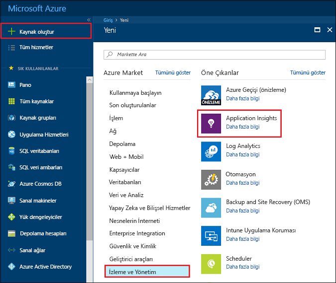
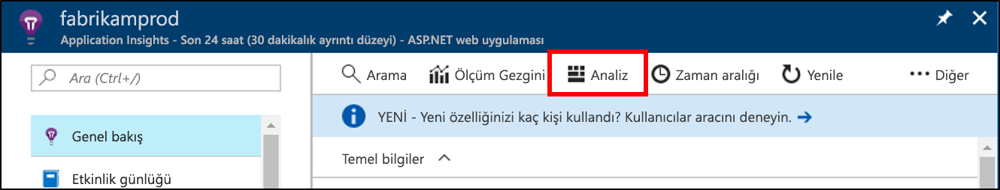
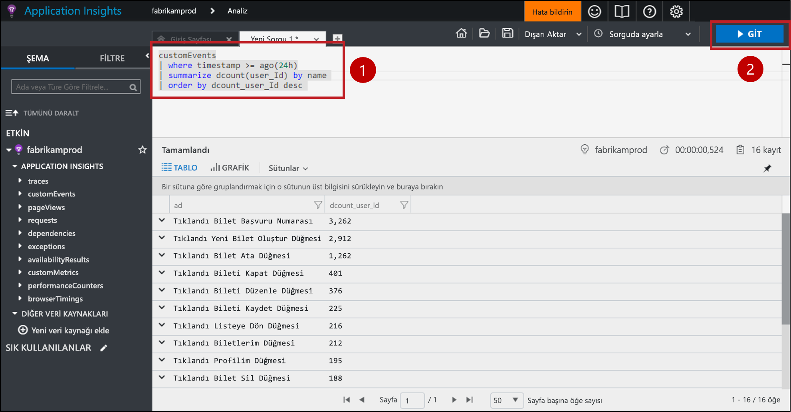
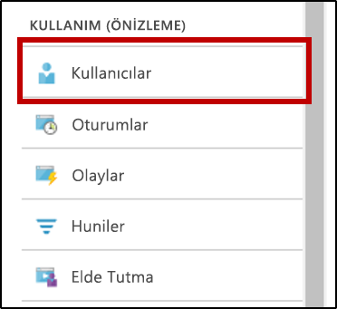
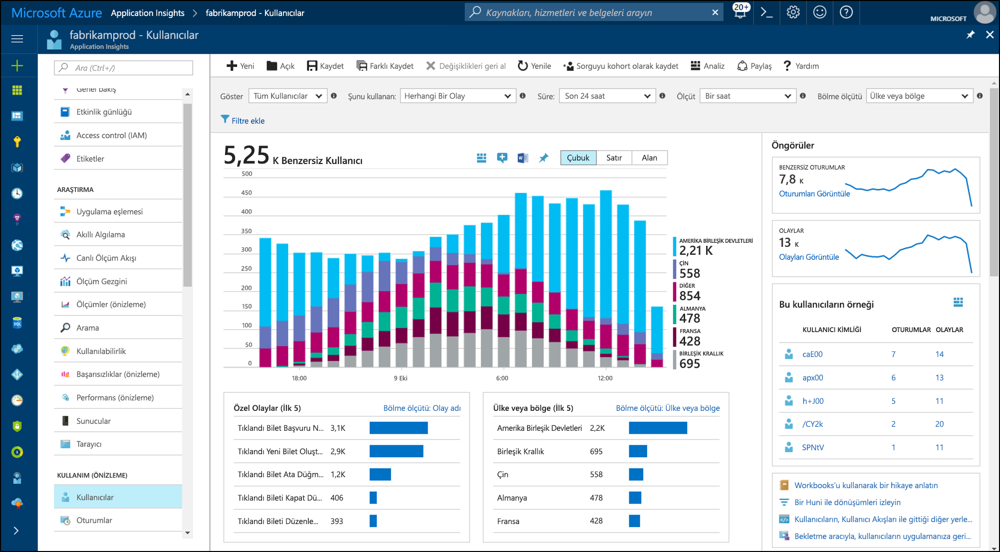

# <a name="start-analyzing-your-mobile-app-with-mobile-center-and-application-insights"></a>Mobil uygulamanızı Mobile merkezi ve Application Insights ile çözümlemeye başlayın

Bu Hızlı Başlangıç, uygulamanızın Mobile merkezi örneği Application Insights'a konusunda size rehberlik eder. Application Insights ile sorgu, segmentlere ayırmak, filtre uygulayabilir ve kullanılabilir olandan daha güçlü araçları ile telemetrinizi analiz [Analytics](https://docs.microsoft.com/mobile-center/analytics/) mobil merkezinin hizmet.

## <a name="prerequisites"></a>Ön koşullar

Bu hızlı başlangıcı tamamlamak için şunlar gerekir:

- Azure aboneliği.
- Bir iOS, Android, Xamarin, Evrensel Windows veya tepki yerel uygulama.
 
Azure aboneliğiniz yoksa başlamadan önce [ücretsiz](https://azure.microsoft.com/free/) bir hesap oluşturun.

## <a name="onboard-to-mobile-center"></a>Yerleşik mobil Merkezi

Mobil uygulamanızı Application Insights kullanmadan önce yerleşik uygulamanıza gerek [Mobile Merkezi](https://docs.microsoft.com/mobile-center/). Application Insights almaz telemetri mobil uygulamanızdan doğrudan. Bunun yerine, uygulamanızın Mobile merkezine özel olay telemetri gönderir. Ardından, olayları alındı olarak Mobile merkezi sürekli olarak bu özel olaylar kopyalarını uygulama Öngörüler aktarır.

Onboarding için uygulamanızın Mobile Merkezi Hızlı Başlangıç her platform için izleyin, uygulama destekler. Her platform için ayrı mobil merkezi örnekleri oluşturun:

* [iOS](https://docs.microsoft.com/mobile-center/sdk/getting-started/ios).
* [Android](https://docs.microsoft.com/mobile-center/sdk/getting-started/android).
* [Xamarin](https://docs.microsoft.com/mobile-center/sdk/getting-started/xamarin).
* [Evrensel Windows](https://docs.microsoft.com/mobile-center/sdk/getting-started/uwp).
* [Yerel tepki](https://docs.microsoft.com/mobile-center/sdk/getting-started/react-native).

## <a name="track-events-in-your-app"></a>Uygulamanızda izleme olayları

Uygulamanızı Mobile merkezi sayede sonra mobil Center SDK'yı kullanarak özel olay telemetri göndermek için değiştirilmesi gerekir. Özel olaylar Application Insights'a dışarı mobil merkezi telemetri yalnızca türüdür.

Özel olaylar iOS uygulamaları göndermek için kullanmak `trackEvent` veya `trackEvent:withProperties` Mobile Merkezi SDK'sı yöntemleri. [İOS uygulamalardan olaylarını izleme hakkında daha fazla bilgi edinin.](https://docs.microsoft.com/mobile-center/sdk/analytics/ios)

```Swift
MSAnalytics.trackEvent("Video clicked")
```

Özel olaylar Android uygulamaları göndermek için kullanmak `trackEvent` Mobile Merkezi SDK'sı yöntemi. [Android uygulamalardan olaylarını izleme hakkında daha fazla bilgi edinin.](https://docs.microsoft.com/mobile-center/sdk/analytics/android)

```Java
Analytics.trackEvent("Video clicked")
```

Özel olaylar diğer uygulama platformlarından göndermek için kullanmak `trackEvent` kendi mobil Center SDK'ları yöntemleri.

Özel olaylarınızı alınan emin olmak için Git **olayları** altında sekmesinde **Analytics** Mobile Merkezi bölümünde. Olayların gelen uygulamanızdan gönderilen gösterilmesi birkaç dakika sürebilir.

## <a name="create-an-application-insights-resource"></a>Application Insights kaynağı oluşturma

Uygulamanızı özel olaylar gönderme ve bu olayları mobil Merkezi tarafından alınan sonra Azure portalında mobil Merkezi-türü Application Insights kaynağı oluşturmanız gerekir:

1. [Azure Portal](https://portal.azure.com/)’da oturum açın.
2. **Yeni** > **İzleme + Yönetim** > **Application Insights**’ı seçin.

    

    Bir yapılandırma kutusu görünür. Giriş alanları doldurmak için aşağıdaki tabloyu kullanın.

    | Ayarlar        |  Değer           | Açıklama  |
   | ------------- |:-------------|:-----|
   | **Ad**      | "Uygulamam-iOS" gibi bazı genel benzersiz değer | İzlemekte olduğunuz uygulamayı tanımlayan ad |
   | **Uygulama Türü** | Mobile Merkezi uygulama | İzlemekte olduğunuz uygulamanın türü |
   | **Kaynak Grubu**     | Yeni bir kaynak grubu ya da mevcut bir menüsünde | Kaynak grubu, yeni Application Insights kaynağı oluşturmak için |
   | **Konum** | Bir konumdan menüsü | Yakınınızda bulunan veya uygulamanızın barındırıldığı konumun yakınında olan bir konum seçin |

3. **Oluştur**'a tıklayın.

Birden çok Platformu (iOS, Android, vb.), uygulamanız destekliyorsa, ayrı Application Insights kaynaklar, her platform için bir tane oluşturmak en iyisidir.

## <a name="export-to-application-insights"></a>Application Insights'a dışarı aktarma

Yeni Application Insights kaynağınıza içinde **genel bakış** sayfasındaki **Essentials** bölümünde en üstte, bu kaynak için izleme anahtarını kopyalayın.

Uygulamanız için Mobile merkezi örneği:

1. Üzerinde **ayarları** sayfasında, **verme**.
2. Seçin **yeni verme**, çekme **Application Insights**, ardından **Özelleştir**.
3. Application Insights izleme anahtarı kutusuna yapıştırın.
4. Application Insights kaynağınıza içeren Azure aboneliği kullanımını artırmak için onay. Her bir Application Insights kaynağı, her ay alınan verilerin ilk 1 GB ücretsizdir. [Application Insights fiyatlandırma hakkında daha fazla bilgi edinin.](https://azure.microsoft.com/pricing/details/application-insights/)

Her platform için bu işlemi yineleyin unutmayın, uygulama destekler.

Bir kez [verme](https://docs.microsoft.com/mobile-center/analytics/export) ayarlanır, mobil Merkezi tarafından alınan her özel olay uygulama Öngörüler kopyalanır. Application Insights erişmek için bunlar hemen görünmüyor şekilde biraz daha ayrıntılı tanılama önce bekleyin olaylar için birkaç dakika sürebilir.

İlk bağlanma sırasında daha fazla veri vermek için en son 48 saat mobil Center'da özel olayların otomatik olarak Application Insights'a dışarı aktarılır.

## <a name="start-monitoring-your-app"></a>Uygulamanızı İzlemeyi Başlat

Application Insights sorgu, segmentlere ayırmak, filtre ve mobil merkezi sağlar analiz araçları ötesinde uygulamalarınızdan özel olay telemetriyi çözümle.

1. **Özel olay telemetrinizi sorgu.** Application Insights gelen **genel bakış** sayfasında, **Analytics**. 

   

   Application Insights kaynağınıza ile ilişkili uygulama Öngörüler Analytics portalı açar. Analytics portalı, uygulamanızı ve kullanıcılarına hakkında rasgele karmaşık sorular sormak için günlük analizi sorgu dili kullanarak verilerinizi doğrudan sorgu olanak tanır.
   
   Açık Analytics portalında yeni bir sekme yapıştırın aşağıdaki sorguda. Kaç tane benzersiz kullanıcı her özel olay uygulamanızdan son 24 saat içindeki bu ayrı sayıları tarafından sıralanan göndermiş sayısına döndürür.

   ```AIQL
   customEvents
   | where timestamp >= ago(24h)
   | summarize dcount(user_Id) by name 
   | order by dcount_user_Id desc 
   ```

   

   1. Sorgu metin düzenleyicisinde sorgusu herhangi bir yere tıklayarak seçin.
   2. Ardından **Git** sorguyu çalıştırmak için. 

   Daha fazla bilgi edinmek [uygulama Öngörüler Analytics](app-insights-analytics.md) ve [günlük analizi sorgu dili](https://docs.loganalytics.io/docs/Language-Reference).


2. **Segment ve özel olay telemetrinizi filtreleyebilirsiniz.** Application Insights gelen **genel bakış** sayfasında, **kullanıcılar** içindekiler tablosu içindeki.

   

   Kullanıcılar aracını, uygulamanızın kaç kullanıcının belirli düğme tıklatıldığında, bazı ekranlar ziyaret ya da bir olay Mobile Merkezi SDK'sı olarak izlemekte olduğunuz herhangi bir eylemde gerçekleştirilen gösterir. Segmentlere ayırmak ve mobil merkezi olayları filtrelemek için bir yol görmek, kullanıcılar aracını harika bir seçimdir.

    

   Örneğin, seçerek kullanımınızı coğrafyaya segmentlere **ülke veya bölge** içinde **bölme** açılır menüsünde.

3. **Dönüştürme, bekletme ve gezinti desenleri uygulamanızda analiz edin.** Application Insights gelen **genel bakış** sayfasında, **kullanıcı akar** içindekiler tablosu içindeki.

   

   Kullanıcı akar aracı bazı başlangıç olayından sonra kullanıcıların göndermesi hangi olayların visualizes. Kullanıcılarınızın uygulamanız nasıl gezindiğini bir genel resim almak için kullanışlıdır. Ayrıca, çok sayıda kullanıcı, uygulamanızdan fakat veya aynı eylemleri tekrar tekrar yinelenen yerler ortaya çıkarabilir.

   Kullanıcı akar ek olarak, Application Insights belirli soruları yanıtlamak için birkaç kullanım analizi araçlara sahiptir:

   * **Funnels** çözümleme ve dönüştürme oranları izleme.
   * **Bekletme** uygulamanız kullanıcıların zaman içinde ne kadar iyi korur çözümlemek için.
   * **Çalışma kitapları** görselleştirmeleri ve metin paylaşılabilir bir rapora birleştirme için.
   * **Cohorts** adlandırma ve diğer Analiz Araçları'ndan kolayca başvurulabilir şekilde belirli kullanıcı gruplarına veya olayları kaydetme.

## <a name="clean-up-resources"></a>Kaynakları temizleme

Application Insights ile Mobile merkezi kullanmaya devam etmek istemiyorsanız mobil Center'da verme devre dışı bırakın ve Application Insights kaynağını silin. Bu engeller, bu kaynak için Application Insights tarafından daha fazla ücret gelen.

Dışarı aktarma mobil Center'da devre dışı bırakmak için:

1. Mobil merkezine Git **ayarları** ve **dışarı**.
2. Silin ve ardından istediğiniz Application Insights Dışa Aktar düğmesini tıklatın **silmek verme** altındaki ve onaylayın.

Application Insights kaynağı silmek için:

1. Azure portalının sol menüye tıklayın **kaynak grupları** ve Application Insights kaynağınıza oluşturulduğu kaynak grubu seçin.
2. Silmek istediğiniz Application Insights kaynağı açın. Ardından **silmek** kaynağının üst menüde ve onaylayın. Bu, Application Insights'a dışarı aktarılan verilerin kopyasını kalıcı olarak siler.

## <a name="next-steps"></a>Sonraki adımlar

> [!div class="nextstepaction"]
> [Müşteriler, uygulamanızın nasıl kullandığını anlamak](app-insights-usage-overview.md)