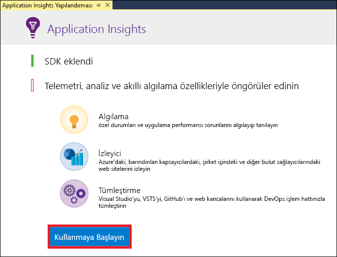
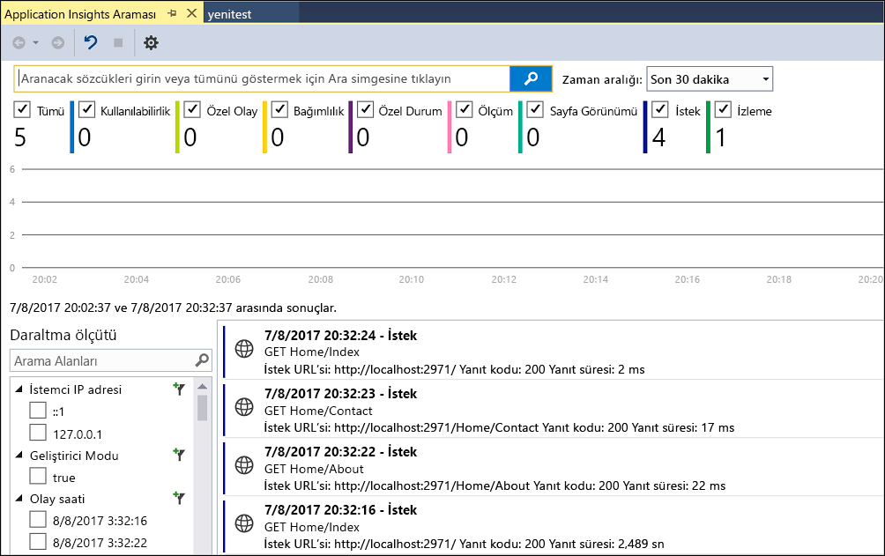
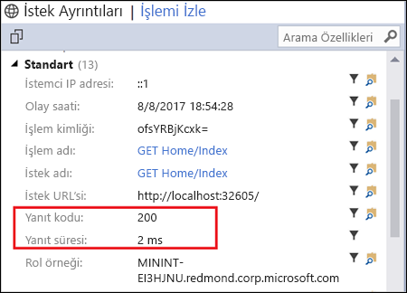
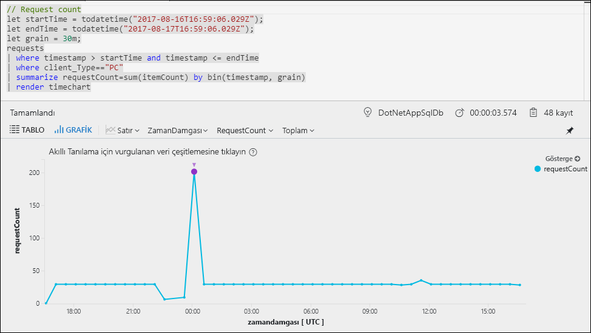
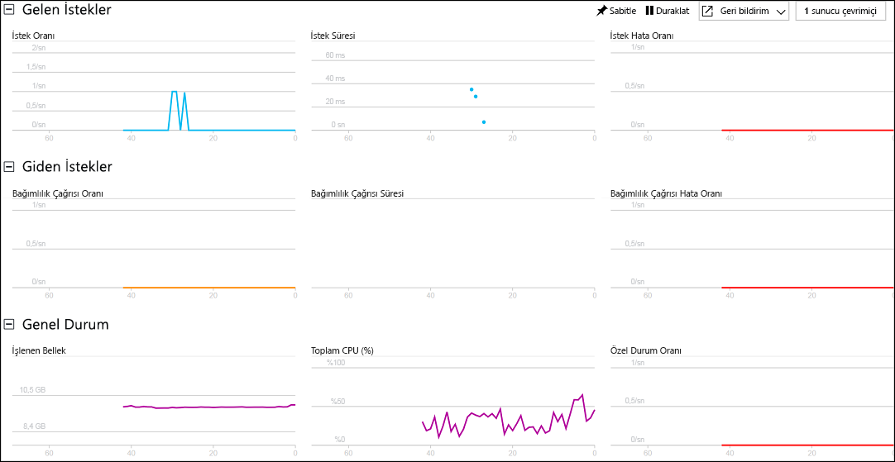

# ASP.NET Web Uygulamanızı izlemeye başlama

Azure Application Insights ile web uygulamanızı kullanılabilirlik, performans ve kullanım bakımından kolayca izleyebilirsiniz.  Ayrıca, bir kullanıcının bildirmesini beklemeden uygulamanızdaki hataları hızlıca tanımlayıp tespit edebilirsiniz.  Application Insights’tan uygulamanızın verimi ve performansı hakkında topladığınız bilgileri kullanarak, uygulamanızı korumak ve geliştirmek için bilinçli seçimler yapabilirsiniz.

Bu hızlı başlangıç, var olan bir ASP.NET web uygulamasına Application Insights ekleme ve uygulamanızı çözümlemek için kullanabileceğiniz çeşitli yöntemlerden yalnızca biri olan canlı istatistikleri çözümlemeye başlama işlemini gösterir. Bir ASP.NET web uygulamanız yoksa [ASP.NET Web Uygulaması oluşturma hızlı başlangıcı](../app-service/app-service-web-get-started-dotnet-framework.md)’nı izleyerek bir tane oluşturabilirsiniz.

## Ön koşullar
Bu hızlı başlangıcı tamamlamak için:

- [Visual Studio 2017](https://www.visualstudio.com/downloads/)’yi aşağıdaki iş yükleri ile yükleyin:
    - ASP.NET ve web geliştirme
    - Azure geliştirme

Azure aboneliğiniz yoksa başlamadan önce [ücretsiz](https://azure.microsoft.com/free/) bir hesap oluşturun.

## Application Insights'ı etkinleştirme

1. Projenizi Visual Studio 2017'de açın.
2. Proje menüsünden **Application Insights’ı Yapılandır**’ı seçin. Visual Studio, uygulamanıza Application Insights SDK'sını ekler.

    > [!IMPORTANT]
    > Application Insights ekleme işlemi, ASP.NET şablon türüne göre değişiklik gösterir. **Boş** bir şablon veya **Azure Mobil Uygulaması** şablonu kullanıyorsanız **Proje** > **Application Insights Telemetri Ekleme** seçeneğini belirleyin. Diğer tüm ASP.NET şablonları için yukarıdaki adımda yer alan yönergelere başvurun. 

3. **Kullanmaya Başlayın**’a tıklayın (Visual Studio'nun önceki sürümlerinde bunun yerine **Ücretsiz Başlayın** düğmesi vardır).

    

4. Aboneliğinizi seçin ve **Kaydet**’e tıklayın.

5. **Hata Ayıkla** menüsünden **Hata Ayıklamayı Başlat**’ı seçerek veya F5 tuşuna basarak uygulamanızı çalıştırın.

## Uygulama yapılandırmasını onaylama

Application Insights, uygulamanızın nerede çalıştığına bakmaksızın telemetri verilerini toplar. Bu verileri görüntülemeyi başlatmak için aşağıdaki adımları kullanın.

1. **Görünüm** -> **Diğer Pencereler** -> **Application Insights Araması** seçeneğine tıklayarak Application Insights’ı açın.  Geçerli oturumunuzdaki telemetriye bakın.  

2. İstek ayrıntılarını görmek için listedeki ilk isteğe tıklayın (Bu örnekte, GET Home/Index). Durum kodu ve yanıt süresinin her ikisinin de istekle ilgili diğer değerli bilgilerle birlikte eklendiğine dikkat edin.  

## Azure portalında izlemeyi başlatma

Artık Application Insights’ı Azure portalında açarak çalışan uygulamanıza ilişkin çeşitli ayrıntıları görüntüleyebilirsiniz.

1. Çözüm Gezgini’nde **Bağlı Hizmetler Application Insights** klasörüne ve **Application Insights Portalını Aç**’a tıklayın.  Uygulamanıza ilişkin bazı bilgiler ve çeşitli seçenekler görürsünüz.

    

2. Uygulama bileşenleriniz arasındaki bağımlılık ilişkilerinin görsel düzenini almak için **Uygulama haritası**’na tıklayın.  Her bileşen yük, performans, hatalar ve uyarılar gibi KPI'leri gösterir.

    

3. Uygulama bileşenlerinden birinde **Uygulama Analizi** simgesi ’na tıklayın.  Bu işlem, Application Insights tarafından toplanan tüm verileri analiz etmeye yönelik zengin bir sorgu dili sağlayan **Application Insights Analizi**’ni açar.  Bu örnekte, istek sayısını grafik olarak işleyen bir sorgu oluşturulur.  Diğer verileri çözümlemek için kendi sorgularınızı yazabilirsiniz.

    

4. **Genel Bakış** sayfasına geri dönüp **Canlı Akış**’a tıklayın.  Burada uygulamanızın çalışması sırasında canlı istatistikler gösterilir.  Buna gelen istek sayısı, bu isteklerin süresi ve oluşan her türlü hata gibi bilgiler dahildir.  Ayrıca, işlemci ve bellek gibi önemli performans ölçümlerini inceleyebilirsiniz.

    

Uygulamanızı Azure'da barındırmaya hazır olduğunuzda, artık yayımlayabilirsiniz. [ASP.NET Web Uygulaması Oluşturma Hızlı Başlangıcı](../app-service/app-service-web-get-started-dotnet.md#update-the-app-and-redeploy) içinde açıklanan adımları izleyin.

## Sonraki adımlar
Bu hızlı başlangıç bölümünde, Azure Application Insights tarafından izleme için uygulamanızı etkinleştirdiniz.  İstatistikleri izlemek ve uygulamanızdaki sorunları tespit etmek üzere nasıl kullanacağınızı öğrenmek için öğreticilere ilerleyin.

> [!div class="nextstepaction"]
> [Azure Application Insights öğreticileri](app-insights-tutorial-runtime-exceptions.md)
