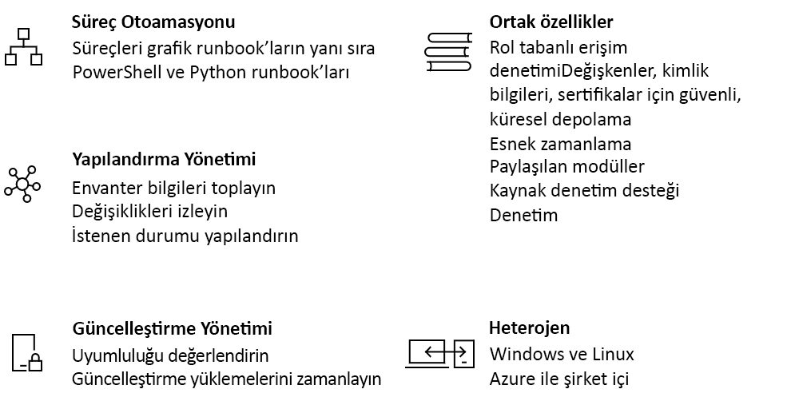

# Azure Otomasyonu'na giriş

Azure Otomasyonu, Azure ve Azure harici ortamlarınızda tutarlı yönetim özellikleri sunan bulut tabanlı bir otomasyon ve yapılandırma hizmeti sunar. Bu hizmet süreç otomasyonu, güncelleştirme yönetimi ve yapılandırma özelliklerine sahiptir. Azure Otomasyonu iş yüklerinin ve kaynaklarının dağıtılması, işleme alınması ve yetkilerinin alınması sırasında eksiksiz denetim sağlar.
Bu makale, Azure Otomasyonu'na ilişkin kısa bir genel bakış sağlar ve bazı sık sorulan soruları yanıtlar. Özellikler hakkında daha fazla bilgi almak için bu genel bakış içindeki bağlantıları ziyaret edin.

## Azure Otomasyon özellikleri

### Süreç otomasyonu

Azure Otomasyonu sık gerçekleştirilen, zaman alan ve hataya açık bulut yönetim görevlerinizi otomatik hale getirme imkanı tanır. Bu otomasyon, işletmenize değer kazandıran işlere odaklanmanıza yardımcı olur. Ayrıca hataları azaltıp verimliliği artırarak, işletim maliyetlerini azaltmanıza da katkıda bulunur. Azure hizmetlerini uçtan uca süreçlerinizi dağıtmak, yapılandırmak ve yönetmek için gerekli olan diğer ortak sistemlerinizle tümleştirebilirsiniz. Bu hizmet PowerShell veya Python ile grafik [runbook'lar yazmanızı](automation-runbook-types.md) mümkün kılar. Karma Runbook çalışanı kullanarak şirket içi ortamları da dahil edebilir, yönetimi tek merkezden gerçekleştirebilirsiniz. [Web kancaları](automation-webhooks.md) istekleri gerçekleştirmek için kullanabileceğiniz bir yöntem sağlamanın yanı sıra ITSM, DevOps ve izleme sistemlerinden otomasyon tetikleyerek hizmet ve operasyon sürekliliğini sağlar.

### Yapılandırma yönetimi

Azure Otomasyonu [istenen durum yapılandırması](automation-dsc-overview.md), PowerShell DSC'ye yönelik kurumsal ortamlar için hizmetler için gerekli hizmetleri sağlayan bulut tabanlı bir çözümdür. Azure Otomasyonu DSC kaynaklarınızı yönetebilir ve bunları Azure buluttaki DSC Çekme Sunucusu'ndan alana sanal veya fiziksel makinelere uygulayabilirsiniz. Bu hizmet düğümlerin kendilerine atanan yapılandırmalardan sapması gibi önemli olayları size bildiren zengin raporlar da sağlar. Hem buluttaki hem de şirket içindeki fiziksel ve sanal makinelerin (Windows veya Linux) yapılandırmasını izleyip otomatik olarak güncelleştirebilirsiniz.

Konuk içi kaynaklar hakkında stok bilgisi alarak yüklü uygulamalar ve diğer yapılandırma öğeleri hakkında görünürlük sağlayabilirsiniz. Gelişmiş raporlama ve arama özellikleri sayesinde işletim sistemi yapılandırmalarını kavramaya yardımcı olan ayrıntılı bilgilere hızlıca ulaşabilirsiniz. Sorunun kaynağını bulmak için hizmetler, daemon'lar, yazılımlar, kayıt defterleri ve dosyalarda yapılan değişiklikleri izleyebilirsiniz. DSC ayrıca ortamınızda istenmeyen değişiklikler olduğunda tanılama ve uyarma konusunda size yardımcı olabilir.

### Güncelleştirme yönetimi

Azure Otomasyonu ile karma ortamlardaki Windows ve Linux sistemlerini güncelleştirebilirsiniz. Azure, şirket içi ve diğer bulutlar üzerindeki güncelleştirme uyumluluğu hakkında görünürlük elde edersiniz. Güncelleştirmelerin belirli bir bakım aralığında yüklenmesini sağlamak için zamanlanmış dağıtım oluşturabilirsiniz. Bir makineye yüklenmemesi gereken güncelleştirmeleri dağıtım kapsamından çıkarabilirsiniz.

### Paylaşılan özellikler

Azure Otomasyonu, büyük ölçekli ortamlarınızda otomasyon ve yapılandırma kolaylığı sunmak için bir dizi paylaşılan kaynak sunar.

* **[Rol tabanlı erişim denetimi](automation-role-based-access-control.md)**: Hesap erişimini görevlerin yazar özellikleri verilmeden çalıştırılmasını sağlayan bir Otomasyon operatörü rolüyle denetleyin.
* **[Değişkenler](automation-variables.md)**: Farklı runbook'larda ve yapılandırmalarda kullanılabilecek içeriği tutmak için bir yöntem sağlar. Runbook'larda ve onlara başvuran yapılandırmalarda değişiklik yapmadan değerleri değiştirebilirsiniz.
* **[Kimlik bilgileri](automation-credentials.md)**: Çalışma zamanında runbook'lar ve yapılandırmalar tarafından kullanılabilecek hassas bilgileri güvenle depolayın.
* **[Sertifikalar](automation-certificates.md)**: Kimlik doğrulaması ve dağıtılan kaynakların güvenliğini sağlama amacıyla kullanmak üzere depolayın ve çalışma zamanında kullanılabilir duruma getirin.
* **[Bağlantılar](automation-connections.md)**: Bağlantı kaynaklarındaki sistemlere bağlanırken kullanılacak bilgileri içeren ad/değer çiftlerini depolayın. Bağlantılar, çalışma zamanında kullanılmak üzere runbook ve yapılandırmalarda modül yazarı tarafından tanımlanır.
* **[Zamanlamalar](automation-schedules.md)**: Otomasyonu önceden tanımlanmış zamanlarda tetikleme amacıyla hizmette kullanılır.
* **[Kaynak denetimiyle tümleştirme](automation-source-control-integration.md)**: Kod ile yapılandırma gerçekleştirilmesini ve bu sayede runbook'ların veya yapılandırmaların kaynak denetim sistemine alınmasını sağlar.
* **[PowerShell modülleri](automation-integration-modules.md)**: Bu modüller Azure'u ve diğer sistemleri yönetmek için kullanılır. Microsoft, üçüncü taraf, topluluk veya özel tanımlı cmdlet'ler ve DSC kaynakları için Otomasyon hesabına aktarın.

### Windows ve Linux

Azure Otomasyonu, hem karma bulut ortamınızda hem de Windows ve Linux ile çalışacak şekilde tasarlanmıştır. Bu hizmet dağıtılan iş yüklerini ve bu iş yüklerinin üzerinde çalıştığı işletim sistemini otomatik hale getirmek ve yapılandırmak için tutarlı bir yöntem sunar.

### Topluluk galerisi

[Otomasyon galerisi](automation-runbook-gallery.md)'ndeki runbook'lara ve modüllere göz atarak PowerShell galerisi ve Microsoft Betik Merkezi süreçlerinizle tümleştirmeye yeni süreçler oluşturmaya başlayın.

## Genel Otomasyon senaryoları

Azure Otomasyonu altyapınızın ve uygulamalarınızın yaşam döngüsü boyunca kullanabileceğini yönetim özellikleri sunar. Kuruluşun iş yükü dağıtım ve bakım şeklini değiştirmek için bilgileri sisteme aktarın. PowerShell, istenen durum yapılandırması, Python ve grafik runbook'lar gibi sık kullanılan dillerde içerik oluşturun. Hedefleme, raporlama ve uyumluluk için dağıtılan kaynakların tam stok durumuna sahip olun. Hatalı yapılandırmaya neden olabilecek değişiklikleri tanımlayın ve işletimsel uyumluluğu geliştirin.

* **Kaynak derleme/dağıtma**: Runbook'ları ve Azure Resource Manager şablonlarını kullanarak karma ortamda VM'ler dağıtın. Jenkins ve Azure DevOps gibi geliştirme araçlarıyla tümleştirin.
* **VM yapılandırma**: Windows ve Linux makinelerini altyapı ve uygulama açısından gereken şekilde yapılandırın ve değerlendirin.
* **İzleme**: Makinelerdeki sorun yaratan değişiklikleri tanımlayın ve düzeltin veya yönetim sistemine iletin.
* **Koruma**: Güvenlik uyarısı durumunda VM'yi karantinaya alın. Konuk içi gereksinimleri ayarlayın.
* **Yönetim**: Ekipler için rol tabanlı erişim denetimini ayarlayın. Kullanılmayan kaynakları kurtarın.

## Otomasyon fiyatlandırması

Azure Otomasyonu fiyatlandırması için [fiyatlandırma](https://azure.microsoft.com/pricing/details/automation/) sayfasına bakabilirsiniz.

## Sonraki adımlar

> [!div class="nextstepaction"]
> [Otomasyon hesabı oluşturma](automation-quickstart-create-account.md)
