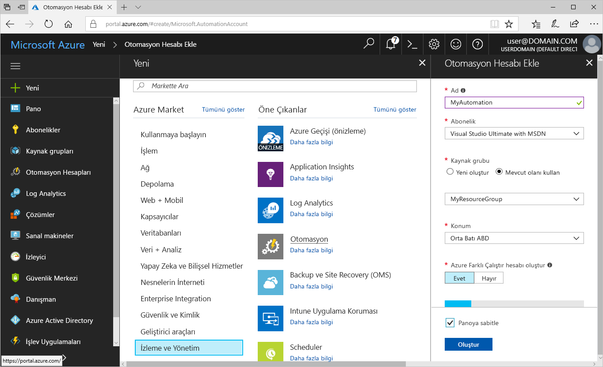
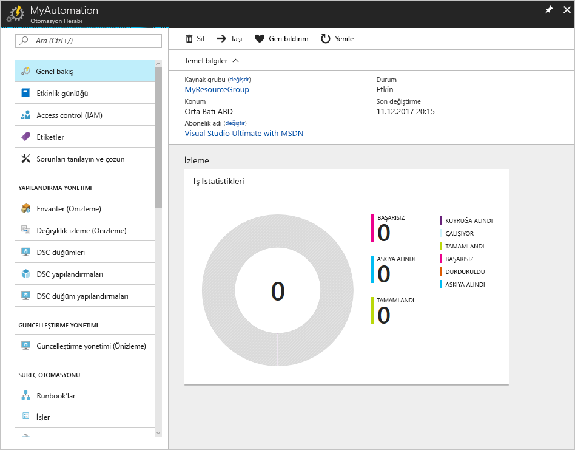
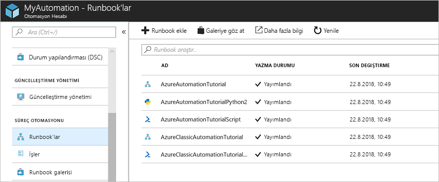
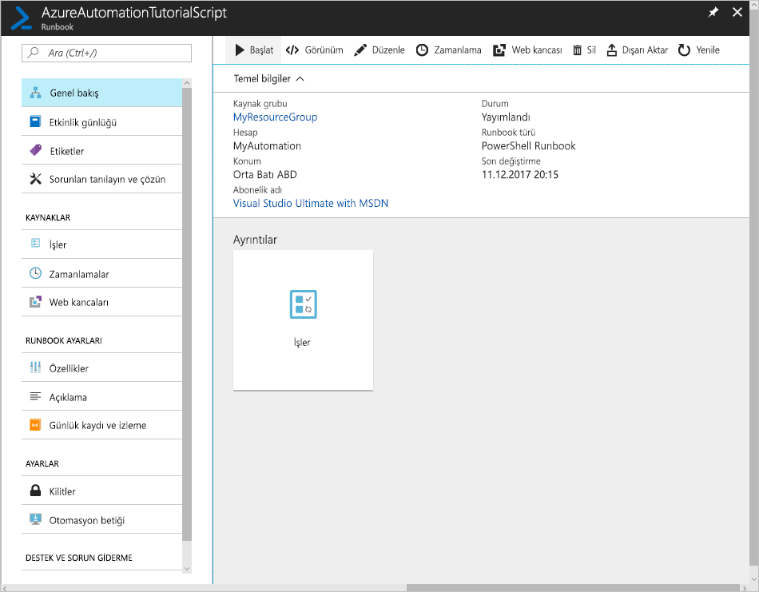
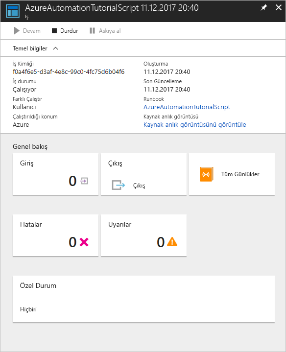

# Azure Otomasyonu hesabı oluşturma

Azure Otomasyonu hesaplarını Azure üzerinden oluşturabilirsiniz. Bu yöntem, Otomasyon hesaplarını ve ilgili kaynakları oluşturup yapılandırmaya yönelik tarayıcı tabanlı bir kullanıcı arabirimi sağlar. Bu hızlı başlangıçta Otomasyon hesabı oluşturma ve hesapta runbook çalıştırma adımları ele alınmaktadır.

Azure aboneliğiniz yoksa başlamadan önce [ücretsiz bir Azure hesabı](https://azure.microsoft.com/free/?WT.mc_id=A261C142F) oluşturun.

## Azure'da oturum açma

https://portal.azure.com adresinden Azure oturumu açın

## Otomasyon hesabı oluşturma

1. Azure'un sol üst köşesinde bulunan **Yeni** düğmesine tıklayın.

1. **İzleme + Yönetim**'i ve ardından **Otomasyon**'u seçin.

1. Hesap bilgilerini girin. **Azure Farklı Çalıştır hesabı oluştur** alanında **Evet**'i seçerek Azure kimlik doğrulamasını kolaylaştıran yapıtların otomatik olarak etkinleştirilmesini sağlayın. İşlemi tamamladığınızda Otomasyon hesabı dağıtımını başlatmak için **Oluştur**'a tıklayın.

      

1. Otomasyon hesabı Azure panosuna sabitlenir. Dağıtım tamamlandığında Otomasyon hesabına genel bakış sayfası otomatik olarak açılır.

    

## Bir runbook'u çalıştırma

Öğretici runbook'larından birini çalıştırın.

1. **SÜREÇ OTOMASYONU**'nın altındaki **Runbook'lar** öğesine tıklayın. Runbook'ların listesi görüntülenir. Varsayılan olarak hesapta etkin halde birden fazla öğretici amaçlı runbook bulunur.

    

1. **AzureAutomationTutorialScript** runbook'unu seçin. Runbook'a genel bakış sayfası açılır.

    

1. **Başlat**'a tıklayın ve **Runbook'u Başlat** sayfasında **Tamam**'ı seçerek runbook'u başlatın.

    

1. **İş durumu**, **Çalışıyor** olarak değiştikten sonra runbook işi çıktısını görüntülemek için **Çıktı** veya **Tüm Günlükler**'e tıklayın. Bu öğretici runbook'u için çıktıda Azure kaynaklarınızın listesi yer alır.

## Kaynakları temizleme

Artık gerekli olmadığında kaynak grubunu, Otomasyon hesabını ve tüm ilişkili kaynakları silin. Bunu yapmak için Otomasyon hesabı için kaynak grubunu seçip **Sil**'e tıklayın.

## Sonraki adımlar

Bu hızlı başlangıçta bir Otomasyon hesabı dağıttınız, runbook işi başlattınız ve iş sonuçlarını görüntülediniz. Azure Otomasyonu hakkında daha fazla bilgi edinmek için ilk runbook'unuzu oluşturmanızı sağlayacak hızlı başlangıç sayfasına gidin.

> [!div class="nextstepaction"]
> [Otomasyon Hızlı Başlangıcı - Runbook Oluşturma](./automation-quickstart-create-runbook.md)
