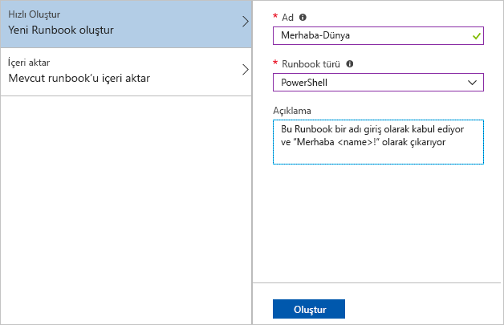
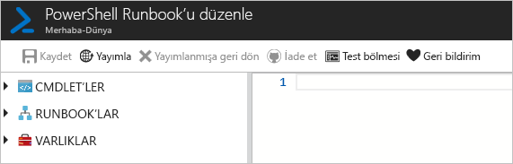
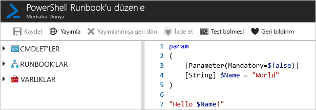
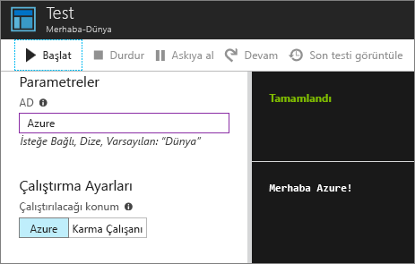
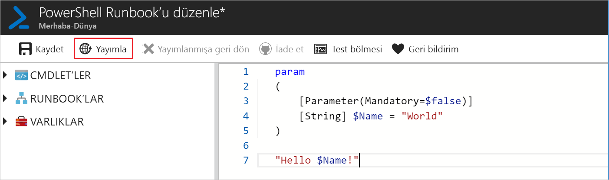
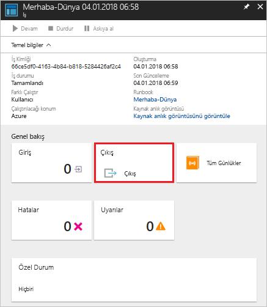
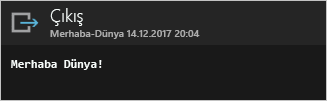

# <a name="create-an-azure-automation-runbook"></a>Azure Otomasyonu runbook'u oluşturma

Azure Otomasyonu runbook'larını Azure üzerinden oluşturabilirsiniz. Bu yöntem Otomasyon runbook'larının oluşturulması için tarayıcı tabanlı kullanıcı arabirimi sunar. Bu hızlı başlangıçta Otomasyon PowerShell runbook'u oluşturma, düzenleme, test etme ve yayımlama adımları incelenmiştir.

Azure aboneliğiniz yoksa başlamadan önce [ücretsiz bir Azure hesabı](https://azure.microsoft.com/free/?WT.mc_id=A261C142F) oluşturun.

## <a name="sign-in-to-azure"></a>Azure'da oturum açma

https://portal.azure.com adresinden Azure'da oturum açın

## <a name="create-runbook"></a>Runbook oluşturma

Öncelikle bir runbook oluşturun. Bu hızlı başlangıçta oluşturulan örnek runbook, varsayılan olarak `Hello World` çıktısını verir.

1. Otomasyon hesabınızı açın.

1. **SÜREÇ OTOMASYONU**'nın altındaki **Runbook'lar** öğesine tıklayın. Runbook'ların listesi görüntülenir.

1. Listenin en üstünde yer alan **Runbook ekle** düğmesine tıklayın. **Runbook ekle** sayfasında **Hızlı Oluştur**'u seçin.

1. Runbook **Ad** değeri için "Hello-World" girip **Runbook türü** olarak **PowerShell**'i seçin. **Oluştur**’a tıklayın.

   

1. Runbook oluşturulur ve **PowerShell Runbook'unu Düzenle** sayfası açılır.

    

1. Aşağıdaki kodu düzenleme bölmesine yazın veya kopyalayıp yapıştırın. "Name" adına ve "World" varsayılan değerine sahip isteğe bağlı bir giriş parametresi oluşturur ve bu giriş değerini kullanan bir dize çıktısı verir:
   
   ```powershell-interactive
   param
   (
       [Parameter(Mandatory=$false)]
       [String] $Name = "World"
   )

   "Hello $Name!"
   ```

1. Runbook'un taslak kopyasını kaydetmek için **Kaydet**'e tıklayın.

    

## <a name="test-the-runbook"></a>Runbook'u test etme

Runbook oluşturulduktan sonra çalışır durumda olduğunu doğrulamak için test etmeniz gerekir.

1. **Test bölmesi**'ne tıklayarak **Test** sayfasını açın.

1. **Ad** için bir değer girip **Başlat**'a tıklayın. Test işi başlar ve iş durumuyla çıkışı görüntülenir.

    

1. Sağ üst köşedeki **X** işaretine tıklayarak **Test** sayfasını kapatın. Açılan pencerede **Tamam**'ı seçin.

1. **PowerShell Runbook'unu Düzenle** sayfasında **Yayımla**'ya tıklayarak runbook'u hesaptaki runbook'un resmi sürümü olarak yayımlayın.

   

## <a name="run-the-runbook"></a>Runbook'u çalıştırma

Runbook yayımlandıktan sonra genel bakış sayfası gösterilir.

1. Runbook'un genel bakış sayfasında **Başlat**'a tıklayarak bu runbook'un **Runbook'u Başlat** yapılandırma sayfasını açın.

   

1. Varsayılan değerin kullanılması için **Ad** alanın boş bırakıp **Tamam**'a tıklayın. Runbook işi gönderilir ve iş sayfası açılır.

   

1. **İş durumu**, **Çalışıyor** veya **Tamamlandı** ise **Çıktı**'ya tıklayarak **Çıktı** bölmesini açıp runbook çıktısını görüntüleyebilirsiniz.

   

## <a name="clean-up-resources"></a>Kaynakları temizleme

İhtiyacınız kalmadıysa runbook'u silebilirsiniz. Bunu yapmak için runbook listesinden runbook'u seçip **Sil**'e tıklayın.

## <a name="next-steps"></a>Sonraki adımlar

Bu hızlı başlangıçta bir runbook oluşturdunuz, düzenlediniz, test ettiniz ve yayımladınız, ayrıca bir runbook işi başlattınız. Otomasyon runbook'ları hakkında daha fazla bilgi edinmek için Otomasyon'da oluşturabileceğiniz ve kullanabileceğiniz farklı runbook türlerini anlatan makaleye geçin.

> [!div class="nextstepaction"]
> [Otomasyon ile Nasıl Yapılır? - Runbook Türleri](./automation-runbook-types.md)

