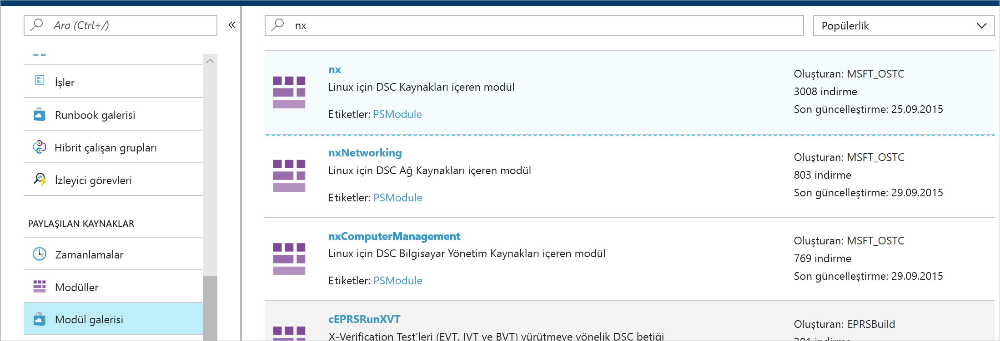
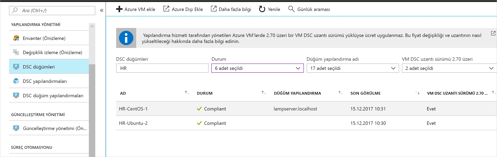

# <a name="configure-a-linux-virtual-machine-with-desired-state-configuration"></a>İstenen Durum Yapılandırması ile Linux sanal makinesi yapılandırma

İstenen Durum Yapılandırması'nı (DSC) etkinleştirerek Windows ve Linux sunucularınızın yapılandırmalarını yönetebilir ve izleyebilirsiniz. İstenen yapılandırmadan farklı olan yapılandırmalar tanımlanabilir veya otomatik olarak düzeltilebilir. Bu hızlı başlangıçta Linux VM ekleme ve DSC ile LAMP yığını dağıtma adımlarına yer verilmiştir.

## <a name="prerequisites"></a>Önkoşullar

Bu hızlı başlangıcı tamamlamak için şunlar gerekir:

* Azure aboneliği. Azure aboneliğiniz yoksa [ücretsiz bir hesap](https://azure.microsoft.com/free/) oluşturun.
* Azure Otomasyonu hesabı. Bir Azure Otomasyonu Garklı Çalıştır hesabı oluşturma yönergeleri için bkz. [Azure Farklı Çalıştır Hesabı](automation-sec-configure-azure-runas-account.md).
* Red Hat Enterprise Linux, CentOS veya Oracle Linux çalıştıran bir Azure Resource Manager VM (Klasik değil). VM oluşturma yönergeleri için bkz. [Azure portalında ilk Linux sanal makinenizi oluşturma](../virtual-machines/linux/quick-create-portal.md)

## <a name="sign-in-to-azure"></a>Azure'da oturum açma
https://portal.azure.com adresinden Azure'da oturum açın

## <a name="onboard-a-virtual-machine"></a>Sanal makine ekleme
Makine eklemek ve İstenen Durum Yapılandırması'nı etkinleştirmek için kullanabileceğiniz birçok farklı yöntem mevcuttur. Bu hızlı başlangıçta ekleme işlemi Otomasyon hesabıyla gerçekleştirilmektedir. Makinelerinizi İstenen Durum Yapılandırması'na eklemek için kullanabileceğiniz diğer yöntemler hakkında daha fazla bilgi edinmek için [ekleme](https://docs.microsoft.com/azure/automation/automation-dsc-onboarding) makalesini okuyabilirsiniz.

1. Azure portalının sol tarafındaki bölmede **Otomasyon hesapları**'nı seçin. Sol bölmede bu seçenek yoksa **Tüm hizmetler**'i seçip açılan ekranda arama yapın.
1. Listeden bir Otomasyon hesabı seçin.
1. Otomasyon hesabının sol bölmesinde, **Durum yapılandırması (DSC)** öğesini seçin.
2. VM seçme sayfasını açmak için **Ekle**'ye tıklayın.
3. DSC özelliğini etkinleştirmek istediğiniz sanal makineyi bulun. Aradığınız sanal makineyi bulmak için arama alanını ve filtre seçeneklerini kullanabilirsiniz.
4. Sanal makineye ve ardından **Bağlan**'a tıklayın
5. Sanal makineye uygun DSC ayarlarını seçin. Hazır yapılandırmanız varsa *Düğüm Yapılandırmasının Adı* alanında belirtebilirsiniz. Makinenin yapılandırma davranışını denetlemek için [yapılandırma modunu](https://docs.microsoft.com/powershell/dsc/metaconfig) ayarlayabilirsiniz.
6. **Tamam**’a tıklayın.


İstenen Durum Yapılandırması uzantısı sanal makineye eklenirken durumu *Bağlanıyor* olur.

## <a name="import-modules"></a>Modülleri içeri aktarma

Modüllerde DSC Kaynakları bulunur ve bunların çoğuna [PowerShell Galerisi](https://www.powershellgallery.com)'nden ulaşabilirsiniz. Derleme öncesinde yapılandırmalarınızda kullanılan kaynakların Otomasyon Hesabı'na aktarılması gerekir. Bu öğretici için **nx** adlı modülün kullanılması gerekir.

1. Otomasyon hesabının sol tarafındaki bölmede **Modül Galerisi**'ni (Paylaşılan Kaynaklar'ın altında) seçin.
1. Adının bir bölümünü yazarak içeri aktarmak istediğiniz modülü arayın: *nx*
1. İçeri aktarmak istediğiniz modüle tıklayın
1. **İçeri Aktar**'a tıklayın



## <a name="import-the-configuration"></a>Yapılandırmayı içeri aktarma

Bu hızlı başlangıçta makinede Apache HTTP Server, MySQL ve PHP yapılandırması gerçekleştiren bir DSC yapılandırması kullanılmaktadır.

DSC yapılandırmaları hakkında bilgi edinmek için bkz. [DSC yapılandırmaları](https://docs.microsoft.com/powershell/dsc/configurations).

Bir metin düzenleyicisine aşağıdakileri yazıp `LAMPServer.ps1` adıyla yerel ortamda kaydedin.

```powershell-interactive
configuration LAMPServer {
   Import-DSCResource -module "nx"

   Node localhost {

        $requiredPackages = @("httpd","mod_ssl","php","php-mysql","mariadb","mariadb-server")
        $enabledServices = @("httpd","mariadb")

        #Ensure packages are installed
        ForEach ($package in $requiredPackages){
            nxPackage $Package{
                Ensure = "Present"
                Name = $Package
                PackageManager = "yum"
            }
        }

        #Ensure daemons are enabled
        ForEach ($service in $enabledServices){
            nxService $service{
                Enabled = $true
                Name = $service
                Controller = "SystemD"
                State = "running"
            }
        }
   }
}
```

Yapılandırmayı içeri aktarmak için:

1. Otomasyon hesabının sol bölmesinde **Durum yapılandırması (DSC)** öğesini seçin ve ardından **Yapılandırmalar** sekmesine tıklayın.
2. **+ Ekle**'ye tıklayın
3. Önceki adımda kaydettiğiniz *Yapılandırma dosyasını* seçin
4. **Tamam**’a tıklayın.

## <a name="compile-a-configuration"></a>Yapılandırma derleme

DSC Yapılandırmalarının bir düğüme atanabilmesi için bir Düğüm Yapılandırması (MOF belgesi) olarak derlenmesi gerekir. Derleme yapılandırmayı doğrular ve parametre değerlerinin girilmesini sağlar. Bir yapılandırma derleme hakkında daha fazla bilgi için bkz: [Azure Automation DSC yapılandırmaları derleme](https://docs.microsoft.com/azure/automation/automation-dsc-compile)

Yapılandırmayı derlemek için:

1. Otomasyon hesabının sol bölmesinde **Durum yapılandırması (DSC)** öğesini seçin ve ardından **Yapılandırmalar** sekmesine tıklayın.
1. Önceki adımda içeri aktardığınız yapılandırmayı seçin: "LAMPServer"
1. Menü seçeneklerinden **Derle**'ye ve ardından **Evet**'e tıklayın
1. Yapılandırma görünümünde kuyruğa eklenmiş yeni bir *Derleme işi* görürsünüz. İş başarıyla tamamlandıktan sonra bir sonraki adıma geçebilirsiniz. Hata oluşursa ayrıntılar için Derleme işinin üzerine tıklayabilirsiniz.

## <a name="assign-a-node-configuration"></a>Düğüm yapılandırması atama

Derlenmiş *Düğüm Yapılandırması* DSC Düğümlerine atanabilir. Atama yapılandırmayı makineye uygular ve yapılandırmaya aykırı durumları izler (veya otomatik olarak düzeltir).

1. Otomasyon hesabının sol bölmesinde **Durum Yapılandırması (DSC) öğesini seçin ve ardından **Düğümler** sekmesine tıklayın.
1. Yapılandırma atamak istediğiniz düğümü seçin
1. **Düğüm Yapılandırması Ata**'ya tıklayın
1. Atamak için *Düğüm Yapılandırması* - **LAMPServer.localhost** seçimini yapın ve **Tamam**'a tıklayın
1. Derlenmiş yapılandırma düğüme atanır ve düğüm durumu *Beklemede* olarak değişir. Bir sonraki düzenli denetimde düğüm yapılandırmayı alır, uygular ve durumu bildirir. Düğümün ayarlarına bağlı olarak yapılandırmayı alma süresi 30 dakikaya kadar çıkabilir. Düğümü hemen denetim gerçekleştirmeye zorlamak için şu komutu Linux sanal makinesinde yerel olarak çalıştırabilirsiniz: `sudo /opt/microsoft/dsc/Scripts/PerformRequiredConfigurationChecks.py`


## <a name="viewing-node-status"></a>Düğüm durumunu görüntüleme

Tüm yönetilen düğümlerin durumunu Otomasyon Hesabında, **Durum Yapılandırması (DSC)** öğesinde ve **Düğümler** sekmesinin altında bulabilirsiniz. Görüntülenen değerleri duruma ve düğüm yapılandırmasına göre filtreleyebilir veya ad ile arama yapabilirsiniz.



## <a name="next-steps"></a>Sonraki adımlar

Bu hızlı başlangıçta DSC'ye bir Linux VM eklediniz, LAMP yığını için yapılandırma oluşturduğunuz ve bunu VM'ye dağıttınız. Automation DSC özelliğini sürekli dağıtımı etkinleştirme amacıyla kullanmayı öğrenmek için şu makaleye geçin:

> [!div class="nextstepaction"]
> [DSC ve Chocolatey kullanarak VM'ye sürekli dağıtım](./automation-dsc-cd-chocolatey.md)

* PowerShell İstenen Durum Yapılandırması hakkında daha fazla bilgi edinmek için bkz. [PowerShell İstenen Durum Yapılandırması'na Genel Bakış](https://docs.microsoft.com/powershell/dsc/overview).
* PowerShell'den Automation DSC yönetimi hakkında daha fazla bilgi edinmek için bkz. [Azure PowerShell](https://docs.microsoft.com/powershell/module/azurerm.automation/)
* DSC raporlarını raporlama ve uyarı Azure İzleyici günlüklerine iletmek öğrenmek için bkz: [iletme DSC raporlama Azure İzleyici ile günlükleri](https://docs.microsoft.com/azure/automation/automation-dsc-diagnostics) 

