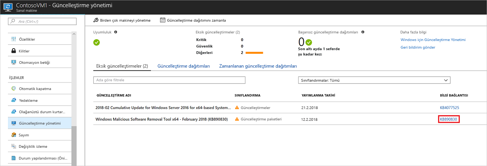
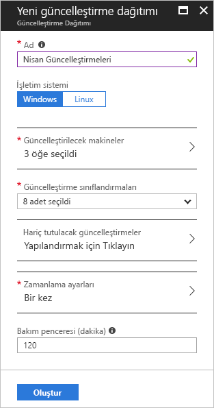
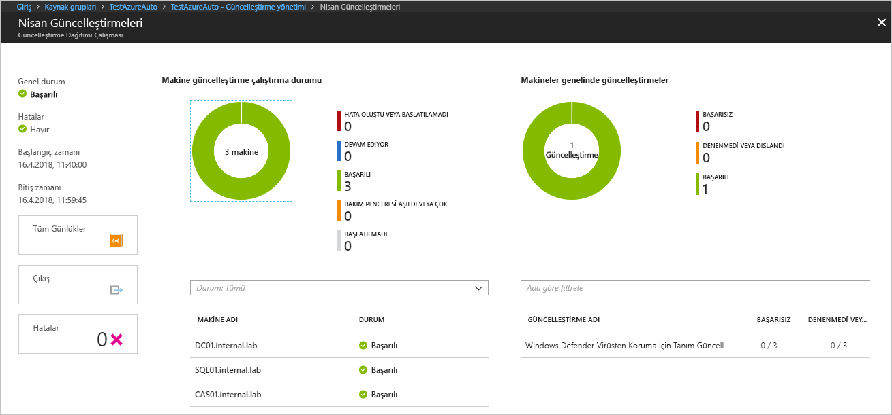

# Azure Otomasyonu'nu kullanarak Windows güncelleştirmelerini yönetme

Güncelleştirme Yönetimi çözümünü kullanarak sanal makineleriniz için güncelleştirmeleri ve yamaları yönetebilirsiniz. Bu öğreticide kullanılabilir durumdaki güncelleştirmelerin durumunu değerlendirmeyi, gerekli güncelleştirmelerin yüklenmesini zamanlamayı, dağıtım sonuçlarını gözden geçirmeyi ve güncelleştirmelerin başarılı bir şekilde uygulandığını doğrulamak için bir uyarı oluşturmayı öğreneceksiniz.

Fiyatlandırma bilgisi için bkz. [Güncelleştirme Yönetimi için Otomasyon fiyatlandırması](https://azure.microsoft.com/pricing/details/automation/).

Bu öğreticide şunların nasıl yapıldığını öğreneceksiniz:

> [!div class="checklist"]
> * Güncelleştirme Yönetimi için VM ekleme
> * Güncelleştirme değerlendirmesini görüntüleme
> * Uyarıları yapılandırma
> * Güncelleştirme dağıtımı zamanlama
> * Dağıtım sonuçlarını görüntüleme

## Önkoşullar

Bu öğreticiyi tamamlamak için aşağıdakiler gerekir:

* Azure aboneliği. Henüz bir aboneliğiniz yoksa [Visual Studio aboneleri için aylık Azure kredinizi etkinleştirebilir](https://azure.microsoft.com/pricing/member-offers/msdn-benefits-details/) ya da [ücretsiz hesap](https://azure.microsoft.com/free/?WT.mc_id=A261C142F) için kaydolabilirsiniz.
* İzleyiciyi, eylem runbook'larını ve İzleyici Görevi'ni barındıracak bir [Azure Otomasyonu hesabı](automation-offering-get-started.md).
* Sisteme eklenecek bir [sanal makine](../virtual-machines/windows/quick-create-portal.md).

## Azure'da oturum açma

https://portal.azure.com adresinden Azure portalında oturum açın.

## Güncelleştirme Yönetimi’ni etkinleştirme

Bu öğretici için öncelikle VM'nizde Güncelleştirme Yönetimi'ni etkinleştirin:

1. Azure portalda sol taraftaki menüden **Sanal makineler**'i seçin. Listeden bir VM seçin.
2. VM sayfasının **İŞLEMLER** bölümünde **Güncelleştirme yönetimi**'ni seçin. **Güncelleştirme Yönetimini Etkinleştirme** sayfası açılır.

Bu VM için Güncelleştirme Yönetimi özelliğinin etkin olup olmadığını belirlemek için doğrulama gerçekleştirilir. Bu doğrulama kapsamında Azure Log Analytics çalışma alanı ve bağlantılı Otomasyon hesabının yanı sıra Güncelleştirme Yönetimi çözümünün çalışma alanında olup olmadığı kontrol edilir.

[Log Analytics](../log-analytics/log-analytics-overview.md?toc=%2fazure%2fautomation%2ftoc.json) çalışma alanı, Güncelleştirme Yönetimi gibi özellikler ve hizmetler tarafından oluşturulan verileri toplamak için kullanılır. Çalışma alanı, birden fazla kaynaktan alınan verilerin incelenip analiz edilebileceği ortak bir konum sağlar.

Doğrulama işlemi ayrıca VM'nin Microsoft Monitoring Agent (MMA) ve Otomasyon Karma Runbook Çalışanı ile sağlanıp sağlanmadığını da kontrol eder. Bu aracı, Azure Otomasyonu ile iletişim kurmak ve güncelleştirme durumu hakkında bilgi almak için kullanılır. Aracı, Azure Otomasyonu hizmetiyle iletişim kurmak ve güncelleştirmeleri indirmek için 443 numaralı bağlantı noktasının açık olmasını gerektirir.

Ekleme sırasında aşağıdaki önkoşullardan birinin karşılanmadığı tespit edilirse ilgili önkoşul otomatik olarak eklenir:

* [Log Analytics](../log-analytics/log-analytics-overview.md?toc=%2fazure%2fautomation%2ftoc.json) çalışma alanı
* Bir [Otomasyon hesabı](./automation-offering-get-started.md)
* Bir [Karma Runbook Çalışanı](./automation-hybrid-runbook-worker.md) (VM üzerinde etkin)

**Güncelleştirme Yönetimi** bölümünde konumu, Log Analytics çalışma alanını ve kullanılacak Otomasyon hesabını belirleyin. Ardından **Etkinleştir**'i seçin. Bu seçeneklerin olmaması VM için etkinleştirilmiş başka bir otomasyon çözümü olduğunu gösterir. Bu durumda aynı çalışma alanını ve Otomasyon hesabı kullanılmalıdır.

Çözümün etkinleştirilmesi birkaç dakika sürebilir. Bu süre boyunca tarayıcı penceresini kapatmayın. Çözüm etkinleştirildikten sonra VM'deki güncelleştirmeleri eksik hakkında bilgi Azure İzleyici günlüklerine akar. Verilerin çözümlemeye hazır hale gelmesi 30 dakika ile 6 saat arasında sürebilir.

## Güncelleştirme değerlendirmesini görüntüleme

Güncelleştirme Yönetimi etkinleştirildikten sonra **Güncelleştirme yönetimi** bölmesi açılır. Varsa **Eksik güncelleştirmeler** sekmesinde eksik güncelleştirmelerin bir listesi gösterilir.

Güncelleştirmeyle ilgili destek makalesini ayrı bir pencerede açmak için **BİLGİ BAĞLANTISI** bölümünden güncelleştirme bağlantısını seçin. Bu pencereden güncelleştirmeyle ilgili önemli bilgilere ulaşabilirsiniz.

Güncelleştirmenin başka bir alanına tıkladığınızda seçilen güncelleştirmeye ait **Günlük Araması** bölmesi açılır. Günlük araması sorgusu ilgili güncelleştirmeye göre önceden tanımlanmıştır. Bu sorguyu değiştirebilir veya kendi sorgunuzu oluşturarak ortamınıza dağıtılmış olan veya ortamınızda eksik olan güncelleştirmeler hakkında ayrıntılı bilgilere ulaşabilirsiniz.

## Uyarı yapılandırma

Bu adımda, bir güncelleştirme dağıtım durumu bildiren bir uyarı ayarlamayı öğrenin.

### Uyarı koşulları

Otomasyon hesabınızda altında **izleme** Git **uyarılar**ve ardından **+ yeni uyarı kuralı**.

Otomasyon hesabınızı kaynak olarak zaten seçildi. Bunu değiştirmek istiyorsanız tıklayabilirsiniz **seçin** ve **bir kaynak seçin** sayfasında **Otomasyon hesapları** içinde **kaynaktürünegörefiltrele** açılır. Otomasyon Hesabınızı ve ardından **Bitti**'yi seçin.

Tıklayın **koşul Ekle** güncelleştirme dağıtımınız için uygun olan sinyal seçin. Aşağıdaki tabloda iki kullanılabilir sinyaller güncelleştirme dağıtımlarının ayrıntılarını gösterir:

|Sinyal adı|Boyutlar|Açıklama|
|---|---|---|
|**Toplam güncelleştirme dağıtım çalışmaları**|-Güncelleştirme dağıtımı adı -Status|Bu sinyal kullanılan uyarı güncelleştirme dağıtımı genel durumu üzerinde.|
|**Toplam güncelleştirme dağıtım makine çalıştırması yok**|-Güncelleştirme dağıtımı adı -Status -Hedef bilgisayar -Güncelleştirme dağıtımı çalıştırma kimliği|Bu sinyal kullanılan uyarı verilmesi belirli makinelere hedeflenen bir güncelleştirme dağıtım durumu|

Boyut değerleri için geçerli bir değer listeden seçin. Aradığınız değer listesinde değilse **\+** oturum yanında boyut ve özel adını yazın. Ardından aramak istediğiniz değeri seçebilirsiniz. Tüm değerleri bir boyut seçin. isterseniz, **seçin \***  düğmesi. Bir boyut için bir değer seçmezseniz, değerlendirme sırasında söz konusu boyut yoksayılır.

**Uyarı mantığı** bölümünde **Eşik** alanına **1** değerini girin. İşiniz bittiğinde **Bitti**'yi seçin.

### Uyarı ayrıntıları

**2. Uyarı ayrıntılarını tanımlama** bölümünde uyarı adını ve açıklamasını girin. **Önem Derecesi**'ni başarılı çalıştırmalar için **Bilgilendirici (Önem Derecesi 2)**, başarısız çalıştırmalar içinse **Bilgilendirici (Önem Derecesi 1)** olarak ayarlayın.

Altında **Eylem grupları**seçin **Yeni Oluştur**. Eylem grubu, birden çok uyarıda kullanabileceğiniz eylemlerden oluşan bir gruptur. Eylemlere e-posta bildirimleri, runbook'lar, web kancaları ve diğer birçok şey dahildir. Eylem grupları hakkında daha fazla bilgi edinmek için bkz. [Eylem grupları oluşturma ve yönetme](../azure-monitor/platform/action-groups.md).

**Eylem grubu adı** kutusuna uyarı için ad ve kısa ad. Bu eylem grubu kullanılarak bildirim gönderildiğinde tam grup adı yerine kısa ad kullanılır.

**Eylemler** bölümünde eyleme için **E-posta Bildirimleri** gibi bir ad girin. **EYLEM TÜRÜ** bölümünde **E-posta/SMS/Anında İletme/Ses**'i seçin. **AYRINTILAR** bölümünden **Ayrıntıları düzenle**’yi seçin.

**E-posta/SMS/Anında İletme/Ses** bölmesine bir ad girin. **E-posta** onay kutusunu seçip geçerli bir e-posta adresi girin.

**E-posta/SMS/Anında İletme/Ses** bölmesinde **Tamam**'ı seçin. **Eylem grubu ekle** bölmesinde **Tamam**'ı seçin.

Uyarı e-postasının konusunu özelleştirmek için **Eylemleri Özelleştirin** bölümündeki **Kural oluştur**, kısmında **E-posta konusu**'nu seçin. İşleminiz bittiğinde **Uyarı kuralı oluştur**'u seçin. Bu uyarı, bir güncelleştirme dağıtımı başarılı olduğunda sizi uyarır ve güncelleştirme dağıtımı çalıştırmasının hangi makineleri kapsadığını bildirir.

## Güncelleştirme dağıtımı zamanlama

Şimdi güncelleştirmeleri yüklemek için yayın zamanlamanızı ve hizmet pencerenizi izleyen bir dağıtım zamanlayın. Dağıtıma hangi güncelleştirme türlerinin dahil edileceğini seçebilirsiniz. Örneğin, kritik güncelleştirmeleri veya güvenlik güncelleştirmelerini dahil edip güncelleştirme paketlerini dışlayabilirsiniz.

Yeni bir VM güncelleştirme dağıtımı zamanlamak için **Güncelleştirme yönetimi**'ne gidip **Güncelleştirme dağıtımı zamanla**'yı seçin.

**Yeni güncelleştirme dağıtımı** bölümüne aşağıdaki bilgileri girin:

* **Ad**: Güncelleştirme dağıtımı için benzersiz bir ad girin.

* **İşletim sistemi**: İşletim sistemi güncelleştirmesi dağıtımı için hedef seçin.

* **(Önizleme) güncelleştirmek için grupları**: Abonelik, kaynak grupları, konumları ve etiketleri, dağıtımınızdaki dahil etmek için Azure vm'leri dinamik bir grup oluşturmak için bir birleşimini temel bir sorgu tanımlarsınız. Daha fazla bilgi için bkz: [dinamik gruplar](automation-update-management.md#using-dynamic-groups)

* **Güncelleştirilecek makineler**: İçeri aktarılan grubu, kayıtlı bir aramayı seçin veya makine açılan listeden seçin ve tek bir makine seçin. **Makineler**'i seçerseniz makinenin hazır olma durumu **GÜNCELLEŞTİRME ARACISI HAZIRLIĞI** sütununda gösterilir. Azure İzleyici günlüklerine bilgisayar grupları oluşturma farklı yöntemleri hakkında bilgi edinmek için bkz: [Azure İzleyici günlüklerine bilgisayar grupları](../azure-monitor/platform/computer-groups.md)

* **Güncelleştirme sınıflandırması**: Güncelleştirme dağıtımının dağıtıma dahil yazılım türlerini seçin. Bu öğreticide tüm türleri seçili halde bırakın.

  Sınıflandırma türleri şunlardır:

   |İşletim Sistemi  |Tür  |
   |---------|---------|
   |Windows     | Kritik güncelleştirmeler Güvenlik güncelleştirmeleri Güncelleştirme paketleri Özellik paketleri Hizmet paketleri Tanım güncelleştirmeleri Araçlar Güncelleştirmeler        |
   |Linux     | Kritik güncelleştirmeler ve güvenlik güncelleştirmeleri Diğer güncelleştirmeler       |

   Sınıflandırma türlerinin açıklaması için bkz. [sınıflandırmaları güncelleştirme](automation-update-management.md#update-classifications).

* **Dahil edilecek/dışlanacak güncelleştirmeler** - Böylece **Dahil Et / Dışla** sayfası açılır. Dahil edilecek veya dışlanacak güncelleştirmeler ayrı sekmelerdedir. Ekleme nasıl ele alındığını daha fazla bilgi için bkz: [ekleme davranışı](automation-update-management.md#inclusion-behavior)

* **Zamanlama ayarları**: **Zamanlama ayarları** bölmesi açılır. Varsayılan başlangıç zamanı, geçerli zamandan 30 dakika sonradır. Başlangıç zamanını en düşük 10 dakika olmak üzere istediğiniz değere ayarlayabilirsiniz.

   Ayrıca, dağıtımın bir kez gerçekleşeceğini belirtebilir veya yinelenen bir zamanlama ayarlayabilirsiniz. **Yinelenme** bölümünde **Bir Kez**'i seçin. Varsayılan 1 gün değerini bırakın ve **Tamam**'ı seçin. Yinelenen bir zamanlama oluşturulur.

* **Önceden komutlar + sonrası betiklerini**: Önce ve sonra dağıtımınız betiklerin seçin. Daha fazla bilgi için bkz. [Ön ve Son betikleri yönetme](pre-post-scripts.md).
* **Bakım penceresi (dakika)**: Varsayılan değeri değiştirmeyin. Güncelleştirme dağıtımının gerçekleşmesini istediğiniz zaman aralığını belirtebilirsiniz. Bu ayar, değişikliklerin sizin tanımladığınız hizmet pencereleri içinde gerçekleştirilmesini sağlar.

* **Yeniden başlatma seçenekleri**: Bu ayar, yeniden başlatma işlemlerini nasıl işleneceğini belirler. Kullanılabilen seçenekler:
  * Gerekirse yeniden başlat (Varsayılan)
  * Her zaman yeniden başlat
  * Hiçbir zaman yeniden başlatma
  * Yalnızca yeniden başlatma - güncelleştirmeleri yüklemez

Zamanlamayı yapılandırdıktan sonra **Oluştur**'u seçin.

Durum panosu açılır. Oluşturduğunuz dağıtım zamanlamasını göstermek için **Zamanlanan güncelleştirme dağıtımları**'nı seçin.

> [!NOTE]
> Güncelleştirme Yönetimi, birinci taraf güncelleştirmelerini ve indirme öncesi yamalarını dağıtmayı destekler. Bu işlem sistemlerdeki değişikliklere yama yapılmasını gerektirir. Sistemlerinde bu ayarları yapılandırmayı öğrenmek için bkz. [birinci taraf ve indirme öncesi destek](automation-update-management.md#firstparty-predownload).

## Güncelleştirme dağıtımının sonuçlarını görüntüleme

Zamanlanmış dağıtım başladıktan sonra, bu dağıtımın durumunu **Güncelleştirme yönetimi** bölümündeki **Güncelleştirme dağıtımları** sekmesinde görebilirsiniz. Dağıtım o anda çalışıyorsa, durum **Sürüyor** şeklinde olur. Dağıtım tamamlandıktan sonra başarılıysa durumu **Başarılı** olarak değişir. Dağıtımdaki bir veya daha fazla güncelleştirme ile ilgili hata varsa durum **Kısmen başarısız** şeklindedir.

Tamamlanan güncelleştirme dağıtımını seçerek bu güncelleştirme dağıtımının panosunu görebilirsiniz.

**Güncelleştirme sonuçları** bölümünde toplam güncelleştirme sayısının bir özeti ve VM'deki dağıtım sonuçları gösterilir. Sağdaki tabloda her güncelleştirmenin ayrıntılı bir dökümü ile yükleme sonuçları gösterilir.

Aşağıdaki listede görüntülenebilecek değerler gösterilmiştir:

* **Denenmedi**: Tanımlanan bakım penceresi süresine göre yeterli süre olmadığından güncelleştirme yüklü değildi.
* **Başarılı**: Güncelleştirme başarılı oldu.
* **Başarısız**: Güncelleştirme başarısız oldu.

Dağıtımın oluşturduğu tüm günlük girişlerini görmek için **Tüm günlükler**’i seçin.

Hedef VM'de güncelleştirme dağıtımını yönetmekten sorumlu runbook'un iş akışını görmek için **Çıktı**'yı seçin.

Dağıtımla ilgili her türlü hata hakkında ayrıntılı bilgiler için **Hatalar**’ı seçin.

Güncelleştirme dağıtımınız başarılı olursa, dağıtımın başarılı olduğunu göstermek için aşağıdaki örneğe benzer bir e-posta gönderilir:

## Sonraki adımlar

Bu öğreticide, şunların nasıl yapıldığını öğrendiniz:

> [!div class="checklist"]
> * Güncelleştirme Yönetimi için VM ekleme
> * Güncelleştirme değerlendirmesini görüntüleme
> * Uyarıları yapılandırma
> * Güncelleştirme dağıtımı zamanlama
> * Dağıtım sonuçlarını görüntüleme

Güncelleştirme Yönetimi çözümüne genel bakış bölümüne geçin.

> [!div class="nextstepaction"]
> [Güncelleştirme Yönetimi çözümü](../operations-management-suite/oms-solution-update-management.md?toc=%2fazure%2fautomation%2ftoc.json)

