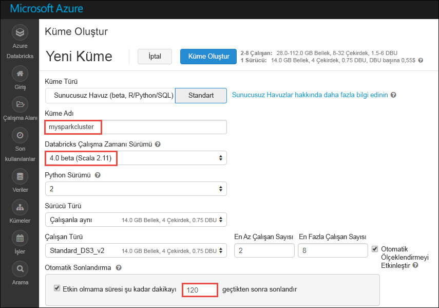

# <a name="tutorial-sentiment-analysis-on-streaming-data-using-azure-databricks"></a>Öğretici: Azure Databricks kullanarak akış verileri üzerinde yaklaşım analizi

Bu öğreticide, Azure Databricks kullanarak neredeyse gerçek zamanlı veri akışı ile ilgili yaklaşım analizi çalıştırmak öğrenin. Azure Event Hubs’ı kullanarak veri alımı sistemini ayarlarsınız. Spark Event Hubs bağlayıcısını kullanarak Event Hubs’tan Azure Databricks’e iletileri kullanırsınız. Son olarak, akışa alınan verilerle ilgili yaklaşım analizi çalıştırmak için Microsoft Bilişsel Hizmet API’lerini kullanırsınız.

Bu öğreticinin sonunda, Twitter’daki "Azure" terimini içeren tweet’leri alır ve bu tweet’ler ile ilgili yaklaşım analizi çalıştırmış olursunuz.

Aşağıdaki şekilde uygulama akışı gösterilmektedir:


Bu öğretici aşağıdaki görevleri kapsar:

> [!div class="checklist"]
> * Azure Databricks çalışma alanı oluşturma
> * Azure Databricks’te Spark kümesi oluşturma
> * Akış verilerine erişmek için bir Twitter uygulaması oluşturma
> * Azure Databricks’te not defterleri oluşturma
> * Event Hubs ve Twitter API’si için kitaplıklar ekleme
> * Microsoft Bilişsel Hizmetler hesabı oluşturma ve erişim anahtarını alma
> * Event Hubs’a tweet’ler gönderme
> * Event Hubs’tan tweet’leri okuma
> * Tweet’lerle ilgili yaklaşım analizi çalıştırma

Azure aboneliğiniz yoksa başlamadan önce [ücretsiz bir hesap oluşturun](https://azure.microsoft.com/free/).

> [!Note]
> Kullanarak bu öğreticiyi gerçekleştirilmesi **Azure ücretsiz deneme aboneliği**.
> Azure Databricks kümesini oluşturmak için ücretsiz hesap oluşturmak istiyorsanız kümeyi oluşturmadan önce profilinize gidin ve aboneliğini **kullandıkça öde** modeline geçirin. Daha fazla bilgi için bkz. [Ücretsiz Azure hesabı](https://azure.microsoft.com/free/).

## <a name="prerequisites"></a>Önkoşullar

Bu öğreticiye başlamadan önce aşağıdaki gereksinimlerin karşılandığından emin olun:
- Azure Event Hubs ad alanı.
- Ad alanı içinde bir Olay Hub’ı.
- Event Hubs ad alanına erişmek için bağlantı dizesi. Bağlantı dizesi şuna benzer bir biçimde olmalıdır: `Endpoint=sb://<namespace>.servicebus.windows.net/;SharedAccessKeyName=<key name>;SharedAccessKey=<key value>`.
- Event Hubs için paylaşılan erişim ilkesi adı ve ilke anahtarı.

[Azure Event Hubs ad alanı ve olay hub’ı oluşturma](../event-hubs/event-hubs-create.md) başlıklı makaledeki adımları tamamlayarak bu gereksinimleri karşılayabilirsiniz.

## <a name="log-in-to-the-azure-portal"></a>Azure portalında oturum açma

[Azure Portal](https://portal.azure.com/)’da oturum açın.

## <a name="create-an-azure-databricks-workspace"></a>Azure Databricks çalışma alanı oluşturma

Bu bölümde Azure portalını kullanarak bir Azure Databricks çalışma alanı oluşturursunuz.

1. Azure portalında **Kaynak oluşturun** > **Veri ve Analiz** > **Azure Databricks** seçeneklerini belirleyin.

    

3. **Azure Databricks Hizmeti** bölümünde, Databricks çalışma alanı oluşturmak için değerler sağlayın.

    

    Aşağıdaki değerleri sağlayın:

    |Özellik  |Açıklama  |
    |---------|---------|
    |**Çalışma alanı adı**     | Databricks çalışma alanınız için bir ad sağlayın        |
    |**Abonelik**     | Açılan listeden Azure aboneliğinizi seçin.        |
    |**Kaynak grubu**     | Yeni bir kaynak grubu oluşturmayı veya mevcut bir kaynak grubunu kullanmayı seçin. Kaynak grubu, bir Azure çözümü için ilgili kaynakları bir arada tutan kapsayıcıdır. Daha fazla bilgi için bkz. [Azure Kaynak Grubuna genel bakış](../azure-resource-manager/resource-group-overview.md). |
    |**Konum**     | **Doğu ABD 2**’yi seçin. Kullanılabilir diğer bölgeler için bkz. [Bölgeye göre kullanılabilir Azure hizmetleri](https://azure.microsoft.com/regions/services/).        |
    |**Fiyatlandırma Katmanı**     |  **Standart** veya **Premium** arasında seçim yapın. Bu katmanlar hakkında daha fazla bilgi için bkz. [Databricks fiyatlandırma sayfası](https://azure.microsoft.com/pricing/details/databricks/).       |

    **Panoya sabitle**’yi ve sonra **Oluştur**’u seçin.

4. Hesabın oluşturulması birkaç dakika sürer. Hesap oluşturma sırasında portal sağ tarafta **Azure Databricks için dağıtım gönderiliyor** kutucuğunu gösterir. Kutucuğu görmek için panonuzu sağa kaydırmanız gerekebilir. Ayrıca, ekranın üst kısmında gösterilen bir ilerleme çubuğu vardır. İlerleme durumu için her iki alanı da izleyebilirsiniz.

    

## <a name="create-a-spark-cluster-in-databricks"></a>Databricks’te Spark kümesi oluşturma

1. Azure portalında, oluşturduğunuz Databricks çalışma alanına gidin ve sonra **Çalışma Alanını Başlat**’ı seçin.

2. Azure Databricks portalına yönlendirilirsiniz. Portaldan **Küme**’yi seçin.

    

3. **Yeni küme** sayfasında, bir küme oluşturmak için değerleri girin.

    

    Aşağıdakiler dışında diğer tüm varsayılan değerleri kabul edin:

   * Küme için bir ad girin.
   * Bu makale için **4.0 (beta)** çalışma zamanıyla bir küme oluşturun.
   * **\_\_ dakika işlem yapılmadığında sonlandır** onay kutusunu seçtiğinizden emin olun. Küme kullanılmazsa kümenin sonlandırılması için biz süre (dakika cinsinden) belirtin.

     **Küme oluştur**’u seçin. Küme çalışmaya başladıktan sonra kümeye not defterleri ekleyebilir ve Spark işleri çalıştırabilirsiniz.

## <a name="create-a-twitter-application"></a>Twitter uygulaması oluşturma

Tweet’lerin akışını almak için Twitter’da bir uygulama oluşturmanız gerekir. Adımları izleyerek bir Twitter uygulaması oluşturun ve bu öğreticiyi tamamlamak için ihtiyaç duyduğunuz değerleri kaydedin.

1. Bir web tarayıcısından [Twitter Uygulama Yönetimi](https://apps.twitter.com/)’ne gidip **Yeni Uygulama Oluştur**’u seçin.

    

2. **Uygulama oluşturun** sayfasında yeni uygulamaya ilişkin ayrıntıları sağlayın ve **Kendi Twitter uygulamanızı oluşturun**’u seçin.

    

3. Uygulama sayfasında **Anahtarlar ve Erişim Belirteçleri** sekmesini seçin ve **Tüketici Anahtarı** ve **Tüketici Parolası** değerlerini kopyalayın. Ayrıca **Erişim belirtecimi oluştur**’u seçip erişim belirteçleri oluşturun. **Erişim Belirteci** ve**Erişim Belirteci Parolası** değerlerini kopyalayın.

    

Twitter uygulaması için aldığınız değerleri kaydedin. Öğreticinin sonraki bölümlerinde bu değerlere ihtiyacınız olacaktır.

## <a name="attach-libraries-to-spark-cluster"></a>Spark kümesine kitaplıklar ekleme

Bu öğreticide, Event Hubs’a tweet’ler göndermek için Twitter API’lerini kullanırsınız. Azure Event Hubs’a verileri okuyup yazmak için de [Apache Spark Event Hubs bağlayıcısını](https://github.com/Azure/azure-event-hubs-spark) kullanırsınız. Kümenizin parçası olarak bu API’leri kullanmak için, Azure Databricks’e bunları kitaplıklar olarak ekler ve sonra Spark kümenizle ilişkilendirirsiniz. Aşağıdaki yönergeler, çalışma alanınızda **Paylaşılan** klasörüne kitaplığın nasıl ekleneceğini göstermektedir.

1. Azure Databricks çalışma alanında **Çalışma Alanı**’nı seçin ve sonra **Paylaşılan**’a sağ tıklayın. Bağlam menüsünden **Oluştur** > **Kitaplık** seçeneklerini belirleyin.

   

2. Yeni Kitaplık sayfasında **Kaynak** için **Maven Koordinatı**’nı seçin. **Koordinat** için, eklemek istediğiniz paketin koordinatını girin. Bu öğreticide kullanılan kitaplıklar için Maven koordinatları aşağıdaki gibidir:

   * Spark Event Hubs bağlayıcısı - `com.microsoft.azure:azure-eventhubs-spark_2.11:2.3.5`
   * Twitter API’si - `org.twitter4j:twitter4j-core:4.0.6`

     

3. **Kitaplık Oluştur**’u seçin.

4. Kitaplığı eklediğiniz klasörü seçin ve sonra kitaplık adını seçin.

    

5. Kitaplık sayfasında, kitaplığı kullanmak istediğiniz kümeyi seçin. Kitaplık başarıyla kümeyle ilişkilendirildikten sonra durum hemen **Eklenmiş** durumuna geçer.

    

6. Twitter paketi için şu adımları yineleyin, `twitter4j-core:4.0.6`.

## <a name="get-a-cognitive-services-access-key"></a>Bilişsel Hizmetler erişim anahtarını alma

Bu öğreticide kullandığınız [Microsoft Bilişsel hizmetler metin analizi API](../cognitive-services/text-analytics/overview.md) neredeyse gerçek zamanlı tweet akışı ile ilgili yaklaşım analizi çalıştırmak için. API'leri kullanmadan önce Azure'da bir Microsoft Bilişsel Hizmetler hesabı oluşturma ve metin analizi API'lerini kullanmak için bir erişim anahtarı almanız gerekir.

1. [Azure Portal](https://portal.azure.com/) oturum açın.

2. **+ Kaynak oluştur**’u seçin.

3. Azure Marketi bölümünde **Yapay Zeka ve Bilişsel Hizmetler** > **Metin Analizi API’si** seçeneklerini belirleyin.

    

4. **Oluştur** iletişim kutusunda aşağıdaki değerleri sağlayın:

    

   - Bilişsel Hizmetler hesabı için bir ad girin.
   - Hesabın oluşturulacağı Azure aboneliğini seçin.
   - Bir Azure konumu seçin.
   - Hizmet için bir fiyatlandırma katmanı seçin. Bilişsel Hizmetler fiyatlandırması hakkında daha fazla bilgi için bkz. [fiyatlandırma sayfası](https://azure.microsoft.com/pricing/details/cognitive-services/).
   - Yeni bir kaynak grubu oluşturun veya mevcut bir isteyip istemediğinizi belirtin.

     **Oluştur**’u seçin.

5. Hesap oluşturulduktan sonra gelen **genel bakış** sekmesinde **erişim anahtarlarını gösterme**.

    

    Ayrıca ekran görüntüsünde gösterildiği gibi uç nokta URL’sinin bir kısmını kopyalayın. Öğreticide bu URL’ye ihtiyacınız olacaktır.

6. **Anahtarları yönet** bölümünde, kullanmak istediğiniz anahtarın karşısındaki kopyala simgesini seçin.

    

7. Uç nokta URL’si ve erişim anahtarı için bu adımda aldığınız değerleri kaydedin. Daha sonra bu öğreticide gerekli olacak.

## <a name="create-notebooks-in-databricks"></a>Databricks’te not defterleri oluşturma

Bu bölümde, Databricks çalışma alanında aşağıdaki adlarla iki not defteri oluşturacaksınız

- **SendTweetsToEventHub** - Bu, Twitter’dan tweet’ler almak ve bunları Event Hubs’ta akışa almak için kullandığınız bir üretici not defteridir.
- **AnalyzeTweetsFromEventHub** - Bu, Event Hubs’tan tweet’leri okumak ve yaklaşım analizi çalıştırmak için kullandığınız bir tüketici not defteridir.

1. Sol bölmede **Çalışma Alanı**’nı seçin. **Çalışma Alanı** açılır listesinden **Oluştur**’u ve sonra **Not Defteri**’ni seçin.

    

2. **Not Defteri Oluştur** iletişim kutusuna **SendTweetsToEventHub** girin, dil olarak **Scala**’yı seçin ve daha önce oluşturduğunuz Spark kümesini seçin.

    

    **Oluştur**’u seçin.

3. **AnalyzeTweetsFromEventHub** not defterini oluşturma adımlarını yineleyin.

## <a name="send-tweets-to-event-hubs"></a>Event Hubs’a tweet’ler gönderme

İçinde **SendTweetsToEventHub** not defterine aşağıdaki kodu yapıştırın ve yer tutucuyu, daha önce oluşturduğunuz Twitter uygulamasının ve Event Hubs ad alanı için değerlerle değiştirin. Bu not defteri, gerçek zamanlı olarak "Azure" anahtar sözcüğünü içeren tweet’leri Event Hubs’ta akışa alır.

```scala
import java.util._
import scala.collection.JavaConverters._
import com.microsoft.azure.eventhubs._
import java.util.concurrent._

val namespaceName = "<EVENT HUBS NAMESPACE>"
val eventHubName = "<EVENT HUB NAME>"
val sasKeyName = "<POLICY NAME>"
val sasKey = "<POLICY KEY>"
val connStr = new ConnectionStringBuilder()
            .setNamespaceName(namespaceName)
            .setEventHubName(eventHubName)
            .setSasKeyName(sasKeyName)
            .setSasKey(sasKey)

val pool = Executors.newFixedThreadPool(1)
val eventHubClient = EventHubClient.create(connStr.toString(), pool)

def sendEvent(message: String) = {
  val messageData = EventData.create(message.getBytes("UTF-8"))
  eventHubClient.get().send(messageData)
  System.out.println("Sent event: " + message + "\n")
}

import twitter4j._
import twitter4j.TwitterFactory
import twitter4j.Twitter
import twitter4j.conf.ConfigurationBuilder

// Twitter configuration!
// Replace values below with yours

val twitterConsumerKey = "<CONSUMER KEY>"
val twitterConsumerSecret = "<CONSUMER SECRET>"
val twitterOauthAccessToken = "<ACCESS TOKEN>"
val twitterOauthTokenSecret = "<TOKEN SECRET>"

val cb = new ConfigurationBuilder()
  cb.setDebugEnabled(true)
  .setOAuthConsumerKey(twitterConsumerKey)
  .setOAuthConsumerSecret(twitterConsumerSecret)
  .setOAuthAccessToken(twitterOauthAccessToken)
  .setOAuthAccessTokenSecret(twitterOauthTokenSecret)

val twitterFactory = new TwitterFactory(cb.build())
val twitter = twitterFactory.getInstance()

// Getting tweets with keyword "Azure" and sending them to the Event Hub in realtime!

val query = new Query(" #Azure ")
query.setCount(100)
query.lang("en")
var finished = false
while (!finished) {
  val result = twitter.search(query)
  val statuses = result.getTweets()
  var lowestStatusId = Long.MaxValue
  for (status <- statuses.asScala) {
    if(!status.isRetweet()){
      sendEvent(status.getText())
    }
    lowestStatusId = Math.min(status.getId(), lowestStatusId)
    Thread.sleep(2000)
  }
  query.setMaxId(lowestStatusId - 1)
}

// Closing connection to the Event Hub
 eventHubClient.get().close()
```

Not defterlerini çalıştırmak için **SHIFT + ENTER** tuşlarına basın. Aşağıdaki kod parçacığında gösterildiği gibi bir çıktı görürsünüz. Çıktıdaki her olay, Event Hubs’a giren bir tweet’tir.

    Sent event: @Microsoft and @Esri launch Geospatial AI on Azure https://t.co/VmLUCiPm6q via @geoworldmedia #geoai #azure #gis #ArtificialIntelligence

    Sent event: Public preview of Java on App Service, built-in support for Tomcat and OpenJDK
    https://t.co/7vs7cKtvah
    #cloudcomputing #Azure

    Sent event: 4 Killer #Azure Features for #Data #Performance https://t.co/kpIb7hFO2j by @RedPixie

    Sent event: Migrate your databases to a fully managed service with Azure SQL Database Managed Instance | #Azure | #Cloud https://t.co/sJHXN4trDk

    Sent event: Top 10 Tricks to #Save Money with #Azure Virtual Machines https://t.co/F2wshBXdoz #Cloud

    ...
    ...

## <a name="read-tweets-from-event-hubs"></a>Event Hubs’tan tweet’leri okuma

**AnalyzeTweetsFromEventHub** not defterine aşağıdaki kodu yapıştırın ve yer tutucuyu, daha önce oluşturduğunuz Azure Event Hubs değerleriyle değiştirin. Bu not defteri, **SendTweetsToEventHub** not defterini kullanarak önceden Event Hubs’ta akışa alınan tweet’leri okur.

```scala
import org.apache.spark.eventhubs._

// Build connection string with the above information
val connectionString = ConnectionStringBuilder("<EVENT HUBS CONNECTION STRING>")
  .setEventHubName("<EVENT HUB NAME>")
  .build

val customEventhubParameters =
  EventHubsConf(connectionString)
  .setMaxEventsPerTrigger(5)

val incomingStream = spark.readStream.format("eventhubs").options(customEventhubParameters.toMap).load()

incomingStream.printSchema

// Sending the incoming stream into the console.
// Data comes in batches!
incomingStream.writeStream.outputMode("append").format("console").option("truncate", false).start().awaitTermination()
```

Aşağıdaki çıkışı alırsınız:

    root
     |-- body: binary (nullable = true)
     |-- offset: long (nullable = true)
     |-- seqNumber: long (nullable = true)
     |-- enqueuedTime: long (nullable = true)
     |-- publisher: string (nullable = true)
     |-- partitionKey: string (nullable = true)

    -------------------------------------------
    Batch: 0
    -------------------------------------------
    +------+------+--------------+---------------+---------+------------+
    |body  |offset|sequenceNumber|enqueuedTime   |publisher|partitionKey|
    +------+------+--------------+---------------+---------+------------+
    |[50 75 62 6C 69 63 20 70 72 65 76 69 65 77 20 6F 66 20 4A 61 76 61 20 6F 6E 20 41 70 70 20 53 65 72 76 69 63 65 2C 20 62 75 69 6C 74 2D 69 6E 20 73 75 70 70 6F 72 74 20 66 6F 72 20 54 6F 6D 63 61 74 20 61 6E 64 20 4F 70 65 6E 4A 44 4B 0A 68 74 74 70 73 3A 2F 2F 74 2E 63 6F 2F 37 76 73 37 63 4B 74 76 61 68 20 0A 23 63 6C 6F 75 64 63 6F 6D 70 75 74 69 6E 67 20 23 41 7A 75 72 65]                              |0     |0             |2018-03-09 05:49:08.86 |null     |null        |
    |[4D 69 67 72 61 74 65 20 79 6F 75 72 20 64 61 74 61 62 61 73 65 73 20 74 6F 20 61 20 66 75 6C 6C 79 20 6D 61 6E 61 67 65 64 20 73 65 72 76 69 63 65 20 77 69 74 68 20 41 7A 75 72 65 20 53 51 4C 20 44 61 74 61 62 61 73 65 20 4D 61 6E 61 67 65 64 20 49 6E 73 74 61 6E 63 65 20 7C 20 23 41 7A 75 72 65 20 7C 20 23 43 6C 6F 75 64 20 68 74 74 70 73 3A 2F 2F 74 2E 63 6F 2F 73 4A 48 58 4E 34 74 72 44 6B]            |168   |1             |2018-03-09 05:49:24.752|null     |null        |
    +------+------+--------------+---------------+---------+------------+

    -------------------------------------------
    Batch: 1
    -------------------------------------------
    ...
    ...

Çıkış ikili modda olduğundan, bunu dizeye dönüştürmek için aşağıdaki kod parçacığını kullanın.

```scala
import org.apache.spark.sql.types._
import org.apache.spark.sql.functions._

// Event Hub message format is JSON and contains "body" field
// Body is binary, so we cast it to string to see the actual content of the message
val messages =
  incomingStream
  .withColumn("Offset", $"offset".cast(LongType))
  .withColumn("Time (readable)", $"enqueuedTime".cast(TimestampType))
  .withColumn("Timestamp", $"enqueuedTime".cast(LongType))
  .withColumn("Body", $"body".cast(StringType))
  .select("Offset", "Time (readable)", "Timestamp", "Body")

messages.printSchema

messages.writeStream.outputMode("append").format("console").option("truncate", false).start().awaitTermination()
```

Çıkış şimdi aşağıdaki kod parçacığına benzer:

    root
     |-- Offset: long (nullable = true)
     |-- Time (readable): timestamp (nullable = true)
     |-- Timestamp: long (nullable = true)
     |-- Body: string (nullable = true)

    -------------------------------------------
    Batch: 0
    -------------------------------------------
    +------+-----------------+----------+-------+
    |Offset|Time (readable)  |Timestamp |Body
    +------+-----------------+----------+-------+
    |0     |2018-03-09 05:49:08.86 |1520574548|Public preview of Java on App Service, built-in support for Tomcat and OpenJDK
    https://t.co/7vs7cKtvah
    #cloudcomputing #Azure          |
    |168   |2018-03-09 05:49:24.752|1520574564|Migrate your databases to a fully managed service with Azure SQL Database Managed Instance | #Azure | #Cloud https://t.co/sJHXN4trDk    |
    |0     |2018-03-09 05:49:02.936|1520574542|@Microsoft and @Esri launch Geospatial AI on Azure https://t.co/VmLUCiPm6q via @geoworldmedia #geoai #azure #gis #ArtificialIntelligence|
    |176   |2018-03-09 05:49:20.801|1520574560|4 Killer #Azure Features for #Data #Performance https://t.co/kpIb7hFO2j by @RedPixie                                                    |
    +------+-----------------+----------+-------+
    -------------------------------------------
    Batch: 1
    -------------------------------------------
    ...
    ...

Artık, neredeyse gerçek zamanlı olarak Apache Spark için Event Hubs bağlayıcısını kullanarak Azure Databricks'e Azure Event Hubs verilerini yaptınız. Spark için Event Hubs bağlayıcısını kullanma hakkında daha fazla bilgi için [bağlayıcı belgesi](https://github.com/Azure/azure-event-hubs-spark/tree/master/docs)ne başvurun.

## <a name="run-sentiment-analysis-on-tweets"></a>Tweet’lerle ilgili yaklaşım analizi çalıştırma

Bu bölümde, Twitter API’si kullanılarak alınan tweet’lerde yaklaşım analizi çalıştıracaksınız. Bu bölüm için, aynı **AnalyzeTweetsFromEventHub** not defterine kod parçacıklarını eklersiniz.

Not defterine yeni bir kod hücresi ekleyerek başlayın ve aşağıda verilen kod parçacığını yapıştırın. Bu kod parçacığı, Dil ve Yaklaşım API’si ile çalışmaya yönelik veri türlerini tanımlar.

```scala
import java.io._
import java.net._
import java.util._

case class Language(documents: Array[LanguageDocuments], errors: Array[Any]) extends Serializable
case class LanguageDocuments(id: String, detectedLanguages: Array[DetectedLanguages]) extends Serializable
case class DetectedLanguages(name: String, iso6391Name: String, score: Double) extends Serializable

case class Sentiment(documents: Array[SentimentDocuments], errors: Array[Any]) extends Serializable
case class SentimentDocuments(id: String, score: Double) extends Serializable

case class RequestToTextApi(documents: Array[RequestToTextApiDocument]) extends Serializable
case class RequestToTextApiDocument(id: String, text: String, var language: String = "") extends Serializable
```

Yeni bir kod hücresi ekleyin ve aşağıda sağlanan kod parçacığını yapıştırın. Bu kod parçacığı, dil algılama ve yaklaşım analizi çalıştırmak için Metin Analizi API’sini çağırma işlevlerini içeren bir nesneyi tanımlar. Yer tutucuları (`<PROVIDE ACCESS KEY HERE>` ve `<PROVIDE REGION HERE>`), Bilişsel Hizmetler hesabınız için aldığınız değerlerle değiştirdiğinizden emin olun.

```scala
import javax.net.ssl.HttpsURLConnection
import com.google.gson.Gson
import com.google.gson.GsonBuilder
import com.google.gson.JsonObject
import com.google.gson.JsonParser
import scala.util.parsing.json._

object SentimentDetector extends Serializable {

    // Cognitive Services API connection settings
    val accessKey = "<PROVIDE ACCESS KEY HERE>"
    val host = "https://<PROVIDE REGION HERE>.api.cognitive.microsoft.com"
    val languagesPath = "/text/analytics/v2.0/languages"
    val sentimentPath = "/text/analytics/v2.0/sentiment"
    val languagesUrl = new URL(host+languagesPath)
    val sentimenUrl = new URL(host+sentimentPath)
    val g = new Gson

    def getConnection(path: URL): HttpsURLConnection = {
        val connection = path.openConnection().asInstanceOf[HttpsURLConnection]
        connection.setRequestMethod("POST")
        connection.setRequestProperty("Content-Type", "text/json")
        connection.setRequestProperty("Ocp-Apim-Subscription-Key", accessKey)
        connection.setDoOutput(true)
        return connection
    }

    def prettify (json_text: String): String = {
        val parser = new JsonParser()
        val json = parser.parse(json_text).getAsJsonObject()
        val gson = new GsonBuilder().setPrettyPrinting().create()
        return gson.toJson(json)
    }

    // Handles the call to Cognitive Services API.
    def processUsingApi(request: RequestToTextApi, path: URL): String = {
        val requestToJson = g.toJson(request)
        val encoded_text = requestToJson.getBytes("UTF-8")
        val connection = getConnection(path)
        val wr = new DataOutputStream(connection.getOutputStream())
        wr.write(encoded_text, 0, encoded_text.length)
        wr.flush()
        wr.close()

        val response = new StringBuilder()
        val in = new BufferedReader(new InputStreamReader(connection.getInputStream()))
        var line = in.readLine()
        while (line != null) {
            response.append(line)
            line = in.readLine()
        }
        in.close()
        return response.toString()
    }

    // Calls the language API for specified documents.
    def getLanguage (inputDocs: RequestToTextApi): Option[Language] = {
        try {
            val response = processUsingApi(inputDocs, languagesUrl)
            // In case we need to log the json response somewhere
            val niceResponse = prettify(response)
            // Deserializing the JSON response from the API into Scala types
            val language = g.fromJson(niceResponse, classOf[Language])
            if (language.documents(0).detectedLanguages(0).iso6391Name == "(Unknown)")
                return None
            return Some(language)
        } catch {
            case e: Exception => return None
        }
    }

    // Calls the sentiment API for specified documents. Needs a language field to be set for each of them.
    def getSentiment (inputDocs: RequestToTextApi): Option[Sentiment] = {
        try {
            val response = processUsingApi(inputDocs, sentimenUrl)
            val niceResponse = prettify(response)
            // Deserializing the JSON response from the API into Scala types
            val sentiment = g.fromJson(niceResponse, classOf[Sentiment])
            return Some(sentiment)
        } catch {
            case e: Exception => return None
        }
    }
}
```

Bir Spark yaklaşım belirleyen UDF (kullanıcı tanımlı işlev) tanımlamak için başka bir hücreye ekleyin.

```scala
// User Defined Function for processing content of messages to return their sentiment.
val toSentiment =
    udf((textContent: String) =>
        {
            val inputObject = new RequestToTextApi(Array(new RequestToTextApiDocument(textContent, textContent)))
            val detectedLanguage = SentimentDetector.getLanguage(inputObject)
            detectedLanguage match {
                case Some(language) =>
                    if(language.documents.size > 0) {
                        inputObject.documents(0).language = language.documents(0).detectedLanguages(0).iso6391Name
                        val sentimentDetected = SentimentDetector.getSentiment(inputObject)
                        sentimentDetected match {
                            case Some(sentiment) => {
                                if(sentiment.documents.size > 0) {
                                    sentiment.documents(0).score.toString()
                                }
                                else {
                                    "Error happened when getting sentiment: " + sentiment.errors(0).toString
                                }
                            }
                            case None => "Couldn't detect sentiment"
                        }
                    }
                    else {
                        "Error happened when getting language" + language.errors(0).toString
                    }
                case None => "Couldn't detect language"
            }
        }
    )
```

Tweet’in içeriği ve tweet ile ilişkili yaklaşım ile bir veri çerçevesi hazırlamak için son bir kod hücresi ekleyin.

```scala
// Prepare a dataframe with Content and Sentiment columns
val streamingDataFrame = incomingStream.selectExpr("cast (body as string) AS Content").withColumn("Sentiment", toSentiment($"Content"))

// Display the streaming data with the sentiment
streamingDataFrame.writeStream.outputMode("append").format("console").option("truncate", false).start().awaitTermination()
```

Aşağıdaki kod parçacığı gibi bir çıktı görmeniz gerekir:

    -------------------------------------------
    Batch: 0
    -------------------------------------------
    +--------------------------------+------------------+
    |Content                         |Sentiment         |
    +--------------------------------+------------------+
    |Public preview of Java on App Service, built-in support for Tomcat and OpenJDK
    https://t.co/7vs7cKtvah   #cloudcomputing #Azure          |0.7761918306350708|
    |Migrate your databases to a fully managed service with Azure SQL Database Managed Instance | #Azure | #Cloud https://t.co/sJHXN4trDk    |0.8558163642883301|
    |@Microsoft and @Esri launch Geospatial AI on Azure https://t.co/VmLUCiPm6q via @geoworldmedia #geoai #azure #gis #ArtificialIntelligence|0.5               |
    |4 Killer #Azure Features for #Data #Performance https://t.co/kpIb7hFO2j by @RedPixie                                                    |0.5               |
    +--------------------------------+------------------+

**Yaklaşım** sütununda bir değerin **1** değerine yakın olması, Azure deneyiminin mükemmel olduğunu ifade eder. Bir değerin **0** değerine yakın olması, kullanıcının Microsoft Azure ile çalışırken sorunlarla karşılaştığını ifade eder.

İşte bu kadar! Azure Databricks kullanarak verileri başarıyla yaptınız Azure Event Hubs'a, Event Hubs bağlayıcısını kullanarak akış verilerini kullandınız ve sonra verileri neredeyse gerçek zamanlı akış yaklaşım analizi çalıştırdınız.

## <a name="clean-up-resources"></a>Kaynakları temizleme

Öğreticiyi çalıştırdıktan sonra kümeyi sonlandırabilirsiniz. Bunu yapmak için Azure Databricks çalışma alanında sol bölmedeki **Kümeler**’i seçin. Sonlandırmak istediğiniz küme için imleci **Eylemler** sütunu altındaki üç noktanın üzerine taşıyın ve **Sonlandır** simgesini seçin.


El ile otomatik olarak durdurur küme sonlandırmazsanız, seçtiğiniz sağlanan **sonra Sonlandır \_ \_ yapılmadan geçecek dakika cinsinden** küme oluşturulurken onay kutusu. Böyle bir durumda, belirtilen süre boyunca etkin olmaması durumunda küme otomatik olarak durdurulur.

## <a name="next-steps"></a>Sonraki adımlar
Bu öğreticide, verileri Azure Event Hubs’ta akışa almak ve sonra gerçek zamanlı olarak Event Hubs’tan akış verilerini okumak için Azure Databricks’i kullanmayı öğrendiniz. Şunları öğrendiniz:
> [!div class="checklist"]
> * Azure Databricks çalışma alanı oluşturma
> * Azure Databricks’te Spark kümesi oluşturma
> * Akış verilerine erişmek için bir Twitter uygulaması oluşturma
> * Azure Databricks’te not defterleri oluşturma
> * Event Hubs ve Twitter API’si için kitaplıklar ekleme
> * Microsoft Bilişsel Hizmetler hesabı oluşturma ve erişim anahtarını alma
> * Event Hubs’a tweet’ler gönderme
> * Event Hubs’tan tweet’leri okuma
> * Tweet’lerle ilgili yaklaşım analizi çalıştırma

Azure Databricks kullanarak makine öğrenmesi görevleri gerçekleştirme hakkında bilgi edinmek için sonraki öğreticiye ilerleyin.

> [!div class="nextstepaction"]
>[Azure Databricks kullanılarak makine öğrenmesi](https://docs.azuredatabricks.net/spark/latest/mllib/decision-trees.html)
