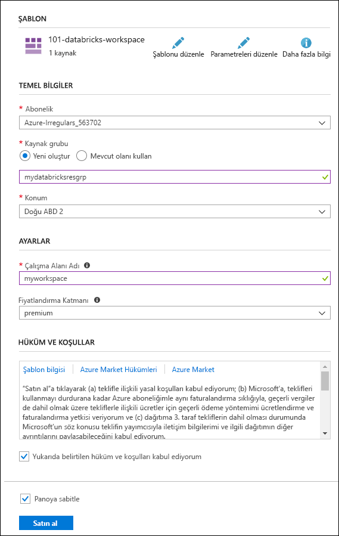

# <a name="quickstart-run-a-spark-job-on-azure-databricks-using-the-azure-resource-manager-template"></a>Hızlı Başlangıç: Azure Resource Manager şablonu kullanarak Azure Databricks'te Spark işini çalıştırma

Bu hızlı başlangıçta, Azure Resource Manager şablonu kullanarak bir Azure Databricks çalışma alanını oluşturma işlemi gösterilmektedir. Apache Spark kümesi oluşturmak ve Databricks kümesinde bir Spark işi çalıştırmak için çalışma alanını kullanırsınız. Azure Databricks hakkında daha fazla bilgi için bkz. [Azure Databricks nedir?](what-is-azure-databricks.md)

Bu hızlı başlangıçta, Spark işinin parçası olarak, demografiye dayalı ücretsiz/ücretli kullanıma yönelik öngörüler elde etmek için bir radyo kanalının abonelik verilerini analiz edersiniz.

Azure aboneliğiniz yoksa başlamadan önce [ücretsiz bir hesap oluşturun](https://azure.microsoft.com/free/).

> [!Note]
> Kullanarak bu öğreticiyi gerçekleştirilmesi **Azure ücretsiz deneme aboneliği**.
> Azure Databricks kümesini oluşturmak için ücretsiz hesap oluşturmak istiyorsanız kümeyi oluşturmadan önce profilinize gidin ve aboneliğini **kullandıkça öde** modeline geçirin. Daha fazla bilgi için bkz. [Ücretsiz Azure hesabı](https://azure.microsoft.com/free/).

## <a name="create-an-azure-databricks-workspace"></a>Azure Databricks çalışma alanı oluşturma

Bu bölümde, Azure Resource Manager şablonunu kullanarak bir Azure Databricks çalışma alanı oluşturursunuz.

1. Azure Portal'da bir şablonu açmak için aşağıdaki görüntüye tıklayın.

   <a href="https://portal.azure.com/#create/Microsoft.Template/uri/https%3A%2F%2Fraw.githubusercontent.com%2FAzure%2Fazure-quickstart-templates%2Fmaster%2F101-databricks-workspace%2Fazuredeploy.json" target="_blank"></a>

2. Azure Databricks çalışma alanınızı oluşturmak için gerekli değerleri sağlayın

   

   Aşağıdaki değerleri sağlayın:

   |Özellik  |Açıklama  |
   |---------|---------|
   |**Abonelik**     | Açılan listeden Azure aboneliğinizi seçin.        |
   |**Kaynak grubu**     | Yeni bir kaynak grubu oluşturmayı veya mevcut bir kaynak grubunu kullanmayı seçin. Kaynak grubu, bir Azure çözümü için ilgili kaynakları bir arada tutan kapsayıcıdır. Daha fazla bilgi için bkz. [Azure Kaynak Grubuna genel bakış](../azure-resource-manager/resource-group-overview.md). |
   |**Konum**     | **Doğu ABD 2**’yi seçin. Kullanılabilir diğer bölgeler için bkz. [Bölgeye göre kullanılabilir Azure hizmetleri](https://azure.microsoft.com/regions/services/).        |
   |**Çalışma alanı adı**     | Databricks çalışma alanınız için bir ad sağlayın        |
   |**Fiyatlandırma Katmanı**     |  **Standart** veya **Premium** arasında seçim yapın. Bu katmanlar hakkında daha fazla bilgi için bkz. [Databricks fiyatlandırma sayfası](https://azure.microsoft.com/pricing/details/databricks/).       |

3. **Yukarıdaki hüküm ve koşulları kabul ediyorum**'u ve ardından **Panoya sabitle**'yi seçip **Satın al**'a tıklayın.

4. Çalışma alanının oluşturulması birkaç dakika sürer. Çalışma alanı oluşturma sırasında portal sağ tarafta **Azure Databricks için dağıtım gönderiliyor** kutucuğunu gösterir. Kutucuğu görmek için panonuzu sağa kaydırmanız gerekebilir. Ayrıca, ekranın üst kısmında gösterilen bir ilerleme çubuğu vardır. İlerleme durumu için her iki alanı da izleyebilirsiniz.

   

## <a name="create-a-spark-cluster-in-databricks"></a>Databricks’te Spark kümesi oluşturma

1. Azure portalında, oluşturduğunuz Databricks çalışma alanına gidin ve sonra **Çalışma Alanını Başlat**’a tıklayın.

2. Azure Databricks portalına yönlendirilirsiniz. Portaldan **Küme**’ye tıklayın.

   

3. **Yeni küme** sayfasında, bir küme oluşturmak için değerleri girin.

   

   Aşağıdakiler dışında diğer tüm varsayılan değerleri kabul edin:

   * Küme için bir ad girin.
   * Bu makale için **4.0** çalışma zamanıyla bir küme oluşturun.
   * **\_\_ dakika işlem yapılmadığında sonlandır** onay kutusunu seçtiğinizden emin olun. Küme kullanılmazsa kümenin sonlandırılması için biz süre (dakika cinsinden) belirtin.

   **Küme oluştur**’u seçin. Küme çalışmaya başladıktan sonra kümeye not defterleri ekleyebilir ve Spark işleri çalıştırabilirsiniz.

Küme oluşturma hakkında daha fazla bilgi için bkz. [Azure Databricks üzerinde Spark kümesi oluşturma](https://docs.azuredatabricks.net/user-guide/clusters/create.html).

## <a name="run-a-spark-sql-job"></a>Spark SQL işi çalıştırma

Bu bölüme başlamadan önce aşağıdaki önkoşulları tamamlamanız gerekir:

* [Azure Blob depolama hesabı oluşturma](../storage/common/storage-quickstart-create-account.md).
* Örnek JSON dosyası indirmeniz [github'dan](https://github.com/Azure/usql/blob/master/Examples/Samples/Data/json/radiowebsite/small_radio_json.json).
* Örnek JSON dosyasını, oluşturduğunuz Azure Blob depolama hesabına yükleyin. Dosyaları karşıya yüklemek için [Microsoft Azure Depolama Gezgini](../vs-azure-tools-storage-manage-with-storage-explorer.md)’ni kullanabilirsiniz.

Databricks içinde bir not defteri oluşturmak, not defterini bir Azure Blob depolama hesabındaki verileri okuyacak şekilde yapılandırmak ve sonra veriler üzerinde bir Spark SQL işi çalıştırmak için aşağıdaki görevleri gerçekleştirin.

1. Sol bölmedeki **Çalışma Alanı**'na tıklayın. **Çalışma Alanı** açılır listesinden **Oluştur**’a ve sonra **Not Defteri**’ne tıklayın.

   

2. **Not Defteri Oluşturma** iletişim kutusuna bir ad girin, dil olarak **Scala**’yı seçin ve daha önce oluşturduğunuz Spark kümesini seçin.

   

   **Oluştur**’a tıklayın.

3. Bu adımda Azure Depolama hesabını Databricks Spark kümesiyle ilişkilendirin. Bu ilişkilendirmeyi gerçekleştirmenin iki yolu vardır. Azure Depolama hesabını Databricks Dosya Sistemine (DBFS) bağlayabilir veya Azure Depolama hesabına doğrudan oluşturduğunuz uygulamadan erişebilirsiniz.

   > [!IMPORTANT]
   >Bu makalede **depolamayı DBFS'ye bağlama** yaklaşımı kullanılır. Bu yaklaşım, bağlı deponun küme dosya sistemiyle ilişkilendirilmesini sağlar. Bu sayede kümeye erişen tüm uygulamalar ilişkilendirilmiş depolamayı da kullanabilir. Doğrudan erişim yaklaşımı, erişimi yapılandırdığınız uygulamayla kısıtlıdır.
   >
   > Bağlama yaklaşımını kullanmak için bu makalede seçtiğiniz Databricks çalışma zamanı sürüm **4.0** ile bir Spark kümesi oluşturmanız gerekir.

   Aşağıdaki kod parçacığında `{YOUR CONTAINER NAME}`, `{YOUR STORAGE ACCOUNT NAME}` ve`{YOUR STORAGE ACCOUNT ACCESS KEY}` değerlerini Azure Depolama hesabınız için uygun değerlerle değiştirin. Kod parçacığını not defterindeki boş bir hücreye yapıştırın ve sonra kod hücresini çalıştırmak için SHIFT + ENTER tuşlarına basın.

   * **Depolama hesabını DBFS'ye bağlayın (önerilen)**. Kod parçacığında Azure Depolama hesabı yolu `/mnt/mypath` yoluna bağlanır. Böylece ilerde Azure Depolama hesabına eriştiğiniz her durumda tam yolu vermenize gerek kalmaz. Yalnızca `/mnt/mypath` yolunu kullanabilirsiniz.

          dbutils.fs.mount(
            source = "wasbs://{YOUR CONTAINER NAME}@{YOUR STORAGE ACCOUNT NAME}.blob.core.windows.net/",
            mountPoint = "/mnt/mypath",
            extraConfigs = Map("fs.azure.account.key.{YOUR STORAGE ACCOUNT NAME}.blob.core.windows.net" -> "{YOUR STORAGE ACCOUNT ACCESS KEY}"))

   * **Depolama hesabına doğrudan erişme**

          spark.conf.set("fs.azure.account.key.{YOUR STORAGE ACCOUNT NAME}.blob.core.windows.net", "{YOUR STORAGE ACCOUNT ACCESS KEY}")

     Depolama hesabı anahtarınızı alma yönergeleri için bkz. [Depolama erişim anahtarlarınızı yönetme](../storage/common/storage-account-manage.md#access-keys).

   > [!NOTE]
   > Azure Data Lake Store’u Azure Databricks üzerine bir Spark kümesi ile de kullanabilirsiniz. Yönergeler için bkz. [Data Lake Store’u Azure Databricks ile Kullanma](https://docs.azuredatabricks.net/spark/latest/data-sources/azure/azure-datalake-gen2.html).

4. **small_radio_json.json** adlı örnek JSON veri dosyasındaki verileri kullanarak geçici tablo oluşturmak için bir SQL deyimi çalıştırın. Aşağıdaki kod parçacığında yer tutucu değerlerini kapsayıcınızın adı ve depolama hesabı adı ile değiştirin. Kod parçacığını not defterindeki bir kod hücresine yapıştırın ve sonra SHIFT + ENTER tuşlarına basın. Kod parçacığında `path` değeri, Azure Depolama hesabınıza yüklediğiniz örnek JSON dosyasının konumunu gösterir.

   ```sql
   %sql
   DROP TABLE IF EXISTS radio_sample_data;
   CREATE TABLE radio_sample_data
   USING json
   OPTIONS (
    path "/mnt/mypath/small_radio_json.json"
   )
   ```

   Komut başarıyla tamamlandıktan sonra, JSON dosyasındaki tüm verileri Databricks kümesinde tablo olarak görüntüleyebilirsiniz.

   `%sql` dili sihirli komutu, not defteri başka bir türde olsa bile not defterinden bir SQL kodu çalıştırmanızı sağlar. Daha fazla bilgi için bkz. [Bir not defterinde dilleri karıştırma](https://docs.azuredatabricks.net/user-guide/notebooks/index.html#mixing-languages-in-a-notebook).

5. Çalıştırdığınız sorguyu daha iyi anlamak için örnek JSON verilerinin bir anlık görüntüsüne bakalım. Kod hücresine aşağıdaki kod parçacığını yapıştırın ve **SHIFT + ENTER** tuşuna basın.

   ```sql
   %sql
   SELECT * from radio_sample_data
   ```

6. Aşağıdaki ekran görüntüsünde gösterildiği gibi bir tablo çıktısı görürsünüz (yalnızca bazı sütunlar gösterilmiştir):

   

   Diğer ayrıntılara ek olarak, örnek veriler bir radyo kanalının dinleyicilerinin yakalar (sütun adı **cinsiyet**) ve ücretsiz veya Ücretli aboneliğini olup (sütun adı **düzeyi**).

7. Bu durumda, bu verilerin her bir cinsiyet, ücretsiz hesaba sahip kullanıcı sayısı ve ücretli hesabı olan abone sayısı için gösterilecek görsel bir açıklamasını oluşturursunuz. Tablo çıktısının alt kısmında bulunan **Çubuk grafik** simgesine ve sonra **Çizim Seçenekleri**’ne tıklayın.

   

8. **Çizimi Özelleştir** menüsünde, değerleri ekran görüntüsünde gösterilen şekilde sürükleyip bırakın.

   

   * **Anahtarlar**’ı **cinsiyet** olarak ayarlayın.
   * **Seri gruplandırmalar**’ı **düzey** olarak ayarlayın.
   * **Değerler**’ı **düzey** olarak ayarlayın.
   * **Toplama**’yı **SAYI** olarak ayarlayın.

   **Uygula**'ya tıklayın.

9. Çıktı aşağıdaki ekran görüntüsünde gösterildiği gibi görsel açıklamayı gösterir:

   

## <a name="clean-up-resources"></a>Kaynakları temizleme

Makaleyi tamamladıktan sonra kümeyi sonlandırabilirsiniz. Bunu yapmak için Azure Databricks çalışma alanında sol bölmedeki **Kümeler**’i seçin. Sonlandırmak istediğiniz küme için imleci **Eylemler** sütunu altındaki üç noktanın üzerine taşıyın ve **Sonlandır** simgesini seçin.


El ile otomatik olarak durdurur küme sonlandırmazsanız, seçtiğiniz sağlanan **sonra Sonlandır \_ \_ yapılmadan geçecek dakika cinsinden** küme oluşturulurken onay kutusu. Böyle bir durumda, belirtilen süre boyunca etkin olmaması durumunda küme otomatik olarak durdurulur.

## <a name="next-steps"></a>Sonraki adımlar

Bu makalede, Azure Databricks’te bir Spark kümesi oluşturdunuz ve Azure depolama alanındaki verileri kullanarak bir Spark işi çalıştırdınız. Diğer veri kaynaklarından Azure Databricks’e verileri aktarma hakkında bilgi almak için [Spark veri kaynakları](https://docs.azuredatabricks.net/spark/latest/data-sources/index.html) bölümüne de bakabilirsiniz. [Özel VNET adresi ile Azure Databricks çalışma alanı oluşturmak](https://github.com/Azure/azure-quickstart-templates/tree/master/101-databricks-workspace-with-custom-vnet-address) için Resource Manager şablonuna da bakabilirsiniz. JSON söz dizimi ve bir şablonunda kullanmak için özellikler için bkz: [Microsoft.Databricks/workspaces](/azure/templates/microsoft.databricks/workspaces) şablon başvurusu.

Azure Databricks kullanılarak bir ETL işleminin (verileri ayıklama, dönüştürme ve yükleme) nasıl gerçekleştirileceğini öğrenmek için sonraki makaleye ilerleyin.

> [!div class="nextstepaction"]
> [Azure Databricks kullanarak verileri ayıklama, dönüştürme ve yükleme](databricks-extract-load-sql-data-warehouse.md)
