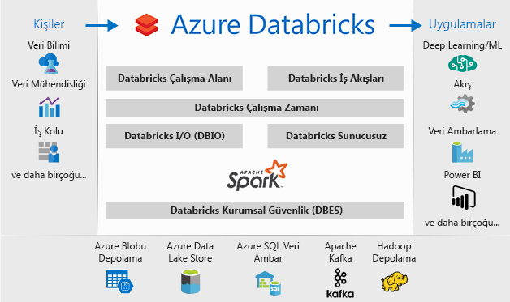

# Azure Databricks nedir?

Azure Databricks, Microsoft Azure bulut hizmetleri platformu için iyileştirilen Apache Spark tabanlı bir analiz platformudur. Apache Spark’ın kurucuları ile birlikte tasarlanan Databricks, tek tıklama ile kurulum olanağı ve kolaylaştırılmış iş akışlarının yanı sıra veri uzmanları, veri mühendisleri ve iş analistleri arasında işbirliği sağlayan etkileşimli bir çalışma alanı sunmak amacıyla Azure ile tümleştirilmiştir.

Azure Databricks hızlı, kolay ve işbirliğine dayalı Apache Spark tabanlı analiz hizmetidir. Büyük veri için bir işlem hattı, verileri (ham veya yapılandırılmış) Azure Data Factory aracılığıyla azure'da toplu olarak alınan veya kullanarak neredeyse gerçek zamanlı akış Kafka, olay hub'ı veya IOT hub'ı. Bu veri bölgesi için uzun vadeli bir veri gölü'nde, depolama, Azure Blob Depolama veya Azure Data Lake Storage kalıcı. Analytics akışınızın bir parçası verileri gibi birden çok veri kaynağından okumak için Azure Databricks'i kullanmayı [Azure Blob Depolama](../storage/blobs/storage-blobs-introduction.md), [Azure Data Lake Storage](../data-lake-store/index.md), [Azure Cosmos DB](../cosmos-db/index.yml) , veya [Azure SQL veri ambarı](../sql-data-warehouse/index.md) ve Spark ile çığır açan öngörülere dönüştürün.

## Apache Spark tabanlı analiz platformu

Azure Databricks tam açık kaynaklı Apache Spark küme teknolojileri ve özellikleri içerir. Azure Databricks’te Spark aşağıdaki bileşenleri içerir:

* **Spark SQL ve DataFrames**: Spark SQL, yapılandırılmış verilerle çalışmaya yönelik Spark modülüdür. Bir DataFrame, adlandırılmış sütunlar halinde düzenlenmiş, dağıtılmış bir veri koleksiyonudur. Kavramsal olarak, ilişkisel bir veritabanındaki tabloya veya R/Python’daki veri çerçevesine eşdeğerdir.

* **Akış**: Gerçek zamanlı veri işleme ve analiz Analitik ve etkileşimli uygulamalar için. HDFS, Flume ve Kafka ile tümleştirilir.

* **MLib**: Makine öğrenimi kitaplığı genel öğrenme algoritmaları ve yardımcı programları Sınıflandırma, regresyon, kümeleme, ortak filtreleme, dahil olmak üzere, boyut düzeyi azaltma yanı sıra temel alınan iyileştirme oluşan.

* **GraphX**: Grafikler ve grafik hesaplamaları geniş bir kapsam için çalışmaları bilişsel analizden veri keşfine kullanın.

* **Spark Core API'si**: R, SQL, Python, Scala ve Java desteği içerir.

## Azure Databricks’te Apache Spark

Azure Databricks, aşağıdakileri içeren sıfır yönetimli bir bulut platformu sağlayarak Spark özelliklerine katkıda bulunur:

- Tam yönetilen Spark kümeleri
- Keşif ve görselleştirme için etkileşimli bir çalışma alanı
- Sık kullandığınız Spark tabanlı uygulamalarınızı destekleyen bir platform

### Bulutta tam yönetilen Apache Spark kümeleri

Azure Databricks, Spark uzmanları tarafından yönetilip desteklenen, bulutta güvenli ve güvenilir bir üretim ortamına sahiptir. Şunları yapabilirsiniz:

* Birkaç saniye içinde kümeler oluşturun.
* Sunucusuz kümeler de dahil olmak üzere kümelerin ölçeğini dinamik olarak artırıp azaltın ve ekipler arasında paylaşın. 
* REST API'lerini kullanarak kümeleri programlı olarak kullanın. 
* Merkezileştirme olmadan verilerinizi birleştirmenizi sağlayan, Spark üzerine eklenmiş güvenli veri tümleştirme yeteneklerini kullanın. 
* Her yayınla en son Apache Spark özelliklerine anında erişin.

### Databricks Çalışma Zamanı
Databricks Çalışma Zamanı, Apache Spark’ın üzerine kurulmuştur ve Azure bulutu için yerel olarak oluşturulmuştur. 

**Sunucusuz** seçeneği ile Azure Databricks, altyapı karmaşıklığını ve veri altyapınızı ayarlamak ve yapılandırmak için özel uzmanlık gereksinimini tamamen ortadan kaldırır. Sunucusuz seçeneği, veri bilimcilerinin ekip olarak hızla yinelemesine yardımcı olur.

Üretim işlerinin performansıyla ilgilenen veri mühendisleri, G/Ç katmanında ve işleme katmanında (Databricks G/Ç) çeşitli iyileştirmeler aracılığıyla daha hızlı ve daha iyi performans gösteren bir Spark altyapısı sağlar.

### İşbirliği için çalışma alanı

Azure Databricks, işbirliğine dayalı ve tümleşik bir ortam aracılığıyla veri araştırma, prototip oluşturma ve Spark’ta veri temelli uygulamalar çalıştırma işlemini kolaylaştırır.

* Kolay veri araştırması ile verileri nasıl kullanacağınızı belirleyin.
* İlerleme durumunuzu R, Python, Scala veya SQL dilinde not defterlerine kaydedin.
* Verileri birkaç tıklama ile görselleştirin, Matplotlib, ggplot veya d3 gibi tanıdık araçları kullanın.
* Dinamik raporlar oluşturmak için etkileşimli panolar kullanın.
* Spark kullanın ve verilerle eşzamanlı etkileşim kurun.

## Kurumsal güvenlik

Azure Databricks, Azure Active Directory tümleştirmesi, rol tabanlı denetimler ve verilerinizi ve işinizi koruyan SLA'lar dahil olmak üzere kurumsal düzeyde Azure güvenliği sağlar.

* Azure Active Directory ile tümleştirme, Azure Databricks kullanarak tam Azure tabanlı çözümler çalıştırmanıza olanak sağlar.
* Azure Databrick rol tabanlı erişimi; not defterleri, kümeler, işler ve veriler için ayrıntılı kullanıcı izinleri sağlar.
* Kurumsal düzeyde SLA’lar. 

## Azure hizmetleriyle tümleştirme

Azure Databricks, Azure veritabanları ve depolarıyla derin bir şekilde tümleştirilir: SQL veri ambarı, Cosmos DB, Data Lake Store ve Blob Depolama. 

## Power BI ile tümleştirme
Power BI ile zengin tümleştirme sayesinde Azure Databricks, etkili öngörülerinizi hızlı ve kolay bir şekilde keşfedip paylaşmanızı sağlar. JDBC/ODBC küme uç noktaları aracılığıyla Tableau yazılımı gibi diğer BI araçlarını da kullanabilirsiniz.

## Sonraki adımlar

* [Hızlı Başlangıç: Azure Databricks'te Spark işini çalıştırma](quickstart-create-databricks-workspace-portal.md)
* [Spark kümeleri ile çalışma](https://docs.azuredatabricks.net/user-guide/clusters/index.html)
* [Not defterleri ile çalışma](https://docs.azuredatabricks.net/user-guide/notebooks/index.html)
* [Spark işleri oluşturma](https://docs.azuredatabricks.net/user-guide/jobs.html)

 

