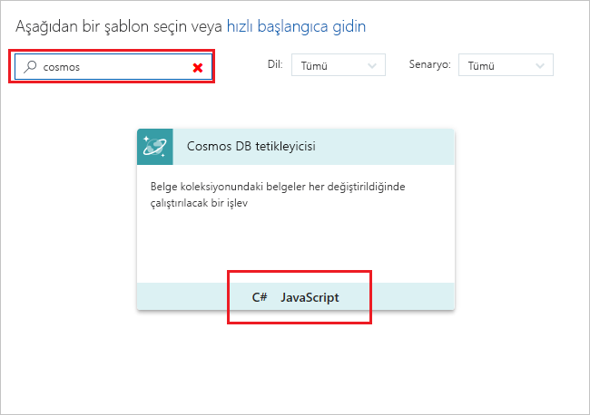
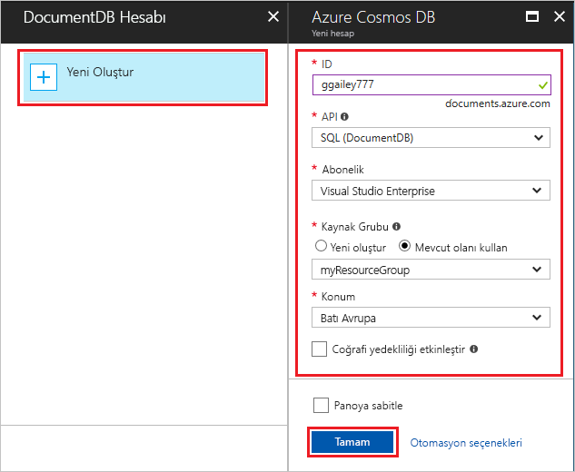

# Azure Cosmos DB tarafından tetiklenen bir işlev oluşturun

Veri eklendiğinde tetiklenen veya Azure Cosmos DB içinde değiştirilen bir işlev oluşturmayı öğrenin. Azure Cosmos DB hakkında daha fazla bilgi için bkz: [Azure Cosmos DB: sunucusuz veritabanı Azure işlevleri kullanarak bilgi işlem](..\cosmos-db\serverless-computing-database.md).

## Ön koşullar

Bu öğreticiyi tamamlamak için:

+ Azure aboneliğiniz yoksa başlamadan önce [ücretsiz bir hesap](https://azure.microsoft.com/free/?WT.mc_id=A261C142F) oluşturun.

[!INCLUDE [functions-portal-favorite-function-apps](../../includes/functions-portal-favorite-function-apps.md)]

## Azure İşlev uygulaması oluşturma

[!INCLUDE [Create function app Azure portal](../../includes/functions-create-function-app-portal.md)]

Ardından, yeni işlev uygulamasında bir işlev oluşturun.

## Azure Cosmos DB Tetikleyici oluşturma

1. İşlev uygulamanızı genişletin ve **İşlevler**'in yanındaki **+** düğmesine tıklayın. Bu, işlev uygulamanızdaki ilk işlevse **Özel işlev**'i seçin. Böylece işlev şablonlarının tamamı görüntülenir.

    

2. Bulun ve seçin **Azure CosmosDBTrigger** istediğiniz dili için şablon.

    

3. Yeni Tetikleyici görüntünün aşağıdaki tabloda belirtildiği gibi ayarları yapılandırın.

    
    
    | Ayar      | Önerilen değer  | Açıklama                                |
    | ------------ | ---------------- | ------------------------------------------ |
    | **İşlevinizi adlandırın** | Varsayılan | Şablon tarafından önerilen varsayılan işlevi adı kullanın. |
    | **Veritabanı adı** | Görevler | İzlenecek derlemesiyle veritabanının adı. |
    | **Koleksiyon adı** | Öğeler | İzlenecek koleksiyonunun adı. |
    | **Yoksa kira koleksiyonu oluşturun** | İşaretli | Koleksiyon henüz mevcut değil, bu yüzden oluşturun. |

4. Seçin **yeni** yanına **Azure Cosmos DB hesap bağlantı** etiket ve var olan bir Cosmos DB hesabını seçin veya **+ Yeni Oluştur**. 
 
    

6. Yeni bir Cosmos DB hesabı oluştururken **yeni hesabı** tabloda belirtildiği gibi ayarlar.

    | Ayar      | Önerilen değer  | Açıklama                                |
    | ------------ | ---------------- | ------------------------------------------ |
    | **ID** | Veritabanının adı | Azure Cosmos DB veritabanı için benzersiz kimliği  |
    | **API** | SQL (DocumentDB) | Bu konu belge veritabanı API kullanır.  |
    | **Abonelik** | Azure Aboneliği | Azure Aboneliği  |
    | **Kaynak Grubu** | myResourceGroup |  İşlevi uygulamanızı içeren mevcut kaynak grubunu kullanın. |
    | **Konum**  | WestEurope | İşlev uygulamanıza veya depolanmış belgeleri kullanan diğer uygulamalara yakın olan bir konum seçin.  |

6. Veritabanını oluşturmak için **Tamam**’a tıklayın. Veritabanının oluşturulması birkaç dakika sürebilir. Veritabanı oluşturulduktan sonra, veritabanı bağlantı dizesi bir işlev uygulaması ayarı olarak depolanır. Bu uygulama ayarı adı eklenen **Azure Cosmos DB hesap bağlantı**. 

7. Tıklatın **oluşturma** Azure Cosmos DB oluşturmak için işlevi tetiklenir. İşlev oluşturulduktan sonra şablona dayalı işlev kodu görüntülenir.  

    

    Bu işlev şablonunun belgeler ve ilk belge kimliği sayısı günlüklerine yazar. 

Ardından, Azure Cosmos DB hesabınıza bağlanın ve oluşturma **görevleri** veritabanında toplama. 

## Öğeleri koleksiyonu oluşturun

1. İkinci bir örneğini açmak [Azure portal](https://portal.azure.com) tarayıcıda yeni bir sekmede. 

2. Portalın sol tarafta simge çubuğu genişletin türü `cosmos` arama alanı ve seçin **Azure Cosmos DB**.

    

2. Azure Cosmos DB hesabınızı seçin ve ardından **Veri Gezgini**. 
 
3. İçinde **koleksiyonları**, seçin **taskDatabase** seçip **yeni koleksiyon**.

    

4. İçinde **topluluk Ekle**, görüntünün aşağıdaki tabloda gösterilen ayarları kullanın. 
 
    
 
    | Ayar|Önerilen değer|Açıklama |
    | ---|---|--- |
    | **Veritabanı kimliği** | Görevler |Yeni veritabanınızın adı. Bu, işlev bağlama tanımlanan adıyla eşleşmelidir. |
    | **Koleksiyon kimliği** | Öğeler | Yeni koleksiyon adı. Bu, işlev bağlama tanımlanan adıyla eşleşmelidir.  |
    | **Depolama kapasitesi** | Sabit (10 GB)|Varsayılan değeri kullanın. Bu değer, veritabanının depolama kapasitesidir. |
    | **Üretilen iş** |400 RU| Varsayılan değeri kullanın. Daha sonra gecikme süresini azaltmak isterseniz aktarım hızının ölçeğini artırabilirsiniz. |
    | **[Bölüm anahtarı](../cosmos-db/partition-data.md#design-for-partitioning)** | /kategori|Verileri her bölüme eşit şekilde dağıtan bir bölüm anahtarı. Koleksiyon performansının yüksek olması için doğru bölüm anahtarının seçilmesi önemlidir. | 

1. Tıklatın **Tamam** oluşturmak için **görevleri** koleksiyonu. Oluşturulan koleksiyon kısa bir süre devam edebilir.

İşlev bağlama içinde belirtilen koleksiyon oluşturulduktan sonra bu yeni koleksiyona belgeleri ekleyerek işlevi test edebilirsiniz.

## İşlevi test etme

1. Yeni genişletin **taskCollection** Veri Gezgini koleksiyonunda seçin **belgeleri**seçeneğini belirleyip **yeni belge**.

    

2. Yeni belge içeriğini aşağıdaki içerik ile değiştirin ve ardından **kaydetmek**.

        {
            "id": "task1",
            "category": "general",
            "description": "some task"
        }

1. İşlevinizi portalında içeren ilk tarayıcı sekmesine geçin. İşlev günlükleri'ni genişletin ve yeni belge işlevi başlatmış olabilir doğrulayın. Görüp `task1` belge kimliği değeri günlüklerine yazılır. 

    

4. (İsteğe bağlı) Gidin, belge için değişiklik ve tıklatın **güncelleştirme**. Ardından, işlev günlükleri geri dönün ve güncelleştirme işlevi başlatmış olabilir doğrulayın.

## Kaynakları temizleme

[!INCLUDE [Next steps note](../../includes/functions-quickstart-cleanup.md)]

## Sonraki adımlar

Bir belge eklendiğinde veya Azure Cosmos DB'de değiştirildiğinde çalıştırılan bir işlev oluşturdunuz.

[!INCLUDE [Next steps note](../../includes/functions-quickstart-next-steps.md)]

Kuyruk depolama tetikleyicileri hakkında daha fazla bilgi için bkz. [Azure İşlevleri Kuyruk depolama bağlamaları](functions-bindings-storage-queue.md).
