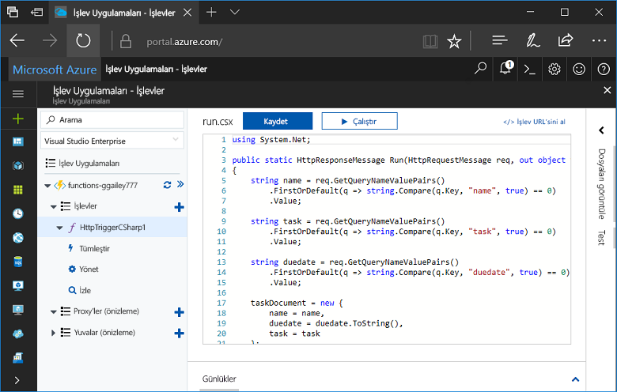
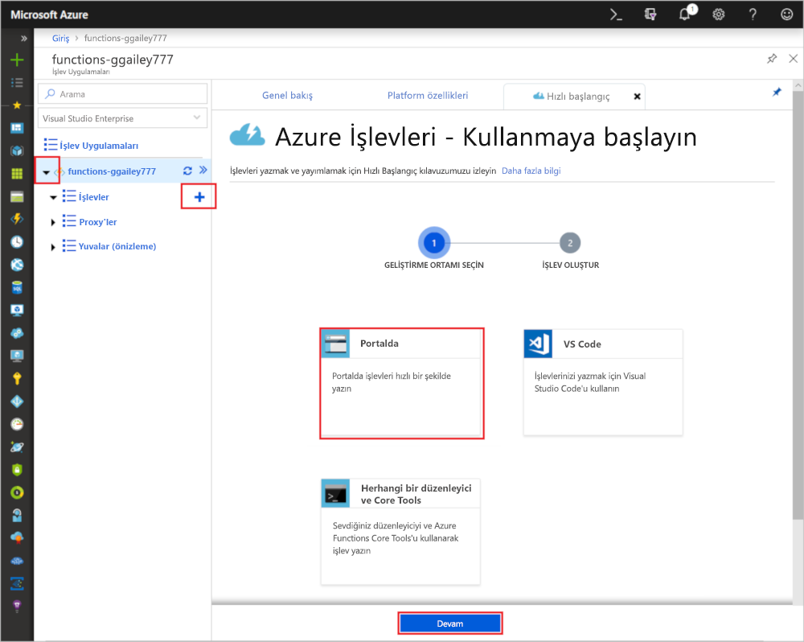
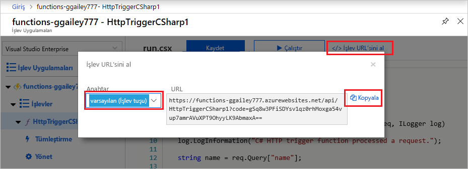

# Azure portalında ilk işlevinizi oluşturma

Azure İşlevleri, öncelikle bir VM oluşturmak veya bir web uygulaması yayımlamak zorunda kalmadan kodunuzu [sunucusuz](https://azure.microsoft.com/solutions/serverless/) bir ortamda yürütmenize olanak tanır. Bu makalede, Azure portalında bir "Merhaba Dünya" işlevi oluşturmak için işlevleri kullanmayı öğrenin.

[!INCLUDE [quickstarts-free-trial-note](../../includes/quickstarts-free-trial-note.md)]

> [!NOTE]
> C#Geliştiriciler göz önünde bulundurmalıdır [Visual Studio 2019 içinde ilk işlevinizi oluşturma](functions-create-your-first-function-visual-studio.md) yerine portalında. 

## Azure'da oturum açma

Azure hesabınızla Azure portalında <https://portal.azure.com> sayfasında oturum açın.

## İşlev uygulaması oluşturma

İşlevlerinizin yürütülmesini barındıran bir işlev uygulamasına sahip olmanız gerekir. İşlev uygulaması, kaynakların daha kolay yönetilmesi, dağıtılması ve paylaşılması için işlevleri bir mantıksal birim olarak gruplandırmanıza olanak tanır. 

[!INCLUDE [Create function app Azure portal](../../includes/functions-create-function-app-portal.md)]

Ardından, yeni işlev uygulamasında bir işlev oluşturun.

## HTTP ile tetiklenen bir işlev oluşturma

1. Yeni işlev uygulamanızı genişletin ve **İşlevler**'in yanındaki **+** düğmesini, **Portalda**'yı ve **Devam**'ı seçin.

    

1. **Web Kancası + API**'yi ve ardından **Oluştur**'u seçin.

    

Dile özgü HTTP ile tetiklenen işlev şablonu kullanılarak bir işlev oluşturulur.

Artık bir HTTP isteği göndererek yeni işlevi çalıştırabilirsiniz.

## İşlevi test etme

1. Yeni işlevinizde sağ üst kısımdaki **</> İşlev URL'sini al**'a tıklayın, **varsayılan (İşlev anahtarı)** seçeneğini belirleyin ve ardından **Kopyala**'ya tıklayın. 

    

2. İşlev URL'sini tarayıcınızın adres çubuğuna yapıştırın. `&name=<yourname>` sorgu dizesi değerini bu URL’nin sonuna ekleyin ve isteği yürütmek için klavyenizdeki `Enter` tuşuna basın. İşlev tarafından döndürülen yanıtın tarayıcıda gösterildiğini görürsünüz.  

    Aşağıdaki örnekte tarayıcıdaki yanıt gösterilmektedir:

    

    İstek URL’si, işlevinize HTTP üzerinden erişmek için varsayılan olarak gerekli olan bir anahtar içerir.

3. İşleviniz çalıştığında, izleme bilgileri günlüklere yazılır. Önceki yürütme işleminden alınan izleme çıktısını görmek için, portalda işlevinize geri dönün ve ekranın altındaki oka tıklayarak **Günlükler**’i genişletin.

   

## Kaynakları temizleme

[!INCLUDE [Clean-up resources](../../includes/functions-quickstart-cleanup.md)]

## Sonraki adımlar

Basit bir HTTP ile tetiklenen işlevi bir işlev uygulaması oluşturdunuz.  

[!INCLUDE [Next steps note](../../includes/functions-quickstart-next-steps.md)]

Daha fazla bilgi için bkz. [Azure İşlevleri HTTP bağlamaları](functions-bindings-http-webhook.md).
