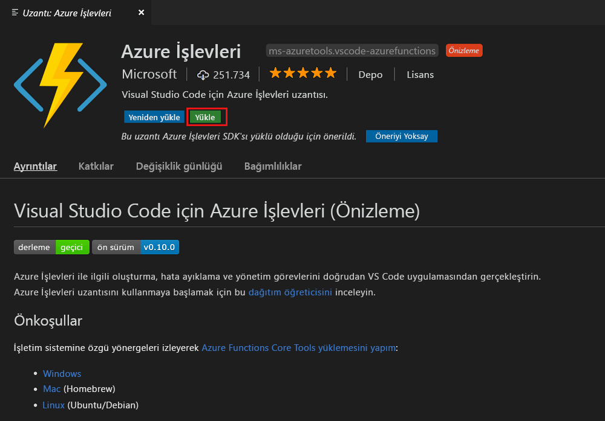
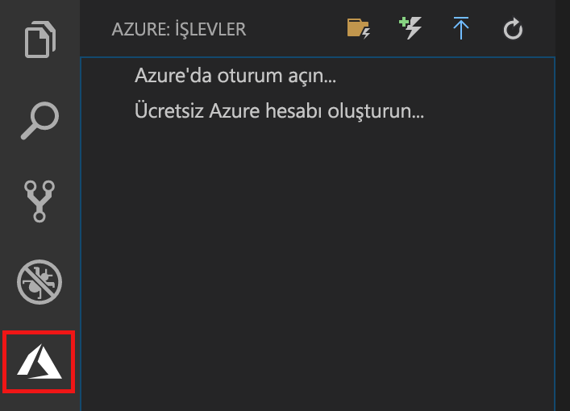
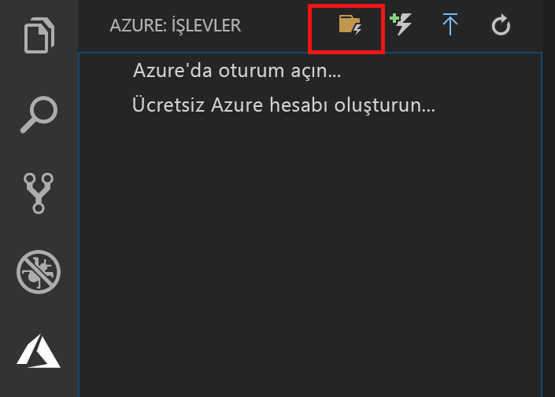
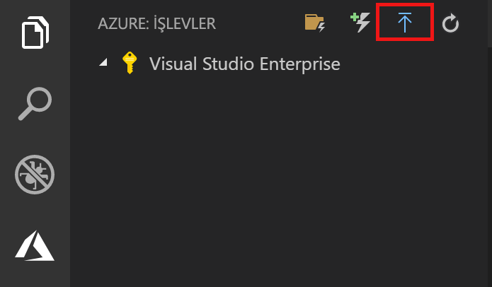
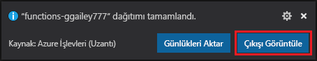
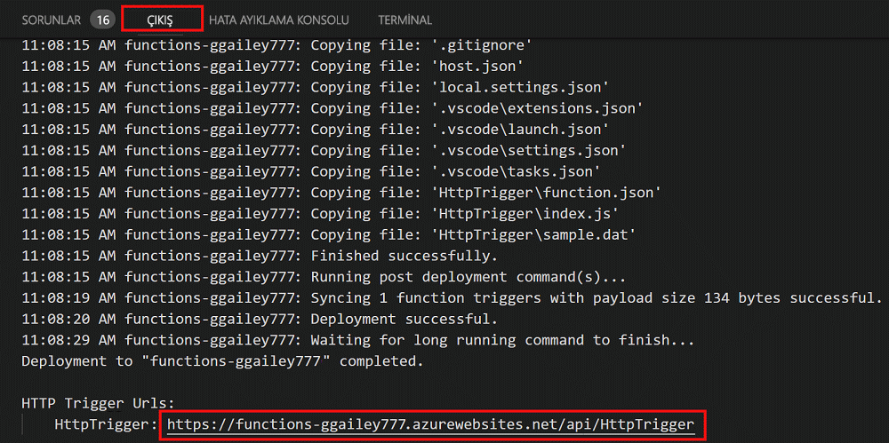

# Visual Studio Code kullanarak ilk işlevinizi oluşturma

Azure İşlevleri, öncelikle bir VM oluşturmak veya bir web uygulaması yayımlamak zorunda kalmadan kodunuzu [sunucusuz](https://azure.microsoft.com/solutions/serverless/) bir ortamda yürütmenize olanak tanır.

Bu makalede Microsoft Visual Studio Code’u kullanarak yerel bilgisayarınızda bir “merhaba dünya” işlevi oluşturup test etmek üzere [Visual Studio Code için Azure İşlevleri uzantısı] kullanmayı öğreneceksiniz. Ardından işlev kodunu Visual Studio Code ile Azure’da yayımlayacaksınız.

Uzantı şu anda C#, JavaScript ve Java işlevlerini desteklemektedir. Bu makaledeki adımlar, Azure İşlevleri projenizde tercih ettiğiniz dile göre değişiklik gösterebilir. Uzantı şu an önizleme aşamasındadır. Daha fazla bilgi edinmek için [Visual Studio Code için Azure İşlevleri uzantısı] sayfasına bakın.

## Ön koşullar

Bu hızlı başlangıcı tamamlamak için:

* [Desteklenen platformlardan](https://code.visualstudio.com/docs/supporting/requirements#_platforms) birinde [Visual Studio Code](https://code.visualstudio.com/)’u yükleyin. Bu makale macOS (High Sierra) ile çalışan bir cihazda geliştirilmiş ve test edilmiştir.

* [Azure İşlevleri Temel Araçları](functions-run-local.md#v2)’nın hala önizleme aşamasında olan 2.x sürümünü yükleyin.

* Seçtiğiniz dile özgü gereksinimleri yükleyin:

    | Dil | Dahili numara |
    | -------- | --------- |
    | **C#** | [Visual Studio Code için C#](https://marketplace.visualstudio.com/items?itemName=ms-vscode.csharp) [.NET Core CLI araçları](https://docs.microsoft.com/dotnet/core/tools/?tabs=netcore2x)*   |
    | **Java** | [Java hata ayıklayıcısı](https://marketplace.visualstudio.com/items?itemName=vscjava.vscode-java-debug) [JDK 1.8](http://www.oracle.com/technetwork/java/javase/downloads/index.html) [Maven 3+](https://maven.apache.org/) |
    | **JavaScript** | [Node 8.0+](https://nodejs.org/)  |

    \* Ayrıca Core Araçları için gereklidir.

[!INCLUDE [quickstarts-free-trial-note](../../includes/quickstarts-free-trial-note.md)]

## Azure İşlevi uzantısını yükleme

Azure İşlevleri uzantısı, işlevleri oluşturmak, test etmek ve Azure’da dağıtmak için kullanılır.

1. Visual Studio Code’da **Uzantılar**’ı açın ve `azure functions` için arama yapın veya [bu bağlantıyı Visual Studio Code’da açın](vscode:extension/ms-azuretools.vscode-azurefunctions).

1. Uzantıyı Visual Studio Code’a yüklemek için **Yükle**’yi seçin. 

    

1. Visual Studio Code’u yeniden başlatın ve Etkinlik çubuğundaki Azure simgesini seçin. Kenar Çubuğunda bir Azure İşlevleri alanı görmeniz gerekir.

    

## Azure İşlevleri projesi oluşturma

Visual Studio Code'daki Azure İşlevleri proje şablonu, Azure'daki bir işlev uygulamasında yayımlanabilen bir proje oluşturur. İşlev uygulaması, kaynakların yönetilmesi, dağıtılması ve paylaşılması için işlevleri bir mantıksal birim olarak gruplandırmanıza olanak tanır.

1. Visual Studio Code’da **Azure: İşlevler** alanını görüntülemek için Azure logosunu seçin ve Yeni Proje Oluştur simgesini seçin.

    

1. Proje çalışma alanınız için bir konum seçin ve **Seç** seçeneğinin belirleyin.

    > [!NOTE]
    > Bu makale, bir çalışma alanının dışında tamamlanacak şekilde tasarlanmıştır. Bu örnekte, bir çalışma alanının parçası olan bir proje klasörünü seçmeyin.

1. İşlev uygulaması projenizin dilini seçin. Bu makalede JavaScript kullanılmıştır.
    

1. İstendiğinde **Çalışma alanına ekle**’yi seçin.

Visual Studio Code işlev uygulaması projesini yeni bir çalışma alanında oluşturur. Bu proje [host.json](functions-host-json.md) ve [local.settings.json](functions-run-local.md#local-settings-file) yapılandırma dosyaları ve tüm dile özgü proje dosyalarını içerir. Ayrıca proje dosyasında yeni bir Git deposu edinirsiniz.

## HTTP ile tetiklenen işlev oluşturma

1. **Azure: İşlevler** seçeneğinden İşlev Oluştur simgesini seçin.

    

1. İşlev uygulaması projenizin yer aldığı klasörü seçin ve **HTTP tetikleyicisi** işlev şablonunu seçin.

    

1. İşlev adı için `HTTPTrigger` yazın ve Enter tuşuna basın ve **Anonim** kimlik doğrulamasını seçin.

    

    HTTP ile tetiklenen işlevin şablonu kullanılarak, seçtiğiniz dilde bir işlev oluşturulur.

    

function.json dosyasını değiştirerek işlevinize giriş ve çıkış bağlamaları ekleyebilirsiniz. Daha fazla bilgi için bkz. [Azure İşlevleri tetikleyicileri ve bağlama kavramları](functions-triggers-bindings.md).

İşlev projenizi ve HTTP ile tetiklenen işlev oluşturduğunuza göre, artık bunu yerel bilgisayarınızda test edebilirsiniz.

## İşlevi yerel olarak test etme

Azure İşlevleri Temel Araçları, Azure İşlevleri projenizi yerel geliştirme bilgisayarınızda çalıştırmanıza olanak sağlar. Visual Studio Code'da ilk kez bir işlev başlattığınızda bu araçları yüklemeniz istenir.  

1. İşlevinizi test etmek için işlev kodunda bir kesme noktası ayarlayın ve işlev uygulaması projesini başlatmak için F5 tuşuna basın. Temel Araçlar’daki çıktı, **Terminal** panelinde görüntülenir.

1. **Terminal** panelinde, HTTP ile tetiklenen işlevinizin URL uç noktasını kopyalayın.

    

1. HTTP isteğinin URL’sini tarayıcınızın adres çubuğuna yapıştırın. `?name=<yourname>` sorgu dizesini bu URL’ye ekleyip isteği yürütün. Kesme noktasına gelindiğinde yürütme duraklatılır.

    

1. Yürütmeyi sürdürdüğünüzde GET isteğine tarayıcıda verilen yanıt aşağıda gösterilmiştir:

    

1. Hata ayıklamayı durdurmak için Shift + F1 tuşuna basın.

İşlevin yerel bilgisayarınızda düzgün çalıştığını doğruladıktan sonra, projeyi Azure'da yayımlamanın zamanı gelmiştir.

## Azure'da oturum açma

Uygulamanızı yayımlamadan önce Azure’da oturum açmanız gerekir.

1. **Azure: İşlevler** alanında **Azure’da oturum aç...** seçeneğini belirleyin. Henüz bir hesabınız yoksa **Ücretsiz bir Azure hesabı oluşturabilirsiniz**.

    

1. İstendiğinde **Kopyala ve Aç**’ı seçin veya görüntülenen kodu kopyalayın ve tarayıcınızda <https://aka.ms/devicelogin> öğesini açın.

1. Kopyalanan kodu **Cihaz Oturum** sayfasına yapıştırın, Visual Studio Code oturum açmasını doğrulayın ve sonra **Devam Et**’i seçin.  

1. Azure hesap bilgilerinizi kullanarak oturum açmayı tamamlayın. Başarılı bir şekilde oturum açtıktan sonra tarayıcıyı kapatabilirsiniz.

## Projeyi Azure'da yayımlama

Visual Studio Code, işlevler projenizi doğrudan Azure’da dağıtmanıza olanak sağlar. Süreç kapsamında, Azure abonelik bir işlev uygulaması ve ilgili kaynakları oluşturursunuz. İşlev uygulaması, işlevlerinize ilişkin bir yürütme bağlamı sağlar. Proje, Azure aboneliğinizdeki yeni işlev uygulamasında paketlenir ve dağıtılır. 

Bu makalede, yeni bir işlev uygulaması oluşturduğunuz varsayılır. Varolan bir işlev uygulamasına yayımladığınızda Azure’daki uygulamanın içeriğinin üzerine yazılır.

1. **Azure: İşlevler** alanında İşlev Uygulamasına Dağıt simgesini seçin.

    

1. Geçerli çalışma alanınız olan proje klasörünü seçin.

1. Birden fazla aboneliğiniz varsa işlev uygulamanızı barındırmak istediğiniz seçeneği belirleyin ve sonra **+ Yeni İşlev Uygulaması Oluştur**’u seçin.

1. İşlev uygulamanızı tanımlayan bir genelde benzersiz olan bir ad yazın ve Enter tuşuna basın. İşlev uygulaması adına ilişkin geçerli karakterler `a-z`, `0-9` ve `-` işaretidir.

1. **+ Yeni Kaynak Grubu Oluştur**’u seçin, `myResourceGroup` gibi bir kaynak grubu adı yazın ve Enter tuşuna basın. Ayrıca var olan bir kaynak grubunu kullanabilirsiniz.

1. **+Yeni Depolama Hesabı Oluştur**’u seçin işlev uygulamanız tarafından kullanılan yeni depolama hesabı için genelde benzersiz olan bir ad yazın ve Enter tuşuna basın. Depolama hesabı adları 3 ile 24 karakter arasında olmalı ve yalnızca sayıyla küçük harf içermelidir. Var olan bir hesabı da kullanabilirsiniz.

1. Ayrıca, kendinize veya işlevlerinizin erişeceği diğer hizmetlere yakın bir [bölgede](https://azure.microsoft.com/regions/) yer alan bir konum seçin.

    İşlev uygulamasının oluşturulması, konumunuzu seçtikten sonra başlar. İşlev uygulamanız oluşturulduktan sonra bir bildirim görüntülenir ve dağıtım paketi uygulanır.

1. Oluşturduğunuz Azure kaynakları dahil olmak üzere oluşturma ve dağıtma sonuçlarını görüntülemek üzere bildirimlerde **Çıktıyı Görüntüle**’yi seçin.

    

1. Azure’daki yeni işlev uygulamasının URL’sini not edin. Bunu, proje Azure’da yayımlandıktan sonra işlevinizi test etmek için kullanırsınız.

    

1. **Azure: İşlevler** alanında, yeni işlev uygulamasının aboneliğinizin altında görüntülendiğini görürsünüz. Bu düğümü genişlettiğinizde işlev uygulamasındaki işlevlerle birlikte uygulama ayarları ve işlev proxy’lerini görürsünüz.

    

    İşlev uygulaması düğümünde, Azure’daki işlev uygulamasına yönelik çeşitli yönetim ve yapılandırma görevlerini gerçekleştirmek için Ctrl tuşuna basarak tıklayın (sağ tıklama). Ayrıca işlev uygulamasını Azure portalında görüntülemeyi seçebilirsiniz.

## Azure'da işlevinizi test etme

1. **Çıktı** panelinden HTTP tetikleyicisinin URL’sini kopyalayın. Daha önce olduğu gibi, `?name=<yourname>` sorgu dizesini bu URL’nin sonuna ekleyip isteği yürütmeyi unutmayın.

    HTTP tarafından tetiklenen işlevinizi çağıran URL aşağıdaki biçimde olmalıdır:

        http://<functionappname>.azurewebsites.net/api/<functionname>?name=<yourname> 

1. HTTP isteğinin yeni URL’sini tarayıcınızın adres çubuğuna yapıştırın. İşlevin döndürdüğü uzak GET isteğine tarayıcıda verilen yanıt aşağıda gösterilmiştir: 

    

## Sonraki adımlar

HTTP ile tetiklenen basit bir işlevi kullanarak bir işlev uygulaması oluşturmak için Visual Studio Code’u kullandınız. Belirli bir dildeki geliştirme işlevleri hakkında daha fazla bilgi almak için [JavaScript](functions-reference-node.md), [.NET](functions-dotnet-class-library.md) veya [Java](functions-reference-java.md)’ya yönelik dil başvuru kılavuzlarına bakın.

Ardından, Azure İşlevleri Temel Araçları’nı kullanarak Terminal veya komut istemcisinden yerel testler gerçekleştirme veya hat ayıklama hakkında daha fazla bilgi edinmek isteyebilirsiniz.

> [!div class="nextstepaction"]
> [Yerel olarak kod yazma ve test etme](functions-run-local.md)

[Azure Functions Core Tools]: functions-run-local.md
[Visual Studio Code için Azure İşlevleri uzantısı]: https://marketplace.visualstudio.com/items?itemName=ms-azuretools.vscode-azurefunctions
