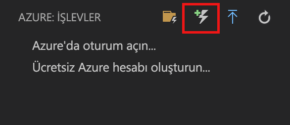

# Visual Studio Code kullanarak ilk işlevinizi oluşturma

Azure İşlevleri, öncelikle bir VM oluşturmak veya bir web uygulaması yayımlamak zorunda kalmadan kodunuzu [sunucusuz](https://azure.microsoft.com/solutions/serverless/) bir ortamda yürütmenize olanak tanır.

Bu makalede Microsoft Visual Studio Code’u kullanarak yerel bilgisayarınızda bir “merhaba dünya” işlevi oluşturup test etmek üzere [Visual Studio Code için Azure İşlevleri uzantısını] kullanmayı öğreneceksiniz. Ardından işlev kodunu Visual Studio Code ile Azure’da yayımlayacaksınız.

Uzantı şu anda tam olarak destekler C#, JavaScript ve Java işlevleri, Python desteği şu anda önizlemede. Bu makaledeki adımlar, Azure İşlevleri projenizde tercih ettiğiniz dile göre değişiklik gösterebilir. Uzantı şu an önizleme aşamasındadır. Daha fazla bilgi edinmek için [Visual Studio Code için Azure İşlevleri uzantısı] sayfasına bakın.

## Önkoşullar

Bu hızlı başlangıcı tamamlamak için:

* [Desteklenen platformlardan](https://code.visualstudio.com/docs/supporting/requirements#_platforms) birinde [Visual Studio Code](https://code.visualstudio.com/)’u yükleyin. Bu makale macOS (High Sierra) ile çalışan bir cihazda geliştirilmiş ve test edilmiştir.

* [Azure İşlevleri Temel Araçları](functions-run-local.md#v2)’nın hala önizleme aşamasında olan 2.x sürümünü yükleyin.

* Seçtiğiniz dile özgü gereksinimleri yükleyin:

    | Dil | Dahili numara |
    | -------- | --------- |
    | **C#** | [Visual Studio Code için C#](https://marketplace.visualstudio.com/items?itemName=ms-vscode.csharp) [.NET Core CLI araçları](https://docs.microsoft.com/dotnet/core/tools/?tabs=netcore2x)*   |
    | **Java** | [Java için hata ayıklayıcı](https://marketplace.visualstudio.com/items?itemName=vscjava.vscode-java-debug) [Java 8](https://aka.ms/azure-jdks) [Maven 3+](https://maven.apache.org/) |
    | **JavaScript** | [Düğüm 8.0 +](https://nodejs.org/)  |

    \* Ayrıca Core Araçları için gereklidir.

[!INCLUDE [quickstarts-free-trial-note](../../includes/quickstarts-free-trial-note.md)]

[!INCLUDE [functions-install-vs-code-extension](../../includes/functions-install-vs-code-extension.md)]

[!INCLUDE [functions-create-function-app-vs-code](../../includes/functions-create-function-app-vs-code.md)]

## HTTP ile tetiklenen işlev oluşturma

1. Gelen **Azure: İşlevleri**, Create FUNCTION simgesini seçin.

    

1. İşlev uygulaması projenizin yer aldığı klasörü seçin ve **HTTP tetikleyicisi** işlev şablonunu seçin.

    

1. İşlev adı için `HTTPTrigger` yazın ve Enter tuşuna basın ve **Anonim** kimlik doğrulamasını seçin.

    

    HTTP ile tetiklenen işlevin şablonu kullanılarak, seçtiğiniz dilde bir işlev oluşturulur.

    

function.json dosyasını değiştirerek işlevinize giriş ve çıkış bağlamaları ekleyebilirsiniz. Daha fazla bilgi için bkz. [Azure İşlevleri tetikleyicileri ve bağlama kavramları](functions-triggers-bindings.md).

İşlev projenizi ve HTTP ile tetiklenen işlev oluşturduğunuza göre, artık bunu yerel bilgisayarınızda test edebilirsiniz.

## İşlevi yerel olarak test etme

Azure İşlevleri Temel Araçları, Azure İşlevleri projenizi yerel geliştirme bilgisayarınızda çalıştırmanıza olanak sağlar. Visual Studio Code'da ilk kez bir işlev başlattığınızda bu araçları yüklemeniz istenir.  

1. İşlevinizi test etmek için işlev kodunda bir kesme noktası ayarlayın ve işlev uygulaması projesini başlatmak için F5 tuşuna basın. Temel Araçlar’daki çıktı, **Terminal** panelinde görüntülenir.

1. **Terminal** panelinde, HTTP ile tetiklenen işlevinizin URL uç noktasını kopyalayın.

    

1. HTTP isteğinin URL’sini tarayıcınızın adres çubuğuna yapıştırın. `?name=<yourname>` sorgu dizesini bu URL’ye ekleyip isteği yürütün. Kesme noktasına gelindiğinde yürütme duraklatılır.

    

1. Yürütmeyi sürdürdüğünüzde GET isteğine tarayıcıda verilen yanıt aşağıda gösterilmiştir:

    

1. Hata ayıklamayı durdurmak için Shift + F5 tuşuna basın.

İşlevin yerel bilgisayarınızda düzgün çalıştığını doğruladıktan sonra, projeyi Azure'da yayımlamanın zamanı gelmiştir.

[!INCLUDE [functions-sign-in-vs-code](../../includes/functions-sign-in-vs-code.md)]

[!INCLUDE [functions-publish-project-vscode](../../includes/functions-publish-project-vscode.md)]

## Azure'da işlevinizi test etme

1. **Çıktı** panelinden HTTP tetikleyicisinin URL’sini kopyalayın. Daha önce olduğu gibi, `?name=<yourname>` sorgu dizesini bu URL’nin sonuna ekleyip isteği yürütmeyi unutmayın.

    HTTP tarafından tetiklenen işlevinizi çağıran URL aşağıdaki biçimde olmalıdır:

        http://<functionappname>.azurewebsites.net/api/<functionname>?name=<yourname> 

1. HTTP isteğinin yeni URL’sini tarayıcınızın adres çubuğuna yapıştırın. İşlevin döndürdüğü uzak GET isteğine tarayıcıda verilen yanıt aşağıda gösterilmiştir: 

    

## Sonraki adımlar

HTTP ile tetiklenen basit bir işlevi kullanarak bir işlev uygulaması oluşturmak için Visual Studio Code’u kullandınız. Daha fazla bilgi edinin isteyebilirsiniz [yerel test ve Terminal veya komut satırından hata ayıklama](functions-run-local.md) Azure işlevleri çekirdek araçları kullanarak.

> [!div class="nextstepaction"]
> [Application Insights tümleştirmesini etkinleştirme](functions-monitoring.md#manually-connect-an-app-insights-resource)

[Azure Functions Core Tools]: functions-run-local.md
[Visual Studio Code için Azure işlevleri uzantısı]: https://marketplace.visualstudio.com/items?itemName=ms-azuretools.vscode-azurefunctions
