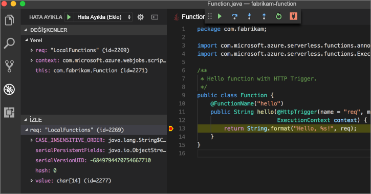

# <a name="create-your-first-function-with-java-and-maven-preview"></a>Java ve Maven (Önizleme) ile ilk işlevinizi oluşturma

> [!NOTE] 
> Azure İşlevleri için Java şu anda önizleme aşamasındadır.

Bu hızlı başlangıç, Maven ile [sunucusuz](https://azure.microsoft.com/overview/serverless-computing/) işlev projesi oluşturma, bunu yerel olarak test etme ve Azure İşlevleri’ne dağıtma konusunda rehberlik sağlar. Hızlı başlangıcı bitirdiğinizde, Azure’da çalışan HTTP tetiklemeli bir işlev uygulamanız olur.


[!INCLUDE [quickstarts-free-trial-note](../../includes/quickstarts-free-trial-note.md)]

## <a name="prerequisites"></a>Ön koşullar
Java ile işlev uygulamaları geliştirebilmeniz için şunlar yüklü olmalıdır:

-  [Java Developer Kit](https://www.azul.com/downloads/zulu/), sürüm 8.
-  [Apache Maven](https://maven.apache.org), sürüm 3.0 veya üzeri.
-  [Azure CLI](https://docs.microsoft.com/cli/azure)

> [!IMPORTANT] 
> Bu hızlı başlangıcın tamamlanabilmesi için JAVA_HOME ortam değişkeni JDK’nin yükleme konumu olarak ayarlanmalıdır.

## <a name="install-the-azure-functions-core-tools"></a>Azure Functions Core Tools’u Yükleme

Azure İşlevleri Temel Araçları, terminalden veya komut isteminden Azure İşlevleri yazmak, çalıştırmak ve bunların hatalarını ayıklamak için yerel bir geliştirme ortamı sağlar. 

Devam etmeden önce yerel bilgisayarınıza [Temel Araçların 2. sürümünü](functions-run-local.md#v2) yükleyin.

## <a name="generate-a-new-functions-project"></a>Yeni İşlevler projesi oluşturma

İşlevler projesini bir [Maven arketipinden](https://maven.apache.org/guides/introduction/introduction-to-archetypes.html) oluşturmak için boş bir klasörde aşağıdaki komutu çalıştırın.

### <a name="linuxmacos"></a>Linux/MacOS

```bash
mvn archetype:generate \
    -DarchetypeGroupId=com.microsoft.azure \
    -DarchetypeArtifactId=azure-functions-archetype 
```

### <a name="windows-cmd"></a>Windows (CMD)
```cmd
mvn archetype:generate ^
    -DarchetypeGroupId=com.microsoft.azure ^
    -DarchetypeArtifactId=azure-functions-archetype
```

Maven, proje oluşturma işleminin tamamlanması için gereken değerleri ister. _groupId_, _artifactId_ ve _version_ değerleri için [Maven adlandırma kuralları](https://maven.apache.org/guides/mini/guide-naming-conventions.html) başvurusuna bakın. _appName_ değerinin Azure genelinde benzersiz olması gerektiğinden, Maven bir varsayılan olarak daha önce girilen _artifactId_’yi temel alarak bir uygulama adı oluşturur. _packageName_ değeri, oluşturulan işlev kodu için Java paketini belirler.

Aşağıdaki `com.fabrikam.functions` ve `fabrikam-functions` tanımlayıcıları, örnek olarak ve bu hızlı başlangıcın ilerleyen kısımlarındaki adımların okunmasını kolaylaştırmak için kullanılır. Bu adımda Maven’e kendi değerlerinizi sağlamanız önerilir.

```Output
Define value for property 'groupId': com.fabrikam.functions
Define value for property 'artifactId' : fabrikam-functions
Define value for property 'version' 1.0-SNAPSHOT : 
Define value for property 'package': com.fabrikam.functions
Define value for property 'appName' fabrikam-functions-20170927220323382:
Confirm properties configuration: Y
```

Maven, şu örnekte _artifactId_ adlı yeni bir klasörde proje dosyalarını oluşturur: `fabrikam-functions`. Projedeki çalıştırılmaya hazır olarak oluşturulan bu kod, isteğin gövdesini yankılayan [HTTP tetiklemeli](/azure/azure-functions/functions-bindings-http-webhook) basit bir işlevdir:

```java
public class Function {
    /**
     * This function listens at endpoint "/api/hello". Two ways to invoke it using "curl" command in bash:
     * 1. curl -d "HTTP Body" {your host}/api/hello
     * 2. curl {your host}/api/hello?name=HTTP%20Query
     */
    @FunctionName("hello")
    public HttpResponseMessage<String> hello(
            @HttpTrigger(name = "req", methods = {"get", "post"}, authLevel = AuthorizationLevel.ANONYMOUS) HttpRequestMessage<Optional<String>> request,
            final ExecutionContext context) {
        context.getLogger().info("Java HTTP trigger processed a request.");

        // Parse query parameter
        String query = request.getQueryParameters().get("name");
        String name = request.getBody().orElse(query);

        if (name == null) {
            return request.createResponse(400, "Please pass a name on the query string or in the request body");
        } else {
            return request.createResponse(200, "Hello, " + name);
        }
    }
}

```

## <a name="run-the-function-locally"></a>İşlevi yerel olarak çalıştırma

Yeni oluşturulan proje klasörünün dizinine geçerek Maven ile işlevi derleyin ve çalıştırın:

```
cd fabrikam-function
mvn clean package 
mvn azure-functions:run
```

> [!NOTE]
> Java 9 ile `javax.xml.bind.JAXBException` özel durumunu yaşıyorsanız, [GitHub](https://github.com/jOOQ/jOOQ/issues/6477)’daki geçici çözüme bakın.

İşlev sisteminizde yerel olarak çalıştırılırken ve HTTP isteklerine yanıt vermeye hazır olduğunda şu çıktıyı görürsünüz:

```Output
Listening on http://localhost:7071
Hit CTRL-C to exit...

Http Functions:

   hello: http://localhost:7071/api/hello
```

Yeni bir terminal penceresinde curl kullanarak komut satırından işlevi tetikleyin:

```
curl -w '\n' -d LocalFunction http://localhost:7071/api/hello
```

```Output
Hello LocalFunction!
```

İşlev kodunu durdurmak için terminalde `Ctrl-C` komutunu kullanın.

## <a name="deploy-the-function-to-azure"></a>İşlevi Azure’a dağıtma

Azure İşlevleri’ne dağıtım işlemi, Azure CLI’dan hesap kimlik bilgilerini kullanır. Devam etmeden önce [Azure CLI ile oturum açın](/cli/azure/authenticate-azure-cli?view=azure-cli-latest).

```azurecli
az login
```

`azure-functions:deploy` Maven hedefini kullanarak kodunuzu yeni bir İşlev uygulamasına dağıtın.

```
mvn azure-functions:deploy
```

Dağıtım tamamlandığında, Azure işlev uygulamanıza erişmek için kullanabileceğiniz URL’yi görürsünüz:

```output
[INFO] Successfully deployed Function App with package.
[INFO] Deleting deployment package from Azure Storage...
[INFO] Successfully deleted deployment package fabrikam-function-20170920120101928.20170920143621915.zip
[INFO] Successfully deployed Function App at https://fabrikam-function-20170920120101928.azurewebsites.net
[INFO] ------------------------------------------------------------------------
```

Azure’da çalışan işlev uygulamasını `cURL` kullanarak test edin. Önceki adımdan kendi işlev uygulamanız için dağıtılan URL ile eşleşmek üzere aşağıdaki örnekten URL’yi değiştirmeniz gerekir.

```
curl -w '\n' https://fabrikam-function-20170920120101928.azurewebsites.net/api/hello -d AzureFunctions
```

```Output
Hello AzureFunctions!
```

## <a name="next-steps"></a>Sonraki adımlar

Basit bir HTTP tetikleyicisine sahip bir Java işlev uygulaması oluşturdunuz ve Azure İşlevleri’ne dağıttınız.

- Java işlevleri geliştirme hakkında daha fazla bilgi edinmek için [Java İşlevleri geliştirici kılavuzunu](functions-reference-java.md) gözden geçirin.
- `azure-functions:add` Maven hedefini kullanarak projenize farklı tetikleyicilere sahip ek işlevler ekleyin.
- Visual Studio Code ile işlevlerde yerel olarak hata ayıklayın. [Java uzantı paketi](https://marketplace.visualstudio.com/items?itemName=vscjava.vscode-java-pack) yüklü ve İşlevler projeniz Visual Studio Code’da açık haldeyken, 5005 bağlantı noktasına [hata ayıklayıcıyı bağlayın](https://code.visualstudio.com/Docs/editor/debugging#_launch-configurations). Sonra düzenleyicide bir kesme noktası ayarlayın ve işleviniz yerel olarak çalışırken tetikleyin: 
- Visual Studio Code ile işlevlerde uzaktan hata ayıklayın. Yönergeler için [sunucusuz Java uygulamaları yazma](https://code.visualstudio.com/docs/java/java-serverless#_remote-debug-functions-running-in-the-cloud) belgelerine göz atın.
