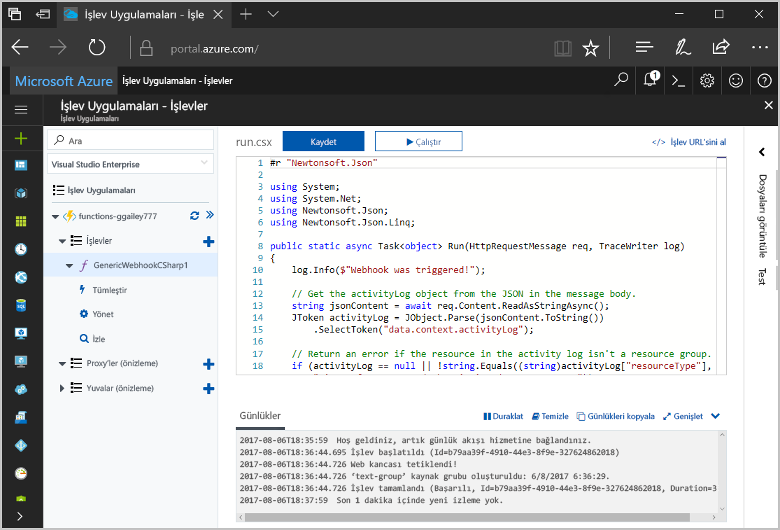
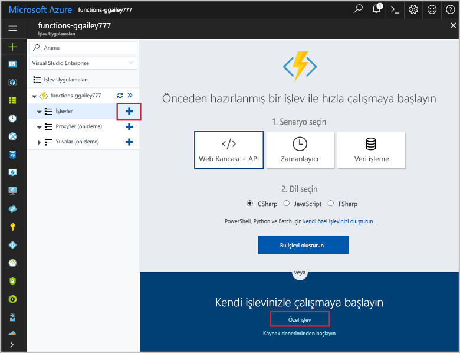
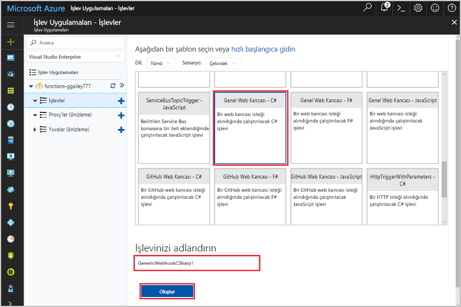
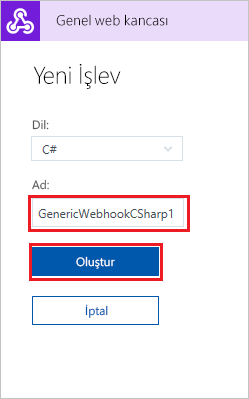
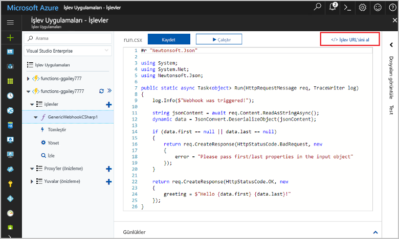
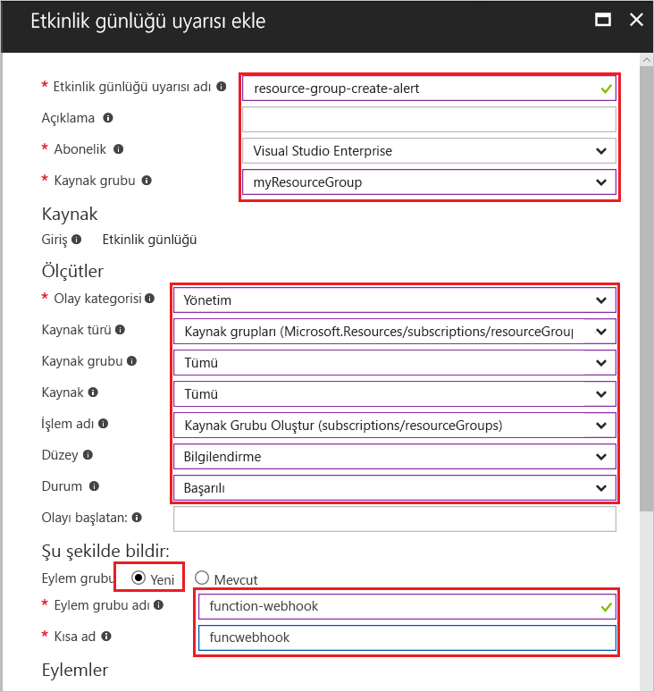
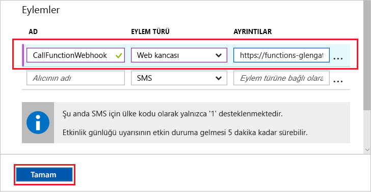
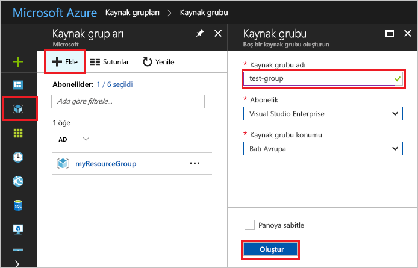
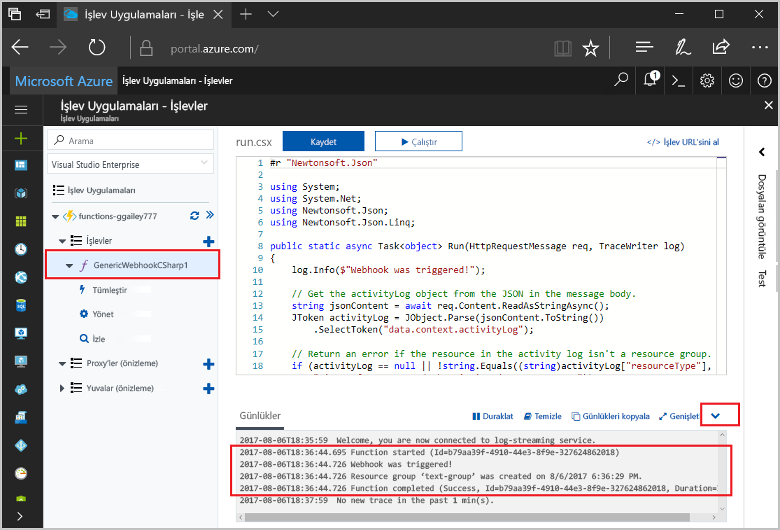

# <a name="create-a-function-triggered-by-a-generic-webhook"></a>Genel web kancasıyla tetiklenen bir işlev oluşturma

Azure İşlevleri, öncelikle bir VM oluşturmak veya bir web uygulaması yayımlamak zorunda kalmadan kodunuzu sunucusuz bir ortamda yürütmenize olanak tanır. Örneğin, bir işlevi Azure İzleyici tarafından oluşturulan bir uyarıyla tetiklenecek şekilde yapılandırabilirsiniz. Bu konuda, aboneliğinize kaynak grubu eklendiğinde C# kodu yürütme açıklanır.   



## <a name="prerequisites"></a>Ön koşullar 

Bu öğreticiyi tamamlamak için:

+ Azure aboneliğiniz yoksa başlamadan önce [ücretsiz bir hesap](https://azure.microsoft.com/free/?WT.mc_id=A261C142F) oluşturun.

## <a name="create-an-azure-function-app"></a>Azure İşlev uygulaması oluşturma

[!INCLUDE [Create function app Azure portal](../../includes/functions-create-function-app-portal.md)]

Ardından, yeni işlev uygulamasında bir işlev oluşturun.

## <a name="create-function"></a>Genel web kancası ile tetiklenen bir işlev oluşturma

1. İşlev uygulamanızı genişletin ve **İşlevler**'in yanındaki **+** düğmesine tıklayın. Bu işlev, işlev uygulamanızdaki ilk işlevse **Özel işlev**'i seçin. Böylece işlev şablonlarının tamamı görüntülenir.

    

2. Arama alanına `generic` yazıp genel web kancası tetikleyici şablonunuz için istediğiniz dili seçin. Bu konuda bir C# işlevi kullanılmaktadır.

     

2. İşleviniz için bir **Ad** yazın ve **Oluştur**'u seçin. 

      

2. Yeni işlevinizde, **</> İşlev URL’sini al**’a tıklayın, sonra da değeri kopyalayın ve kaydedin. Bu değeri, web kancasını yapılandırmak için kullanırsınız. 

    
         
Sonra, Azure İzleyici’deki bir etkinlik günlüğü uyarısında bir web kancası uç noktası oluşturursunuz. 

## <a name="create-an-activity-log-alert"></a>Etkinlik günlüğü uyarısı oluşturma

1. Azure portalında **İzleyici** hizmetine gidin, **Uyarılar**’ı seçin ve **Etkinlik günlüğü uyarısı ekle**’ye tıklayın.   

    

2. Tabloda belirtilen ayarları kullanın:

    

    | Ayar      |  Önerilen değer   | Açıklama                              |
    | ------------ |  ------- | -------------------------------------------------- |
    | **Etkinlik günlüğü uyarısı adı** | resource-group-create-alert | Etkinlik günlüğü uyarısının adı. |
    | **Abonelik** | Aboneliğiniz | Bu öğretici için kullandığınız abonelik. | 
    |  **Kaynak Grubu** | myResourceGroup | Uyarı kaynaklarının dağıtıldığı kaynak grubu. İşlev uygulamanızla aynı kaynak grubunu kullanmanız, öğreticiyi tamamladıktan sonra temizlik yapmanızı kolaylaştırır. |
    | **Olay kategorisi** | Yönetim | Bu kategori, Azure kaynaklarında yapılan değişiklikleri içerir.  |
    | **Kaynak türü** | Kaynak grupları | Kaynak grubu etkinliklerine yönelik uyarıları filtreler. |
    | **Kaynak Grubu**<br/>ve **Kaynak** | Tümü | Tüm kaynakları izleyin. |
    | **İşlem adı** | Kaynak Grubu oluşturma | İşlem oluşturmak için uyarıları filtreleyin. |
    | **Düzey** | Bilgilendirici | Bilgilendirici düzeydeki uyarılar dahil edin. | 
    | **Durum** | Başarılı oldu | Başarıyla tamamlanan eylemlere yönelik uyarıları filtreler. |
    | **Eylem grubu** | Yeni | Bir uyarı oluşturulduğunda gerçekleştirilecek eylemi tanımlayan yeni bir eylem grubu oluşturun. |
    | **Eylem grubu adı** | function-webhook | Eylem grubunu tanımlamak için bir ad.  | 
    | **Kısa ad** | funcwebhook | Eylem grubu için kısa bir ad. |  

3. **Eylemler**’de, tabloda belirtilen ayarları kullanarak bir eylem ekleyin: 

    

    | Ayar      |  Önerilen değer   | Açıklama                              |
    | ------------ |  ------- | -------------------------------------------------- |
    | **Ad** | CallFunctionWebhook | Eylem için bir ad. |
    | **Eylem türü** | Web Kancası | Uyarıya verilen yanıt, bir Webhook URL’sine çağrı yapılmasıdır. |
    | **Ayrıntılar** | İşlev URL'si | İşlevin daha önce kopyaladığınız web kancası URL’sini yapıştırın. |v

4. Uyarıyı ve eylem grubunu oluşturmak için **Tamam**’a tıklayın.  

Artık aboneliğinizde bir kaynak grubu oluşturulursa web kancasına çağrı yapılır. Daha sonra, işlevinizdeki kodu isteğin gövdesindeki JSON günlük verilerini işleyecek şekilde güncelleştirin.   

## <a name="update-the-function-code"></a>İşlev kodunu güncelleştirme

1. Portaldan işlev uygulamanıza dönün ve işlevinizi genişletin. 

2. Portalda, işlevdeki C# betik kodunu şu kodla değiştirin:

    ```csharp
    #r "Newtonsoft.Json"
    
    using System;
    using System.Net;
    using Newtonsoft.Json;
    using Newtonsoft.Json.Linq;
    
    public static async Task<object> Run(HttpRequestMessage req, TraceWriter log)
    {
        log.Info($"Webhook was triggered!");
    
        // Get the activityLog object from the JSON in the message body.
        string jsonContent = await req.Content.ReadAsStringAsync();
        JToken activityLog = JObject.Parse(jsonContent.ToString())
            .SelectToken("data.context.activityLog");
    
        // Return an error if the resource in the activity log isn't a resource group. 
        if (activityLog == null || !string.Equals((string)activityLog["resourceType"], 
            "Microsoft.Resources/subscriptions/resourcegroups"))
        {
            log.Error("An error occurred");
            return req.CreateResponse(HttpStatusCode.BadRequest, new
            {
                error = "Unexpected message payload or wrong alert received."
            });
        }
    
        // Write information about the created resource group to the streaming log.
        log.Info(string.Format("Resource group '{0}' was {1} on {2}.",
            (string)activityLog["resourceGroupName"],
            ((string)activityLog["subStatus"]).ToLower(), 
            (DateTime)activityLog["submissionTimestamp"]));
    
        return req.CreateResponse(HttpStatusCode.OK);    
    }
    ```

Artık aboneliğinizde yeni bir kaynak grubu oluşturarak işlevi test edebilirsiniz.

## <a name="test-the-function"></a>İşlevi test etme

1. Azure portalının solundaki kaynak grubu simgesine tıklayıp **+ Ekle**’yi seçin, bir **Kaynak grubu adı** yazın ve **Oluştur**’u seçerek boş bir kaynak grubu oluşturun.
    
    

2. İşlevinize dönün ve **Günlükler** penceresini genişletin. Kaynak grubu oluşturulduktan sonra eylem günlüğü uyarısı web kancasını tetikler ve işlev yürütülür. Yeni kaynak grubunun adının günlüklere yazıldığını görürsünüz.  

    

3. (İsteğe bağlı) Geri dönün ve oluşturduğunuz kaynak grubunu silin. Bu etkinliğin işlevi tetiklemediğini unutmayın. Bunun nedeni, silme işlemlerinin uyarı tarafından filtrelenmesidir. 

## <a name="clean-up-resources"></a>Kaynakları temizleme

[!INCLUDE [Next steps note](../../includes/functions-quickstart-cleanup.md)]

## <a name="next-steps"></a>Sonraki adımlar

Genel bir web kancasından istek alındığında çalışan bir işlev oluşturdunuz. 

[!INCLUDE [Next steps note](../../includes/functions-quickstart-next-steps.md)]

Web kancası bağlamaları hakkında daha fazla bilgi için bkz. [Azure İşlevleri HTTP ve web kancası bağlamaları](functions-bindings-http-webhook.md). C# dilinde işlev geliştirme hakkında daha fazla bilgi edinmek için bkz. [Azure İşlevleri C# betiği geliştirici başvurusu](functions-reference-csharp.md).

