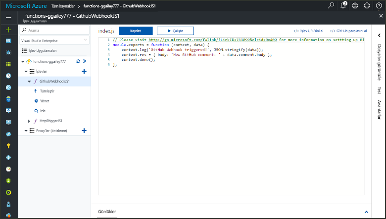
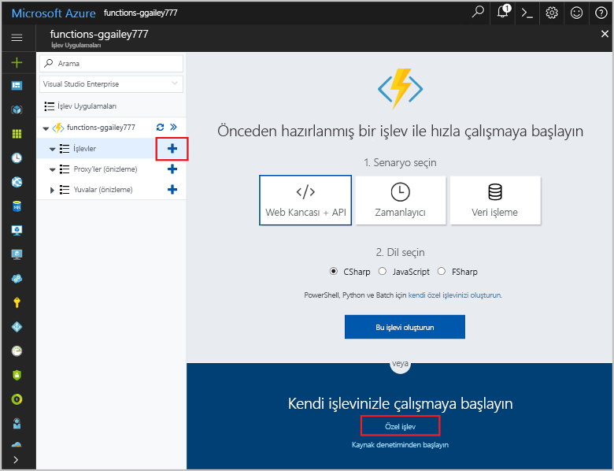
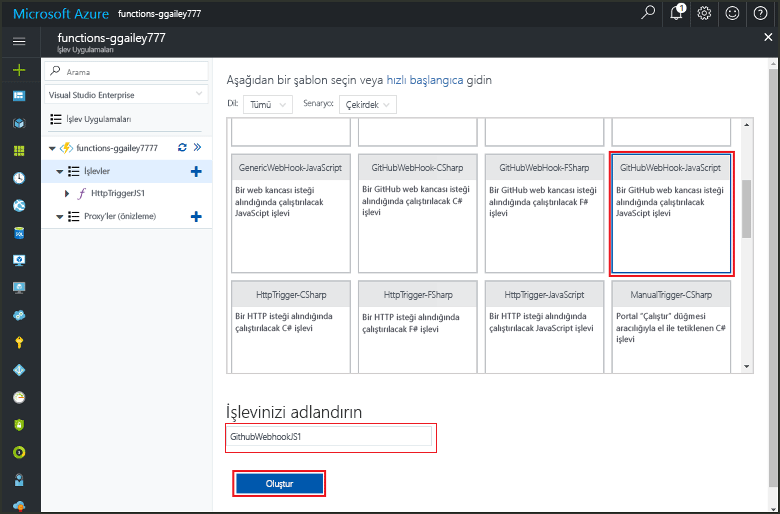
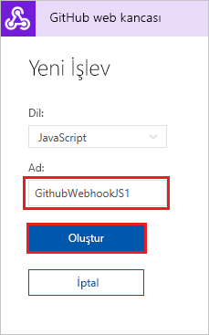
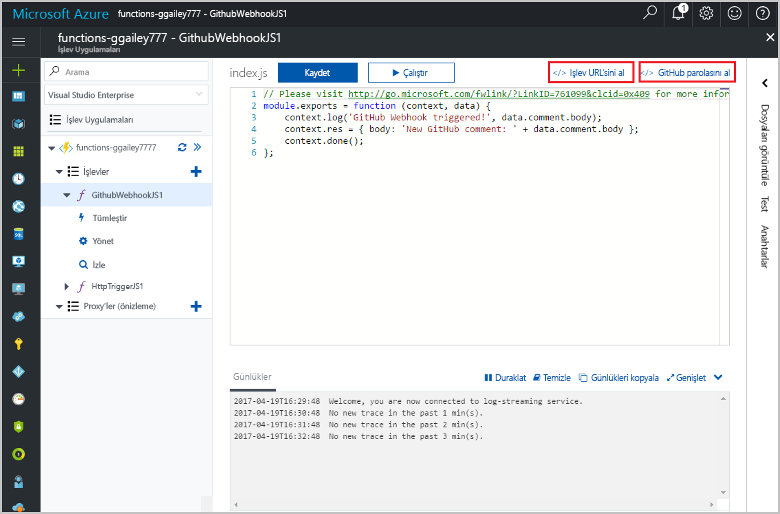
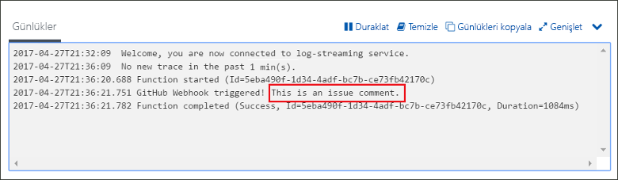

# GitHub web kancası tarafından tetiklenen bir işlev oluşturma

GitHub’a özel bir yük kullanarak, HTTP web kancası isteğiyle tetiklenmiş bir işlev oluşturma hakkında bilgi edinin.

## Ön koşullar

+ En az bir proje içeren bir GitHub hesabı.
+ Azure aboneliği. Aboneliğiniz yoksa başlamadan önce [ücretsiz bir hesap](https://azure.microsoft.com/free/?WT.mc_id=A261C142F) oluşturun.

[!INCLUDE [functions-portal-favorite-function-apps](../../includes/functions-portal-favorite-function-apps.md)]

## Azure İşlev uygulaması oluşturma

[!INCLUDE [Create function app Azure portal](../../includes/functions-create-function-app-portal.md)]

Ardından, yeni işlev uygulamasında bir işlev oluşturun.

## GitHub web kancası ile tetiklenen bir işlev oluşturma

1. İşlev uygulamanızı genişletin ve **İşlevler**'in yanındaki **+** düğmesine tıklayın. Bu, işlev uygulamanızdaki ilk işlevse **Özel işlev**'i seçin. Böylece işlev şablonlarının tamamı görüntülenir.

    

2. Arama alanına `github` yazıp GitHub web kancası tetikleyici şablonunuz için istediğiniz dili seçin. 

      

2. İşleviniz için bir **Ad** yazın ve **Oluştur**'u seçin. 

      

3. Yeni işlevinizde, **</> İşlev URL’sini al**’a tıklayın, sonra da değerleri kopyalayın ve kaydedin. **</> GitHub parolasını al** için de aynı işlemi yapın. GitHub’da web kancasını yapılandırırken bu değerleri kullanırsınız.

    

Ardından, GitHub deponuzda web kancasını oluşturursunuz.

## Web kancası yapılandırma

1. GitHub’da sahip olduğunuz bir depoya gidin. Varsa çatallandırdığınız depoları da kullanabilirsiniz. Bir depoyu çatallaştırmanız gerekirse, <https://github.com/Azure-Samples/functions-quickstart> sayfasını kullanın.

1. **Ayarlar**’a tıklayın, sonra da **Web Kancaları**’na ve **Web kancası ekle**’ye tıklayın.

    

1. Tabloda belirtilen ayarları kullanın, ardından **Web kancası ekle**'ye tıklayın.

    

| Ayar | Önerilen değer | Açıklama |
|---|---|---|
| **Yük URL'si** | Kopyalanan değer | **</> İşlev URL’sini Al** tarafından döndürülen değeri kullanın. |
| **Gizli dizi**   | Kopyalanan değer | **</> GitHub gizli dizisini al** tarafından döndürülen değeri kullanın. |
| **İçerik türü** | uygulama/json | İşlev bir JSON yükü bekler. |
| Olay tetikleyicileri | Olayları ayrı ayrı seçmeme izin ver | Yalnızca sorun yorum olaylarını tetiklemek istiyoruz.  |
| | Sorun açıklaması |  |

Şimdi, web kancası yeni bir sorun açıklaması eklendiğinde işlevinizi tetikleyecek şekilde yapılandırılır.

## İşlevi test etme

1. GitHub deposunda **Sorunlar** sekmesini yeni bir tarayıcı penceresinde açın.

1. Yeni pencerede **Yeni Sorun**’a tıklayın, bir başlık yazın ve ardından **Yeni sorunu gönder**’e tıklayın.

1. Sorunda bir açıklama yazın ve **Açıklama**’ya tıklayın.

    

1. Portala geri dönün ve günlükleri görüntüleyin. Yeni açıklama metnini içeren bir izleme girişi görmeniz gerekir.

     

## Kaynakları temizleme

[!INCLUDE [Next steps note](../../includes/functions-quickstart-cleanup.md)]

## Sonraki adımlar

GitHub web kancasından istek alındığında çalıştırılan bir işlev oluşturdunuz.

[!INCLUDE [Next steps note](../../includes/functions-quickstart-next-steps.md)]

Web kancası bağlamaları hakkında daha fazla bilgi için bkz. [Azure İşlevleri HTTP ve web kancası bağlamaları](functions-bindings-http-webhook.md).
