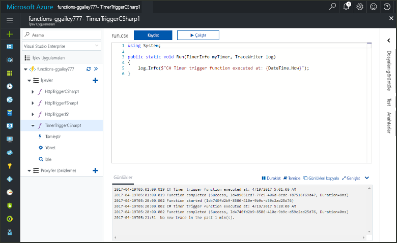
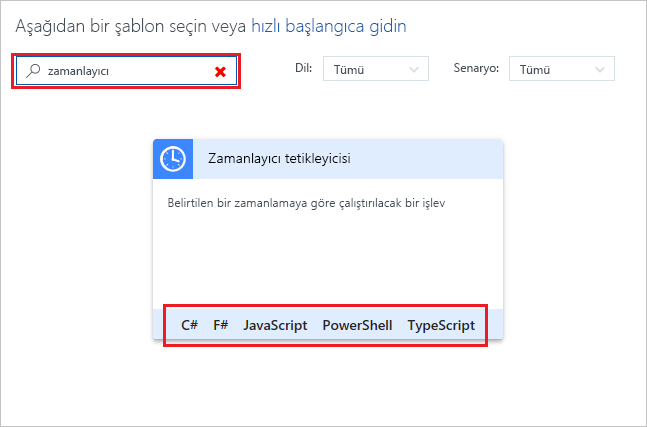
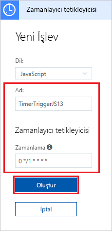
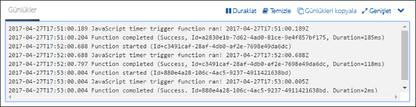
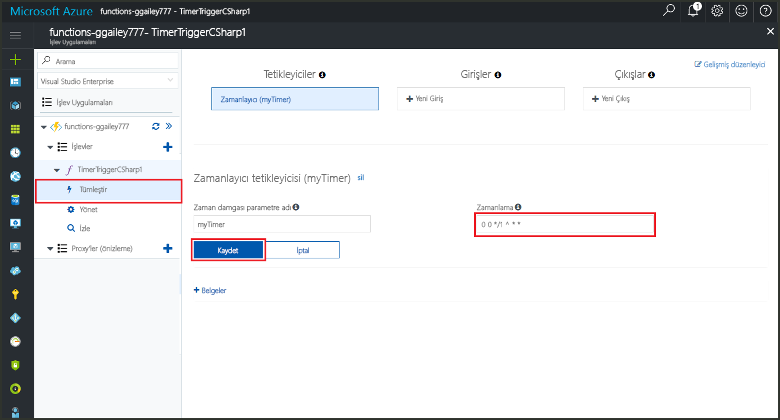

# Azure’da bir zamanlayıcı tarafından tetiklenen bir işlev oluşturma

Azure İşlevleri’ni kullanarak, tanımladığınız bir zamanlamaya göre çalışan bir [sunucusuz](https://azure.microsoft.com/overview/serverless-computing/) işlev oluşturma hakkında bilgi edinin.

## Ön koşullar

Bu öğreticiyi tamamlamak için:

+ Azure aboneliğiniz yoksa başlamadan önce [ücretsiz bir hesap](https://azure.microsoft.com/free/?WT.mc_id=A261C142F) oluşturun.

## Azure İşlev uygulaması oluşturma

[!INCLUDE [Create function app Azure portal](../../includes/functions-create-function-app-portal.md)]

Ardından, yeni işlev uygulamasında bir işlev oluşturun.

## Zamanlayıcı ile tetiklenen işlev oluşturma

1. İşlev uygulamanızı genişletin ve **İşlevler**'in yanındaki **+** düğmesine tıklayın. Bu, işlev uygulamanızdaki ilk işlevse **Özel işlev**'i seçin. Böylece işlev şablonlarının tamamı görüntülenir.

    

2. Arama alanına `timer` yazıp zamanlayıcı tetikleyici şablonunuz için istediğiniz dili seçin. 

    

3. Yeni tetikleyiciyi resmin altındaki tabloda belirtilen ayarlarla yapılandırın.

    

    | Ayar | Önerilen değer | Açıklama |
    |---|---|---|
    | **Ad** | Varsayılan | Zamanlayıcı ile tetiklenen işlevinizin adını tanımlar. |
    | **Zamanlama** | 0 \*/1 \* \* \* \* | İşlevinizi her dakika çalışacak şekilde zamanlayan altı haneli bir [CRON ifadesi](functions-bindings-timer.md#cron-expressions). |

2. **Oluştur**’a tıklayın. Seçtiğiniz dilde her dakika çalışan bir işlev oluşturulur.

3. Günlüklere yazılan izleme bilgilerini görüntüleyerek yürütmeyi doğrulayın.

    

Artık, işlevin zamanlamasını dakikada bir yerine saatte bir çalışacak şekilde değiştirebilirsiniz. 

## Zamanlayıcı zamanlamasını güncelleştirme

1. İşlevinizi genişletin ve **Tümleştir**’e tıklayın. Burada, işlevinizin giriş ve çıkış bağlamalarını tanımlamanın yanı sıra zamanlamayı da ayarlarsınız. 

2. `0 0 */1 * * *` şeklinde yeni bir saatlik **Zamanlama** değeri girin ve **Kaydet**’e tıklayın.  

Saatte bir çalışan bir işleviniz oldu. 

## Kaynakları temizleme

[!INCLUDE [Next steps note](../../includes/functions-quickstart-cleanup.md)]

## Sonraki adımlar

Bir zamanlamaya göre çalışan bir işlev oluşturdunuz.

[!INCLUDE [Next steps note](../../includes/functions-quickstart-next-steps.md)]

Zamanlayıcı tetikleyicileri hakkında daha fazla bilgi edinmek için bkz. [Azure İşlevleri ile kod yürütme zamanlama](functions-bindings-timer.md).
