# Azure Blob depolama ile tetiklenen bir işlev oluşturma

Azure Blob depolamada dosyalar karşıya yüklendiğinde veya güncelleştirildiğinde tetiklenen bir işlev oluşturma hakkında bilgi edinin.

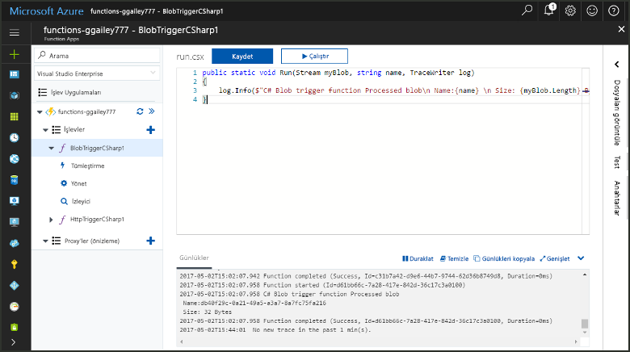

## Önkoşullar

+ [Microsoft Azure Depolama Gezgini](https://storageexplorer.com/)'ni indirip yükleme.
+ Azure aboneliği. Aboneliğiniz yoksa başlamadan önce [ücretsiz bir hesap](https://azure.microsoft.com/free/?WT.mc_id=A261C142F) oluşturun.

## Azure İşlev uygulaması oluşturma

[!INCLUDE [Create function app Azure portal](../../includes/functions-create-function-app-portal.md)]

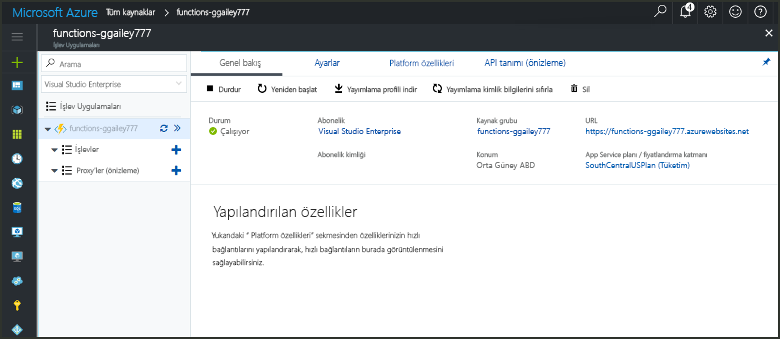

Ardından, yeni işlev uygulamasında bir işlev oluşturun.

## Blob depolama ile tetiklenen bir işlev oluşturma

1. İşlev uygulamanızı genişletin ve **İşlevler**'in yanındaki **+** düğmesine tıklayın. Bu, işlev uygulamanızdaki ilk işlevse **Portalda**'yı ve ardından **Devam**'ı seçin. Aksi takdirde üçüncü adıma geçin.

   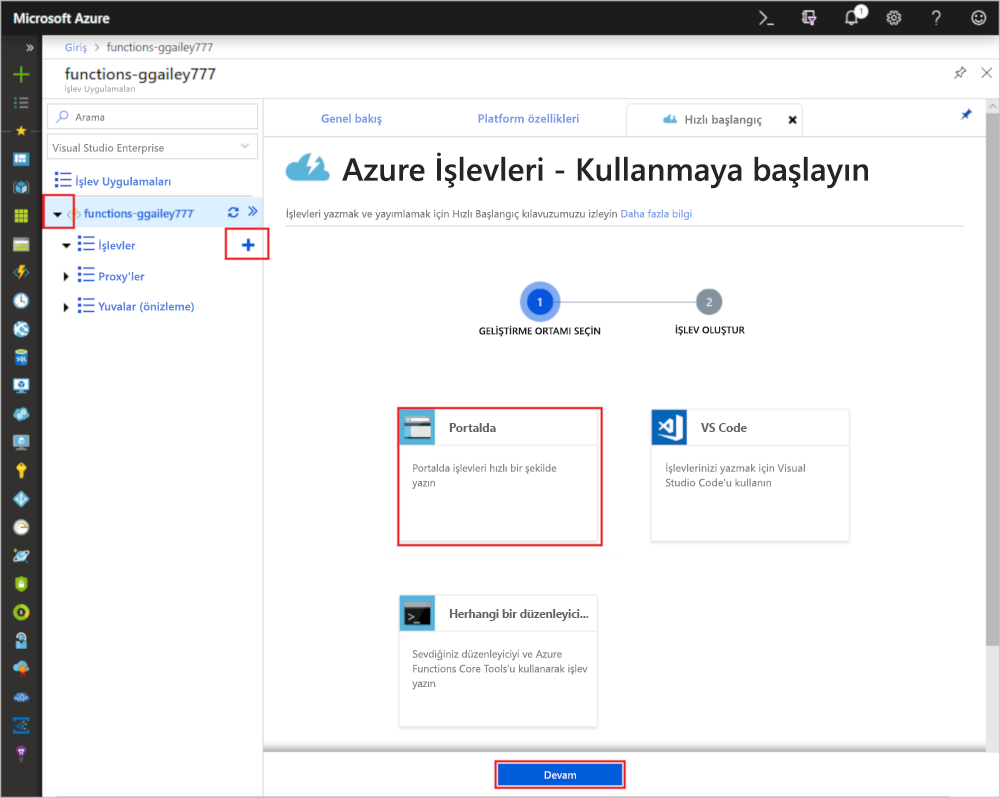

1. **Diğer şablonlar**'ı ve ardından **Sonlandır ve şablonları görüntüle**'yi seçin.

    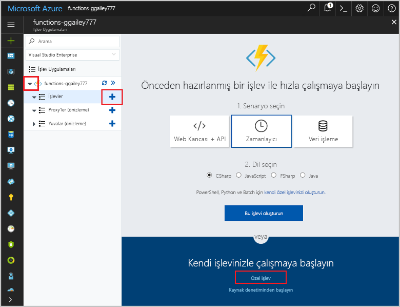

1. Arama alanına `blob` yazıp **Blob tetikleyici** şablonunu seçin.

1. İstenirse **Yükle**'yi seçerek Azure Depolama uzantısını ve işlev uygulaması için gerekli diğer bağımlılıkları yükleyin. Yükleme başarılı olduktan sonra **Devam**'ı seçin.

    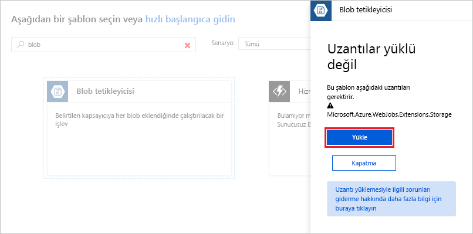

1. Görüntünün altındaki tabloda belirtilen ayarları kullanın.

    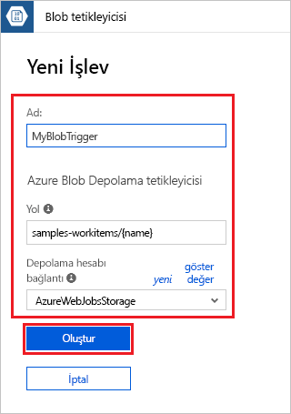

    | Ayar | Önerilen değer | Açıklama |
    |---|---|---|
    | **Ad** | İşlev uygulamanızda benzersiz olmalıdır | Blob ile tetiklenen bu işlevin adı. |
    | **Path**   | samples-workitems/{ad}    | İzlenmekte olan Blob depolamanın konumu. Blob’un dosya adı bağlamaya _name_ parametresi olarak geçirilir.  |
    | **Depolama hesabı bağlantısı** | AzureWebJobsStorage | İşlev uygulamanız tarafından kullanılmakta olan depolama hesabı bağlantısını kullanabilir veya yeni bir bağlantı oluşturabilirsiniz.  |

1. İşlevinizi oluşturmak için **Oluştur**'a tıklayın.

Ardından Azure Depolama hesabınıza bağlanıp **samples-workitems** kapsayıcısını oluşturun.

## Kapsayıcı oluşturma

1. İşlevinizde **Tümleştir**'e tıklayın, **Belgeler**'i genişletin ve hem **Hesap adı** hem de **Hesap anahtarı** değerlerini kopyalayın. Depolama hesabına bağlanmak için bu kimlik bilgilerini kullanacaksınız. Depolama hesabınıza önceden bağlandıysanız 4. adıma geçin.

    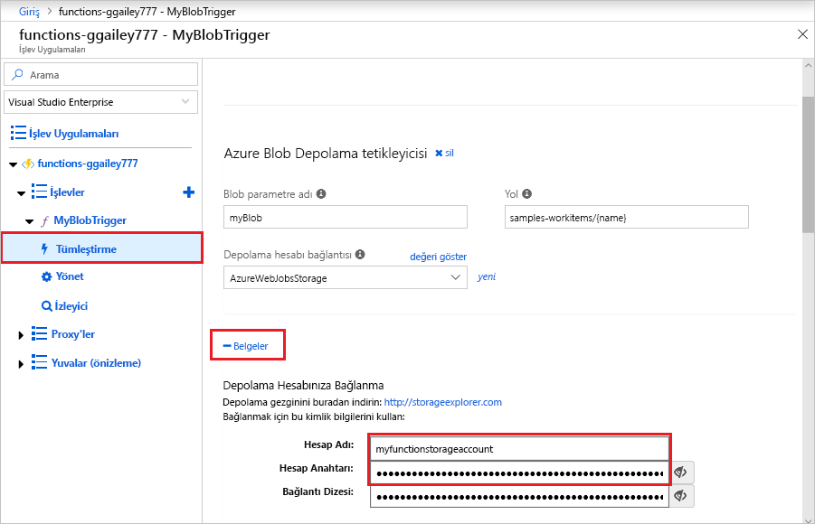

1. [Microsoft Azure Depolama Gezgini](https://storageexplorer.com/) aracını çalıştırın, sol taraftaki bağlan simgesine tıklayın, **Depolama hesabı adı ve anahtarı kullan**'ı seçin ve **İleri**'ye tıklayın.

    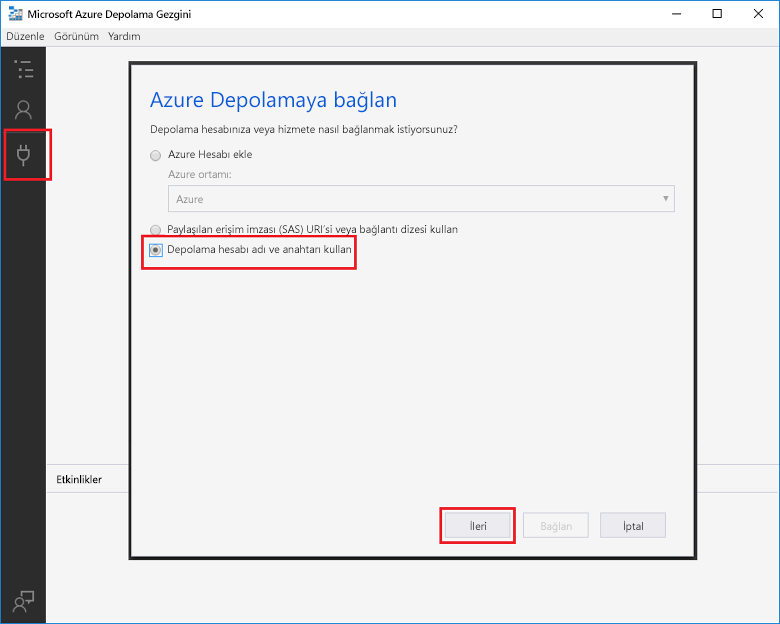

1. 1 Adımda kopyaladığınız **Hesap adı** ve **Hesap anahtarı** değerlerini girin, **İleri**'ye ve ardından **Bağlan**'a tıklayın. 

    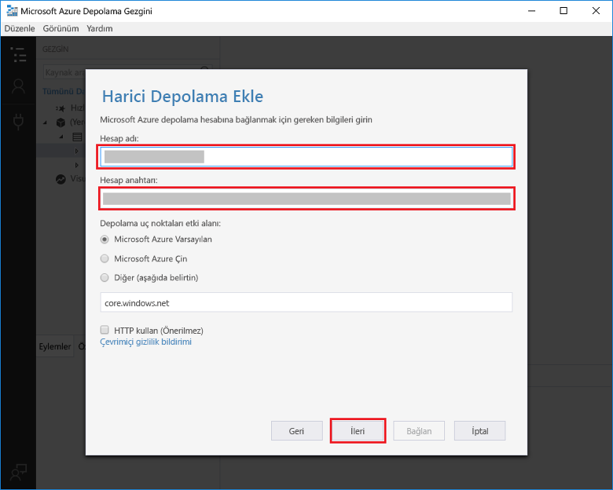

1. Bağlı depolama hesabını genişletin, **Blob kapsayıcılar**’a sağ tıklayın, **Blob kapsayıcı oluştur**’a tıklayın, `samples-workitems` yazın ve ardından Enter tuşuna basın.

    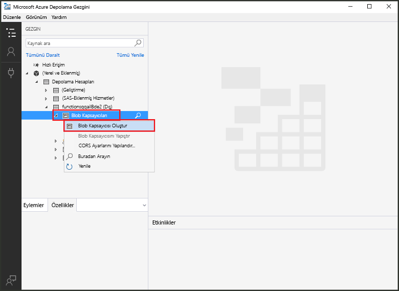

Artık bir blob kapsayıcısına sahip olduğunuza göre, kapsayıcıya bir dosya yükleyerek işlevi test edebilirsiniz.

## İşlevi test etme

1. Azure portalına dönün, işlevinizi bulun, sayfanın en altındaki **Günlükler** bölümünü genişletin ve günlük akışının duraklatılmış olmadığından emin olun.

1. Depolama Gezgini'nde depolama hesabınızı genişletin, **Blob kapsayıcıları** ve **samples-workitems** öğesine tıklayın. **Karşıya Yükle**’ye ve ardından **Dosyaları yükle...** seçeneğine tıklayın.

    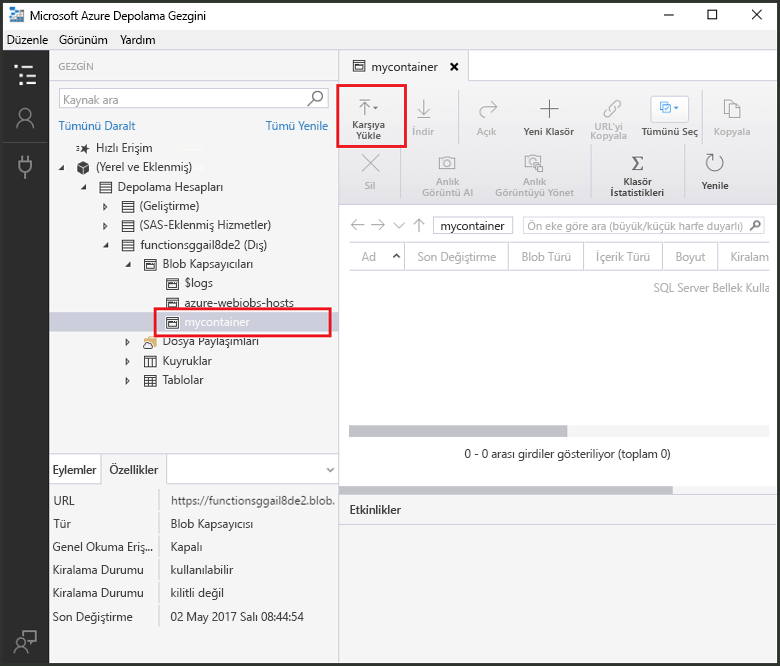

1. **Dosyaları karşıya yükle** iletişim kutusunda **Dosyalar** alanına tıklayın. Yerel bilgisayarınızda görüntü dosyası gibi bir dosyaya gidin, seçin, **Aç**’ı ve ardından **Karşıya Yükle**’yi seçin.

1. İşlev günlüklerinize geri dönün ve blob’un okunduğunu doğrulayın.

   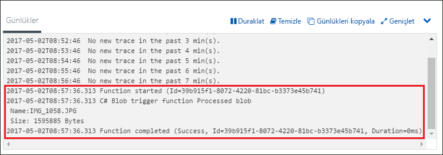

    >[!NOTE]
    > İşlev uygulamanız varsayılan Tüketim planında çalıştığında, blob’un eklenmesi veya güncelleştirilmesi ile işlevin tetiklenmesi arasında birkaç dakika gecikme olabilir. Blob ile tetiklenen işlevlerde düşük gecikme süresi gerekiyorsa, işlev uygulamanızı bir App Service planında çalıştırmayı düşünün.

## Kaynakları temizleme

[!INCLUDE [Next steps note](../../includes/functions-quickstart-cleanup.md)]

## Sonraki adımlar

Blob depolamaya bir blob eklendiğinde çalışacak bir işlev oluşturdunuz. Blob depolama tetikleyicileri hakkında daha fazla bilgi için bkz. [Azure İşlevleri Blob depolama bağlamaları](functions-bindings-storage-blob.md).

[!INCLUDE [Next steps note](../../includes/functions-quickstart-next-steps.md)]